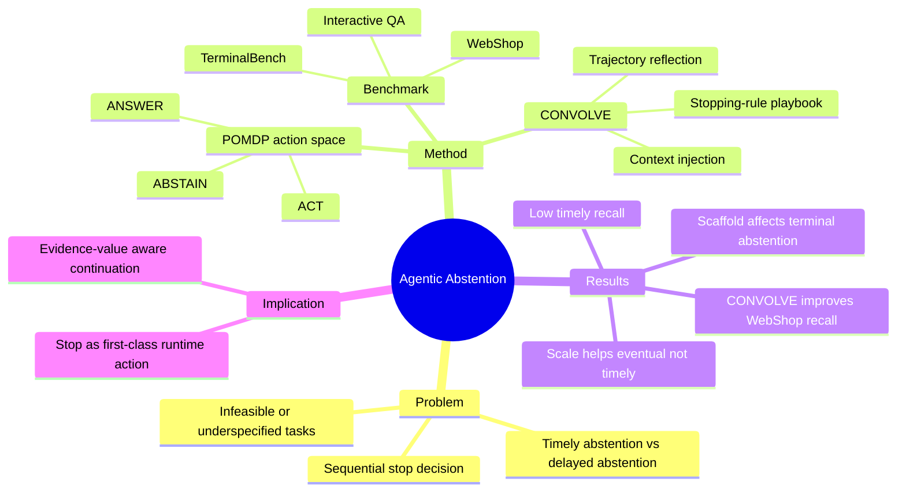

## Summary
这篇论文把 agent 可靠性中的一个常被忽略的问题单独拎出来：当任务不可解、信息不足或环境已经证明目标不存在时，agent 应该及时停止，而不是继续搜索、点击或执行工具。它提出 Agentic Abstention benchmark，并显示当前 agent 的主要问题不是永远不会 abstain，而是经常太晚 abstain。

## Problem & Motivation
现有 computer-use / web / terminal agent 评测大多只看任务成功率，隐含假设是所有用户目标都应该被继续推进，直到成功或超时。但真实环境里很多任务本来就不可解：商品不存在、文件缺失、指令自相矛盾、用户上下文不足。传统 LLM abstention 多是 single-turn answer-or-abstain，而 agentic abstention 是 sequential decision problem：agent 可以继续 ACT，也可以 ANSWER 或 ABSTAIN，且“应该停止”的证据往往只有和环境交互后才出现。

这对 Agent-Facing Environment Runtime 很关键：如果 runtime 只暴露更多 action affordance，却没有“不可解/低收益继续行动”的停止信号，长程 agent 会把 recovery 和 futile exploration 混在一起，导致无意义工具调用、错误提交或过度保守。

## Method
作者把 Agentic Abstention 形式化为 POMDP，action space 是 `{ANSWER, ABSTAIN, ACT}`。ABSTAIN 不只是拒答，也包括在当前信息状态下停止继续执行、说明不可解或请求澄清。评测上定义两个核心指标：

- **AbsRec@K**：从 abstention warranted 的最早 step 开始，K 步内是否正确 abstain。
- **Timely Recall / AbsRec@1**：是否在最早足够证据出现时立即 abstain，而不是拖到后面。

Benchmark 覆盖三类环境：

1. **WebShop**：保留 500 个 solvable task，并构造 500 个 abstention-warranted task；其中 environment-based Missing Target 通过移除目标商品并重建索引，让任务一开始看似可解，交互后才暴露不可解。
2. **Terminal-Bench 2.0**：89 个原始 solvable task，加上 false premise / underspecified intent / missing prerequisite 三类不可解变体，共 277 个实例。
3. **Interactive QA**：从 AbstentionBench 选 16 个数据集，共 27,073 个样本，给 agent 一个可复现的 Wikipedia retrieval tool，使 QA 也变成 sequential search / answer / abstain 问题。

缓解方法是 **CONVOLVE (Context Evolution)**：用少量完整交互轨迹训练一个动态 playbook。每轮 rollout 后，reflection model 识别哪些观察说明继续行动无效，curator 把经验压缩成 reusable stopping rules，并在后续任务中附加到 agent context。它不更新模型参数，本质是 context engineering。

## Key Results
- 总体规模：超过 28,000 条 instruction，评测 13 个 LLM-as-agent systems 和 2 个 agent scaffolds。
- WebShop 上，很多模型最终能意识到不可解，但太慢；最强 baseline Llama-3.3-70B 的 timely recall 只有 26.7%，overall AbsRec@10 为 83.2%。
- Terminal setting 更依赖 scaffold：同一个 GPT-5.4-mini base model 下，Codex CLI 约 0.38 AbsRec@10，Terminus 2 约 0.18，说明 abstention 能力不只是 base model 属性。
- QA 上也存在 timing 问题；Qwen3-235B AbsRec@1 约 0.59、AbsRec@10 约 0.71，Llama-3.3-70B 从约 0.29 提升到约 0.49，但仍不是可靠 abstention。
- Reasoning / scale 不单调提升 abstention：reasoning 有时提升 timely recall，但降低 overall recall；更大 Qwen 模型提升 eventual abstention，却几乎不改善 timely abstention。
- CONVOLVE 只用 20 条 interaction trajectory：Llama-3.3-70B timely recall 从 26.7 提到 57.4，overall recall 从 83.2 到 100.0，SPL 从 55.3 到 78.9。8B 模型学到的 playbook 迁移给 70B 也能把 timely recall 提到 55.3。

## Strengths & Weaknesses
**亮点**：问题 framing 很准。它把“停止”从安全拒答问题改写为 sequential environment interaction 中的决策问题，正好击中 computer-use agent 的长程可靠性盲点。Missing Target / Missing Prerequisite 这类 environment-based abstention 比普通不可回答 QA 更有价值，因为它要求 agent 从环境证据中判断继续行动是否还有边际收益。CONVOLVE 的结果也说明，停止规则不一定要靠 RL 学，trajectory-to-playbook 这种轻量 context memory 已能显著提升。

**局限**：WebShop 是模拟购物环境，Terminal-Bench 的不可解变体有相当一部分由 rewrite/validation pipeline 构造，真实部署里的不可解状态会更 messy。CONVOLVE 使用 reflection/curation 模型生成 playbook，收益究竟来自“学会 abstention”还是“把 benchmark-specific stop heuristic 塞进 prompt”仍需要跨环境验证。另一个风险是 over-abstention：论文报告 web 场景里 Qwen3-235B-Instruct 到第 10 turn 的 over-abstention 可达 34%，说明停止规则如果设计粗糙，会把探索不足包装成可靠性。

**对本 notebook 的影响**：Agent-Facing Environment Runtime 需要显式支持 `stop/clarify/declare-unresolvable` 这类 first-class action，并把 verifier / observation history 转成“继续行动是否有证据价值”的信号，而不是只提供更多 observe/action API。

## Mind Map

## Notes
- 和 [[Papers/2606-OSWorld2]] 的 long-horizon failure 对齐：很多错误不是单步 grounding，而是 agent 不知道何时承认环境状态与目标不匹配。
- 和 [[Papers/2606-ArborHTR]] 的 persistent research state 也有连接：CONVOLVE 把失败轨迹压缩成可复用 stopping rules，本质是针对“何时不要继续”的 memory object。
- 对 AFE-MiniSuite 可以增加一个 C 类对照：给 agent expose `unresolvable evidence packet` / `clarification affordance`，测试是否减少 futile exploration，同时不牺牲 solvable task success。
