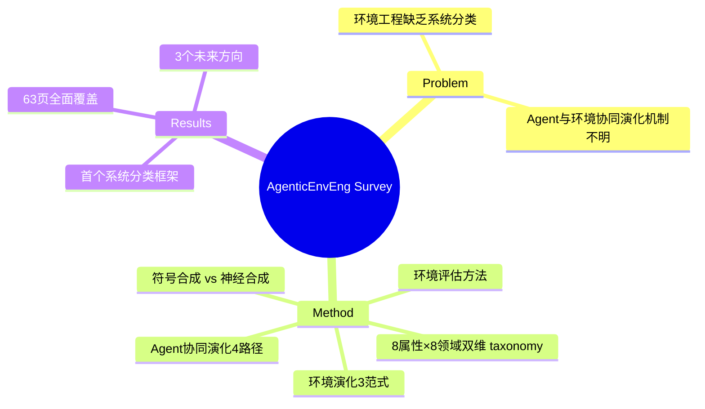

## Summary

系统梳理了 LLM Agent 环境工程的全生命周期——从环境建模、合成、评估到与 agent 的协同演化，提供 8 属性 × 8 领域的分类框架，以及符号/神经两条合成路线和三种演化范式。

## Problem & Motivation

LLM Agent 的能力进化高度依赖环境，但现有工作缺乏系统性分类与深层分析。研究者面对碎片化的环境选择时难以做出有依据的判断。具体问题包括：环境如何刻画（8 属性）、如何合成（符号 vs 神经）、如何评估（环境本身的质量）、以及 agent 与环境如何协同演化（4 条路径）。

## Method

> [未获取全文，仅基于 abstract]

**环境建模**：8 属性（observability、action space、reward structure、dynamics 等）× 8 领域（web、desktop、mobile、game、physical 等）的双维度分类体系，提供统一分析框架。

**环境合成**：
- **符号合成（Symbolic）**：基于规则、程序化生成环境，如基于 AST 的代码执行环境、形式化描述的棋盘游戏
- **神经合成（Neural）**：基于生成模型（video diffusion、world model）合成环境，如 3D 场景生成、world model rollouts

**环境评估**：分别针对两种合成范式设计评估方法，包括 fidelity、diversity、controllability 等维度。

**Agent-环境协同演化**：
- Agent 演化路径：记忆为中心、编排为中心、轨迹为中心、探索为中心的 4 条路线
- 环境演化范式：神经驱动、难度驱动、规模驱动

**未来方向**：Environment-as-a-Service（环境即服务）、Multi-agent Environments（多智能体环境）、Neural-Symbolic Environments（神经符号混合环境）。

## Key Results

> [未获取全文，仅基于 abstract]

- 提出首个系统性 agentic environment 分类框架
- 覆盖 43M+ academic resources（引用 SciAtlas）
- 识别 3 个 promising future directions
- 63 页篇幅，10 张图表

## Strengths & Weaknesses

**Strengths**：
- **系统性**：首个覆盖建模→合成→评估→协同演化的完整框架，解决文献碎片化问题
- **分类清晰**：8×8 taxonomy 是实用的分析工具，便于研究者定位自己的工作
- **覆盖全面**：涵盖 web、desktop、mobile、game、physical 等多类环境

**Weaknesses**：
- **Survey 固有局限**：无 novel 方法；内容受文献发表时间限制，可能遗漏最新进展
- **深度有限**：每个子方向只能点到为止，深度不如专题论文
- **实践指导价值存疑**：taxonomy 是好的文献阅读工具，但能否真正指导环境选择决策？

**Impact**：作为文献地图有价值，但能否真正指导实践需要看具体子方向的深度覆盖。

## Mind Map

