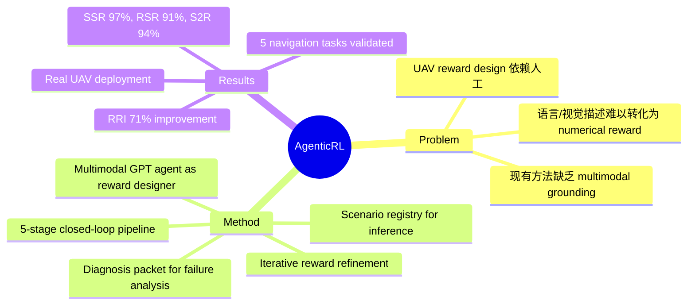

## Summary

提出 AgenticRL，一个多模态 GPT agent 驱动的闭环 RL 框架：自动生成 reward、训练 PPO policy、诊断 failure modes、迭代精修 reward，最终在真实 UAV 上实现 91% success rate 和 94% sim-to-real accuracy。

## Problem & Motivation

UAV RL 导航的核心痛点：reward function 设计依赖人工反复调参，费时且不保证 task success。自然语言+视觉场景能更直观描述 desired behavior，但转化为 dense numerical reward 仍是难题——语义正确的 reward 可能诱导 unsafe/incomplete behavior。现有方法（demonstration、preference、human feedback）需要额外监督或 task-specific data，且缺乏 multimodal scene grounding 和 real-world deployment 验证。

## Method

**框架核心**：5 阶段闭环 pipeline：

1. **Multimodal Task Understanding**：接收语言指令 l0、视觉场景 I、observation spec O
2. **Reward Generation**：GPT agent 生成可执行 Python reward R0（包含 task progress rewards、safety penalties、terminal terms）
3. **Policy Training**：在定制 UAV simulator 用 PPO 训练 policy（网络 512→512→256→128，entropy annealing 0.1→0.001，训练 25M-70M steps）
4. **Policy Diagnosis**：评估 policy 行为，聚合 collision events、landing accuracy、gate traversal success 等为 diagnosis packet D
5. **Reward Refinement**：GPT agent 将 diagnosis packet 转化为 refinement prompt，识别 failure modes，更新 reward → 闭环迭代

**推理时**：Multimodal Scenario Registry —— agent 根据真实图像+语言信息识别 active scenario，自动选择对应 trained policy。

**与已有工作区别**（vs. Text2Reward、Code as Reward、Agents Trainer）：
- 同时具备 Reward Code Generation ✓、Visual Input ✓、Closed-loop Auto Refinement ✓、Task Diagnosis ✓、Real-world UAV Platform ✓

## Key Results

**仿真性能**：collective SSR 97%

**Sim-to-Real Transfer**：
- collective RSR 91%
- collective S2R accuracy 94%
- Gate Traversal / Circular Motion：接近完美
- Trajectory Following：S2R 97%
- Obstacle Avoidance：RSR 82%
- Barrier Crossing：RSR 89%

**Reward Refinement 效果**：
- RRI (Reward Refinement Improvement) 71% —— 相比初始 reward，精修后 policy behavior 显著提升
- 训练曲线：精修后 convergence 更清晰（gate traversal、obstacle landing、wall barrier landing 任务）

**Ablation Study**：
| Method | Trajectory Follow | Gate Traversal | Obstacle+Land | Barrier+Land | Circular Motion |
|--------|-------------------|----------------|---------------|--------------|-----------------|
| Zero-shot reward | 0% | 80% | 63% | 0% | 55% |
| Few-shot reward | 48% | 74% | 88% | 72% | 98% |
| w/o analyzer | 50% | 61% | 60% | 52% | 62% |
| w/o vision conditioning | 87% | 95% | 65% | 48% | 76% |
| **Full AgenticRL** | **95%** | **100%** | **96%** | **93%** | **98%** |

关键发现：
- Zero-shot reward 在某些任务直接失败（trajectory follow 0%、barrier 0%）
- Few-shot 有提升但整体仍低于 full framework
- w/o analyzer（无 failure analysis）跨任务表现差，说明闭环精修是关键
- w/o vision conditioning 在 obstacle/barrier 任务明显下降，证明视觉 grounding 重要性

## Strengths & Weaknesses

**Strengths**：
1. **闭环精修机制**：不是一次性生成 reward，而是通过 behavior diagnosis + GPT agent feedback 实现迭代改进，71% RRI 证明设计有效
2. **Multimodal Grounding**：同时利用语言指令和视觉场景生成 reward，ablation 显示视觉输入对 spatial-constrained tasks（obstacle/barrier）至关重要
3. **Real-world Validation**：在物理 quadrotor 上验证，91% RSR + 94% S2R 是硬指标，不玩 simulation-only 游戏
4. **Task Diversity**：5 个不同导航任务（gate traversal、obstacle avoidance、barrier crossing、trajectory following、motion generation），覆盖不同的 spatial/safety/termination 要求

**Weaknesses**：
1. **依赖 GPT Agent 能力**：reward quality 和 consistency 受限于 underlying multimodal agent（文中提到不同模型可能表现不一致）
2. **计算开销**：迭代训练需要多个 RL training cycles，复杂任务耗时显著（25M-70M steps per cycle）
3. **仍需手动设计组件**：termination conditions、observation spaces、safety constraints、task-specific environment settings 仍需人工
4. **实验场景局限**：controlled environments，未在 highly dynamic/diverse real-world settings 评估
5. **Insight 深度不足**：71% RRI 是 aggregate metric，具体每个 refinement epoch 改了什么、为什么有效缺乏细致分析

**与研究方向关联**：
- `agentic-RL`：直接相关 —— LLM agent 作为 reward designer + critic，实现 self-improving RL pipeline
- `navigation`：UAV 导航是 embodied AI 重要子领域
- `VLM`：多模态 grounding 用于 reward generation

## Mind Map

## Notes

- 与 Eureka (Ma et al., 2023) 的区别：Eureka 专注 text-to-reward + human verification，AgenticRL 引入 visual grounding + automated diagnosis + UAV real-world validation
- 与 ReSkill (2606-01619) 的关联：两者都是 RL-in-the-loop，但 ReSkill 侧重 skill creation，AgenticRL 侧重 reward refinement
- 有价值的问题：GPT agent 的 failure diagnosis 是否能泛化到其他 embodied tasks（manipulation、mobile manipulation）？vision conditioning 的具体贡献是什么——是帮助识别 scene entities 还是影响 reward structure？