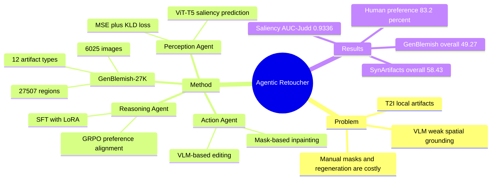

## Summary
Agentic Retoucher 把 T2I 生成后的局部 artifact 修复重写为 perception-reasoning-action loop：先定位细粒度失真区域，再做 human-aligned 诊断，最后调用局部 inpainting 工具修复。论文同时构建 GenBlemish-27K，提供 6,025 张 T2I 图像、27,507 个 pixel-level 失真标注和 12 类 artifact，用来监督定位、诊断与修复。核心价值在于把 VLM 的语义诊断、saliency grounding 和工具化编辑接成闭环，但主文证据仍集中在 AIGC 图像局部修复，而不是 GUI/embodied 任务。

## Problem & Motivation
T2I diffusion models 已经能生成 photorealistic 图像，但仍常出现局部、小尺度 distortion，例如手指/肢体异常、脸部不对称、文字不可读、物体交互不一致。完整重生成成本高且容易改变全局内容；prompt enhancement、RL-based optimization、noise-space alignment 更偏向提升整体质量，缺少显式空间推理；Imagic、Bagel、Step1x-Edit 等 post-hoc editing pipeline 又依赖人工 mask 或 heuristic textual hint。

论文的关键观察是：通用 VLM 虽然有语义推理能力，但在 AIGC image 的细粒度 artifact 上存在 weak spatial grounding 和 hallucinated judgment。作者用 Fig. 1 强调，即使给出显式 region cue，VLM 也可能把明显异常区域判断为正常。因此，问题不是单纯“找一个更强编辑器”，而是需要一个能先可靠定位、再解释、再执行局部修复的闭环系统。

## Method
方法由数据集和三类 agent 组成。

**GenBlemish-27K**：作者从 EvalMuse-Structure 中整理 6,025 张图像，覆盖 Dreamina、Midjourney、Kandinsky、SDXL 等 20+ T2I models。标注流程是 human-in-the-loop：预标注校准、多 annotator 独立给出 center/category/brief description、用 QwenVL-Max 扩展文本描述、再通过 majority voting 和 expert validation 汇总。数据集共有 27,507 个失真区域，12 个 fine-grained artifact types；majority voting 与 expert validation 的 agreement rate 超过 95%，每张图平均 4.6 个标注区域，每个描述平均 11.8 words。

**Context-aware Perception Agent**：输入生成图像 \(I\) 和 prompt \(P\)，用 ViT-T5 dual encoder 分别编码视觉和文本，再通过 self-attention 融合 visual structure 与 textual semantics，预测 distortion-saliency map \(S \in [0,1]^{H \times W}\)。训练目标混合 MSE 与 KLD：MSE 约束 pixel-level accuracy，KLD 约束与 human fixation distribution 的一致性。saliency map 之后被二值化并做 morphological dilation，形成后续 reasoning 的 mask candidates。

**Human-aligned Reasoning Agent**：给定 localized regions \(\{M_i\}\)，输出区域级 textual descriptions \(\{D_i\}\)，包含 distortion type、局部外观和上下文不一致原因。训练分两阶段：先用 LoRA 做 SFT 建立结构化输出和 taxonomy，主文给出的 LoRA rank 为 64、\(\alpha=32\)；再用 GRPO 做 preference alignment，reward 包括 distortion-type classification accuracy 和 textual description 与 human label 的 semantic alignment。作者声称这一阶段用于减少 hallucination，让诊断更符合 human perceptual judgment。

**User-preference Action Agent**：将 \(\{M_i, D_i\}\) 转换为局部编辑动作，决定修复范围、tool selection 和 inpainting instruction。工具库同时支持 VLM-based editing（如 Qwen-Edit、Gemini 2.5 Flash Image）和 mask-based inpainting（如 Flux-fill、SD-inpainting）。修复后的图像重新送回 Perception Agent；论文报告 inference 全自动，每张图通常在 2-3 个 reasoning iterations 内收敛。

## Key Results
- **Retouch quality / GenBlemish-27K**：Original 的 RichHF-style metrics 为 plausibility 44.21、aesthetics 53.69、alignment 57.89、overall 47.15；`Ours w Qwen-Edit` 提升到 plausibility 47.10、aesthetics 55.75、alignment 59.54、overall 49.27。`Ours w Gemini 2.5 Flash Image` 的 overall 为 48.97，`Ours w Flux-fill` 为 48.66，`Ours w SD-inpainting` 为 48.31，均高于对应 baseline。
- **Generalization / SynArtifacts-1K**：Original overall 为 55.35；`Ours w Gemini 2.5 Flash Image` 达到 overall 58.43，`Ours w SD-inpainting` 为 58.27，`Ours w Qwen-Edit` 为 58.04，`Ours w Flux-fill` 为 57.86。最高 plausibility 来自 `Ours w SD-inpainting`，为 66.66。
- **Human evaluation**：5 名参与者的 randomized blind survey 中，Ours 有 48.8% 被评为 significantly better、34.4% slightly better，合计 83.2% 优于修复前图像；baseline 对应为 4.2% 和 22.8%，合计 27.0%。
- **Perception / saliency prediction**：在 distortion-aware saliency prediction 上，Ours 达到 AUC-Judd 0.9336、NSS 1.2087、CC 0.5568、SIM 0.3822、KLD 1.4313。对比 RichHF 为 AUC-Judd 0.9211、NSS 0.8954、CC 0.4748、SIM 0.3309、KLD 1.6697；Qwen2.5-VL-7B 为 AUC-Judd 0.6145、KLD 7.4353。
- **Reasoning / distortion diagnosis**：在 Qwen2.5-VL-7B family 中，base accuracy 为 57.76%，GRPO-only 为 58.97%，SFT 为 78.34%，Ours 为 80.10%，同时 SimCSE/Word2Vec/Meteor/ROUGE 分别为 0.8426/0.7785/0.4037/0.3530。Ovis2.5-9B family 中 Ours accuracy 最高，为 80.62%；GPT-5 Zero-Shot 和 Gemini-2.5 Pro Zero-Shot 分别为 61.31% 和 60.28%。
- **Ablation**：Perception Agent 的完整模型在 SIM 0.3822、CC 0.5568、KLD 1.4313 上优于去掉 attention 或 KLD loss 的版本，但增益幅度较小；例如 `w/o KLD loss` 的 SIM 为 0.3525、KLD 为 1.5008。Reasoning Agent ablation 显示 progressive alignment 优于单独 SFT 或 GRPO-only；作者还指出 early-stage GRPO 会 destabilize response formatting 并造成 factual drift。

## Strengths & Weaknesses
**已知**：论文不是只做一个 image editor，而是明确把错误修复拆成定位、诊断、行动三个可评估模块，并给每个模块设计了对应 benchmark/metric。GenBlemish-27K 的 pixel-level mask、artifact taxonomy 和 region-level description 对 VLM 的 fine-grained AIGC assessment 有直接价值。定量结果覆盖 retouch quality、human preference、saliency localization、reasoning diagnosis 和 ablation，证据链比较完整。

**已知**：与通用 VLM 的对比很有信息量。GPT-5 Zero-Shot、Gemini-2.5 Pro Zero-Shot、Qwen2.5-VL、GLM-4.1V、InternVL3.5 等在 localization 或 diagnosis 上并没有自然解决局部 artifact grounding，支持作者的核心判断：高层语义能力不能自动转化为可靠 pixel/region-level verification。

**局限**：human evaluation 只有 5 名参与者，虽然是 randomized blind survey，但样本规模限制了 preference 结论的稳健性。主文没有给出完整 runtime/cost、失败案例分布、修复失败后的停止策略细节；只报告 inference 通常 2-3 iterations 收敛。Action Agent 的最终质量依赖外部 inpainting backbone，论文通过 `Ours w tool` 对比了不同 tool，但没有把 tool 能力与 agent 决策能力完全解耦。

**局限**：Perception Agent 的 ablation 在 AUC-Judd 上差异很小，例如完整模型 0.9336，`w/o attn&KLD loss` 为 0.9335；这说明 attention/KLD 的贡献在报告指标上不是大幅提升，更多体现在 SIM/KLD 等局部指标。数据集文本描述经过 QwenVL-Max 扩展，可能引入模型风格偏置；论文主文没有量化这种偏置对 reasoning agent 的影响。

**推测**：这个 perception-reasoning-action decomposition 对 GUI-agent 的 screen verification 有启发，因为两者都需要把视觉局部异常转化为可执行修复/行动；但论文没有在 GUI、web、mobile UI 或 embodied setting 上做实验，不能把 T2I artifact 修复结果外推为 GUI grounding 能力。

**不知道**：论文主文未给出 code link，也未报告 DOI。补充材料可能包含更多数据细节和 qualitative cases，但主文中不可确认。

## Mind Map

## Notes
这篇论文最值得保留的是 problem formulation：不要默认 VLM critic 能可靠发现局部视觉错误，而要显式训练 region-aware perception，并把 diagnosis 与 action 分离。对当前 VLM/agentic 研究而言，GenBlemish-27K 比修复工具本身更可能产生复用价值，因为它把“哪里错了”和“为什么错了”同时标出来。

后续如果要借鉴到 GUI-agent，关键问题不是 inpainting，而是把 saliency-style region proposal 换成 UI element / screenshot anomaly proposal，并用 action agent 输出可执行操作而非图像修复。这个迁移目前只是研究假设，论文没有提供直接证据。
