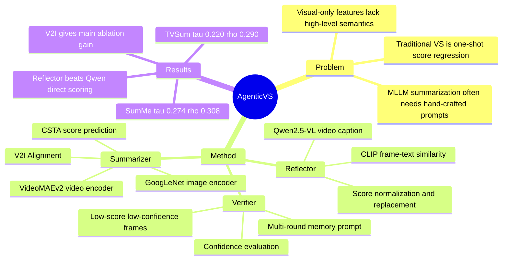

## Summary
AgenticVS 把 extractive video summarization 改写为一个固定的 Summarizer-Verifier-Reflector workflow：先用 V2I Alignment 产生初始 frame importance scores，再让 MLLM 检查低分帧的可信度，最后用 MLLM 生成视频摘要并由 CLIP similarity 校准可能漏掉的 keyframes。论文在 SumMe 和 TVSum 上报告 AgenticVS 相比 CSTA、LLMVS 等 baseline 有更高的 Kendall τ / Spearman ρ，但增益主要来自 V2I Alignment，Verifier/Reflector 的额外提升较小。

## Problem & Motivation
已知：传统 extractive video summarization 多依赖 CNN / LSTM / attention 等视觉特征，再回归每帧的重要性分数；作者认为这类方法缺少高层语义理解和跨帧全局 temporal reasoning。近期 LLMVS、MLLM-based semantic representation 等方法把 LLM/MLLM 引入视频摘要，但仍常依赖人工设计 prompt 或 caption embedding，可能损失细粒度视觉线索，并且缺少自动校正机制。论文的核心动机是把 video summarization 从一次性预测改成一个 self-reflecting loop，让模型在初始打分后还能验证、反思并补回漏选片段。

推测：这篇工作的更大价值不在“视频摘要”本身，而在一个可迁移的 agentic pattern：把视觉模型的 dense score 交给 MLLM 做全局语义校验，再用可校准的视觉-文本相似度模型修正局部错误。对 GUI-agent / embodied agent 的直接证据仍然没有，因为论文只在离线 video summarization benchmark 上验证。

## Method
**整体 workflow**：AgenticVS 包含三个 atomic agents。Summarizer 负责 initial importance score prediction；Verifier 用 multi-round memory prompt 评估低分帧是否真的不重要；Reflector 对 Verifier 标出的低置信低分帧做 self-reflection correction，搜索 missing keyframes。

**Summarizer / V2I Alignment**：给定视频帧序列，作者使用 GoogLeNet 作为 image encoder 提取 image-level embedding `vimg`，使用 VideoMAEv2 设置的视频 encoder 提取 video-level embedding `vvid`。V2I Alignment 先用 temporal attention pooling 压缩视频特征的时间维度，再用包含 layer normalization 与 GELU 的 adapter 把 video-level embedding 映射到 image-level feature space，得到融合 intra-frame 与 inter-frame 信息的 `vv2i`。推理时只使用 video-level features 经过 pooling 和 AdaptMLP 后的输出；image features 只作为训练对齐目标。

**Verifier / multi-round memory**：Verifier 先学习 human scoring criteria 和评分规律，再重新评估初始分数较低的位置。论文使用自适应阈值 `theta_s = mean(st) - 0.5 * std(st)` 找到低分帧，并结合 confidence `ct` 做两类决策：如果 `st` 低且 `ct` 低，认为初始低分可能不可靠，交给 Reflector 搜索 missing frame；如果 `st` 低但 `ct` 高，则直接判为 non-key frame。

**Reflector / CLIP calibration**：Reflector 不是让 Qwen2.5-VL 直接输出逐帧分数，而是先让 MLLM 生成面向视频摘要的整体 caption，覆盖 overall content、event transitions 和 scene changes。随后对 Verifier 指出的候选帧，用 CLIP-ViT-B/32 计算 frame image 与 caption 的 cosine similarity，并把 CLIP score normalize / rescale 到初始分数尺度后替换原分数。最终再按修正后的 importance scores 重新确定 key frames。

**Training objective**：Verifier 和 Reflector 是 training-free；训练只发生在 V2I Alignment module 和 video summarization model。V2I Alignment 使用 MSE 对齐项加 residual regularization，`lambda = 1e-3`；VS model 使用 predicted score `st` 和 ground-truth score `s_t^*` 的 squared error。实现中 VideoMAEv2 使用 8-frame sliding window，VS backbone 采用 CSTA，MLLM 使用 Qwen2.5-VL-7B-Instruct，训练在 NVIDIA V100 上进行，learning rate `1e-4`、weight decay `1e-4`、batch size `1`。

## Key Results
**Main results on SumMe / TVSum**：AgenticVS 在 SumMe 上达到 Kendall τ `0.274`、Spearman ρ `0.308`；在 TVSum 上达到 τ `0.220`、ρ `0.290`。对比最强 visual-only baseline CSTA，SumMe 为 `0.246 / 0.274`，TVSum 为 `0.194 / 0.255`；对比最强 visual-text baseline LLMVS，SumMe 为 `0.253 / 0.282`，TVSum 为 `0.211 / 0.275`。论文因此声称 AgenticVS 在两个 benchmark 的四个 rank-correlation 指标上均超过非 agentic baseline。

**Workflow ablation**：Table 2 的 baseline 是直接 concat image-level 与 video-level embeddings 后送入 CSTA，SumMe 为 `0.230 / 0.257`，TVSum 为 `0.178 / 0.232`。加入 V2I Alignment 后，SumMe 提升到 `0.265 / 0.296`，TVSum 提升到 `0.215 / 0.278`；再加入 Verifier + Reflector 后，最终为 SumMe `0.274 / 0.308`、TVSum `0.220 / 0.290`。这说明主要提升来自 V2I Alignment，Verifier/Reflector 的增量为 SumMe τ `+0.009`、ρ `+0.012`，TVSum τ `+0.005`、ρ `+0.012`。

**V2I Alignment ablation on SumMe**：只用 `Eimg` 为 `0.228 / 0.254`，只用 `Evid` 为 `0.220 / 0.245`，直接 concat 为 `0.230 / 0.257`。I2V alignment 为 `0.238 / 0.265`，V2I alignment 为 `0.265 / 0.296`；在 V2I setting 中，mean pooling 为 `0.243 / 0.270`，temporal attention pooling 为 `0.265 / 0.296`。

**Reflector ablation on SumMe**：在不使用 Summarizer 和 Verifier 的 train-free setting 中，让 Qwen2.5-VL 直接生成 importance scores 只有 `0.073 / 0.081`；Reflector 的 Qwen2.5-VL caption + CLIP scoring 为 `0.116 / 0.128`。它高于 DMASum `0.063 / 0.089` 和 iPTNet `0.101 / 0.119`，但与 A2Summ `0.108 / 0.129` 相比是 τ 更高、ρ 略低，因此不能概括为全面超过所有早期 supervised methods。

## Strengths & Weaknesses
### 已知
- 论文明确把 video summarization 分解为 score prediction、verification、reflection 三步，比单次回归更容易解释“哪里可能漏掉 keyframe”。
- V2I Alignment 的消融比较充分：only image、only video、concat、I2V、V2I、mean pooling、temporal attention pooling 都有表格数值，支持作者选择 video-to-image feature alignment 与 temporal attention pooling。
- 指标选择有自觉性：作者指出 F1-score 可能因长度约束偏好 shorter clips，因此主评估使用 Kendall τ 和 Spearman ρ 这类 rank-based correlation。
- Reflector 的设计避免让 MLLM 直接输出细粒度连续分数，而是把 MLLM 用于整体 caption / reasoning，再用 CLIP 产生更稳定的 frame-text similarity；Table 4 支持这种设计优于 Qwen2.5-VL direct scoring。

### 局限
- “agentic”更像固定的三阶段 workflow，而不是开放式 agent：没有动态 tool selection、环境交互、长期 planning 或失败恢复 benchmark。
- 实验只覆盖 SumMe 和 TVSum 两个传统 video summarization benchmark；论文结论中提到 long videos、multi-view data、additional modalities、VQA / video reasoning / video tracking 等扩展，但没有实验验证。
- 最终提升并不均匀。Table 2 显示 V2I Alignment 贡献了大部分增益，而 Verifier + Reflector 的额外提升相对小；这削弱了“agentic loop”本身是主要性能来源的强度。
- 论文正文没有独立 limitation section，也没有系统 failure case taxonomy。qualitative results 只展示 SumMe 中两个示例，不能说明哪些事件类型、镜头切换、长视频结构或 prompt 变化会导致失败。
- Verifier 的 prompt、`theta_s = mean - 0.5 * std` 阈值、CLIP score rescaling、MLLM caption 质量都可能影响最终结果；论文正文没有报告这些敏感性分析。

### 推测 / 不知道
- 推测：这种“dense perception score + MLLM global check + calibrated visual-text correction”的结构可能启发 GUI / web agent 的 screen-state verification，例如让 MLLM 发现局部 detector 漏掉的关键 UI state；但论文没有 GUI、web、mobile 或 embodied control 实验。
- 不知道：论文正文没有给出 code URL、DOI 或自身 arXiv identifier。
- 不知道：完整 Verifier / Reflector prompts、推理开销、MLLM 调用次数、latency、token budget、以及不同 MLLM backbone 的性能差异没有在正文表格中量化。

## Mind Map

## Notes
- 对当前研究方向的价值：这篇不是 GUI-agent 论文，但它提供了一个可讨论的 multimodal self-reflection 模式，即把 MLLM 放在“检错和补漏”位置，而不是让它直接承担全部感知分数回归。
- 需要谨慎引用“first agentic workflow for video summarization”这一 claim：论文在 video summarization 语境下这样表述，但它的 agentic 性主要来自固定角色分解和自反校准，而非通用自主 agent 能力。
- 后续可追问：如果把 Reflector 的 CLIP scoring 换成更强 video-text model，或者让 Verifier 只输出可审计的 frame-level uncertainty 而不是 prompt judgment，是否能把 agentic loop 的增益从小幅修正变成主要贡献。
