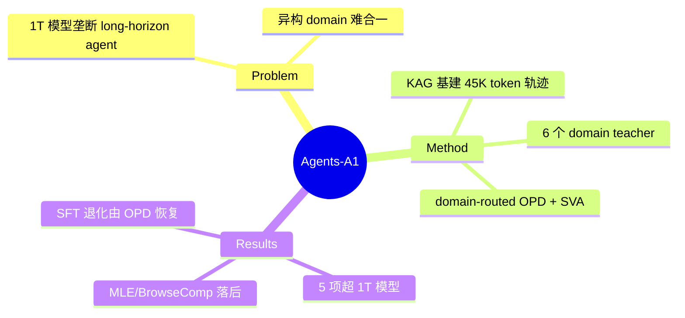

## Summary

Agents-A1 用"scale agent horizon 而非参数"的路线，把 Qwen3.5-35B-A3B 训成在部分 long-horizon agent benchmark 上追平/超过 1T 级模型的 35B MoE agent：先建 Knowledge-Action Graph 基建产出平均 45K token 的 verified 轨迹（100K 条），再走全域 SFT → 6 个 domain teacher（SFT/RL 各异）→ multi-teacher domain-routed on-policy distillation（带 salient vocabulary alignment）三阶段，将六个异构 domain 合入单一可部署 student。

## Problem & Motivation

Long-horizon agent 能力（deep research、ML engineering、科学推理、工具调用）目前主要由 1T 级模型（Kimi-K2.6、DeepSeek-V4-pro、GPT-5.5）占据，部署成本高。作者的 bet：这些任务的瓶颈不在参数容量，而在 (a) 缺少长轨迹（知识-动作-观测-验证闭环）训练数据，(b) 异构 domain 能力难以合入一个模型（单模型 SFT/RL 会互相拖累）。因此把 scaling 维度从参数转向 horizon——轨迹长度与 domain 覆盖。

## Method

**1. Knowledge-Action Graph (KAG) 基建**：每个 domain 定义为 typed 4-tuple（corpus、action space、observation space、verifier set），用 proposer–solver–verifier self-play 生成任务并回写图。接收轨迹须满足五条件（verifiable / valid / process-informative / evidence-covering / unambiguous）。最终 SFT 集约 100K 条轨迹、平均 45K token（deep research 44K / coding 48K / 科学推理 37K / instruction following 3K / general agentic 39K），单轨迹最多 300 次 tool call。

**2. 三阶段训练**：
- **Stage 1 全域 SFT**：Qwen3.5-35B-A3B，131K context，sample packing + cross-sample attention mask。
- **Stage 2 domain teachers**：各 domain 用不同配方——Search teacher（SFT+GRPO，仅 ~2K 多跳问题、8 rollouts/prompt，reward 含 LLM-judge 正确性 + 轮次效率惩罚 + 重复惩罚）；Science teacher（两段 SFT：纯推理 → tool-augmented）；IF teacher（两段 RL：rule-based 约束 reward → answer-matching，rollout 动态过滤全同 reward 组）；Tool-calling teacher（SFT + 64 样本 hard-set RL，失败轨迹用 process score 做非对称 advantage：A_i = A_out + 0.5·1[r_out=0]·A_proc）。
- **Stage 3 multi-teacher domain-routed OPD**：student on-policy rollout，按样本 domain 硬路由到对应 teacher 做 top-k salient vocabulary alignment（在 teacher top-k token 集上重归一化后算 reverse KL，student-side coverage ρ 监控近似质量）；loss 按 domain 归一聚合防止大 domain 主导；tool output 与 user turn 掩掉不算 loss。

## Key Results

- **胜过 1T 模型的 5 项**：SEAL-0 56.4（Kimi-K2.6 50.5 / DSV4-Pro 55.0）、IFBench 80.6（GPT-5.5 75.9）、HiPhO 46.4、FrontierScience-Olympiad 79.0、MolBench-Bind 56.8（但 GPT-5.5 62.2 更高）。
- **落后的项**：BrowseComp 75.5 vs 83–84、HLE w/ tools 47.6 vs 54.0（Kimi）、SciCode 44.3 vs 56.1、MLE-Bench-Lite 43.9 vs 72.7（GPT-5.5）——ML engineering 差距最大，作者归因于长程目标保持/避免重复试错的原子能力缺失。
- **对 35B 同级**：全面超过基座 Qwen3.6-35B（如 SEAL-0 38.7→56.4、IFBench 64.4→80.6）。
- **Teacher 增益**（报告值）：Search teacher GAIA 59.8→95.1、Science FS-R 2.5→54.3、IF IFBench 70.2→82.0、tool-calling τ²-Bench 32.5→82.5。
- **SFT 阴性观察**：全域 SFT 后 general agentic / IF / HLE 相比基座反而下降（long-thinking 推理模式与 multi-turn agentic 模式冲突），OPD 阶段才恢复；且 OPD student 不总能追平单 domain teacher（统一 policy 的代价）。

## Strengths & Weaknesses

**亮点**：
- 相比同类工业报告，透明度较高：开源 checkpoint + 评测代码，有分阶段 ablation（SFT 退化 → OPD 恢复的阴性观察诚实），τ²-Bench 复现差异主动披露。
- Multi-teacher domain-routed OPD + SVA 是 on-policy distillation 工程化的新数据点：与 [[Papers/2607-UIMOPD]]（platform-conditioned multi-teacher）、[[Papers/2607-DirectOPD]]（log-ratio implicit reward）同属"迁移 RL/专家增量而非最终分布"路线，本文把它 scale 到 6 个异构 domain 且给出 domain-normalized loss 防主导的具体方案。
- "SFT 学格式、RL 学 domain 专精、OPD 做合并"的三段分工对 multi-domain agent 训练是可复用的配方；per-domain teacher 的 RL 数据量惊人地小（Search 2K 问题、tool-calling 64 样本 hard-set）。

**局限**：
- **Headline 需打折**："trillion-parameter performance" 建立在 5 个获胜 benchmark 上，而 BrowseComp/HLE/SciCode/MLE-Bench 全面落后（MLE 差 28.8 分）；更准确的结论是"在 verifier 密集、轨迹可合成的 domain 上 35B 可追平 1T，在开放长程工程任务上不能"。
- Teacher 增益数字异常大（GAIA 59.8→95.1 远超公开 SOTA 水平），未说明评测 split/工具配置，按工业报告惯例应降权待复现。
- 六 domain 全是文本/代码/搜索侧，无 GUI/视觉 agent domain——KAG 基建能否覆盖 visual observation 未验证。
- 45K token 平均轨迹长度的"horizon scaling"与性能的因果关系没有直接 ablation（没有"同配方短轨迹"对照），horizon 是否是关键变量仍是推测。

## Mind Map

## Notes

- 对 pattern "On-policy distillation 成为复用 RL 成果的迁移机制"（patterns.md 2026-07-15）是第 3 个独立数据点，且首次 scale 到 6 异构 domain——可考虑在下次 memory-distill 时追加证据。
- "SFT 使 agentic 能力退化、OPD 恢复"与 [[Papers/2607-GRPONullWebAgent]] 的"训练干预条件化"视角互补：训练阶段的收益边界都比默认叙事更窄。
- 对 AFE 方向的间接启示：KAG 的 verifier set 是 trainer-facing 的（用于轨迹过滤与 reward），再次印证环境 verifier 能力未暴露给 agent 本身。
