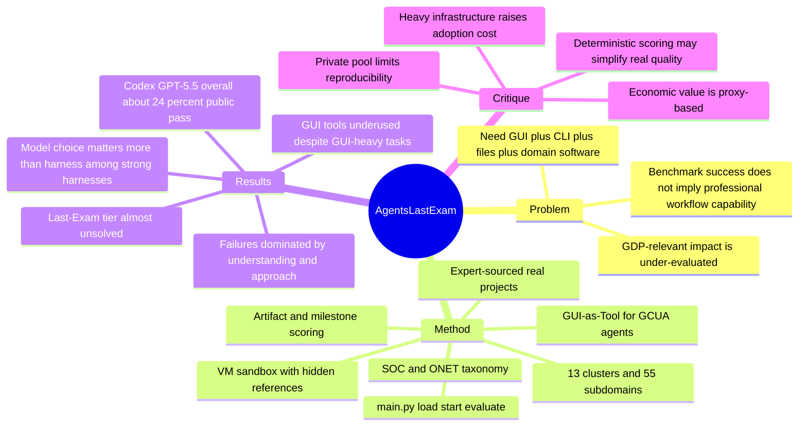

## Summary
Agents' Last Exam (ALE) 是一个面向 Generalist Computer-Use Agent 的长程真实工作流 benchmark，试图用专家提交的专业项目、真实软件环境、GUI+CLI 混合操作和可验证交付物来衡量 agent 是否能做有经济价值的工作。它的覆盖面和工程规模很强，但核心科学风险在于：`economically valuable` 的 claim 主要靠任务来源和职业 taxonomy 支撑，而不是任务通过率与真实经济产出的因果证据。

## Problem & Motivation
现有 agent benchmark 常把能力拆得太碎：GUI benchmark 测几步桌面操作，CLI benchmark 测 terminal workflow，QA benchmark 测知识或搜索，SWE benchmark 测代码修复。作者认为这些任务即使被 saturate，也不能说明 agent 能执行数小时到数周级的专业工作流。

ALE 的 problem formulation 是：如果要判断 agent 是否能产生 GDP-relevant impact，评估对象应该是完整的 professional workflow，而不是局部动作或问答。它将目标 agent 定义为 Generalist CUA-agent，即同一 action loop 中同时具备 reasoning、视觉观察、工具调用、runtime 操作、文件/代码/GUI 控制能力的系统。

## Method
**Benchmark scope.** ALE 以 O*NET / SOC 2018 为职业分类锚点，筛出非物理、软件中介的职业工作流，组织成 13 个 industry clusters 和 55 个 subdomains。论文声称当前覆盖 1K+ task instances；官网和 GitHub README 显示已收集 1.5K+ tasks，并公开 150 个 reference tasks 作为 public subset，private pool 用于 leaderboard 和抗污染。

**Task construction.** 任务来自 domain experts 已经做过的真实项目，而不是众包 worker 或合成脚本。每个任务需要明确五件事：自然语言任务描述、input files、target software、expected deliverable、evaluation specification。构建流程包括 expert sourcing、submission refinement、first-pass review、engineering implementation、engineer dry-run、expert committee final QC。

**Execution protocol.** 每个 task instance 被封装为一个 `main.py` task specification，暴露 `load() / start() / evaluate()` 生命周期。agent 只能看到任务描述和可见环境，操作 remote VM，完成后把交付物放入 `output/`；隐藏参考答案在 agent 结束后才 staged 到 `reference/`，由 `evaluate()` 评分。

**Environment and agent surface.** ALE 支持 Linux 和 Windows VM，任务会使用真实专业软件，如 Dorico、DaVinci Resolve、Blender、KiCad、Rhino、MicroDicom、FSLeyes、Moldex3D 等。主评估把 CLI-native harness 通过 GUI-as-Tool 扩展成 GCUA：截图、鼠标、键盘、滚动等 GUI 动作作为普通 tools 暴露给 Codex、Claude Code、Cursor、OpenClaw 等 agent harness。

**Scoring modes.** 输出形式非常杂，包括 CAD、spreadsheet、3D mesh、MIDI、video、report、simulation state 等。ALE 用 artifact-based 或 milestone-based scoring 组合：exact/hash match、numeric/tabular tolerance、geometry/point-cloud distance、visual judge、behavioral state check、free-text rubric。作者强调尽量避免 LLM-as-judge；但在视频、游戏截图、rendered scene 等任务里仍会使用窄化的 vision judge probe。

## Key Results
基于 arXiv HTML v2（2026-06-11）表格，当前 public selected task set 远未饱和：

- **Mainstream GCUA, fixed GPT-5.5 + GUI-as-Tool**：Codex overall pass rate 24.0%，Near-Term 38.1%，Full-Spectrum 22.7%，Last-Exam 0.0%；ALE-Claw overall 23.0%，Last-Exam 2.6%；Cursor overall 20.7%，Last-Exam 2.6%；Droid overall 19.1%，Last-Exam 2.6%。
- **Fixed Claude Opus 4.7 + GUI-as-Tool**：Cursor overall 20.4%，Last-Exam 2.6%；ALE-Claw overall 18.4%，Last-Exam 0.0%；Claude Code overall 13.2%，Last-Exam 0.0%。
- **ALE-CLI Linux-only subset**：Codex + GPT-5.5 overall 23.3%，Last-Exam 0.0%；Claude Code + Sonnet 4.6 overall 16.7%，Last-Exam 0.0%；ForgeCode / Hermes / Terminus / OpenHands 也均为 Last-Exam 0.0%。
- **Domain profile**：computing/math 与 agriculture/environment 得分最高，business/legal 居中，education 最低。作者解释为模型在 code-adjacent 任务上训练暴露更多，而专业工作流知识不足。
- **Failure analysis**：Claude Code + Opus 4.7 的失败中，Understanding + Approach 约占四分之三；更细的 appendix taxonomy 中，Approach 47%，Understanding 31%，Execution 22%。这说明瓶颈不是单纯 GUI 控制，而是领域知识、策略选择和任务完成意识。
- **Harness vs model**：固定 OpenClaw 换 backbone 的 pass-rate spread 为 16.8 pp；固定 backbone 换 harness 的 spread 约 4.9-7.2 pp。作者据此认为，在 well-engineered harness 之间，foundation model 的 domain knowledge 和 reasoning 是主要差异源。
- **Cost/time/token**：resource consumption 与 performance 相关性弱。比如 ALE-Claw + GPT-5.5 在较低总 API cost 下拿到最高 overall mean score，而更高 token/cost 的配置未必更好。

重要修正：`Workbench/daily/2026-06-09.md` 中记录过 “Last-Exam 8.6%，完整平均 26.2%”。这与我在 2026-06-23 核对到的 arXiv HTML v2 表格不一致；后续引用应以 v2 表格和当前仓库为准，除非明确追溯 v1 或 leaderboard 快照。

## Strengths & Weaknesses
**Strengths.**

1. **问题切得比普通 GUI benchmark 更接近真实工作。** ALE 把 GUI、CLI、文件、代码、专业软件和长程 workflow 放在一个环境里，避免了 OSWorld/WebArena/Terminal-Bench 各自只测局部能力的问题。
2. **task provenance 比合成 benchmark 更可信。** 任务来自专业人士做过的项目，并经过工程实现和专家 QC。这至少比“研究者凭想象写任务”更接近真实需求分布。
3. **可运行 artifact 已公开一部分。** GitHub 仓库公开 `ale_run` runner、sandbox orchestration、150 个 public tasks、selected task lists、quickstart 和两个 reference harness，这让它不是纯 paper-only benchmark。
4. **failure analysis 有可用 insight。** GUI 使用比例低、agent 倾向用 Bash/脚本绕过专业软件、失败主因是 Understanding/Approach，这些对 computer-use agent 的训练数据和 harness 设计都有指导意义。

**Weaknesses.**

1. **“经济价值”仍是 proxy，不是被验证的 causal claim。** SOC/O*NET coverage、专家来源、days/weeks 项目都只能说明任务像真实工作，不能证明 pass rate 与 GDP impact 之间有稳定映射。这里的 grounding 是分类学和任务来源，不是经济计量。
2. **private pool 让 benchmark 介于 research artifact 和 service 之间。** 抗污染需要私有任务，但主要 leaderboard 面无法完全复现。公开 150 tasks 有研究价值，但不足以独立验证 private distribution、QC 标准和 leaderboard fairness。
3. **自动评分和真实质量之间存在 structural gap。** 专业工作常需要专家 judgment。ALE 用 deterministic scripts 和 artifact rubrics 强行可验证化，会偏向“可脚本检查的交付物”，可能低估审美、策略、风险判断、业务语境等不可轻易脚本化的能力。
4. **vision judge 虽窄化，仍引入模型裁判。** 作者说避免 LLM-as-judge，但 chroma key、rendered scene、visual output 等任务仍需要 vision judge probe。它比 holistic judge 更好，但不是纯 deterministic。
5. **任务难度层级和 domain balance 仍需外部审计。** 论文说 public subset representative，但 55 个 subdomains 的专业难度、软件可得性、rubric 宽严、task author 风格都可能影响分数。这个 bias 很难从 paper table 中完全排除。
6. **benchmark 太重，研究迭代门槛高。** Windows VM、licensed software、cloud sandbox、长时任务、API cost 都会限制小团队复现和快速 ablation。作为 leaderboard 可行，作为日常研究工具偏重。

## Mind Map

## Notes
- **我的判断**：rating=2。ALE 是值得跟踪的 benchmark-as-infrastructure，尤其适合观察 frontier CUA agents 的真实 workflow failure modes；但它目前更像评测平台和产业对齐工程，不是一个带来清晰算法 insight 的 paper。
- **和 GUI Agent 方向的关系**：它把 GUI grounding 从“点哪里”推进到“在真实软件里产出专业 artifact”。这对 GUI agent benchmark 是健康压力，但也说明 GUI grounding 本身不是全部，domain knowledge、planning、file discipline、software-specific workflow 更可能是瓶颈。
- **对研究 idea 的启发**：可以把 ALE 当作上游压力测试，拆出更可训练的小问题，例如 GUI-underuse diagnosis、artifact verifier learning、professional-software workflow imitation、CLI-vs-GUI routing policy、domain-rubric aware planning。
- **需要进一步查证**：private task distribution、leaderboard submission protocol、task difficulty calibration、vision judge prompt 和 model choice、licensed software 的可复现环境。这些会决定 ALE 能否成为 de facto 标准，而不是一个高成本 leaderboard。
- **Sources**: arXiv HTML v2 `https://arxiv.org/html/2606.05405`; project website `https://agents-last-exam.org/`; GitHub `https://github.com/rdi-berkeley/agents-last-exam`; public task inventory `https://raw.githubusercontent.com/rdi-berkeley/agents-last-exam/refs/heads/main/tasks/published_tasks.json`.
