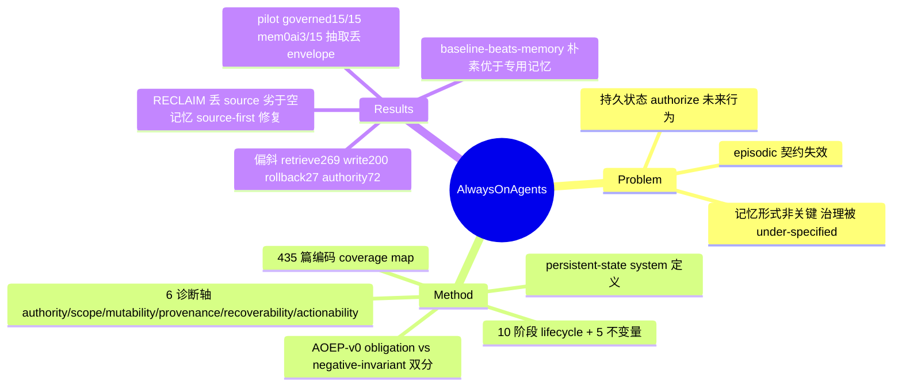

## Summary
这篇 survey 把 LLM agent 的"记忆"重新定义为 **persistent-state system**（记忆只是其中一类，还含 task ledger、权限、凭据、承诺、provenance/audit、共享状态、trigger、外部已提交副作用），提出用 6 条诊断轴 + 10 阶段 lifecycle + 5 条不变量来审视持久状态，并对 435 篇编码语料指出领域严重偏向"积累/检索"而非"治理/回收/回滚"；配套提出 AOEP-v0 评测协议，把治理义务而非答案质量做成可打分的契约。

## Problem & Motivation
LLM agent 通常被当作 **episodic**（单轮）系统来设计和评测：接任务→推理→调工具→给答案→重置，过去被丢弃，因此安全性论证只需保证"当前 prompt 干净、当前工具调用被授权"。一旦状态跨会话持久化，这个前提失效：存下的 preference 能悄悄改写工具默认参数、缓存的凭据能在用户本意撤销后仍授权访问、几个月前写的 summary 因检索更强而压过新证据、lossy consolidation 删掉了后续行动需要的精确标识符却留下一条 recall 分数仍高的摘要。作者的核心判断是：**记忆的"形式/检索质量"不是关键问题，关键是被保留的状态如何 authorize 未来行为、如何跨会话/用户/agent 传播、以及变脏/被投毒/过期后如何被修复**——而这一整块"治理"在文献中被 under-specified。

## Method
纯 survey/framework 论文，无训练实验。四项贡献构成论证骨架：

**1. 定义 + 六诊断轴（§2.3）**：每个持久状态项沿 6 轴刻画——`authority`（什么东西准许它影响行动）、`scope`（可用于哪个 user/task/tool/时间窗/group）、`mutability`（可否修订/被取代/衰减/锁定）、`provenance`（来源、时间戳、经过何种变换产生）、`recoverability`（派生状态与已做决策可否回滚）、`actionability`（是被动证据、preference、policy、skill 还是可执行承诺）。一句 taste 论断："一段 recall 完美的记忆，若没有 authority 边界、没有 provenance、没有坏行动后的修复路径，仍然是不安全的。"

**2. Lifecycle + 五不变量（§4）**：把记忆降格为一个更大受治理循环中的一站——forward arc `observe→write→validate→organize→retrieve→act`，return arc `update→forget→audit→rollback`。命名 5 条不变量：`authority monotonicity`、`scope non-expansion`、`deletion propagation`、`provenance preservation`、`rollback traceability`。episodic agent 靠"重置"平凡满足它们；always-on agent 每条不变量的违反都定义一类 persistence-specific failure。

**3. 435 篇编码语料 + coverage map（§1.1, §6-§8）**：跨 2023-2026（含 pre-2023 认知架构 anchor），沿 category×lifecycle-stage×state-axis×subarea 四维编码，且刻意 over-sample 治理端，作为 scoped map 而非普查。

**4. AOEP-v0 评测协议（§9）**：把治理义务做成确定性可打分契约。评分刻意拆成两个分数——`obligation pass`（正向义务：记录删除、revocation 后报告当前 permission epoch、拦截 stale-permission/untrusted 任务、暴露 owner-vs-collaborator 冲突、外部行动后记录 rollback）与 `negative-invariant pass`（无泄漏检查：已删值不可见、越权值不出现、未提升不可信指令）。拆分理由：二者的退化解相反——"什么都不存"平凡通过所有 negative invariant 却满足零正向义务，单一标量会奖励失忆。五不变量映射为 10 个可执行检查（8 个 per-snapshot 布尔 + 2 个 ledger-subset）。

**核心机制发现（本笔记重点，§7.5 / §12.2，survey 转述被引工作）**：`RECLAIM (Kwon 2026)` 用 judge-free 方式隔离出一个 provenance 失败——**一段记忆若保留了 stale 结论却丢掉了它的来源，会变得"confidently uncorrectable，且严格劣于空记忆"，而一个 source-first write policy 能修复它**。注意这是 survey 引用并转述的第三方基准结果，不是本 survey 自己跑的实验。它与 `MEME (Jung et al. 2026)`（deletion propagation 近乎全面崩溃：Cascade 3%、Absence 1%）、`STALE`、`GEM (Orogat & Mansour 2026，证明 record-level store 无法满足 6 条 governed-evolving-memory 正确性条件)` 一起，构成"治理赤字在硬数字上现形"的证据群。

## Key Results
- **语料偏斜（Table 3, §1.1）**：435 篇中 lifecycle 集中在积累端——`retrieve` 269/435、`write` 200；轴上 `mutability` 160、`provenance` 153 领先；治理端稀薄——`authority` 是最罕见的轴仅 72/435，`audit` 88、`forget` 66、`rollback` 仅 27/435。治理覆盖率随年份从 ~12% 升到 46% 但仍为少数，rollback 到 2026 仅从 0% 升到不足 10%。inter-coder 一致性 0.82（lifecycle）/0.74（axes，236 篇盲样）。
- **AOEP-v0 pilot（Table 18，9 个 fault pattern、单一 frozen reader Qwen2.5-7B、greedy 决定性解码）**：governed reducer 上界 obligation **15/15**；no-memory floor **0/15**（唯一从不泄漏，代价是满足零义务）；三个 raw-storage 系统（naive append / full context / vector-RAG）同为 **7/15**；Mem0-style 抽取事实 **4/15**；实际 mem0ai 包 **3/15**。关键读法：**抽取式记忆（Mem0）在治理义务上反而低于朴素原始存储**，因为其 extraction 步骤丢掉了治理 envelope（实测中泄漏了一个已删账单地址和一个不可信 exfiltration 地址）。
- **baseline-beats-memory（§6.4.3）**：`Asawa et al. 2026` 的受控研究发现专用记忆系统并不可靠地改善学习，朴素 in-context 使用近期历史反而优于若干 purpose-built 记忆架构；另有 environment-drift 基准显示 agent 保持记忆与变化世界对齐的准确率平均不足 40%。
- **成本治理（§5.7）**：TCO 研究测得朴素 retrieval 以 8.4× 更低总成本匹配最重框架的最高准确率（Wolff & Bennati 2026），把 substrate 选择重构为成本-治理决策。

## Evidence Ledger
| Claim ID | Claim | Type | Source locator | Evidence excerpt | Status |
|:--|:--|:--|:--|:--|:--|
| C1 | 记忆保留 stale 结论但丢弃来源 → "confidently uncorrectable，严格劣于空记忆"；judge-free reclaim eval 显示 source-first write policy 修复之——**survey 转述被引工作 Kwon 2026 (RECLAIM)，非本 survey 自跑实验** | causal-mechanism | §7.5/§12.2；ref "Reclaim evaluation: A lossy memory is worse than an empty one, 2026" | "a memory that keeps a stale conclusion but drops its source becomes confidently uncorrectable, strictly worse than empty memory... source-first write policy repairs it" | source-verified |
| C2 | 435 篇；retrieve 269/435、write 200、mutability 160、provenance 153；authority 最罕见 72/435；audit 88、forget 66、rollback 27/435 | number | §1.1 corpus / Table 3 | "retrieve (269 of 435) and write (200)... Authority is the rarest axis at 72 of 435... audit (88), forget (66), and especially rollback (27)" | source-verified |
| C3 | AOEP pilot Table 18 obligation：governed reducer 15/15；no-memory 0/15；naive append/full context/vector-RAG 各 7/15；Mem0-style 4/15；mem0ai 3/15；抽取式因丢 envelope 反低于原始存储 | number/benchmark | §9.4 Table 18 | "Governed reducer 15/15; [no-memory] 0/15; Naive append 7/15... Mem0-style 4/15; mem0ai 3/15... extraction without an explicit governance envelope performs worse" | source-verified |
| C4 | MEME (Jung et al. 2026) deletion propagation 近全面崩溃：Cascade 3%、Absence 1% | number | §7.5 | "near-total collapse (Cascade at 3 percent, Absence at 1 percent)" | source-verified |
| C5 | 6 诊断轴（authority/scope/mutability/provenance/recoverability/actionability）+ 5 不变量（authority monotonicity, scope non-expansion, deletion propagation, provenance preservation, rollback traceability）+ 10 阶段 lifecycle | benchmark-setting | §2.3, §4.1.1 | "six diagnostic axes (authority, scope, mutability, provenance, recoverability, actionability)... five invariants" | source-verified |
| C6 | baseline-beats-memory：朴素 in-context 近期历史优于若干 purpose-built 记忆架构（Asawa et al. 2026） | comparison | §6.4.3 | "naive in-context use of recent history outperforms several purpose-built memory architectures (Asawa et al. 2026)" | source-verified |

## Strengths & Weaknesses
**亮点**：
- **问题重构 taste 很正**。把"agent 记忆"从"存什么形式、检索多准"这个 publishable 问题，推进到"被保留的状态如何授权行动、如何跨主体传播、变脏后如何修复"这个 important 问题。6 轴/5 不变量的框架 simple 且 generalizable，且明确指出"更大 context + 更好 retrieval 都不能修复问题，因为伤害已经驻留在持久状态里"（§12.2）——这是对当前 scaling-context 主流的第一性原理反驳。
- **两个 taste 论断有硬证据支撑**：(1) provenance 失败使记忆"劣于空记忆"（C1/RECLAIM）；(2) 朴素 baseline 打败专用记忆系统（C6/Asawa）。二者都是"对领域不舒服"的信号，比 +x% SOTA 更有 insight。AOEP 把 obligation pass 与 negative-invariant pass 强行拆开、拒绝单一标量的设计，是防止评测奖励失忆的巧思。
- 编码方法透明（admission flow、盲样一致性、故意 over-sample 治理端以证明偏斜不是"找错地方"），caveat 诚实（scoped map 而非普查）。

**局限 / 需批判地读**：
- **最锋利的结论都是转述而非自证**。C1（worse-than-empty-memory + source-first write）、C4（MEME 崩溃）、C6（baseline-beats-memory）均来自被引第三方基准；本 survey 自跑的只有 AOEP-v0 pilot，而 pilot 规模极小（9 个 fault pattern、单一 7B reader、少量 episode），作者自称是 "prototype/pilot"，不能当作对 mem0ai 等生产系统的定论（作者也明确声明这不是对 mem0 软件的缺陷指控）。
- **coupling gap 是自认的软肋**：现有 mutation 基准大多脱离真实 action 测试（STALE 只问 agent 是否知道值过期，不问它是否因此拒绝了被该 stale 值授权的工具调用），AOEP 只是原型契约，尚未在真实系统上跑通"状态变更→副作用回滚"的闭环。
- 435 篇是 scoping estimate 非 census，rollback=27 这类"稀缺"计数受查询框架与 subarea 归一影响，不能读成全领域普查比例。

**对领域的潜在影响**：若 AOEP 一类"给治理义务打分"的评测被采纳，可能把 agent memory 评测从"recall 排行榜"扭向"lifecycle 保真度"，并把 provenance/authority/rollback 从 desiderata 变成可执行义务——这与数据库、分布式系统、capability security、machine unlearning 形成明确的桥接议程。

## Mind Map

## Notes
- **thesis 关联**：与"行动必须可追溯到某个 belief source（pixels/structure/memory/prior）并留下可验证的状态变更；hybrid observation 会放大 stale evidence"的论点高度共振。本 survey 在 memory 轴上把它形式化为 `provenance preservation` 不变量 + `rollback traceability`；RECLAIM 结果正是"丢掉 source → 证据被放大成 confidently-wrong → 劣于空记忆"的直接实证，mem0 pilot 则是"抽取式记忆丢 governance envelope"的实测版本。可作为"stale evidence amplification"论点的强外部支撑与术语来源。
- **可复用术语/构件**：6 诊断轴、5 不变量、AOEP 的 obligation-pass/negative-invariant-pass 拆分、source-first write policy、controlled-compounding criterion——都是干净可迁移到 GUI agent memory / long-horizon computer-use 的分析工具。
- **scope 提醒**：这是 general LLM-agent 记忆/状态/治理 survey，非 GUI 专题（web/computer-use 只作为 §10 应用域之一出现）；勿路由到 CUA-Survey。可与 `Papers/2606-AgentMemorySystem.md`、`Papers/2606-ProceduralMemoryAFTER.md`、`Papers/2606-ViLoMem.md`、`Papers/2606-MemGUI.md` 交叉链接。
- **待追**：RECLAIM (Kwon 2026)、MEME (Jung et al. 2026)、GEM/Governed Evolving Memory (Orogat & Mansour 2026)、Asawa et al. 2026 均为高价值单篇，值得后续 digest 以验证转述细节。
