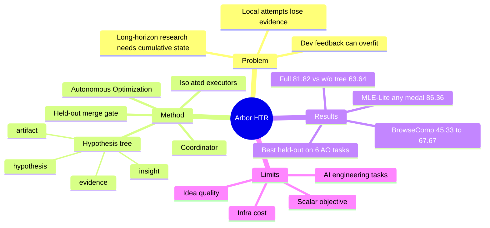

## Summary

Arbor 把 autonomous research formalize 为 Autonomous Optimization（AO）：agent 在没有 step-level human supervision 的情况下，通过反复实验改进一个 artifact。核心方法 Hypothesis Tree Refinement（HTR）用持久 hypothesis tree 连接 hypothesis、artifact version、evidence、distilled insight，并用 isolated worktree executor + held-out merge gate 把局部实验变成可累积、可审计的研究过程。

## Problem & Motivation

现有 coding agent 能长时间编辑代码和跑实验，但“跑得久”不等于“像研究一样进步”。真正困难的是：失败实验如何变成约束，多个竞争方向如何并行保留，局部改进如何避免 dev overfitting，哪些 evidence 足以让一个 artifact 被晋升为 current best。

Arbor 的问题定义是 Autonomous Optimization（AO）：给定初始 artifact、研究目标、开发 evaluator `Edev`、held-out evaluator `Etest`，agent 必须在固定资源预算下改进 artifact。这个 formulation 比“自动写论文”更窄，但也更可检验：研究是否真的推进，由 held-out artifact improvement 证明。

## Method

**Coordinator / Executor 分层**：

- long-lived coordinator 维护全局 research state，决定扩展、剪枝、合并哪些方向；
- short-lived executors 在 isolated git worktree 中测试单个 hypothesis，返回 score、实验结果、distilled insight、artifact references；
- coordinator 不直接在 shared working tree 里随意试错，executor 也不能改写自己的 hypothesis，这保证每个实验的语义可解释。

**Hypothesis Tree as Research State**：

HTR 的树节点绑定四类东西：`hypothesis`、实现该 hypothesis 的 artifact state、实验 evidence、distilled insight。树既是 search frontier，也是 memory，也是 audit trail。叶子实验完成后，coordinator 把局部结果向祖先节点抽象，形成下一轮 ideation / selection 的约束。

**Held-out merge gate**：

development evaluator 只用于探索，不能直接决定 artifact 晋升。candidate branch 只有在 fresh detached worktree 上跑 `Etest` 并超过 current best 时才会被 merge。这个设计把“dev 上看起来有效”与“artifact-level verified progress”分开，是整篇最重要的可靠性机制。

**Implementation contract**：

Arbor 的 coordinator 工具有 TreeView / TreeAddNode / TreeUpdateNode / TreePrune / RunSubagentParallel / GitMergeBranch 等；executor 只在自己的 worktree 内 Bash/FileRead/Edit/Grep/Glob。tree 每次 mutation 后序列化为 JSON 和 Markdown。默认 20 coordinator cycles、最大树深 2，executor parallelism 受 evaluator 资源约束。

## Key Results

**六个真实 AO tasks：Arbor held-out 全胜**：

- Optimizer Design：held-out steps 从 3325 降到 3237.5（+2.63% relative improvement），Codex 为 +0.00%，Claude Code +1.13%。
- Architecture Design：held-out loss 从 1.098 降到 1.028（+6.38%），Codex +1.37%，Claude Code +5.92%。
- Terminal-Bench 2.0：held-out pass 从 69.81 到 77.36（+7.55），Codex +3.78，Claude Code +1.89；Claude Code dev 更高（75.00）但 held-out 掉到 71.70，显示 dev overfitting。
- BrowseComp：held-out accuracy 从 45.33 到 67.67（+22.34），Codex 50.00，Claude Code 53.33。
- Search-Agent Data Synthesis：held-out gap 从 5.00 到 18.00（+13.00），Codex +4.00，Claude Code +7.00。
- Math-Reasoning Data Synthesis：held-out pass-gap 从 1.04 到 20.83（+19.79），Codex +5.21，Claude Code +7.29。

**MLE-Bench Lite**：

- Arbor + Gemini-3-Flash：100% valid submissions，86.36% above median，81.82% any medal。
- Arbor + GPT-5.5：100% valid submissions，95.45% above median，77.27% gold，86.36% any medal，为表中最高 any-medal / gold 组合。

**Ablations**：

- Full Arbor 在 MLE-Bench Lite（Claude Opus 4.6 backbone）Any Medal 81.82%。
- 去掉 tree：63.64%。
- 保留 tree 但去掉 insight feedback：54.54%。

这说明树结构本身不够，真正重要的是把 leaf-level evidence 抽象成 direction-level lessons，让后续 proposal distribution 改变。

**Cost**：

六个 completed cost logs 中 Arbor 使用 20.12M-43.19M tokens，量级与 single-trajectory baselines 相近；收益主要来自 budget organization，而不是单纯采样更多。

## Strengths & Weaknesses

**亮点**：

- 问题 formulation 好：AO 把“自动科研”从宏大的 end-to-end scientist narrative 拉回可检验 artifact optimization。
- HTR 的 state abstraction 清晰：hypothesis / artifact / evidence / insight 四件事绑在一起，避免传统 agent transcript 里“试过什么、为什么失败、该不该继续”不可审计。
- held-out merge gate 是关键 taste：它承认 dev feedback 会被 agent exploit，并把验证进步做成系统边界，而不是 prompt advice。
- isolated worktree executor 的工程边界合理，和当前 Codex 多 worktree / subagent workflow 很贴近。

**局限**：

- AO task suite 仍偏 AI engineering：model training、harness engineering、data synthesis，不等于完整 scientific discovery。biology / math / physics 等更开放问题还没证明。
- 固定 scalar objective 简化了真实研究。真正研究常同时关心 performance、resource、robustness、interpretability、novelty、safety，单一 metric 容易诱导 metric chasing。
- idea generation 仍是瓶颈。论文自己承认 agent 会放弃早期失败但可能有前途的方向，也可能从 observed scores reverse-engineer 方案，而不是从 first principles 形成机制假设。
- 成本和 infra 重：prompt caching、evaluator scheduling、isolated environment startup、parallel worktree execution、inter-agent coordination 都是成败因素。HTR 是正确抽象，但不是低成本方案。

## Mind Map

## Notes

- 这篇对本 vault 的 `autoresearch` 设计直接相关：当前 `Workbench/agenda.md` + `queue.json` + logs 是线性状态，缺少 hypothesis tree。尤其是“暂停 / 失败 / 负证据”没有被树状地保留，导致后续容易重复跑相似方向。
- 对 [[Reports/2026-06-23-AgentFriendlyEnvironment-Proposal]] 的启发：AFE-MiniSuite 也需要 held-out gate 概念。不能只看 agent 在可见 dev apps 上通过了更多任务，还要有隐藏/held-out task family 验证 affordance 没有造成 reward hacking。
- 和 [[Papers/2606-OpenRath]] 的关系：OpenRath 是 runtime state substrate，Arbor 是 research-state controller。两者可组合：Session 记录 execution/evidence，HTR 记录 hypothesis/artifact/search frontier。
- 我不完全买账的地方：Arbor 把研究简化为“优化已有 artifact + evaluator”，这对 harness/training/data synthesis 非常合适，但对 problem formulation 本身的 pivot 能力仍弱。真正重要的科研常常是换 metric 或换问题，而不是在给定 evaluator 上爬坡。
