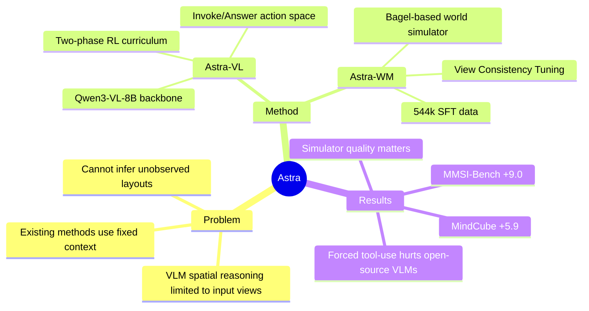

## Summary
提出 Astra 框架，让 VLM 通过调用 world simulator 主动获取"想象视角"的视觉证据，解决空间推理中缺失视角的问题。核心是两部分：Astra-VL 用 RL 训练 VLM 学会何时调用 simulator；Astra-WM 用 View Consistency Tuning 让生成图像满足空间一致性。

## Problem & Motivation
VLM 的空间推理局限于输入图像，难以推断未观测布局、维持跨视角一致性、从替代视角推理。现有方法（CoT、中间视角、cognitive maps）要么依赖固定视觉上下文，要么用预定义中间表示，无法主动决定"什么视角有用"并获取对应证据。作者将问题重新定义为"thinking with imagination"：VLM 主动向 world simulator 发出 camera-motion 查询，获取想象的新视角观测，并在推理中整合。

## Method
**Astra 框架**包含两个组件：

1. **Astra-VL**：基于 Qwen3-VL-8B 的 agentic reasoning model。动作空间为 `{Invoke, Answer}`——Invoke 指定参考图像、运动类型（lateral/forward/yaw/pitch 等）和幅度，生成自然语言 camera-motion instruction 发送给 simulator。用两阶段 RL 训练：
   - Phase 1：探索阶段，加入 capped simulator-use bonus，防止 policy collapse 到短回答
   - Phase 2：选择性想象阶段，对比 tool-augmented vs direct answering，奖励正向增益、惩罚负向影响

2. **Astra-WM**：基于 Bagel 的 world simulator，生成 action-conditioned novel views。关键创新是 **View Consistency Tuning**：在 544k quality-verified SFT 数据上微调（IsaacSim, ScanNet++, Matterport3D, DL3DV 等），让生成视图遵循请求的运动并保持场景内容一致性。设计 pose consistency 和 content consistency 两个评测指标验证 simulator 质量。

**数据构建**：World Simulator SFT 用 544k posed multi-view 样本；Agentic RL 用 6k 挑选的 challenging samples（从 SenseNova-800K, VST-500K 和 Hard-UMMQA 中筛选，Qwen3-VL-8B 5 次采样最多 1 次正确）。

## Key Results
**主实验**（MMSI-Bench / MindCube-tiny）：

| Setting | Model | MMSI-Bench All | MindCube All |
|:---|:---|:---|:---|
| Direct Answer | Qwen3-VL-8B | 29.8 | 36.8 |
| Forced Tool-Use (zero-shot) | Qwen3-VL-8B + Astra-WM | 28.6 (-1.2) | 27.6 (-9.2) |
| **Agentic Tool-Use** | **Astra (Qwen3-VL-8B)** | **38.8 (+9.0)** | **42.7 (+5.9)** |
| Direct Answer | Gemini-3-Flash | 45.1 | 70.5 |
| Forced Tool-Use | Gemini-3-Flash + Astra-WM | 49.5 (+4.4) | 72.7 (+2.2) |

关键发现：
- **Forced tool-use 反而伤害开源 VLM**：Qwen3-VL 直接接入 simulator 性能下降（MMSI -1.2, MindCube -9.2），说明没学会何时调用、如何整合
- **RL 训练后的 Agentic 使用带来显著提升**：Astra 在 MMSI +9.0，MindCube +5.9
- **Simulator 质量 critical**：off-the-shelf Bagel pose consistency 仅 9.0/3.0，Astra-WM 达到 69.0/75.0

**Ablation**（详见附录）：
- Astra-WM 的 pose/content consistency 随训练数据量增加（30k→60k）持续提升
- 不同 spatial-relation 子类别收益不同：Cam.-Cam. (+12.4) 和 Obj.-Obj. (+11.8) 提升最大

## Strengths & Weaknesses
**亮点**：
- 问题定义清晰：将"空间推理缺陷"转化为"主动证据获取"，framing 很有意思
- 两阶段 RL 设计合理：Phase 1 防探索崩溃，Phase 2 学选择性调用，reward shaping 有细节
- 实验设计诚实：forced tool-use 的 negative result 直接展示，没有 cherry-pick

**局限**：
- World simulator 依赖 Bagel（未公开模型细节），复现门槛高
- RL 训练数据 6k，规模较小，泛化能力存疑
- 仅在室内场景评测（MMSI, MindCube），开放世界/室外场景未验证
- Camera-motion vocabulary 较有限（5 种），复杂运动如何处理未讨论
- 与 true world model（如 learned dynamics）对比缺失，"simulation" 是否准确？

**潜在影响**：将 world model 从"被动预测"变成"主动推理工具"，对 GUI Agent（屏幕理解）、Embodied AI（场景探索）有启发。但核心问题是：生成图像作为"想象证据"是否可靠？ simulator 误差会累积误导推理吗？

## Mind Map

## Notes
- 与 DeepEyes、Pixel Reasoner 的"thinking with images"方向一致，但后者操作现有图像，Astra 生成新视角
- "想象证据"的风险：如果 simulator 生成错误的空间关系（如物体位置偏移），会系统性误导推理。论文提到 pose/content consistency 但未分析 error propagation
- RL 的 reward 设计有意思：$\alpha$奖励正向增益、$\beta$惩罚负向影响，但如何避免模型学会"只在简单问题上调用 simulator"？
- 期待看到：与 3D reconstruction（NeRF/3DGS）结合的真实视角合成对比；开放世界评测；更多 failure case 分析