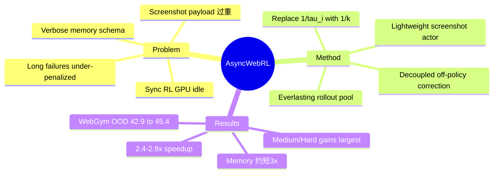

## Summary

AsyncWebRL 在 WebGym 之上提出 fully asynchronous multi-step RL framework，通过 everlasting rollout pool、lightweight screenshot handling 和 decoupled off-policy correction 提升训练吞吐，同时发现 multi-step GRPO 的 `1/|tau_i|` step normalizer 会鼓励长失败轨迹和 verbose memory schema。把 normalizer 替换成常数 `1/k` 后，在 WebGym OOD split 上把开源 SOTA 从 42.9% 提到 45.4%，且 Medium/Hard slice 增益最大。

## Problem & Motivation

Visual web agent 的 multi-step RL 主要有两类效率瓶颈：

1. **系统瓶颈**：同步 RL 中 GPU 等待 browser rollout，且多步视觉轨迹包含大量高分辨率截图，跨 worker 传输会压垮 shared object store。
2. **算法瓶颈**：multi-step GRPO 常用的 `1/|tau_i|` trajectory step normalizer 会让长失败轨迹的 token 负梯度被下调。因为失败 rollout 往往比成功 rollout 更长，模型没有充分学会停止低效行为，反而学出 verbose memory schema。

作者的出发点很清楚：在固定 compute budget 下，web agent RL 的性能由“单位时间可消费多少有效 trajectories”决定。任何 GPU idle、截图 IO、过长 response 都会直接降低最终 agent。

## Method

### 1. Fully Async Multi-Step RL System

AsyncWebRL 在 WebGym synchronous rollout pool 基础上做两个 web-specific 改动：

- **Everlasting rollout pool**：rollout workers 跨 iteration 一直存活，不在每轮重建 browser sessions。一个 episode 结束后立即开始下一个，rollout、gradient update、policy refresh 连续重叠。
- **Lightweight screenshot handling**：高分辨率 screenshot tensors 不进入 shared RPC object store，而是保存在专门的 in-memory actor 中，worker 和 trainer 只传 lightweight references，避免 disk-spill path。

这两个设计解决了 visual multi-step RL 与普通 text RL 的差异：web agent 每条 trajectory 有几十张截图，且有数百并发 browser sessions。直接套已有 async LLM-RL 系统会被图像 payload 拖垮。

### 2. Decoupled Off-Policy Correction

Fully async execution 会引入 policy staleness：训练时使用的 batch 可能来自旧 policy，甚至同一 trajectory 可由不同 policy snapshot 生成。朴素 importance ratio `pi_theta / pi_behave` 同时包含 rollout staleness 和 current update movement，PPO clip 会频繁触发，导致样本被浪费。

AsyncWebRL 使用 decoupled-PPO factorization：

- `pi_theta / pi_behave = (pi_theta / pi_prox) * (pi_prox / pi_behave)`
- PPO clipping 只围绕 proximal policy `pi_prox`，让 clip 反映当前优化步的移动，而不是旧 rollout 的 staleness。

论文报告该设计大约将 clip-trigger rate 减半。

### 3. Constant Step Normalizer

论文最有 insight 的算法点是诊断 multi-step GRPO 的 `1/|tau_i|`。在 WebGym 中，失败轨迹平均 **12.5 steps**，成功轨迹平均 **5.1 steps**。如果 loss 对每条 trajectory 用 `1/|tau_i|` 归一化，那么失败轨迹每个 token 的 negative gradient 被约 **2.4x** 下调。

这会产生一个看似细节但很致命的行为：agent 在每一步 response 中维护 append-only `Memory` JSON，`1/|tau_i|` 让长失败轨迹的 verbose memory padding 几乎不受惩罚，于是模型学会不断追加 generic slots。替换成常数 `1/k` 后，长失败轨迹获得完整惩罚，trajectory 变短，memory 更 compact，任务成功率保持或提升。

## Key Results

### WebGym OOD Test Split

| Model | Method | Easy | Medium | Hard | Avg |
|:--|:--|--:|--:|--:|--:|
| Qwen3-VL-8B-Instruct | Base | 32.5 | 11.2 | 0.0 | 26.2 |
| Qwen3-VL-8B-Instruct | WebGym sync REINFORCE | 50.9 | 24.1 | 4.8 | 42.9 |
| Qwen3-VL-8B-Instruct | AsyncWebRL-RAFT++ | 46.6 | 27.8 | 5.5 | 39.3 |
| Qwen3-VL-8B-Instruct | AsyncWebRL full | **52.4** | **34.3** | **7.1** | **45.4** |
| Qwen3-VL-8B-Thinking | Base | 37.4 | 24.3 | 1.2 | 32.0 |
| Qwen3-VL-8B-Thinking | AsyncWebRL-RAFT++ | 47.3 | 30.0 | 5.2 | 40.5 |
| Qwen3-VL-8B-Thinking | AsyncWebRL full | **51.8** | **35.1** | **11.3** | **44.4** |

核心数字：AsyncWebRL full 在 Instruct 上达到 **45.4%**，相对 WebGym 42.9% 提升 **+5.8% relative**。Medium / Hard slice 增益最大，论文和项目页分别报告约 **+42% Medium / +48% Hard relative**。

### Throughput

项目页报告 AsyncWebRL 在 24 小时预算下累积 trajectory 数显著高于 sync WebGym，约 **3,100 traj/h**，而 sync WebGym 为约 **1,300 / 1,050 traj/h**（Instruct / Thinking），对应 **2.4-2.9x end-to-end speedup**。

### Behavior Analysis

`1/|tau_i|` step normalizer 会诱导 memory bloat：

- GRPO length norm 下，agent 每步倾向添加新的 generic memory key，34% keys 是 generic placeholders，仅 7% trajectories 能保持 key set 到结束。
- 常数 `1/k` 下，generic-slot keys 降到 11%，Memory 约短 3x，同时任务成功率基本匹配或更好。

这个 finding 很有价值，因为它说明 trajectory-level loss 归一化会悄悄改变 token-level generation 行为，尤其是在 agent 有 self-maintained memory / scratchpad 时。

## Strengths & Weaknesses

**Strengths:**

1. **系统问题抓得准**：visual multi-step RL 的瓶颈确实不是单个 optimizer step，而是 browser rollout、截图搬运、session warm-up 和 GPU idle。AsyncWebRL 直接打在痛点上。
2. **web-specific system design**：lightweight screenshot handling 不是通用 async RL 论文会自然想到的东西，它来自 visual web rollout 的具体负载。
3. **`1/|tau_i|` 诊断很漂亮**：一行 normalizer 造成长失败轨迹 under-penalized，再外溢成 memory schema bloat，这个机制有 first-principles 解释，也有行为分析支撑。
4. **结果是增量但实在**：在 WebGym 已经较强的 sync pipeline 上继续提升到 45.4%，且 hard slice 相对增益大。

**Weaknesses:**

1. **依赖 WebGym 的任务与 reward 假设**：AsyncWebRL 改的是训练系统和 loss，不解决 WebGym evaluator 的可靠性问题。如果 rubric reward 有偏差，更快 RL 也会更快放大偏差。
2. **SOTA gain 幅度有限**：Avg 42.9 -> 45.4 是有意义但不是范式级 leap。真正的贡献更多在 training efficiency 和 loss pathology。
3. **工程复杂度高**：everlasting rollout pool、screenshot actor、policy refresh、decoupled importance sampling 都提高系统实现门槛。
4. **分析集中在 Memory prompt 设计**：`1/|tau_i|` 的 pathology 在 append-only memory schema 下非常明显，但在没有显式 memory 或 memory 可编辑的 agent 中是否同样强，需要进一步验证。
5. **仍非 deterministic environment**：和 WebGym 一样，它没有提供 MobileGym 式 state forking / programmatic verifier / controlled transition simulation。

**Impact:** AsyncWebRL 是 WebGym 路线的自然强化：先有大规模 web task environment，再把 RL 系统吞吐和 loss shape 做到能稳定消费这些任务。对我们最有启发的是：GUI/web agent RL 的很多“算法问题”其实是环境和系统设计诱发的，例如长失败轨迹、verbose memory、截图 IO、rollout warm-up。这支持继续把 GUI agent 研究重心从模型换到 environment / harness / reward。

## Mind Map

## Notes

- 这篇和 [[2601-WebGym]] 的关系类似 DART-GUI 和 GUI RL infra 的关系：不重新定义环境，而是让现有环境上的 RL 跑得更快、更稳。
- 它间接支持一个研究原则：在 agentic RL 中，不要只看 final success；还要看 trajectory length、tokens/step、memory growth、failure horizon。这些可能是 reward hacking 或训练病态的早期指标。
- 对 MobileGym-style web simulator 的启示：如果未来做 transition-faithful WebGym，系统层面必须一开始就设计 state forking、screenshot/reference handling、异步 rollout 和长度/副作用 penalty，否则环境再好也吃不动。

