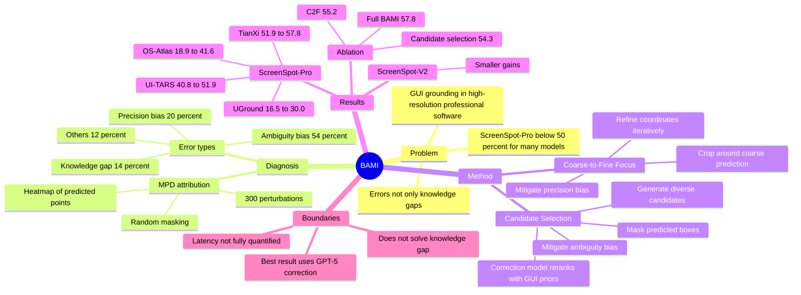

## Summary

BAMI 提出一种 training-free GUI grounding inference method：先用 MPD attribution 诊断 ScreenSpot-Pro 上的错误来源，再用 coarse-to-fine focus 和 candidate selection 缓解 precision bias / ambiguity bias。核心结果是在 ScreenSpot-Pro 上把 TianXi-Action-7B 从 51.9% 提升到 57.8%，但它主要处理模型“知道目标但定位/选择偏了”的 inductive bias，对 knowledge gap 不是直接解法。

## Problem & Motivation

GUI grounding 是 GUI agent 执行 click、typing、dragging 等 atomic action 的基础：给定自然语言 instruction 和 screenshot，模型需要输出目标 UI element 的坐标或 bounding box。论文关注的难点是 professional high-resolution GUI：截图分辨率高、元素密集、icon/text/context 混合，导致 ScreenSpot-Pro 上多数模型 accuracy 低于 50%。

作者的关键问题不是再训练一个更强模型，而是问：现有 MLLM / GUI grounding model 的能力是否被 inference procedure 限制了？通过 MPD 对 TianXi-Action-7B 在 ScreenSpot-Pro 的 50 个错误样本做 attribution，作者把失败分成 knowledge gap、precision bias、ambiguity bias 和 others；其中 precision bias + ambiguity bias 合计 74%，说明大量错误可能不是“不会识别目标”，而是坐标离散化和候选选择偏置带来的系统性失误。

重要性在于，这类误差直接影响 GUI agent 的可靠性：在复杂软件里，几十到几百像素的偏移或在相似 UI 元素之间选错，都可能让 agent 执行完全不同的操作。若 inference-time structured manipulation 能稳定提升定位，就能在不重新训练 base model 的情况下提高已有 GUI agent stack 的可用性。

## Method

**MPD attribution.** Masked Prediction Distribution 通过随机遮挡 screenshot 的 grid blocks，对同一 query 重复预测并聚合预测点分布，用 heatmap 观察模型注意力/候选坐标倾向。作者认为 GradCAM、Integrated Gradients 不适合 discrete text-to-coordinate conversion；Shapley value 虽可做 attribution，但单样本在 RTX 4090 上约 10 小时，因此 MPD 用 300 次 perturbation 将单样本 heatmap 成本降到约 20 分钟。MPD 是诊断工具，不是最终 inference pipeline 的必要每步组件。

**Error taxonomy.** 论文把错误分为：

- **Knowledge Gap**：模型不能识别目标信息，50 个错误样本中 7 个，占 14%。
- **Precision Bias**：模型识别到目标但存在系统性坐标偏移，10 个样本，占 20%。
- **Ambiguity Bias**：模型被相似区域或误导语义吸引，27 个样本，占 54%。
- **Others**：6 个样本，占 12%。

**Coarse-to-Fine Focus for precision bias.** BAMI 先让 grounding model 在原图上预测 coarse location，再围绕预测区域按 crop ratio `lambda < 1` 裁剪，将 cropped image 重新输入模型做 finer localization。动机是高分辨率 GUI 下，坐标以 text token 形式离散生成，单步输出容易产生几十到几百像素误差；递归裁剪减少搜索空间，并让同样的输出精度映射到更小图像区域。实验默认使用 2 次 coarse-to-fine iteration；crop ratio 在高分辨率截图上设为 0.5 到 0.7。

**Candidate Selection for ambiguity bias.** BAMI 在每轮中生成多个 mutually exclusive candidate boxes：每得到一个 candidate，就 mask 掉该 candidate box 内像素，再让 grounding model 预测下一个 candidate。然后用 correction model 在候选之间重新选择，prompt 中注入 GUI priors，例如 functional purpose、standard UI patterns、interactive elements over static labels，以及 element quality hierarchy。论文测试了 online APIs（如 GPT-5、Gemini-2.5-Pro）和 local Qwen3-VL-8B correction model。

**BAMI pipeline.** 外层循环做 coarse-to-fine focus，内层循环通过 mask-and-predict 生成 2 到 3 个 candidates，再由 correction model 选择最合适的 box，最后对 selected box 继续 crop/refine。对 bounding-box-output models（OS-Atlas、TianXi-Action）直接 mask box；对 click-point-output models（UGround、UI-TARS）先把点击点上下左右扩展固定像素再 mask。方法声称不需要 retrain grounding model；但 local correction variant 本身用 LoRA 在 128,487 个 dual-box samples 上训练。

## Key Results

**ScreenSpot-Pro main comparison.** 在 ScreenSpot-Pro 上，BAMI-7B 的 average accuracy 为 57.8%，高于 TianXi-Action-7B baseline 的 51.9%（+5.9 pp）、DiMo-GUI-7B 的 49.7%、GUI-G2-7B 的 47.5% 和 SE-GUI-7B 的 47.3%。同一表中，GPT-4o 为 0.8%，Claude Computer Use 为 17.1%，Qwen2.5-VL-7B 为 26.8%，显示 general MLLM 在该 benchmark 上远弱于 GUI-specific models。

**Backbone transfer on ScreenSpot-Pro.** BAMI 在多个 base grounding models 上都有提升：UGround-7B 从 16.5% 到 30.0%，OS-Atlas-7B 从 18.9% 到 41.6%，UI-TARS-1.5-7B 从 40.8% 到 51.9%，TianXi-Action-7B 从 51.9% 到 57.8%（GPT-5 correction）。使用 local Qwen3-VL-8B correction model 时，TianXi-Action-7B + BAMI 为 56.2%，低于 GPT-5 版本但仍高于 51.9% baseline。

**Component ablation on ScreenSpot-Pro.** TianXi-Action-7B baseline 为 51.9%；只加 coarse-to-fine focus 为 55.2%；只加 candidate selection 为 54.3%；二者合并的 BAMI 为 57.8%。Prompt ablation 中，vanilla prompt 为 55.7%，加入 CoT 为 57.0%，加入 CoT + key principles 为 57.8%，说明 selection prompt 中的 GUI priors 对 ambiguity correction 有贡献。

**Correction model ablation.** 不同 online correction models 都提升了 ScreenSpot-Pro accuracy：Doubao-Seed-1.6-Flash 为 55.3%，GLM-4.5V 为 55.9%，Qwen-VL-Max 为 56.4%，Gemini-2.5-Pro 为 57.2%，GPT-5 为 57.8%。local Qwen3-VL-8B correction model 为 56.2%，论文报告其训练只微调 language model component，LoRA rank 128、alpha 256、dropout 0.05，约 200M trainable parameters，占总参数 2.5%。

**ScreenSpot-V2 result.** 在较简单的 ScreenSpot-V2 上，提升明显更小：OS-Atlas-7B 从 81.2% 到 82.2%，UI-TARS-1.5-7B 从 86.4% 到 86.5%。这支持作者的判断：BAMI 的主要价值在高分辨率、目标小、干扰多的复杂 GUI 场景，而不是已经接近饱和的简单 grounding benchmark。

**Attribution result.** MPD 对 TianXi-Action-7B 在 ScreenSpot-Pro 的 50 个错误样本分析显示：knowledge gap 14%，precision bias 20%，ambiguity bias 54%，others 12%；precision + ambiguity 作为 inductive bias 合计 74%。这是 BAMI 方法设计的直接证据来源，也是该论文最有 insight 的部分。

## Strengths & Weaknesses

**已知 Strengths.** BAMI 的强点是把 GUI grounding 的失败拆成可操作的机制假设，而不是只报告 benchmark 分数。MPD 虽然是 heuristic attribution，但它把“模型没知识”和“模型有知识但坐标/候选偏了”区分开，让 training-free inference manipulation 有清晰目标。coarse-to-fine focus 对 precision bias、candidate selection 对 ambiguity bias 的 ablation 也比较干净：单独模块分别提升到 55.2% / 54.3%，组合到 57.8%。

**已知 Limitations / boundary.** BAMI 不解决 knowledge gap：论文明确说 knowledge gap 来自训练数据或架构限制，难以用 inference-time technique 修复。方法对 complex GUI 更有效，对 ScreenSpot-V2 这种简单 benchmark 只有 +1.0 pp（OS-Atlas）和 +0.1 pp（UI-TARS）的提升。最佳结果依赖 GPT-5 correction model；local correction model 虽可离线部署，但需要额外 LoRA training，不是完全“零训练”的系统配置。

**已知 failure / sensitivity.** crop ratio 和 iteration count 有 trade-off：crop ratio 过激（小于 40%）会裁掉关键上下文，迭代过多会使 overall crop ratio 过大并降低性能。作者还报告 random sampling 生成 candidate boxes 时会高度重叠、缺乏 diversity，因此改用 masked prediction；这说明 candidate selection 的上限依赖候选集合是否真正覆盖不同区域。

**推测.** 这篇论文对 GUI agent pipeline 的启发是：grounding failure 可能不应只靠更大数据或 RL 修复，也可以通过 inference-time spatial search + external verification 拆解。BAMI 的 candidate selection 本质上把“坐标生成”与“GUI priors-based reranking”分离，可能能和 verifier、UI element parser 或 action-safety checker 结合。

**不知道.** 论文没有给出完整 latency / cost 对比，因此不知道 BAMI 在真实 GUI agent 多步执行中是否会因为多轮预测和 correction model 调用变得太慢。也不知道 correction model 在不同 UI language、dynamic UI、scrolling context、多窗口遮挡或真实 OSWorld-style task execution 中是否保持同样收益；ScreenSpot-Pro / ScreenSpot-V2 都是 static screenshot grounding benchmark，不能直接证明 end-to-end task success 会等比例提升。

## Mind Map

## Notes

- 最有价值的 insight 不是 57.8% 本身，而是 MPD 给出的 failure decomposition：在复杂 GUI grounding 中，很多错例可能是 inductive bias 而非 recognition failure。这会影响后续该优先做 data scaling、RL reward、test-time search，还是 verifier/reranker。
- BAMI 和 ScreenSpot-Pro / OS-Atlas 这条线形成很自然的后续问题：当 ScreenSpot-V2 逐渐饱和后，复杂 high-resolution professional GUI 才更能暴露定位偏置；因此 benchmark 难度设计会直接影响我们看到的是“模型不会看 GUI”还是“模型会看但坐标生成机制不稳”。
- 需要谨慎引用“training-free”：对 base grounding model 是 training-free，但 local correction path 需要额外训练；GPT-5 path 则引入 proprietary model capability、成本和隐私边界。若用于真实 computer-use agent，下一步应验证 BAMI 是否提升 end-to-end task success，而不只是 static screenshot grounding accuracy。
