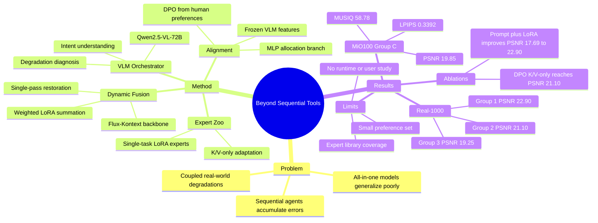

## Summary
这篇论文把 photographic post-processing 从 sequential tool invocation 改成 VLM-guided 的 one-shot multi-expert fusion：Qwen2.5-VL-72B 负责分析用户意图和图像退化，Flux-Kontext backbone 负责执行，多个 single-task LoRA experts 按动态权重同时融合。核心贡献不是新的单一 restoration model，而是用 DPO-aligned weight allocation + K/V-only LoRA composition，把 agentic planning、expert selection 和 diffusion restoration 合成一个单次前向执行框架。

## Problem & Motivation
真实照片退化通常是耦合的：noise、motion blur、haze、rain、low-light、JPEG artifact 等可能同时出现，逐个修复容易让一个步骤的 artifact 被后续模型放大。论文认为 specialized restoration models 只覆盖窄任务，all-in-one restoration models 对未见混合退化泛化不足，而现有 agentic IR 系统依赖 sequentially invoking disjoint tools，存在规划延迟、error accumulation 和 task conflict。作者要解决的问题是：能否让 VLM 做“brain”，用一个统一 diffusion backbone 做“hands”，再把多个 LoRA experts 作为可组合“pens”，在一次执行中协同处理多种退化。

## Method
系统分三步。第一步是 **Analysis and Planning**：输入 degraded image 和可选用户 prompt 后，Qwen2.5-VL-72B 作为 VLM Orchestrator Agent 同时做 user intent understanding 与 degradation diagnosis，输出两类计划：给 diffusion backbone 用的 refined text prompt，以及每个 expert LoRA 的权重 $w \in [0,1]$。

第二步是 **Dynamic Expert Assembly**：系统把多个 LoRA experts 按权重线性合成到 frozen Flux-Kontext diffusion backbone 中。每个 expert 对应一个 restoration skill，例如 denoising、deblurring、deraining、dehazing、low-light enhancement、JPEG artifact removal、raindrop removal 或 super-resolution。关键设计是 LoRA 只更新 self-attention 中的 Key 和 Value projection matrices，保持 Query frozen；作者的解释是这样保留 backbone 原有 attention pattern，让每个 LoRA 学“restoration content”而不是改写注意力结构，从而提升 composability。

第三步是 **Single-Pass Execution**：动态 assembled model 以 degraded image 和 enhanced prompt 为条件，一次 forward pass 生成 restored image。形式上，对每个 $M \in \{K,V\}$，合成权重为 $W'_M = W_{0,M} + \sum_i w_i \Delta W_{i,M}$。这利用了 LoRA task vector 的线性可加性，避免 sequential agent 逐个调用外部模型。

权重分配不是纯 prompt engineering。作者指出开源较小 VLM 难以只靠 prompting 给出精确连续权重，因此在 frozen VLM vision features 上接一个轻量 MLP allocation branch。训练流程是：先让 VLM 给 heuristic weight pseudo-label 做 cross-entropy pre-training，得到 reference policy $\pi_{ref}$；再从 500 张 real/synthetic 训练图像构造 preference dataset，对每张图生成 VLM heuristic + 4 个权重变体的 restoration 结果，由 human annotators 给 pairwise preferences；最后把连续权重离散成 bins，用 DPO 训练 allocation branch，使 winning weight bins 相对 losing bins 概率更高。DPO branch 训练 2,000 steps；LoRA experts 各自在对应 task dataset 上训练 10,000 到 40,000 steps。

## Key Results
- **Real-1000 zero-shot benchmark**：在 Group 1 single degradations 上，Ours 达到 PSNR **22.90**、LPIPS **0.1711**、DISTS **0.1380**、NIQE **4.375**、MANIQA **0.3295**、CLIPIQA **0.4098**、MUSIQ **60.67**；但 SSIM 为 **0.7718**，低于 InstructIR 的 **0.7796**。在 Group 2 two degradations 上，Ours 达到 PSNR **21.10**、SSIM **0.7175**、LPIPS **0.2528**、DISTS **0.1579**、NIQE **4.812**、CLIPIQA **0.4569**、MUSIQ **55.84**；MANIQA **0.2997** 低于 Qwen-Image 的 **0.3077**。在 Group 3 three degradations 上，Ours 为 PSNR **19.25**、SSIM **0.7310**、LPIPS **0.2650**、DISTS **0.1550**、NIQE **5.120**、MANIQA **0.3450**、CLIPIQA **0.3880**、MUSIQ **52.30**。
- **MiO100 Group C synthetic mixed-degradation benchmark**：Ours 达到 PSNR **19.85**、SSIM **0.5765**、LPIPS **0.3392**、MUSIQ **58.78**，优于 4K Agent 的 **19.77 / 0.5629 / 0.4271 / 55.56**；但在 no-reference perceptual metrics 上不是全胜，MANIQA **0.3298** 低于 4K Agent 的 **0.3545**，CLIPIQA **0.4742** 低于 4K Agent 的 **0.5233**。
- **Agent component ablation on Real-1000 Group 1**：baseline Flux-Kontext with simple prompt (A) 为 PSNR **17.69**、SSIM **0.5618**、LPIPS **0.4275**、MUSIQ **48.92**；加入 VLM enhanced prompt (A+B) 提升到 **19.37 / 0.6426 / 0.2967 / 51.35**；再加入 expert LoRA (A+B+C) 达到 **22.90 / 0.7718 / 0.1711 / 60.67**。这支持“prompt enhancement 有帮助，但 specialized expert LoRA 才带来主要增益”的结论。
- **DPO weights and K/V-only LoRA ablation on Real-1000 Group 2**：Fixed Weights (K/V only) 为 PSNR **19.56**、SSIM **0.6722**、LPIPS **0.2901**、MUSIQ **53.29**；Heuristic $\pi_{ref}$ (K/V only) 为 **20.12 / 0.6850 / 0.2785 / 54.72**；Full LoRA (QKV) + DPO 为 **20.45 / 0.6981 / 0.2677 / 54.15**；Ours (K/V only + DPO) 达到 **21.10 / 0.7175 / 0.2528 / 55.84**。这同时支持 DPO-aligned allocation 和 K/V-only adaptation 的作用。
- **Failure analysis against sequential agents**：论文的定性比较把 sequential tool invocation 的失败分为 **Cumulative Artifacts**、**Noise Amplification**、**Unrealistic Smoothing**、**Content Hallucination** 四类；例子包括 4K Agent 在 motion blur + JPEG artifacts 输入上加剧 blocky artifacts，在 defocus blur + noise 输入上放大 noise，以及生成不存在的 birds。

## Strengths & Weaknesses
**已知 Strengths：** 这篇的 problem formulation 有价值：它不是继续做一个更大的 all-in-one restoration model，而是直接攻击 agentic restoration 的 sequential composition failure。动态融合多个 LoRA experts 的 single-pass execution 与 VLM analysis/planning 结合，给“agent uses tools”提供了一个更可微、更低耦合错误累积的替代形态。

**已知 Strengths：** 实验没有只报主表，ablation 能区分 VLM prompt enhancement、expert LoRA、DPO allocation、K/V-only LoRA adaptation 的贡献。尤其 Table 5 显示 Ours 相对 Heuristic $\pi_{ref}$ 从 PSNR **20.12** 到 **21.10**、SSIM **0.6850** 到 **0.7175**，说明 preference alignment 不只是装饰；相对 Full LoRA (QKV) + DPO 的 **20.45 / 0.6981**，K/V-only composition 也更稳。

**已知 Weaknesses / boundaries：** 论文自己的 conclusion 把 future work 放在扩大 expert library、研究 VLM 的 local region-based expert fusion、扩大 human preference dataset、做 comprehensive user studies。这意味着当前系统的覆盖范围受 expert zoo 限制，权重对齐数据规模只有 500 张采样图像，perceptual quality 主要依赖 IQA metrics 和定性展示，还没有完整用户研究。

**已知 Weaknesses / boundaries：** 表格不完全支持“所有指标全面第一”的强说法：Real-1000 Group 1 的 SSIM 低于 InstructIR，Group 2 的 MANIQA 低于 Qwen-Image；MiO100 Group C 的 MANIQA 和 CLIPIQA 低于 4K Agent。因此更准确的结论是：Ours 在 FR metrics 和多数 NR metrics 上很强，尤其 PSNR/SSIM/LPIPS/MUSIQ，但 perceptual metric 上仍有 trade-off。

**推测：** 对 GUI-agent / computer-use agent 的启发在于“不要把工具调用默认为 sequential pipeline”。如果多个 expert/tool 本质上作用于同一对象状态，先由 VLM 诊断，再以可组合权重一次性融合，可能比线性工具链更少 error accumulation。但论文没有评估 GUI、web、desktop 或 embodied agent，因此这个迁移只是一种架构启发，不能当作已验证结论。

**不知道：** 正文没有给出该论文自己的 code URL、DOI、arXiv id、端到端 latency 或与 sequential agents 的实际 wall-clock speedup。也没有系统报告本方法自身的 failure cases、不同 VLM orchestrator 尺寸的替换结果、human annotation agreement，或 expert library 扩展到新退化类型时的训练/融合成本。

## Mind Map

## Notes
这篇值得放进 VLM / agentic system 视野里，但不应把它当 GUI-agent 论文。最有用的 insight 是：当多个工具不是独立子任务，而是在同一状态空间里同时作用时，agent 的“plan”可以是 soft routing / weight allocation，而不是 tool sequence；这可能对应 GUI agent 中的 parser、OCR、grounding、state-repair modules 的融合式调度。关键未解问题是如何把这种一次性融合从 diffusion/LoRA 这种天然可加的参数空间，迁移到不可微、接口异构的真实工具系统。
