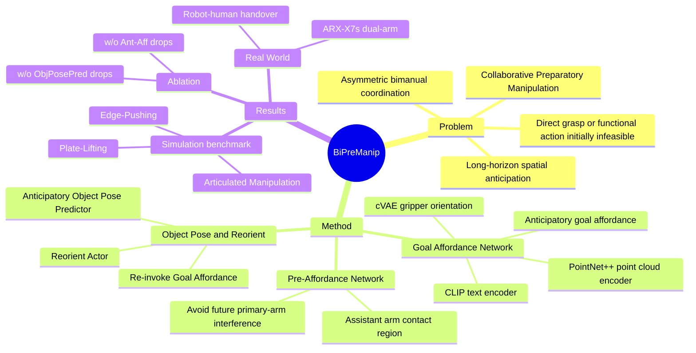

## Summary
BiPreManip 定义并研究 Collaborative Preparatory Manipulation: 一个手臂先通过 lifting、reorienting、pushing 等 preparatory manipulation 改变物体状态，让另一只手臂随后完成 goal-directed manipulation。方法核心是先预测 primary arm 未来交互的 anticipatory goal affordance，再用它约束 assistant arm 的 pre-affordance、object pose prediction 和 reorient action，在 SAPIEN 仿真、ARX-X7s 真实双臂平台和 robot-human handover 中验证。

## Problem & Motivation
许多日常物体不能直接被单臂抓取或功能性操作，例如平放的 tablet、倒扣的 bowl、躺在桌上的 capped pen 或 bottle。作者指出这类任务不是普通 bimanual manipulation 中的同步协作或可直接执行的双臂分工，而是需要一个 arm 先创造条件: 把物体推到桌边、抬起或旋转物体、暴露功能部件，另一个 arm 才能完成目标操作。

论文把这个问题形式化为 Collaborative Preparatory Manipulation，强调三个难点: 物体几何和语义理解、对未来交互空间关系的 anticipation、以及长时序的 asymmetric inter-arm coordination。这个方向对 embodied agent 有价值，因为它要求策略不是只预测当前可执行动作，而是推理“为了让未来动作可行，现在应如何改变环境”。

## Method
BiPreManip 的输入是 object point cloud 和 language instruction，输出分成 anticipatory、preparatory、execution 三个阶段。方法不是端到端直接生成整段双臂轨迹，而是用 affordance 作为显式中间表示来连接 perception 和 action。

### 1. Goal Affordance Network

Goal Affordance Network 预测 primary arm 未来应在哪里以及如何与目标物体交互。它用 PointNet++ 编码 point cloud，用 CLIP text encoder 编码 instruction，再通过 MLP 预测 per-point affordance score；选中 high-score point 后，用 cVAE 预测 gripper orientation，形成 6D action `a_goal = (p_goal, d_goal)`。在最开始调用时，这个 affordance 是 anticipatory 的: 它不是当前立即执行的动作，而是想象 preparatory manipulation 之后 primary arm 应该执行的 goal-directed interaction。

### 2. Pre-Affordance Network

Pre-Affordance Network 以 anticipatory goal representation 为条件，预测 assistant arm 的 preparatory affordance 和 action。它把 object geometry、language instruction、goal contact feature 和 goal orientation feature 融合后，输出 assistant arm 应该接触的位置 `p_pre` 和 gripper orientation `d_pre`。设计意图是让 assistant arm 的接触既能改变物体状态，又避免占用或干扰 primary arm 未来需要使用的 interaction region。

### 3. Anticipatory Object Pose Predictor 与 Reorient Actor

Anticipatory Object Pose Predictor 根据 goal action、preparatory action 和全局 object feature 预测期望 object transformation `T_obj`，得到 anticipated object configuration `O'`。随后 Reorient Actor 接收 `O'` 和 assistant arm 已 pre-grasp 后的 scene observation，预测将物体重定向到目标姿态所需的 6D preparatory motion。两者都以 cVAE 实现，rotation 用 geodesic loss，translation 用 L1 loss，并带 KL regularization。

### 4. Re-invoking Goal Affordance

Preparatory manipulation 完成后，同一个 Goal Affordance Network 会在更新后的 scene 上再次运行，预测最终 goal affordance 和 goal action。作者强调这里共享参数，用来保持 imagined interaction 和 executed interaction 的 semantic consistency 与 geometric coherence。

### 5. Training Supervision

Affordance score 使用 successful 和 failed demonstrations 监督，critic network 估计 object surface 上 sampled actions 的 empirical success probability，形成 ground-truth affordance map。anticipatory stage 本身没有直接 demonstration annotation，因此作者把 execution-stage 的 affordance label 和 gripper orientation 通过已知 object pose transformation 映射回 anticipatory frame，作为 anticipatory affordance 与 gripper orientation 的监督信号。

## Key Results
### Simulation Benchmark

Benchmark 基于 SAPIEN 和 Franka Panda grippers，包含 3 类任务: Articulated Manipulation、Edge-Pushing、Plate-Lifting。对象来自 ShapeNet 和 PartNet-Mobility，主文报告 18 个 object categories、882 个 instances，训练和 unseen object 按 3:1 划分；每个 category 收集 1,000 successful demonstrations 和 1,000 failure cases，seen/unseen evaluation set 每类各 100 个 test samples。

Table 1 的 success rate 显示，BiPreManip 在多个 Edge-Pushing 类别显著高于 baselines: Cap 为 71% / 74%，Heuristic 为 31% / 37%，ACT 为 22% / 36%；Laptop 为 62% / 67%，Heuristic 为 35% / 33%；Switch 为 61% / 72%，Heuristic 为 20% / 23%；Window 为 87% / 87%，Heuristic 为 56% / 56%。在 Plate-Lifting benchmark 上，BiPreManip 达到 85% / 82%，高于 Heuristic 的 81% / 78% 和 3DFA 的 71% / 68%。

Articulated Manipulation 的结果更不均匀，但仍体现 anticipatory coordination 的价值: Pen-Button 为 67% / 72%，高于 Heuristic 的 27% / 34%、3DFA 的 14% / 25% 和 ACT 的 15% / 9%；Pen-Cap 为 26% / 32%，高于 Heuristic 的 22% / 15% 和 3DFA 的 1% / 0%；Bottle 为 30% / 26%，高于 Heuristic 的 19% / 14%。Dispenser training split 上 3DFA 为 57%、ACT 为 54%、Ours 为 45%，但 unseen split 上 Ours 为 56%，高于 Heuristic 47%、ACT 43%、3DFA 41%。

### Baselines

论文比较了 W2A、ACT、3DA、3DFA 和 Heuristic。W2A 是 single-arm affordance baseline，结果普遍较低，例如 Edge-Pushing Bowl 0% / 0%、Articulated Bottle 1% / 2%，说明这类任务确实不能靠直接 goal affordance 完成。ACT 能学到一些 temporal action patterns，但作者观察到它依赖 RGB image 和 joint states，2D 上看似合理的动作在 3D 中可能 misaligned。3DA/3DFA 的动作常出现空间上粗糙或不符合功能约束的问题；Heuristic 在部分任务较强，但依赖 simulation 中的 ground-truth scene information、canonical poses 和 handcrafted rules。

### Ablation

Table 2 在 Articulated Manipulation Tasks 上验证两个关键模块。移除 anticipatory-stage Goal Affordance Network 后，Pen-Button 从 67% / 72% 降到 48% / 58%，Pen-Cap 从 26% / 32% 降到 23% / 10%，Stapler 从 38% / 30% 降到 21% / 23%。移除 Object Pose Predictor 后，Pen-Button 降到 51% / 50%，Pen-Cap 降到 21% / 8%，Stapler 降到 14% / 14%；不过 Pliers unseen split 出现例外，w/o ObjPosePred 为 31%，Ours 为 29%，说明 full model 并非每个 category/split 都严格占优。

### Real-World Evaluation

真实实验使用 ARX-X7s dual-arm platform 和 Intel RealSense L515 depth camera。Table 3 报告真实任务成功次数: Edge Book 上 Ours 7/10，W2A 0/10，3DFA 1/10；Edge Hat 上 Ours 8/10，W2A 1/10，3DFA 0/10；Articulated Bottle 上 Ours 6/10，W2A 0/10，3DFA 0/10；Articulated Dispenser 上 Ours 8/10，W2A 1/10，3DFA 2/10；Handover Bowl 和 Bottle 分别为 5/10、6/10，而 W2A 均为 0/10，3DFA 分别为 0/10、2/10。

### Efficiency and Deployment Details

Supplementary material 报告，BiPreManip 在单张 NVIDIA V100 上约 24 小时收敛；完整 rollout 的平均 model inference time 为 0.27 秒，其中 pre-grasping 0.12 秒、reorientation 0.08 秒、final goal-directed action 0.07 秒；inference GPU memory 为 1,166 MB。真实部署中，预测的 SE(3) gripper poses 会先经过 inverse kinematics feasibility 和 controller constraints 检查，未通过的动作直接计为 failure，不做 recovery 或 resampling。

## Strengths & Weaknesses
### Strengths

- **问题定义清楚**: Collaborative Preparatory Manipulation 抓住了一个真实且常被简化掉的 embodied manipulation 场景，即一个 arm 必须先改变 object state，另一个 arm 才有可行的 goal action。
- **方法 insight 简洁**: 用 anticipatory goal affordance 先表达“未来目标交互”，再指导 assistant arm 的 preparatory action，比直接预测双臂 action sequence 更可解释，也更贴合 asymmetric coordination。
- **实验覆盖较完整**: 仿真中覆盖 Edge-Pushing、Articulated Manipulation、Plate-Lifting 三类任务，包含 seen/unseen objects；真实实验还包含 bimanual robot manipulation 和 robot-human handover。
- **Ablation 有信息量**: w/o Ant-Aff 和 w/o ObjPosePred 都出现明显下降，支持“anticipatory affordance”和“anticipated object pose”不是装饰性模块。

### Weaknesses / Limitations

- **仍然依赖 demonstration 和 simulator signal**: 每个 category 使用 1,000 successful demonstrations 和 1,000 failure cases；anticipatory supervision 还依赖 simulation 或 pose-estimation pipeline 提供 object pose transformation。真实世界中如果 pose estimation 不稳定，训练信号和执行闭环都会受影响。
- **不是闭环多步 correction**: Edge-Pushing failure analysis 指出当前任务设定只允许 single pushing attempt，remote 等物体可能因为一次 push 后不稳定而失败；作者把 multi-step closed-loop pushing 留给 future work。
- **感知设置较窄**: Failure case 中 lighter 的 ignition button 被 gripper 遮挡后导致 action ambiguity，作者明确指出这与 single-camera setup 有关，多相机可能缓解。
- **精细几何仍是瓶颈**: USB 的 small non-movable body 容易导致 unstable grasp，小直径 bowl 的 rim grasp 容易撞桌面，wide shallow bottle lid 对 gripper pose 精度敏感。
- **真实实验规模有限**: Real-world table 每个任务 10 次试验，能证明可行性和相对优势，但不足以说明大规模部署鲁棒性。

### 已知 / 推测 / 不知道

- **已知**: 论文报告 BiPreManip 在仿真多数 category、Plate-Lifting、真实双臂和 handover 任务上优于 W2A、ACT、3DA、3DFA、Heuristic 等 baselines，并给出了 ablation 和 failure analysis。
- **推测**: 这种“先预测未来 goal affordance，再规划 preparatory manipulation”的表示可能对 VLA 或 embodied agent 的 long-horizon physical reasoning 有迁移价值，尤其适合作为中间 supervision 或 planner-policy interface；但论文没有把 BiPreManip 接入通用 VLA foundation model。
- **不知道**: 论文文本未给出代码仓库链接，也没有报告更复杂 cluttered scenes、mobile manipulation、multi-camera real-world setting、或允许 recovery/resampling 的闭环部署结果。

## Mind Map

## Notes
- 对 GUI-agent 方向的启发不是界面操作本身，而是“preparatory action”这个问题 formulation: 很多 agent 任务也不是下一步直接点击/抓取即可完成，而是要先改变环境状态，让未来 action affordance 出现。
- 与 [[2606-AffordanceVLA]] 的连接: 两者都把 affordance 当作 perception-action bridge；BiPreManip 更聚焦 bimanual physical coordination，AffordanceVLA 更聚焦 VLA 内部的 structured affordance modeling。
- Supplementary Table 4 报告 dataset split 为 668 train / 213 unseen / 882 total；主文也写 18 categories、882 instances。若后续引用 dataset size，优先沿用论文报告值，不自行重算 aggregate。
