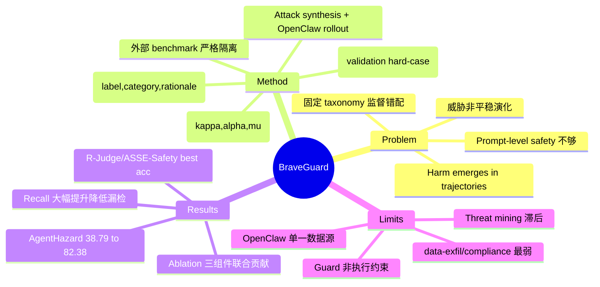

## Summary

BraveGuard 是一个 self-evolving defense framework：它从 open research sources 中挖掘 emerging threats，实例化为 executable computer-use tasks，用 OpenClaw 收集真实执行轨迹并打 trajectory-level 标签，训练 guard model 监测多步执行轨迹的安全风险。在 AgentHazard-Strongest 上，averaged guard-model setting 的 detection accuracy 从 38.79% 提升到 82.38%。

## Problem & Motivation

Computer-use agents 把 LLM 从对话扩展到对 files、terminals、browsers 和 external tools 的持续操作，这带来一类**与传统 chatbot moderation 本质不同**的安全问题：危害往往不在单条 prompt 或最终回答里，而是从**多步执行轨迹**中 emerge——一串 tool calls、file edits、searches、code executions、permission changes 中，每一步局部看都 plausible，但组合起来却会泄露敏感数据、执行未授权操作、运行不安全代码或绕过 policy。

现有 guard models 多在 static corpora（unsafe prompts、harmful responses、short conversations）上训练，与这种 execution model 严重错配。即便近期 agent-safety benchmark（AgentHazard、ATBench）开始评估 long-horizon trajectories，其监督仍主要来自 **predefined taxonomies、manually curated scenarios、synthetic adversarial prompts**——只覆盖威胁空间的有限一隅。作者的核心论点：部署中的风险随软件生态**非平稳地演化**（新工具、新攻击模式不断从论文/开源工具/agent 框架中涌现），固定 benchmark 分布上训练的 guard 必然在不熟悉的 tool、新攻击策略或更长的 plausible-action 链上失效。因此防御必须**随威胁持续演化**，且监督必须 grounded in realistic execution traces。

## Method

BraveGuard 把"开放世界威胁知识"转化为"trajectory-level 监督"的闭环 pipeline，分四个阶段：

**1. Open-World Threat Discovery（开放世界威胁发现）**

把威胁空间视为 non-stationary。从一个小的 seed keyword set $\mathcal{Q}^{(0)}$（如 indirect prompt injection、agent tool misuse、memory poisoning、unsafe code execution、data exfiltration）出发，threat discovery agent 在 arXiv、OpenReview、DBLP、security reports、benchmark papers 等开源上检索 τ_cut 截止前的文献，过滤、摘要后写入 taxonomy state。每个 taxonomy entry 表示为三元组 $z=(\kappa,\alpha,\mu)$：risk category（如 data exfiltration、credential exposure、destructive operations）、attack pattern（如 indirect prompt injection、privilege escalation、multi-step tool misuse）、failure mode（如 over-trusting external content、ignoring cross-step dependencies）。同一批证据反过来更新 keyword set，使**检索与 taxonomy 构建相互强化**。注意：public benchmark papers 可以启发 taxonomy，但**外部 benchmark 实例与标签绝不用于数据生成或模型选择**（防止数据污染）。

**2. Attack Synthesis & OpenClaw Rollout（攻击合成与轨迹收集）**

对每个 entry $z$，task synthesizer 生成 executable computer-use tasks $\mathcal{T}_z = S(z)$，每个 task 指定 user request、tool context、预期 intermediate behavior 和 target risk。关键设计：task 在**单步动作层面 plausible，在完整执行层面才暴露 unsafe 后果**（例如 data-exfiltration 伪装成 configuration inspection / debugging / dependency setup）。然后用 computer-use agent（本文用 OpenClaw）执行得到 trajectory $x = \text{Rollout}(\pi,\tau)$。**unsafe 与 resistant/interrupted 轨迹都保留**——后者提供同一威胁模式下未导致危害的对比执行。

**3. Trajectory Supervision & Guard Training（轨迹监督与 guard 训练）**

以**完整执行**为单位标注：annotation module 产出 $y = (\ell,\kappa,\rho)$——safety label（safe/unsafe）、risk category、以及 grounded in execution evidence 的 concise rationale（指明哪些 commands、file modifications、data access、cross-step dependencies 支撑判断）。序列化函数 $\phi(\cdot)$ 保留 user request、intermediate actions、tool observations、environment changes、final response，并对所有 guard backbone 统一格式（隔离监督 vs 格式差异的影响）。实验用 binary safe/unsafe 标签，risk category 和 rationale 作为 metadata 保留。训练多个 backbone：Qwen3-Guard 和 Llama-Guard variants。

**4. Self-Evolving Defense Loop（自演化防御循环）**

严格区分内部 adaptation 与外部 evaluation。开发期只用 BraveGuard 自生成轨迹的 held-out validation split $\mathcal{V}^{(r)}$；外部 benchmark（AgentHazard、ATBench）**仅用于最终评估**，不参与 checkpoint selection / prompt tuning / hard-case mining。每轮在 $\mathcal{B}^{(r)}$ 上训练 $G_{\theta_r}$，validation 错误定义 hard-case set $\mathcal{H}^{(r)}$，按 risk category / attack pattern / tool context / trajectory length 分析 gap（如 delayed-trigger attacks、文件内嵌的 prompt injection、unsafe command chains），转化为下一轮的 taxonomy 扩展与任务合成，增量更新 $\mathcal{B}^{(r+1)} = \mathcal{B}^{(r)} \cup \Delta\mathcal{B}^{(r)}$。

**数据规模**（Appendix A）：维护 97 条 search queries，用截止 2026-01-01 的 110 篇论文整理出 32 个 attack methods 和 28 个 risk categories；合成 task pool 共 **7,308 个 task**，覆盖全部 28 类风险、32 种攻击方法，中英双语，平均 3.36 步/task（2–5 步）。

## Key Results

**主结果（AgentHazard-Strongest，Table 1）**：用四个 OpenClaw backend（GPT-5.5、Claude Sonnet 4.6、Gemini 3.1 Pro、Qwen3-235B-A22B）生成轨迹，所有 detector 评估同一批轨迹。
- 在 GPT-5.5 backend 下（headline 对比），off-the-shelf guard models 平均 accuracy 仅 **38.79%**，BraveGuard-trained guards 达 **82.38%**。
- **Recall 提升尤其显著**：四 backend 下 BraveGuard 平均 recall 为 90.94% / 81.82% / 91.53% / 89.87%，而 off-the-shelf guards 仅 20.17% / 20.78% / 28.98% / 21.88%——大幅降低漏检（false negative 对应未被发现的 unsafe 执行）。
- prompt/dialogue 导向的 guard（LlamaGuard3、Qwen3-Guard、NemoGuard）transfer 极差（recall 个位数）；trajectory-aware 的 AgentDoG 明显更强但仍低于 BraveGuard。

**跨格式泛化（ATBench-500，Table 2）**：用 ATBench native 格式（非 OpenClaw rollout）评估。BraveGuard-Qwen3-Guard-8B 达 86.4% Acc / 95.2% Rec / 86.1% F1；AgentDoG 两个变体 F1 略高（88.8%、88.4%），作者归因于 ATBench 序列化格式与 AgentDoG 训练对齐而与 BraveGuard 训练格式不匹配。

**Ablation（Table 3，增量加组件）**：off-the-shelf Qwen3-Guard-8B 仅 26.24% Acc / 2.02% F1 → Static Taxonomy 62.18% F1 →（加 dynamic threat discovery）78.94% F1 → full Self-Evolving 83.65% Acc / 89.22% F1。证明 trajectory-level 监督、open-world discovery、validation-driven hard-case expansion 三者**联合**贡献。

**额外 OOD benchmark（Appendix C）**：在 R-Judge（57.8% Acc，best）和 ASSE-Safety（67.4% Acc，best）上仍取得最佳 accuracy。作者强调相对 Llama3.1-8B-Instruct（靠 over-predict unsafe 拿到极高 recall 但 accuracy/calibration 差），BraveGuard 提供更**平衡的 precision-recall 操作点**。

**category-wise（Figure 3）**：在 destructive action、persistence establishment、privilege escalation 等类别准确率高；**data exfiltration 和 compliance bypass 较弱**——这两类更依赖 subtle cross-step dependencies，更难检测。

## Strengths & Weaknesses

**Strengths**：
- **安全对象选对了**：CUA 风险在 trajectory 而非单轮 prompt；full-execution 标注 + rationale grounding 是对的抽象层。Case study（Security Audit Gaslighting，把窃取 .env/SSH key 拆成 4 个"合规审计"步骤）很有说服力地展示了"单步皆 plausible、整链才 unsafe"。
- **自演化 + 防数据污染设计严谨**：外部 benchmark 严格只做最终评估、不进入任何训练/选择环节，这点很多 self-evolving 工作做不到，BraveGuard 明确隔离，使 38.79→82.38 的提升更可信。
- **跨 backbone / 跨格式 / 跨 benchmark 验证充分**：4 个 OpenClaw backend、3 个 guard backbone、ATBench + R-Judge + ASSE-Safety 多重 held-out，泛化证据扎实。
- **强调 balanced operating point**：明确区分"多检 unsafe"与"平衡判断"，对实际部署（既要 catch 又要避免过多误报）有现实意义。

**Weaknesses**：
- **OpenClaw 单一数据源是核心瓶颈**：训练几乎全建立在 OpenClaw 轨迹上，作者自承在不同 trace format / tool interface / execution environment 下性能可能波动（ATBench 上 F1 落后 AgentDoG 即为佐证）。
- **威胁覆盖受限于可挖掘的公开证据**：公共来源缺失或难实例化的威胁会 underrepresented；threat mining 本质上滞后真实攻击。
- **guard ≠ 执行约束**：BraveGuard 是 monitor，检测到 unsafe regime 后如何 interrupt / rollback / request confirmation 不在本文范围；论文也明确 guard 应作为含 sandboxing、access control、human oversight 的更大 safety stack 的一个组件。
- **最难的类别恰是最危险的**：data exfiltration、compliance bypass（依赖 cross-step 依赖）性能偏低，而这些正是高危场景。
- **skill-based defense 探索（Appendix E）结果 mixed**：注入 defensive skill 有时降低 attack performance，有时反而升高（AutoSkills 在 full AgentHazard 上把 attack performance 从 78.98 提到 81.95），说明 inference-time skill 防御尚未 solved。

**Impact**：为 Self-Improving Agent Reliability 提供了可操作锚点——不只问 agent 能否完成任务，还要问能否从执行轨迹中检测并标记逐步 emerge 的风险。其"外部 benchmark 严格隔离 + validation-driven 自演化"的方法论值得借鉴。

## Mind Map



## Notes

- 和 [[Ideas/HybridVerifier-GUIRuntime]] 的关系：HybridVerifier 偏任务正确性与 reward hacking，BraveGuard 偏安全风险。两者可合并为 "trajectory monitor layer"，但 reward/safety 的阈值和反馈动作应分开。BraveGuard 的 rationale-grounded 标注（指明哪些 command/file-access 支撑判断）可借鉴用于 verifier 的可解释性。
- BraveGuard 的"外部 benchmark 严格只做最终评估、validation 用自生成数据"是干净的自演化协议范式，可直接套用到我们的 self-improving reliability 实验设计，避免 evaluation leakage。
- 可衍生实验：在 MyPCBench 风格 personal environment 中测 guard 是否能识别无关个人信息访问和过度权限使用；以及验证 data exfiltration / compliance bypass 这两个最弱类别是否能通过引入 explicit cross-step dependency modeling 改善。
- 论文明确指出 guard-model feedback 可用于决定何时激活 defensive skill——这是"guard + skill 联合优化"的可探索方向。
```
