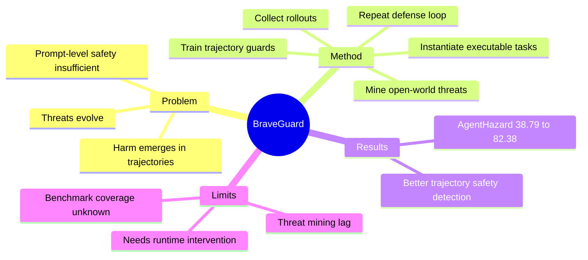

## Summary

> [未获取全文，仅基于 arXiv abstract]

BraveGuard 将 computer-use safety 从 prompt-level 分类推进到 trajectory-level monitoring：它从 open-world threat signals 中挖掘新风险，将其具体化为可执行 CUA tasks，收集 agent rollouts，再训练 guard model 检测多步执行轨迹中的安全风险。在 AgentHazard 上，averaged guard-model setting 的 detection accuracy 从 38.79% 提升到 82.38%。

## Problem & Motivation

> [未获取全文，仅基于 arXiv abstract]

Computer-use agents 能持续操作文件、终端、浏览器和外部工具，安全风险不再只体现在单条 prompt 或最终回答里。很多危险轨迹由局部看似无害的动作组成，例如先收集文件、再拼接信息、最后外传；孤立看每一步可能都不触发 guardrail。

因此，静态 taxonomy 和 synthetic prompt-level safety data 不够。安全监控必须观察 realistic execution trace，并能随着新威胁迭代。

## Method

> [未获取全文，仅基于 arXiv abstract]

BraveGuard 是一个 self-evolving defense framework，流程包括：

1. 从近期研究来源中挖掘 emerging risks 和 attack patterns。
2. 将这些 threat patterns 实例化为 executable computer-use tasks。
3. 收集 agent rollouts，形成 realistic execution trajectories。
4. 从 trajectory 中构造 supervision，训练 guard backbones，例如 Qwen3-Guard 和 Llama-Guard variants。
5. 当出现新威胁或 validation failure 时重复 pipeline，形成 adaptive defense loop。

核心不是训练一个更大的 static classifier，而是把 threat discovery、task instantiation、trajectory supervision 和 guard retraining 连接成循环。

## Key Results

> [未获取全文，仅基于 arXiv abstract]

- BraveGuard 在 trajectory-level agent-safety benchmarks 上持续提升 safety detection。
- 在 AgentHazard 上，averaged guard-model setting 下 detection accuracy 从 38.79% 提升到 82.38%。
- 结果支持一个结论：grounded in realistic agent execution 的 guard supervision，比固定分类法和 prompt-level synthetic data 更适合 computer-use agent safety。

## Strengths & Weaknesses

**Strengths**:

- **安全对象选对了**：CUA 的风险在 trajectory，而不是单轮 prompt。
- **自演化 loop 有现实意义**：open-world threats 会变，防御也必须持续更新。
- **与 agent-friendly runtime 强相关**：如果环境能提供 action provenance、state diff、permission boundary，trajectory guard 会更可靠。

**Weaknesses**:

- **依赖 threat mining 质量**：从研究来源挖掘 threat pattern 可能滞后真实攻击。
- **guard model 不等于执行约束**：检测到风险后如何安全 interrupt、rollback、request confirmation，abstract 未展开。
- **benchmark 泛化未知**：AgentHazard 上提升很大，但是否覆盖 personal assistant / SaaS / lab instrument 场景仍需验证。

**Impact**:

BraveGuard 为 Self-Improving Agent Reliability 提供了一个可操作锚点：不要只问 agent 能不能成功完成任务，还要问是否能从执行轨迹中检测并阻断逐步出现的风险。

## Mind Map

## Notes

- 和 [[Ideas/HybridVerifier-GUIRuntime]] 的关系：HybridVerifier 偏任务正确性与 reward hacking，BraveGuard 偏安全风险。两者可以合并成 “trajectory monitor layer”，但 reward/safety 的阈值和反馈动作应分开。
- 可衍生实验：在 MyPCBench 风格 personal environment 中测 guard 是否能识别无关个人信息访问和过度权限使用。
