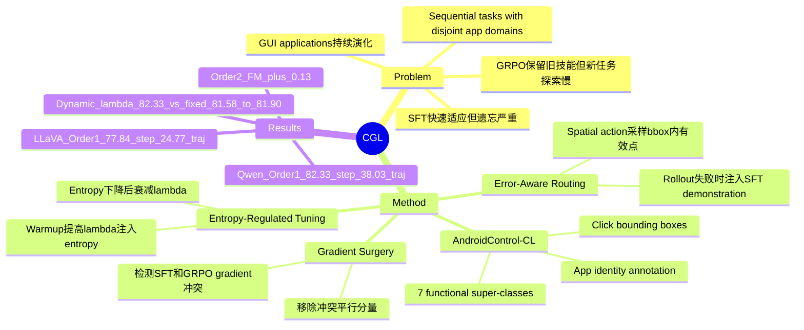

## Summary
CGL 研究 GUI agent 在应用类别连续到来时如何学习新 GUI task 而不遗忘旧 task，并把问题形式化为 Continual GUI Learning。方法上，它在 GRPO 的稳定性和 SFT 的快速适应之间做动态协同：用 Error-Aware Routing 注入监督样本、用 entropy-regulated SFT weight 控制探索/收敛、用 Gradient Surgery 削掉与 GRPO anti-forgetting 方向冲突的 SFT gradient。

## Problem & Motivation
GUI agent 需要适应频繁变化的 mobile applications、UI layout 和 task logic；静态训练范式很难覆盖现实软件生态的持续演化。作者把这个问题定义为 Continual GUI Learning：任务按时间顺序到达，每个任务由不重叠的 app domain 组成，模型在第 `k` 个阶段只能访问当前任务训练集，评估时要覆盖已见过的所有任务。

论文的核心观察是 SFT 和 RL 在 stability-plasticity 上有互补性。SFT 能快速吸收新任务，但容易把参数拉向新任务 manifold，造成旧交互逻辑被覆盖；GRPO 有更强 retention，但在新 GUI pattern 上会受 sparse reward 影响，rollout 全错时缺少区分信号，导致适应慢或探索卡住。

## Method
**AndroidControl-CL benchmark**：作者基于 AndroidControl 构建 continual GUI learning benchmark。具体做法包括：补充 per-trajectory app identity annotation；按功能 super-class 划分 7 个 sequential tasks，即 Shopping、Productivity and Office、Communication、Travel and Transportation、System Tools、Education and Science、Life and Entertainment；每个 task 内按 trajectory 做 8:2 train/test split；用 OmniParser 匹配 click coordinate 到 UI element bounding box，并人工校正模糊或错误匹配。数据分布为 89 个 apps、6043 条 trajectories，其中各类 trajectories 分别为 Shopping 1140、Productivity and Office 1240、Communication 617、Travel and Transportation 686、System Tools 771、Education and Science 559、Life and Entertainment 1030。

**CGL training objective**：模型是基于 MLLM 的 GUI policy `pi_theta`，输入 screenshot、instruction 和历史 action，输出 text-form GUI command。整体目标为 `L = L_GRPO + lambda(H, step) * L_SFT`，其中 `lambda` 由 policy entropy 和训练步数动态控制。实验使用 QwenVL2.5-3b-Instruct 与 LLaVA-OneVision-0.5b，baseline 包括 SFT、SFT+KL、SFT+Replay、RIF-RFT 和 GRPO；所有方法先在初始任务上 SFT，再进入顺序学习。

**Error-Aware Routing**：对每个 instruction 采样多条 rollout；如果 `max_k r(tau_k) < r_max`，说明当前 policy 不能靠 GRPO 自主发现成功路径，就切换到 ground-truth demonstration 做 SFT。对 spatial actions，SFT loss 不是只监督单点，而是在目标 bounding box 内采样多个有效点，以增强空间泛化。

**Entropy-Regulated Tuning**：作者把 SFT 看作在错误高置信状态下的 entropy injection，把 GRPO 看作在已有正确倾向上的 entropy decay。训练初期线性升高 `lambda`，让 SFT 打破错误局部最优；当 entropy 下降后，`lambda` 按 `lambda(H)` 衰减，让 GRPO 主导收敛与知识固化。论文给出的 CGL 超参数为 `lambda_max=1`、`lambda_min=0`、`H_max=0.45`、`step_w=5`、`gamma=20`、`k=e^-10`。

**Conditional Gradient Surgery**：当 `cos(grad L_SFT, grad L_GRPO) < 0` 时，认为 SFT 与 GRPO 出现方向冲突；此时从 SFT gradient 中移除沿 GRPO gradient 的冲突平行分量，只保留正交部分。若 cosine similarity 非负，则保留原始 SFT gradient。这个设计的意图是让 SFT 只贡献对新任务有帮助且不破坏 GRPO retention 方向的更新。

## Key Results
**AndroidControl-CL / Task Order 1 / QwenVL2.5-3b-Instruct**：CGL 达到 **82.33% Avg. Step-Acc. / 38.03% Avg. Trajectory-Acc. / FM -0.02**，高于 GRPO 的 81.53 / 36.78 / -0.62、RIF-RFT 的 80.44 / 32.91 / -0.58、SFT+KL 的 80.84 / 34.69 / -1.01、SFT+Replay 的 79.80 / 30.19 / -3.11，以及 SFT 的 76.90 / 23.53 / -5.73。Zero-shot QwenVL2.5-3b 在同一 benchmark 上为 50.73% Avg. Step-Acc. 和 1.86% Avg. Trajectory-Acc.。

**AndroidControl-CL / Task Order 1 / LLaVA-OneVision-0.5b**：CGL 达到 **77.84% Avg. Step-Acc. / 24.77% Avg. Trajectory-Acc. / FM -0.52**，优于 GRPO 的 76.57 / 23.85 / -0.93、SFT+KL 的 75.59 / 22.39 / -1.78、RIF-RFT 的 74.40 / 22.17 / -0.88、SFT+Replay 的 74.56 / 20.07 / -4.69，以及 SFT 的 72.66 / 14.61 / -6.81。说明主要结论不只依赖 3B backbone。

**Robustness across task orders / QwenVL2.5-3b-Instruct**：在三个 AndroidControl-CL task orders 上，CGL 分别取得 **82.33 / 38.03 / FM -0.02**、**82.61 / 38.66 / FM +0.13**、**82.40 / 38.57 / FM -0.06**。相比之下，SFT 的 FM 为 -5.73、-5.33、-6.03，GRPO 的 FM 为 -0.62、-0.33、-0.52；CGL 的最大优势是显著压低 forgetting，而不是单纯大幅提高 Step-Acc.。

**Ablation / AndroidControl-CL / QwenVL2.5-3b-Instruct / Task Order 1**：SFT baseline 为 76.90% Step-Acc.、23.53% Traj-Acc.、FM -5.73；加入 KL 后提升到 80.84 / 34.69 / -1.01。GRPO+KL 为 81.53 / 36.78 / -0.62；论文文字说明无 KL 的 GRPO 会 collapse，指标不可用。动态 `lambda` 对比中，固定 `lambda=1`、0.2、0.01 的 Avg. Step-Acc. 分别为 81.62、81.58、81.90，而 dynamic lambda 达到 82.33。

**Sequential vs joint training / QwenVL2.5-3b-Instruct**：CGL 在三个 task orders 的平均值为 82.33、82.61、82.40，接近 GRPO-Joint-Training 的 82.41，但低于 SFT-Joint-Training 的 83.48。需要注意，joint training 假设所有任务数据同时可用，不满足 continual learning 的严格数据隔离约束。

## Strengths & Weaknesses
**已知亮点**：
- 问题 formulation 很贴近 GUI agent 的真实维护成本：app categories 和 interaction logic 持续变化，模型不能每次都从全量历史数据重训。
- AndroidControl-CL 的 benchmark 构造补上了 continual GUI learning 的评测空白，并且把 click 从 point annotation 扩展到 UI element bounding box，这比单点坐标更符合 GUI 操作语义。
- 方法不是简单拼 SFT+RL，而是围绕两者的互补性设计了 routing、dynamic weighting 和 gradient conflict resolution。Tab. 5 和 Tab. 6 提供了模块级 ablation，尤其说明固定 SFT 权重不如 entropy-guided dynamic lambda。
- 结果报告了 Step-wise Accuracy、Trajectory-wise Accuracy 和 Forgetting Measure；FM 数字使得 anti-forgetting claim 比单看最终平均 accuracy 更清楚。

**已知局限**：
- 论文没有单独的 limitations section，也没有系统 failure-case taxonomy；主要边界需要从实验设计和结果反推。
- AndroidControl-CL 是从 AndroidControl 重新标注和按 app super-class 划分得到的 benchmark，并不等同于真实线上 app version update 的连续交互环境；distribution shift 主要来自 app category，而非同一 app 的 UI 演化。
- CGL 对 GRPO 的平均 Step-Acc. 增益较小：QwenVL2.5-3b 三个 task orders 上只高 0.80-0.86 points；它的主要价值在 FM 和 trajectory accuracy，而不是大幅刷新单步准确率。
- Trajectory-wise Accuracy 仍然不高：QwenVL2.5-3b 的最佳值为 38.66%，LLaVA-OneVision-0.5b 在 Order 1 只有 24.77%，说明 long-horizon GUI execution 远未解决。
- 代码、benchmark 和 model 只写了 will be made publicly available，正文没有给出具体 repository URL；DOI 也没有在论文文本中出现。
- Table 13 的标题写 Avg. Trajectory Acc.，但数值与前文 Avg. Step-Acc. 对齐；这里存在表述不一致，使用时需要回查原表上下文。

**推测**：
- 这篇最有价值的 insight 不是“CGL 比 GRPO 高不到 1 个 step-accuracy point”，而是 RL fine-tuning 在 continual GUI learning 中天然更抗遗忘，SFT 应该被当作受控纠偏信号而不是主优化器。
- Error-Aware Routing 可能特别适合 GUI agent，因为 GUI reward 常常是 sequence-level sparse reward；但在更开放的 desktop/web environment 中，ground-truth demonstration 的可得性会决定这个思路能否扩展。

**不知道**：
- AndroidControl-CL 在真实设备在线 rollout、动态 UI 更新、账号状态变化和网络延迟下是否保持同样排序。
- Gradient Surgery 的计算开销、对大于 3B 的 MLLM 是否稳定、以及在更长 action sequence 上是否会影响 exploration。
- Benchmark release 后，manual bounding-box correction 的一致性、标注噪声和不同 app category 的难度是否会改变当前结论。

## Mind Map

## Notes
- 这篇和 [[2606-TowardsGUIAgents]] 形成互补：后者聚焦 single-turn GUI grounding 的建模范式，CGL 聚焦 GUI policy 的 post-training 与 continual adaptation。一个问题在“action 是否 ground 对”，另一个问题在“学新 app 时旧 app 是否忘掉”。
- 对后续研究的启发：GUI agent 的 continual learning 可能需要把 reward sparsity、catastrophic forgetting 和 UI element grounding 三者一起看，而不是照搬通用 VLM continual learning 方法。
- date_publish 取论文首页 arXiv header 的 2026-03-07；venue 按 CVPR 2026 记录。正文未给 DOI 或具体代码链接，因此对应字段留空。
