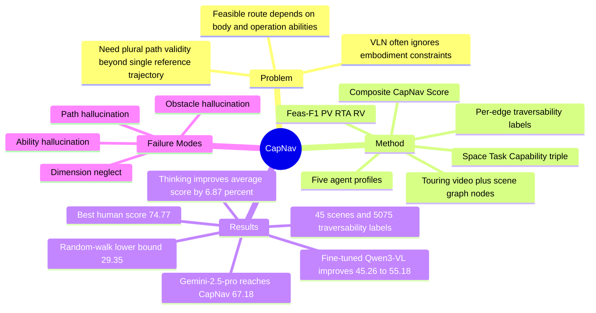

## Summary
CapNav 提出一个 capability-conditioned indoor navigation benchmark，用同一室内空间、任务和导航图去测试 VLM 是否能根据具体 agent 的物理尺寸与操作能力判断可达性、路径有效性、路线可通行性和失败理由。核心发现是：即使 strongest proprietary VLM 在 CapNav 上超过 human average，现有模型仍明显受 mobility constraint、视觉整合瓶颈和 dimension neglect 限制。

## Problem & Motivation
现有 VLN / embodied navigation benchmark 多数默认单一 embodiment，或者只评价与单条参考轨迹的相似度，无法判断“同一个目标对不同身体是否可达”。这在真实部署中是关键问题：wheelchair user、sweeping robot、humanoid robot、quadrupedal robot 对 stairs、elevator、door、narrow passage、turning space 的可通行性不同。论文的 problem formulation 是把导航任务显式写成 Space-Task-Capability triple `<S, tau, a>`，让模型在给定 touring video、scene graph nodes、agent profile 和 from-to task 后输出 feasibility、path 和 rationale。

## Method
**Benchmark construction.** CapNav 使用 HM3D 和 Matterport3D 的 3D indoor scenes，在 Habitat 中手动录制 touring video；每个视频以 2FPS、1.5m human-eye height、75 degree field of view 渲染。作者手动构建 navigation graph：nodes 是语义空间位置，edges 是直接可走连接；再用 Gemini 2.5 Pro 生成 navigation tasks，并人工验证任务有效性和标注 per-edge traversability。

**Agent profiles.** CapNav 定义五类 embodiment：adult with no motor disabilities、wheelchair user、sweeping robot、humanoid robot、quadrupedal robot。每个 profile 用 capability json 描述 physical footprint、vertical traversal limits、是否能走楼梯、是否能操作 elevator / door 等能力。ground truth 不是单一路径，而是基于图上是否存在至少一条所有 edges 都 traversable 的 simple path。

**Dataset scale.** 论文摘要写法是 45 real-world indoor scenes、473 navigation tasks、2365 QA pairs；正文 dataset section 则报告 retained 45 scenes，平均每个 video 160.38s、13.8 nodes、14.5 edges，并产生 2,365 navigation tasks 和 5,075 traversability labels，其中 3,945 positive、1,130 negative。我的理解是 473 base tasks 乘以 5 agent profiles 得到 2,365 QA / per-agent tasks，但这个计数关系需要以后查 benchmark release 再确认。

**Metrics.** CapNav 用四个指标评价模型：Feas-F1 评估 binary feasibility prediction；PV 检查 predicted path 是否是从 source 到 target 的 valid simple path；RTA 在 positive prediction 且 path valid 时计算 route edge traversability accuracy；RV 用 LLM-as-judge 判断 infeasible prediction 的 rationale 是否匹配 annotated failure reasons。综合分数 CapNav Score 默认等权平均四项指标，作者还报告 per-embodiment composite score。

## Key Results
- **CapNav benchmark / Table 1**：不同 agent 的可达性差异很大。Human 的 feasible task ratio / edge traversable ratio 都是 1.00；Wheelchair 是 0.48 / 0.71；Humanoid 是 0.22 / 0.43；Quadrupedal 是 0.97 / 0.96；Sweeper 是 0.57 / 0.79。这说明 benchmark 不是普通 VLN 的换皮，而是在改变 feasible route set。
- **CapNav benchmark / Table 2**：13 个 VLM 全部超过 random-walk lower bound `CapNav=29.35`。最高模型是 Gemini-2.5-pro，Feas-F1 84.30、PV 73.00、RTA 79.15、RV 32.29、CapNav 67.18；GPT-5-pro 紧随其后，CapNav 66.37。best human performance 是 74.77，human average 是 60.59；因此 strongest proprietary models 超过 human average，但仍低于 best human。
- **CapNav benchmark / model gap**：Qwen3-VL-8B-Instruct non-thinking CapNav 55.94，是表中较强的 open-source baseline；Doubao-Seed-1.6 non-thinking 61.91 / thinking 62.12，也接近 proprietary frontier。Spatial-MLLM-4B thinking 只有 CapNav 30.15，Video-R1-7B thinking 为 37.39，说明“spatial reasoning model”标签没有自动转化为 capability-aware navigation 能力。
- **CapNav benchmark / per-agent degradation**：作者报告 adult baseline mean CapNav score 为 57.83%，humanoid 因不能走楼梯且需要 0.9m pathway clearance，平均最低为 39.12%。这支持论文的 mobility degradation claim：unconstrained human-like setting 的表现不能直接外推到 constrained embodiment。
- **CapNav benchmark / inference ablation**：9 组 thinking vs non-thinking 对比中，thinking 平均带来 `Delta CapNav=6.87%`，但 mean inference time 约从 14.94s 增至 123.94s，约 8x。更多 frames 的收益不单调，强模型尤其 Gemini 更可能受益，弱模型收益很小；论文将其解释为 visual integration bottleneck。
- **CapNav benchmark / failure analysis**：在 1,500 个 sampled QA pairs 中，path hallucination 有 659 例，obstacle hallucination 418 例，dimension neglect 191 例，ability hallucination 10 例。ground truth obstacle type 中，stairs `N=520/2365`、door sill / floor height difference `N=82`、narrow pathways `N=438`、lacking turning spaces `N=28`；模型更擅长 stairs / door sill 等显著视觉障碍，弱于 narrow clearance 和 turning radius 这类隐式 metric reasoning。
- **CapNav benchmark / fine-tuning pilot**：作者把 CapNav graph 上的 task count 从 2K 扩到 13K，并对 Qwen3-VL-8B-Instruct 做 one-epoch LoRA fine-tuning，test score 从 45.26% 提升到 55.18%。但 reasoning validity 从 0.30 降到 0.25，且出现更多 narrow passage false positives，说明 dimension neglect 可部分学习，但不是单纯监督微调即可解决。

## Strengths & Weaknesses
**已知的 strengths.**

1. **问题定义比普通 VLN 更接近真实 embodiment 差异。** CapNav 不只问“从 A 到 B 怎么走”，而是问“这个具体身体是否能走、该走哪条路径、如果不能为什么不能”。这对 assistive navigation 和 robot deployment 都比 embodiment-agnostic trajectory matching 更有诊断价值。
2. **评价设计抓住了 plural solutions。** per-edge traversability annotation 允许多条 simple path 都正确，避免把模型惩罚在非唯一 reference path 上；RTA 还能衡量 partial failure，而不是只做全对/全错。
3. **failure taxonomy 有研究启发。** path hallucination、obstacle hallucination、dimension neglect、ability hallucination 这四类错误把 VLM navigation failure 拆成了 graph grounding、visual evidence、metric geometry、profile following 四个不同瓶颈。
4. **benchmark 资源较完整。** 论文明确 release dataset、videos、tasks、agent profiles、5k+ traversability annotations 和 annotation interface，且 abstract 给出 benchmark homepage。

**已知的 weaknesses / limitations.**

1. **这仍是 passive video + graph reasoning，不是 closed-loop navigation。** 作者有意用 global observation 隔离 exploration 和 low-level control noise；这让 benchmark 更干净，但不能直接证明模型可在真实 online navigation 中稳定行动。
2. **task generation 依赖 Gemini 2.5 Pro。** 作者人工验证任务有效性，但任务语言分布仍可能带有 generator bias；这会影响模型在 natural human instruction 上的外推。
3. **RV 依赖 LLM-as-judge。** 作者验证 300 个 sampled reasonings，human / LLM verdict alignment 为 89%，这比未验证 judge 更可信；但 11% disagreement 仍会影响 infeasible case 的 reasoning score。
4. **five profiles 只是代表性近似。** 论文建议 practitioners 将自己的系统近似到最接近的 profile，或用 annotation interface 增加 profile；因此 CapNav 的默认结果不能覆盖所有 robot morphology、assistive device 和 building affordance。
5. **dataset count 表述有轻微歧义。** 摘要说 473 navigation tasks 和 2365 QA pairs，正文又说 2,365 navigation tasks；我倾向理解为 per-agent expansion，但 note 中后续引用应明确是哪一种计数口径。

**推测。** CapNav 对 GUI Agent / Computer-use Agent 的启发不在 indoor navigation 本身，而在“capability-conditioned planning”：同一个 environment graph，对不同 action affordance / tool permission / body constraint 应该有不同 feasible plan。这个 formulation 可以迁移到 web / GUI automation，例如 agent 是否能登录、是否有权限、能否调用某个 tool、UI 状态是否阻断某条路径。

**不知道。** 正文没有给出 per-edge traversability annotation 的 inter-annotator agreement，也没有看到 benchmark release 后 private / public split 或 leaderboard 防污染方案；这些会影响 CapNav 作为长期 benchmark 的可复现性与抗过拟合能力。

## Mind Map

## Notes
- **我的判断**：rating=4。CapNav 是一个很对味的 benchmark paper：问题重要、方法简单、评价指标针对真实 failure mode，尤其适合跟踪 VLM / embodied reasoning 的空间能力；但它主要贡献是 benchmark 和诊断，不是新的 navigation policy 或模型方法。
- **和当前研究兴趣的关系**：对 VLM 方向，CapNav 暴露了 cross-frame visual integration 和 metric dimension reasoning 的短板；对 agent 方向，它提醒我们 plan feasibility 应该条件化于 agent capability，而不是只由 task goal 决定。
- **我不完全买账的地方**：论文说 five agent types generalize to wide practical embodiments，这个 claim 只能算工程上有用的近似，不应理解为覆盖真实 robot / assistive device 的形态空间。尤其是 narrow clearance、turning radius、door operation 这些约束，现实里会受传感器、控制器、地面材料和动态障碍影响。
- **后续值得查**：benchmark homepage 是否公开了完整 task JSON、annotation UI、leaderboard、example prompts、frame sampling protocol，以及是否有 raw graph / per-edge reason labels；这些决定它能否作为后续 VLM navigation ablation 的稳定基准。
