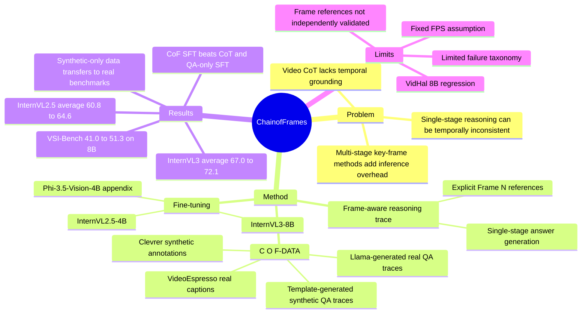

## Summary
Chain-of-Frames (CoF) 让 video LLM 在单阶段回答中生成带显式 `Frame N` 引用的 reasoning trace，以缓解视频 CoT 缺少 temporal grounding 的问题。作者构建了 164,186 条 C O F-DATA，并在 InternVL2.5-4B、InternVL3-8B、Phi-3.5-Vision-4B 上 fine-tune，报告在 VSI-Bench、Video-MME、MVBench、VidHal、EventHallusion 等 benchmark 上整体提升。最有意思的发现是：synthetic Clevrer-derived CoF data 即使与真实视频分布差异大，仍能带来多数 benchmark 的 accuracy 提升。

## Problem & Motivation
视频理解中的 CoT 不只是语言推理问题。模型需要把问题语义、帧内视觉内容、跨帧 temporal / causal relationship 放在同一个推理链里；如果 reasoning trace 只写“视频中发生了什么”，但不说明证据来自哪些帧，就容易出现 temporal inconsistency。

已有 video CoT 方法有两类局限。单阶段方法如 VideoCoT 能直接生成 reasoning，但缺少 frame-level grounding；多阶段方法如 VideoEspresso、M-LLM、Video-of-Thought 会先检索 key frames 或构建 scene graph，再让模型回答，但 inference pipeline 更重，也可能因为只传入子集帧而丢失完整 temporal context。本文要解决的是：能否保留标准 CoT 的简单单阶段推理形式，同时让推理显式锚定到相关视频帧。

## Method
**Chain-of-Frames.** CoF 的核心格式很简单：在 natural language reasoning trace 中直接引用 `Frame 1`、`Frame 7` 这类帧位置标识，再给出答案。作者选择 frame index 而不是 timestamp，因为它与视频时长和采样频率解耦，更容易与 video LLM 输入中的 frame identifiers 对齐。这个设计不引入额外 key-frame selector、caption generator 或 scene graph module；frame selection 被隐式纳入模型生成的 reasoning trace。

**C O F-DATAreal.** 真实视频部分来自 VideoEspresso training split。该数据已有 key-frame captions；作者先做 frame ID alignment，把原始 frame id 映射到 1 FPS 和模型可处理的视频片段内，再用 Llama-3.1-8B-Instruct 根据 frame-aware captions 生成 question、answer、CoF reasoning trace。注意：生成这部分数据时没有直接把 raw video content 输入 Llama，而是输入带 frame id 的 captions。

**C O F-DATAsynth.** 合成视频部分来自 Clevrer。Clevrer 每帧有 object shape、material、color、velocity、location、inside-camera 等结构化 annotation，因此作者用人工模板生成 object count、appearance order、relative distance 三类 quantitative questions，并同步生成 answer 和带 frame references 的 reasoning。这个过程不依赖 LLM，成本低且 temporal grounding 精度更可控。

**Dataset filtering.** 最终 C O F-DATA 包含 164,186 条样本，其中 103,683 来自 C O F-DATAreal，60,503 来自 C O F-DATAsynth。作者过滤掉 question 本身引用 frame 的样本，因为测试时问题通常不会写 frame id；同时降低 reasoning trace 中无 frame reference 样本的比例，但保留一部分 0-frame reasoning，以免模型在不需要 frame-level reasoning 的问题上被迫引用帧。最终样本中 25.3% 不引用帧，32.0% 引用 1 帧，22.5% 引用 2 帧，6.4% 引用 3 帧，13.8% 引用超过 3 帧。

**Model fine-tuning.** 主实验基于 InternVL2.5-4B 和 InternVL3-8B。InternVL2.5-4B fully fine-tune LLM 和 projection module，冻结 vision encoder；InternVL3-8B 用 LoRA fine-tuning 降低显存；appendix 还在 Phi-3.5-Vision-4B 上测试泛化。Inference 时统一从每个视频采样 30 frames，模型不限制视频只能 30 秒，但训练数据构造中需要固定 FPS / frame index 与模型输入对齐。

## Key Results
**Main benchmark results.** Table 1 报告 accuracy。CoF-InternVL2.5-4B 相比 InternVL2.5-4B 平均分从 **60.8** 提到 **64.6**；具体为 VSI-Bench **33.5 → 36.9**，Video-MME **54.7 → 59.7**，MVBench **71.5 → 76.1**，VidHal **77.0 → 79.2**，EventHallusion **67.4 → 71.2**。CoF-InternVL3-8B 相比 InternVL3-8B 平均分从 **67.0** 提到 **72.1**；VSI-Bench **41.0 → 51.3**，Video-MME **66.5 → 73.7**，MVBench **74.4 → 77.1**，EventHallusion **72.1 → 78.7**，但 VidHal 从 **80.9** 降到 **79.5**。

**Compared with strong video LLMs.** 在 Table 1 中，CoF-InternVL3-8B 在 VSI-Bench **51.3** 和 MVBench **77.1** 上高于列出的 closed/open-source baselines；Video-MME **73.7** 低于 Gemini-1.5-Pro **75.0**，但高于 InternVL3-8B **66.5** 和 Qwen2-VL-72B **71.2**。EventHallusion 上 CoF-InternVL3-8B 为 **78.7**，低于 GPT-4o **91.9** 和 Gemini-1.5-Pro **80.4**，但高于列出的 open-source baselines。

**Compared with prior video CoT methods.** 由于 M-LLM 和 Video-of-Thought 不公开，作者只用它们报告过的共享 benchmark 数字比较。Table 2 中，CoF-InternVL2.5-4B 在 Video-MME **59.7**、NextQA **79.6**，相对原始 InternVL2.5-4B 提升 **+4.8 / +4.3**；CoF-InternVL3-8B 在 Video-MME **73.7**、NextQA **87.3**，相对原始 InternVL3-8B 提升 **+7.8 / +4.9**。相比之下，M-LLM 在 Qwen2-VL-7B 上的增益为 Video-MME **+0.6**、NextQA **+0.8**。

**Ablation: CoF vs CoT variants.** Table 3 在 InternVL2.5-4B 上比较 prompting 和 SFT。原始模型为 VSI-Bench **31.8**、Video-MME **54.9**、MVBench **70.8**、VidHal **74.0**、EventHallusion **62.5**；CoT prompting 分别为 **33.5 / 54.7 / 71.5 / 77.0 / 67.4**；只用 QA pairs SFT 为 **31.8 / 54.5 / 73.4 / 64.1 / 57.7**；去掉 frame references 的 CoT SFT 为 **34.3 / 58.6 / 73.7 / 77.9 / 53.1**；完整 CoF SFT 达到 **36.9 / 59.7 / 76.1 / 79.2 / 71.2**，在五个 benchmark 上都是该 ablation 中最高。

**Ablation: synthetic data.** Figure 6 控制训练样本数为 164k，比较 real-only、synth-only、combined。VSI-Bench 为 **31.3 / 35.3 / 36.9**，Video-MME 为 **59.0 / 59.0 / 59.7**，MVBench 为 **73.4 / 74.8 / 76.1**，VidHal 为 **77.2 / 73.2 / 79.2**，EventHallusion 为 **65.3 / 73.6 / 71.2**。已知结论是 synthetic-only 在多数 benchmark 上不差于甚至优于 real-only；但它在 VidHal 上低于 real-only，combined 在 EventHallusion 上也低于 synth-only，因此“synthetic data alone works”不是无条件支配。

**Frame-reference behavior.** Figure 7 显示，CoF-InternVL3-8B 在全部 evaluation benchmarks 的生成答案中，**76.9%** 的 reasoning trace 引用了至少一个 frame。作者据此说明模型不是机械地每题引用固定数量帧，而会按任务类型选择是否生成 frame references。

## Strengths & Weaknesses
**已知的优点。**

1. **方法足够简单。** CoF 没有引入检索器、scene graph、key-frame module 或多轮 pipeline，只是让模型在输出文本中引用 frame id；这让它比许多 video agent / multi-stage CoT 方法更容易接到现有 video LLM 上。
2. **ablation 支撑了 frame references 的必要性。** 只做 CoT prompting 或去掉 frame references 的 CoT SFT 都不如完整 CoF SFT，尤其 EventHallusion 上完整 CoF 为 **71.2**，而 CoT SFT 只有 **53.1**。
3. **synthetic data 结果有启发。** Clevrer-derived synthetic CoF data 在多个真实视频 benchmark 上迁移有效，说明至少一部分 temporal grounding / quantitative video reasoning 能从结构化合成世界中学到，而不一定依赖昂贵人工 annotation。
4. **baseline 选择覆盖了多个层面。** 主表对比 closed-source、large open-source 和原始 InternVL；ablation 对比 prompting、QA-only SFT、CoT SFT、CoF SFT；appendix 还在 Phi-3.5-Vision-4B 上报告一致提升。

**已知的局限。**

1. **VidHal 上存在反例。** CoF-InternVL3-8B 的 VidHal 从原始 InternVL3-8B 的 **80.9** 降到 **79.5**，说明 CoF fine-tuning 不是所有 hallucination setting 上都稳定增益。
2. **方法依赖 fixed FPS / frame index alignment。** 论文 limitations 明确说，CoF training data 适合固定 FPS 的 video LLM；如何适配 Qwen2.5-VL 这类 dynamic frame-rate preprocessing 的模型仍是 open question。
3. **prior video CoT 对比受限。** M-LLM、Video-of-Thought 等模型不公开，且没有在本文五个主 benchmark 上完整报告；Table 2 只能比较它们已有的共享 benchmark 数字，不能完全等价于统一复现实验。
4. **failure case 分析偏少。** 论文给出若干 qualitative examples，但没有系统统计 CoF 失败时是 frame reference 错、视觉识别错、temporal order 错，还是语言推理错。
5. **frame reference 不等于真实因果解释。** CoF trace 更可读，但论文没有独立验证模型引用的 frame 是否总是 necessary 或 sufficient evidence；因此这些 trace 更适合作为 grounding signal / interpretability hint，而不是已验证的 causal rationale。

**推测。**

- 对 GUI-agent / embodied research 的潜在价值在于“把长时视觉历史中的证据显式锚定到 observation step”。如果 screen recording、mobile trajectory 或机器人 egocentric video 也能被标成 frame-aware reasoning trace，CoF 可能帮助 agent 学会引用关键时刻；但本文没有在 GUI、web 或 embodied benchmark 上实验。
- Synthetic CoF data 的迁移效果可能来自任务结构而不是视觉分布相似性：object count、appearance order、relative distance 这类问题强迫模型学习跨帧状态变化。但论文没有进一步隔离是哪类 synthetic task 贡献最大。

**不知道。**

- 不知道论文所说 “Code available at GitHub” 对应的具体 repository URL；论文正文没有给出可直接访问链接。
- 不知道 CoF 的 frame references 在人工标注下有多高 precision / recall，也不知道错误引用是否会误导 downstream user。
- 不知道更大规模的 CoF data 或更大 video LLM 是否会继续线性提升；作者只把这作为 future work。

## Mind Map

## Notes
- **我的判断**：rating=4。它不只是一个小 prompt trick，而是把 video reasoning 的 evidence grounding 放进了训练数据格式；对 video-LLM 和长时视觉 agent 的表示学习都有参考价值。但它离 GUI-agent / embodied action 还有一层迁移距离，且 frame reference 的真实性没有独立验证，所以不到必读级别。
- **和论文讨论的 multi-stage 方法的关系**：VideoEspresso、M-LLM、Video-of-Thought 等路线把 key-frame retrieval、meta-information extraction 或 scene graph construction 放在额外阶段；CoF 的取舍是把 evidence grounding 学进单阶段 generation。它牺牲了外部检索模块的可控性，但换来更简单的 inference path。
- **可复用 insight**：如果要做 GUI trajectory reasoning，值得考虑把 action trace / screenshot sequence 转成 `Step N` 或 `Frame N` grounded reasoning，而不是只训练纯文本 CoT。这样可以让模型在解释“为什么点击这里”时引用具体观察时刻。
- **后续需要查证**：代码仓库、CoF frame-reference correctness 的人工评估、不同 synthetic task category 的贡献、dynamic FPS video LLM 的适配方法。
