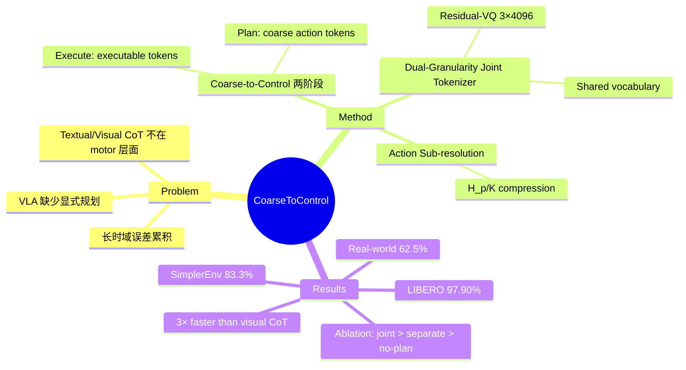

## Summary
提出在 action token 空间内原生实现 plan-execute 两阶段生成的 VLA 方法：先预测粗粒度的 coarse action tokens 作为未来轨迹的计划，再基于该计划生成可执行的 action tokens，使得 planning 和 execution 共享统一的离散 action 词表。在 LIBERO、SimplerEnv 和真实机器人上验证了 action-space planning 对长时域任务的显著提升。

## Problem & Motivation
现有 VLA 模型直接将观测映射到动作，缺少显式的中间规划，导致长时域任务上误差累积。语言指令只描述"做什么"而不指定"怎么做"，模型需在单次前向中隐式解决接近方向、腕部姿态、抓取位姿、路径点序列等运动细节。先前的 reasoning-augmented VLA 使用文本推理、视觉子目标或空间推理作为中介，但这些表示位于语义或感知层面，而非运动意图层面。受人类运动控制的启发（大脑先制定高层计划，再通过低层指令细化执行），作者提出直接在 action space 中进行 planning。

## Method
### 核心架构：Coarse-to-Control 两阶段生成
1. **Planning stage**: 策略首先预测紧凑的 coarse action tokens (z^plan)，概括未来意图轨迹
2. **Execution stage**: 基于计划生成可执行的 action tokens (z^exec)
3. **推理时**: 仅将 executable tokens 解码为机器人动作

### Action Sub-resolution 获取 Coarse Plan
将长时域未来动作序列（H_p 步）压缩为 K 个 coarse plan steps。每个 chunk 大小 c = H_p/K，运动维度求和（捕获净相对运动），gripper 状态取该 chunk 的最终动作。这种压缩"保留了未来轨迹的方向和阶段级意图，同时丢弃高频细节"。

### Dual-Granularity Joint Tokenizer
关键创新是共享词表的双模式 residual-VQ action tokenizer：
- **Execution mode (m=0)**: tokenize 短时域 action chunks
- **Planning mode (m=1)**: tokenize 粗粒度长时域轨迹
- **Shared vocabulary**: 两种模式共享同一离散 action token space

Tokenizer 使用 3 个 residual VQ codebooks，每个 4096 entries。在 LIBERO 设置中，每个分支生成 2×7×3 = 42 tokens（两个 temporal patches × 7 个 action 维度 × 3 个 residual codebooks）。训练目标结合 L1 reconstruction loss 和 residual-VQ codebook + commitment losses（commitment weight β=0.25）。

### Autoregressive VLA Training
策略预测 concatenated suffix [plan tokens, exec tokens]，条件是 image tokens、language tokens 和 proprioceptive state。使用标准 teacher-forced next-token prediction 训练。这种顺序确保 planning tokens 作为内部 prefix 来 condition executable action generation，无需单独的 planner-controller 接口。

## Key Results
### LIBERO Benchmark (Simulation)
在 LIBERO 四个任务套件上达到 **97.90%** 平均成功率（Spatial 98.8%、Object 100.0%、Goal 97.8%、Long 95.0%），超过 OpenVLA-OFT (97.1%)、π₀ (94.2%)、textual CoT π₀.₅ (96.8%)、visual CoT F1 (95.7%) 和 UniVLA (95.5%)。

### SimplerEnv-WidowX (Simulation)
平均成功率 **83.3%**，大幅领先 CogACT (51.3%)、UD-VLA (62.5%)、F1 (59.4%)。在 Put Spoon (100.0%)、Put Carrot (95.8%)、Stack Block (79.2%) 上表现优异，Put Eggplant (58.3%) 稍低。

### 真实机器人实验
4 个物理操作任务，每任务 50 demos，20 次 rollout：在 Carrot+Button、Plate→Basket、Cleanup 三个任务上取得最高成功率，四任务平均 **62.5%**（所有方法中最佳）。Plan-based policy 在三个多阶段任务上表现最优，证明 action-token planning 提升了对误差累积的鲁棒性。

### Runtime Efficiency
相比 CoT-VLA 风格的 visual reasoning baseline (256 visual tokens)，Coarse-to-Control 仅使用 42 action-space tokens，单任务评估时间从 3884.27s 降至 1325.53s —— **约 3 倍加速**。

### Ablation Studies
- **Planning horizon**: H_p 从 0→40→160，Overall 从 96.45%→97.55%→97.90%，Long suite 获益最大
- **Tokenizer design**: 无 plan (95.40%) < 独立 tokenizer (96.60%) < **joint-mode (97.90%)**。Joint-mode 在 Overall 上额外提升 1.3%，Long 上提升 3.4%，验证 plan tokens 与 executable tokens 共享 action-semantic manifold 的重要性
- **Codebook overlap**: 两种模式的 token 使用有部分但非平凡的共享（support-overlap mass ≈ 0.16），无分布坍缩
- **Real-world subtask progress**: Plan-based execution 在每个中间阶段都保留更多进度。Cleanup 任务：plan 最终成功率 45% vs. faster 25%、π₀ 30%
- **Domain transfer**: 即使用 domain-mismatched tokenizer (LIBERO→Bridge)，plan-based 仍将成功率从 30.0% 提升至 52.5%，平均 rollout 长度从 436 降至 239

## Strengths & Weaknesses
### Strengths
- **理论优雅且实践有效**: 将 planning 原生嵌入 action token space，避免 semantic-to-motor 转换损失，plan 和 execution 共享统一词表是真正的 insight
- **实证证据充分**: LIBERO、SimplerEnv、真实机器人三重验证，长时域任务收益显著，ablation 覆盖 planning horizon、tokenizer 设计、跨域迁移
- **效率优势明显**: 42 action tokens vs. 256 visual tokens，3 倍加速，对实时控制更友好
- **透明可解释**: Decoded coarse plan 提供可视化的轨迹意图，attention maps 显示 plan 引导任务相关区域关注

### Weaknesses
- **设计空间未充分探索**: 当前实现为 coarse-then-fine 的固定模式，作者坦承"如何构建更有表达力和自适应的 action-space reasoning schemes 仍是开放问题"。是否可支持动态规划粒度、条件分支、plan revision？
- **粒度统一问题**: Joint tokenizer 虽然对齐了 planning 和 execution tokens，但两种粒度如何"更有机地统一、更好捕获 action space 的共享结构"仍未解决
- **真实世界泛化有限**: 真实机器人上 62.5% 平均成功率仍有提升空间，最短单阶段任务（Carrot placement）反而 π₀ 最优，暗示 planning overhead 在简单任务上可能拖累性能
- **Coarse action 压缩策略简单**: 当前用求和+末态 gripper 获取 coarse action，缺少对复杂轨迹（如螺旋运动、多段式操作）的表达能力
- **缺少失败案例深入分析**: SimplerEnv 中 Put Eggplant 仅 58.3%，论文未剖析原因（object properties? task complexity? demo distribution?）

### 潜在影响
为 VLA 提供了不同于 textual/visual CoT 的第三条路径，证明 motor-level planning 的有效性。Joint-mode tokenizer 的设计思想可能启发更多"共享表示空间内的分层生成"方法。对长时域机器人操作任务具有实际应用价值。

## Mind Map

## Notes
- **与 hierarchical RL 的关系**: 本文的 coarse plan 类似 hierarchical RL 中的 subgoal/option，但以 autoregressive token prediction 实现，避免了 hierarchical RL 的训练不稳定性
- **Tokenizer 设计的可迁移性**: Dual-granularity joint tokenizer 是否可用于其他序列生成任务（如 long-horizon video generation、music composition）？共享词表的分层生成可能是更广泛的范式
- **Plan refinement 的缺失**: 当前 plan 是 one-shot 生成，无法根据执行反馈修正。Future work 可探索 closed-loop planning（执行几步后 re-plan）
- **与 diffusion policy 的对比**: Diffusion policy 在 action space 生成轨迹但无显式 planning stage。Coarse-to-Control 的两阶段分解是否可与 diffusion 结合（coarse diffusion → fine diffusion）？
