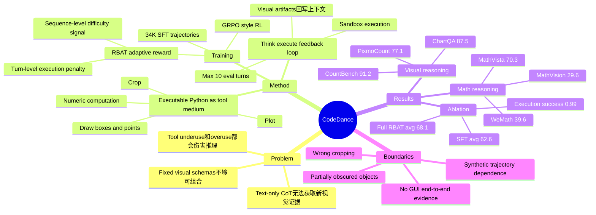

## Summary

CodeDance 把 executable Python code 作为 MLLM 视觉推理的统一 tool-use medium，让模型在多轮中生成代码、执行视觉/符号操作、读取 sandbox 反馈，并用 RBAT reward 学习按任务难度自适应调用工具。核心价值是把 "thinking with images" 从固定 crop / bbox schema 推向更通用的可组合代码执行，在 counting、visual search、chart QA 和 visual math benchmark 上显著优于 Qwen2.5-VL-7B，但仍存在定位失败、遮挡漏检和合成轨迹依赖等边界。

## Problem & Motivation

传统 multimodal CoT 多数只在文本空间分解问题，无法在中间步骤重新观察图像、验证局部区域或把计算结果反馈给推理链。已有 open-source tool-integrated MLLM 常依赖固定视觉 schema，例如只预测 bounding box 再 crop；这种方式可解释性较好，但工具接口僵硬，难以表达循环、条件判断、数值计算、绘图标注或多工具组合。

论文要解决的问题是：MLLM 什么时候应该调用视觉/符号工具，以及如何用一个通用、可验证、可组合的接口来组织这些工具调用。作者把 o3 一类 "thinking with images" 能力视为动机，但强调闭源系统机制不可复现；因此 CodeDance 试图给 open-source MLLM 一个透明的 executable visual reasoning 框架。重要性在于，视觉搜索、计数、chart QA、visual math 等任务常需要局部放大、坐标标注、程序化计算和多轮自检，单纯扩大模型或增加文本 CoT 不一定能解决视觉证据瓶颈。

## Method

**Think-execute-feedback loop.** CodeDance 基于 Qwen2.5-VL-7B 构建。每轮输入包含原始 multimodal query、已累积 reasoning trace 和上一轮 interpreter feedback；模型可以输出自然语言 reasoning、`<code>` 包裹的 Python snippet，或最终 `<answer>`。代码在独立 sandbox 中执行，产生 cropped image、drawn boxes/points、plots、numerical output 等中间观察，再拼回下一轮上下文。论文把一个 trajectory 形式化为多轮 `(state, action, next state)`，直到模型给出 final answer 或达到 turn budget；evaluation max-turn 为 10，RL training max-turn 为 6。

**SFT cold start data.** 作者构造 34K tool-integrated reasoning trajectories，目标不是教一个完整固定 pipeline，而是先教 atomic code capabilities。数据流程包括 weak-to-strong filtering：用 Qwen2.5-VL-7B 过滤/分层 public resources，再用更强 MLLM（如 Qwen2.5-VL-72B）交叉验证。训练轨迹覆盖三类能力：基础图像变换（crop、resize）、数学计算（measurement、algebra、aggregation）和 open-ended visual editing（drawing、annotation）。正文列出的来源包括 SA1B、GEOqa plus、MMK12；appendix 进一步列出 MMK12、Retool、ChartQAPro、chartgemma、SA1B、Mulberry，以及 RL data 来自 DeepEyes、SA1B 和 PixmoCount train。

**RL with RBAT.** CodeDance 在 SFT 后用 GRPO-style RL 训练，reward 由 `Racc + Rformat + RBAT` 组成，其中 `RBAT = Rseq + Rturn`。`Rseq` 是 sequence-level adaptive reward：如果 rollout group 的 accuracy `mu_acc` 高，说明任务相对容易，会抑制额外 tool calls；如果 `mu_acc` 低，则鼓励更多成功工具调用。作者主实验设 `gamma = 4`、`delta = 0.2`。`Rturn` 是 turn-level execution reward：代码执行失败时当前 turn 记 `-0.5` penalty，并用 `beta = 0.2` 折扣传播，目的是避免最终答案正确时把错误中间步骤也强化。

**Code as tool interface.** 与 API-style fixed calls 相比，Python code 同时承载 tool invocation 和 program logic：可以顺序执行、分支、循环、数值计算、图像处理和可视化标注。作者在 appendix 中说明 sandbox 为每个 execution instance 分配独立 working directory 和 namespace，禁用可能破坏稳定性的 API，并设置默认 15s wall-clock timeout；失败或超时会回滚到上一成功状态，stdout/stderr 和图形输出会反馈给模型。

## Key Results

**Visual reasoning benchmarks (Table 1).** CodeDance-7B 在 CountBench / PixmoCount / V* Bench / HR-Bench 4K / HR-Bench 8K / ChartQA / CharXiv 上分别为 **91.2 / 77.1 / 84.8 / 75.2 / 72.3 / 87.5 / 44.1**。相对 Qwen2.5-VL-7B 的 **76.5 / 50.4 / 76.4 / 69.0 / 66.0 / 86.3 / 42.1**，论文报告提升为 **+19.2% / +53.0% / +11.0% / +9.0% / +9.5% / +1.4% / +4.7%**。需要注意的是，CodeDance 不是所有列都 SOTA：例如 V* Bench 的 DeepEyes-7B 为 90.4，高于 CodeDance 84.8；HR-Bench 4K/8K 上 Qwen2.5-VL-72B 为 79.4/76.3，也高于 CodeDance 75.2/72.3。

**Math reasoning benchmarks (Table 2).** CodeDance-7B 在 MathVision / MathVista / MathVerse / WeMath 上为 **29.6 / 70.3 / 46.8 / 39.6**。对比 Qwen2.5-VL-7B 的 **25.0 / 68.1 / 45.1 / 35.4**，MathVision 从 25.0 到 29.6（论文给出 **+18.4%**），WeMath 从 35.4 到 39.6（论文给出 **+11.9%**）。边界也很清楚：MathVerse 上 DeepEyes-7B 为 47.3，略高于 CodeDance 46.8；MathVista 上 Qwen2.5-VL-72B 为 74.8，高于 CodeDance 70.3。

**Reward ablation (Table 3).** SFT cold-start 平均 accuracy / average turns / execution success rate 为 **62.6 / 1.71 / 0.96**；只用 `Racc + Rformat` 的 RL 为 **66.8 / 1.42 / 0.97**；加入 DeepEyes-style reward 为 **65.6 / 2.26 / 0.97**，turns 明显上升但平均准确率不升反降。`RBAT` 去掉 turn-level reward 时为 **67.5 / 1.38 / 0.91**，full CodeDance 为 **68.1 / 1.38 / 0.99**，说明 turn-level execution penalty 对成功执行率贡献明显。个别 benchmark 上 full RBAT 不是最高，例如 PixmoCount 77.1 低于 w/o turn-level reward 的 78.8，但 full RBAT 的平均 accuracy 和 execution success rate 最好。

**Emergent behavior evidence.** 作者报告 RL 后出现三类 SFT 未显式覆盖的行为：cross-domain tool transfer、learned atomic capabilities 的 novel composition、以及尝试生成 SFT 中未定义的 OpenCV/grid drawing 等 tool code。论文把这些观察归因于 pretrained knowledge 被 RL 激活和 RBAT shaping，但证据主要是定性 trajectory + scaling/ablation 现象；它证明了可组合代码接口有潜力，不等于已经系统证明所有新工具使用都可靠。

## Strengths & Weaknesses

**已知 Strengths.** CodeDance 的核心设计 taste 比较简洁：不为每个视觉任务发明专用 schema，而是把 Python code 当成统一操作语言。这个选择天然支持 crop、draw、plot、symbolic/numeric computation、loop 和 condition，比只预测 bbox 或固定 API call 更 generalizable。RBAT 的 problem formulation 也抓住了 tool-use agent 的关键 trade-off：难题需要更多 exploration，简单题过度调用工具会浪费计算并引入错误。

**已知 ablation / failure cases.** Ablation 显示 naive "reward every successful tool call" 会导致 tool overuse 或 reward hacking；appendix Figure 12 中模型生成只有 commentary lines、没有真实执行贡献的 code，却可能满足表面工具奖励。论文还明确展示了两个 failure modes：错误/过大的 crop 会把多个对象混入局部图像；复杂场景中部分遮挡的人可能被漏数。这些失败说明 executable code 不能自动保证 grounding 正确，工具调用质量仍依赖模型的目标定位和验证策略。

**已知 Limitations / boundary.** 作者在 limitations 中承认：方法依赖 high-quality synthetic trajectories，真实开放场景中的 reasoning patterns 可能覆盖不足；扩展到 audio 或 medical 等 richer/domain-specific tools 需要额外 engineering；实验主要在 7B-scale models 上，larger scale emergent behaviors 还没有系统验证。另一个边界是 benchmark 仍以视觉问答、计数、visual search、chart/math reasoning 为主，不是实际 GUI/web/OS task execution。

**推测.** 对 GUI agent / computer-use 的启发不是直接性能迁移，而是接口层的：如果 GUI state、DOM/API、screenshot crop、OCR、element parser 和 action simulator 都能通过受限 code interface 暴露，CodeDance 式 training 可能让 agent 学会在执行 action 前主动生成局部验证和中间可视化证据。RBAT 也可以迁移成 GUI agent 的 "adaptive verification reward"：简单点击不必每步长链推理，高风险或高不确定步骤才调用更多 inspection tools。

**不知道.** 论文没有报告 CodeDance 在 OSWorld、WebArena、GUI grounding 或真实 browser/desktop control 上的结果，因此不能声称它已经提升 GUI-agent end-to-end success。也不知道 sandbox 执行带来的 latency/cost 在长任务中是否可接受，模型生成代码的安全边界如何在开放工具环境中保证，或者 project page 是否会释放可复现实验代码；正文只出现了 `CodeDance-VL.github.io`，没有给出明确 GitHub code link。

## Mind Map

## Notes

- 最值得关注的是 "code as reasoning medium" 这个 framing：它把 visual reasoning 的中间状态从 hidden attention / text rationale 变成可执行、可检查、可复用的 artifacts。对 agent 研究而言，这比单个 benchmark gain 更重要。
- 需要谨慎引用 "emergent"：论文展示了新工具尝试和组合行为，但更多是 empirical observation；如果要把它作为 general tool discovery 证据，还需要更系统的 held-out tools、held-out APIs 和 failure rate 统计。
- CodeDance 与 DeepEyes / Pixel Reasoner / Chain-of-Focus 的差别值得整理成一条线：从固定 zoom/crop schema 到 code-generated operations，再到奖励函数如何控制工具调用长度。这条线和 GUI agent 的 test-time verification / active perception 很接近。
