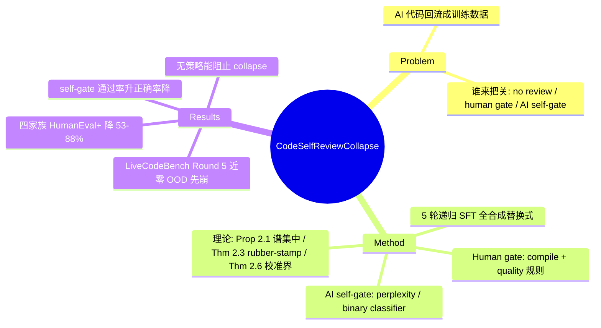

## Summary

系统性负结果：code LLM 在自身生成代码上递归微调 5 轮后，四个模型家族（1.1B–7B）在所有 benchmark 上持续退化，OOD 的 LiveCodeBench 全部到 Round 5 接近零；关键发现是 **AI self-gate（用模型自身信号过滤训练数据）会进入 rubber-stamp regime**——通过率/接受分数上升而正确率下降，理论上（Theorem 2.3）等价于完全不过滤。作者结论：稳定的递归自训练需要 model 偏好分布之外的 exogenous verification，model self-review 不可依赖。

## Problem & Motivation

AI 生成代码正大量进入公开仓库并回流为训练数据，形成"生成→入库→再训练"的自增强闭环；与此同时，越来越多 pipeline 用 AI 审查 AI 代码（自动 PR review、self-scoring 数据过滤）。核心问题：**当过滤器本身是被训练的模型（或与之耦合）时，这个闭环是否稳定？** 已有 model collapse 文献多在自然语言/图像分布上研究无过滤的递归训练，本文把问题推进到 code 域，并首次把"谁来把关"（no review / human-gate / AI self-gate）作为核心实验变量做三方对照。

## Method

**递归 pipeline**（全合成、替换式）：模型 M_t 从固定 prompt pool 采样生成代码，经 gate 过滤后取 5,000 条 accepted 样本进入训练（AI self-gate 方法为每轮生成 20k、按分数保留 25%），SFT 3,000 步得到 M_{t+1}；共 5 轮，训练数据 100% 合成，不回混人类数据。评测经 bigcode-evaluation-harness（采样 temperature 0.8 / top-p 0.95）。

**三种 review regime**：

| Regime | 过滤器 | 性质 |
|:--|:--|:--|
| Vanilla（no review） | 无，全部生成样本进入训练 | 对照 |
| Human-gate（exogenous） | Compile（Python `compile()` 语法检查）；Quality（repetition ≤0.3、length ≥50 tokens）；Compile+Quality | 与模型参数无关的启发式规则，随生成器退化保持稳定 |
| AI self-gate（endogenous） | Perplexity（保留 masked-completion perplexity 最低 25%）；Binary classifier（按 logit-difference 保留 top 25%） | 用 code LLM 自身评估自身输出，接受准则与生成器耦合 |

**理论部分**：Proposition 2.1 证明递归自训练把表示方差集中到主导子空间——λ₁/λ₂ 的下界随 t 上升，且**仅当 λ₂(Σ̃₀)=0 时无界（指数式）增长，一般情形饱和于常数 α/λ₂(Σ̃₀)**（verifier 修正：非无条件指数增长）→ 多样性丧失；Assumption 2.2（self-confirming acceptance：模型在自己高概率输出上给出近乎常数的接受分数）下，Theorem 2.3 证明 **AI self-gate 的 gated 训练分布退化为 ungated 分布**——"filtering becomes mathematically identical to no filtering"（rubber-stamp regime）；Theorem 2.6 给出正面条件：若 AI reviewer 对 human 标准的 sup 校准误差 ε_t 相对 human gate 非零接受质量 z₀ 足够小，则 AI-gated 与 human-gated 分布的 ℓ1 距离有界（‖·‖₁ ≤ 2ε_t/z₀）。

**实验设置**：SantaCoder-1.1B、StarCoder2-3B、Qwen2.5-Coder-1.5B、CodeLlama-7B 四个家族；评测 HumanEval(+)、MBPP(+)、LiveCodeBench。

## Key Results

- **各家族一致退化**（vanilla，baseline → Round 5，HumanEval+）：SantaCoder 0.171→0.073（−57%）；StarCoder2-3B 0.274→0.104（−62%）；CodeLlama-7B 0.287→0.134（−53%，最稳）；Qwen2.5-Coder 0.372→0.043（−88%，最烈）。MBPP+ 更烈：SantaCoder 0.294→0.019（−94%）、Qwen 0.582→0.082（−86%）。作者称之为跨架构/规模/预训练数据的 systematic collapse，"convergence to a common degradation floor"（Table 4）。
- **OOD 先崩**：LiveCodeBench 在 vanilla 下所有模型 Round 5 接近零（Qwen 0.238→0.000；CodeLlama-7B 0.045→0.003；SantaCoder 0.018→0.000；StarCoder2 baseline 本身即 0.000，其"归零"为平凡情形）；原文措辞为 "disproportionately degrades harder, out-of-distribution reasoning tasks"，"LCB 最先归零"是对 Figure 9 的读图推断（LCB 是唯一到 0.000 的 benchmark）。
- **Rubber-stamp 实证**：perplexity self-gate 的通过率随轮次上升（SantaCoder 0.167→0.235；四模型均值约 0.17→0.24）而下游正确率同步下降（Figure 7，caption 明言 "rubber-stamp regime of Theorem 2.3"）——gate 对退化代码越来越"自信"，判别力逐步丧失。
- **干预对比（无一能阻止 collapse）**：Compile gate 减缓但 "cannot stop long-horizon semantic drift"（SantaCoder HumanEval+ R5 0.079 vs vanilla 0.073）；Quality 规则在部分 benchmark 更稳（SantaCoder MBPP+ 保住 0.069）；Binary self-gate 是三个模型 HumanEval+ 上最佳 AI gate（R5 SantaCoder 0.104 / StarCoder2 0.122 / Qwen 0.122，早期表现甚至最好）但 MBPP+ 行为不稳定。总排序：no review 崩最快，human-gate 减缓但不阻止，AI self-gate 早期好看、后期失效。

## Evidence Ledger

| Claim ID | Claim | Type | Source locator | Evidence excerpt | Status |
|:--|:--|:--|:--|:--|:--|
| C1 | 四模型 5 轮后 HumanEval+/MBPP+ 全部退化，vanilla 降幅 53%–94%（8 个数字逐一对表） | number | §3.2/§3.6, Table 4 | "SantaCoder HumanEval+ 0.171→0.073; Qwen 0.372→0.043; MBPP+ 0.294→0.019, 0.582→0.082" | source-verified |
| C2 | Vanilla 下所有模型 Round 5 LiveCodeBench 接近零（Qwen 0.238→0.000；StarCoder2 baseline 即 0.000 为平凡情形） | number | §3.5, Figure 9 | "LiveCodeBench approaches near-zero for all models by Round 5 regardless of strategy" | source-verified |
| C3 | 越难/越 OOD 崩得越彻底；"LCB 最先归零"为读图推断，原文措辞 "disproportionately degrades" | comparison | §3.5 | "disproportionately degrades harder, out-of-distribution reasoning tasks" | source-verified |
| C4 | Collapse 跨家族/规模 systematic，收敛到 common degradation floor | causal-mechanism | §3.6-3.7, Table 4 | "convergence to a common degradation floor" | source-verified |
| C5 | Rubber-stamp regime：perplexity gate 通过率 0.167→0.235（SantaCoder；均值约 0.17→0.24）而正确率降；Theorem 2.3 证明 gated 分布退化为 ungated | causal-mechanism | §2.3 Thm 2.3, Figure 7, Table 2 | "m_t^A = m_t^ungated a.e."; "pass rate from approximately 0.17 to 0.24" | source-verified |
| C6 | Human-gate 减缓不阻止（SantaCoder HumanEval+ R5 compile 0.079 vs vanilla 0.073） | comparison | §3.2-3.4, Tables 2-3 | "human filters slow decline but don't prevent it" | source-verified |
| C7 | Binary self-gate 为 HumanEval+ 最佳 AI gate（R5 0.104–0.122）但 MBPP+ 不稳 | comparison | Table 2/4 | "erratic MBPP+ behavior" | source-verified |
| C8 | 无策略阻止 collapse；需要 exogenous verification | causal-mechanism | §4 Conclusion | "needs verification that remains outside the model's own preference distribution" | source-verified |
| C9 | 协议：全合成替换式、每轮 5,000 accepted（AI gate 为 20k 取 25%）、SFT 3,000 步、5 轮；temp 0.8/top-p 0.95 为评测采样参数 | benchmark-setting | §3.1 | "5,000 accepted samples per round... 3,000 steps" | source-verified |
| C10 | Theorem 2.6：校准误差有界时 ‖q_A−q_H‖₁ ≤ 2ε_t/z₀（ℓ1 范数约定） | causal-mechanism | §2.3 Thm 2.6 | "‖q_A(·|x) − q_H(·|x)‖₁ ≤ 2ε_t/z₀" | source-verified |
| C11 | Prop 2.1：方差集中到主导子空间；λ₁/λ₂ 无界指数增长**仅当 λ₂(Σ̃₀)=0**，一般情形下界饱和于 α/λ₂(Σ̃₀) | causal-mechanism | §2.2 Prop 2.1 | "if λ₂(Σ̃₀)=0 the ratio grows without bound" | source-verified |
| C12 | "Human-gate" 实为 compile/repetition/length 启发式（无真人、无 unit-test 执行）；Limitations 承认 execution-based gates 为 future work | benchmark-setting | Table 1, Limitations | "simplified proxies for full PR review... stronger execution-based gates... remain future directions" | source-verified |

## Strengths & Weaknesses

**亮点**

- **问题选得准**：把 model collapse 研究从"要不要过滤"推进到"谁来过滤"，三 regime 对照直接回应了当下 AI-review-AI pipeline 的现实风险，是 self-evolving 路线上 internal self-reward 失效的最系统负结果之一。
- **理论与实证互锁**：Theorem 2.3（rubber-stamp 等价于不过滤）不是装饰——Figure 7 的"通过率上升、正确率下降"正是该定理预言的可观测信号；Theorem 2.6 还给出了 AI reviewer 何时可用的正面条件（校准误差有界），使结论不是简单的"AI review 不行"。
- **跨 4 个模型家族验证 + 难度梯度分析**（LiveCodeBench 先崩）让 "systematic property" 的 claim 有分层证据，OOD 先崩与低概率 mode 丢失机制自洽。

**局限（部分为作者自认，部分为批判性阅读）**

- **最悲观的 setting**：100% 合成、完全替换式（replace 而非 accumulate）、不回混真实数据。已有文献表明数据积累（保留原始数据混训）能大幅缓解 collapse——本文未测该标准缓解，因此 "collapse 是 systematic property" 的适用边界是 full-replacement 递归闭环，不能外推到"任何含合成数据的训练都会崩"。（推测：accumulate regime 下结论会明显弱化。）
- **"Human-gate" 名不副实**：实际是 compile()/repetition/length 等廉价启发式，不含真人审查，也**不含 unit-test 执行验证**——而 execution feedback 恰是 code 域最强且最易得的 exogenous verifier（作者在 Limitations 承认 "stronger execution-based gates" 是 future work）。所以本文严格证明的是"廉价外生过滤不够、自我过滤更糟"，而"execution-based exogenous verification 能否稳定闭环"这一最关键问题实际上留空。
- 规模 ≤7B、仅 SFT、5 轮、仅 Python；binary gate 按设计固定 25% 接受率，其 rubber-stamp 证据主要落在接受分数漂移上，比 perplexity gate 的通过率上升间接一层。Under review v1，数字未经同行评审。

## Mind Map

## Connections

- [[Papers/2509-Misevolution]]：最直接的姊妹证据线。Misevolution 实证 model evolution（自训练）路径上 **safety** 累积衰减，本文补上同一路径的 **capability** collapse 维度，且给出机制定理（self-confirming acceptance）；两文合看，"self-generated feedback 闭环需要外部 gate" 从经验观察升级为有理论支撑的 pattern。
- [[Topics/SelfEvolvingAgents-Survey]] / [[Papers/2507-SelfEvolvingAgentsSurvey]]：直接喂给 survey 的"反馈信号来源（internal self-reward vs external verifier）是成败分界"横切轴——本文是 internal 信号失效端最系统的负结果，与 verifier gating 正面例证 [[Papers/2605-GRASP]]（验收闸门贡献几乎全部收益）、[[Papers/2606-SkillNb]]（执行证据 gate 保可靠性）构成互补证据对：exogenous gate 有效、endogenous gate 会 rubber-stamp。
- [[Papers/2606-RiseAndCollapse]]：collapse 主题对读。两文的崩塌机制不同层：RiseAndCollapse 是 RL within-task policy over-optimization（同分布内相变式崩塌，几十梯度步量级），本文是 SFT 递归数据闭环的分布漂移（跨 5 轮渐进退化）；共同点是 endogenous 信号（KL 锚定 / self-gate）不仅无效还可能有害，稳定都依赖外生锚。
- [[Papers/2606-VisPlay]]：VisPlay 的共识伪标签逐代 72→61 劣化是同一"自生成监督越训越脏"现象在 VLM self-play 域的量化；本文的 rubber-stamp 定理为该现象提供了机制上界解释。

## Notes

- 值得追问：Theorem 2.6 的正面条件（reviewer 校准误差有界）实际上给出了一条"用少量人类校准数据持续锚定 AI reviewer"的干预路径，但作者没有做这个实验——这可能比"换 exogenous gate"更实用，是明显的 follow-up 空间。
- 对 self-evolving agent 方向的含义：本文的 gate 全部作用在**训练数据准入**层；GRASP/SKILL.nb 的 gate 作用在**技能/工作流准入**层且用执行证据。两层结论一致指向 execution-grounded verification，但"执行验证够不够阻止长程 semantic drift"仍无人在递归训练 setting 下测过。
