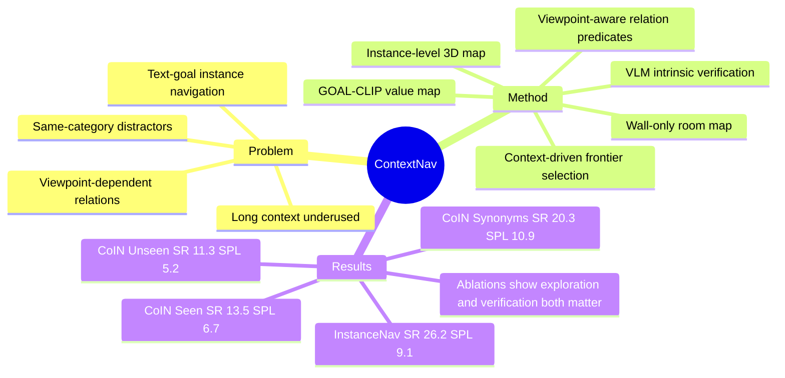

## Summary

Context-Nav 解决 text-goal instance navigation 中长描述常被降级为局部检测/匹配信号的问题：它把完整 caption 转成探索阶段的 context-conditioned value map prior，并在停止前用 viewpoint-aware 3D spatial reasoning 验证候选实例的外部空间关系。已知结果是：在 InstanceNav 上达到最高 SR 26.2%，在 CoIN-Bench 三个 split 上达到最高 SR/SPL，但 InstanceNav SPL 9.1 低于 PSL 10.2 和 UniGoal 11.4。方法不做 TGIN-specific policy training 或 fine-tuning，但依赖一组预训练 perception、VLM/LLM 与在线 3D mapping 模块。

## Problem & Motivation

Text-goal instance navigation (TGIN) 要求 agent 根据一段自由文本描述，在未探索 3D 环境里找到唯一正确的 object instance；难点不是找到某一类物体，而是在 same-category distractors 中用 intrinsic attributes 和 extrinsic/context attributes 消歧。论文指出，既有 supervised/RL 方法依赖语义监督和训练分布，zero-shot modular 方法容易把语言压缩成局部 attribute matching，interactive 方法则假设可以向人追问。作者的核心动机是：长描述里的周边物体和空间关系不是额外噪声，而是可以直接约束探索空间的 global signal。这个问题与 embodied agent 的 spatial grounding、VLM-based verification 和 open-vocabulary navigation 直接相关，因此在本 vault 中属于高相关论文。

## Method

Context-Nav 是一个 training-free modular pipeline，输入 RGB-D、odometry 和 free-form text goal，输出离散动作 `{forward, turn-left, turn-right, stop}`。整体分成 perception/mapping、context-driven exploration、candidate verification 三层。

**Perception 与 online 3D mapping。** 系统从 goal 中解析 target category、intrinsic attributes、context objects 与 spatial relation triples。每个观测先用 open-vocabulary detector 产生 bounding boxes，再用 segmenter 得到 masks；COCO 类别用 class-specific detector 验证，non-COCO open-set 类别用 VLM yes/no 判断。通过 depth 和 pose 将 2D masks 投影到 3D，按空间邻近和 voxel-overlap 把多视角观测融合成 instance-level point clouds。为了做房间级约束，系统还单独维护 wall-only map：从 depth 中 range/height gate 出结构点，用 RANSAC 分割 vertical planes，再用 free-space connected components 定义 wall-bounded rooms。

**Context-driven exploration。** 与先检测目标再验证不同，Context-Nav 用完整 goal 构造 prompt，把 target category、attributes 和 context 一起编码进 GOAL-CLIP。每帧计算 dense text-image similarity，并投影到 top-down grid 形成 value map；frontier selection 选择 value 最高的未知边界。若已经检测到 target instance，但同房间中仍有未观察到的 context instance，且该房间内还有 unexplored frontier，系统会一次性 override 全局 value-map frontier，优先探索同房间最近 frontier；到达后恢复默认策略。低层运动由 off-the-shelf depth-only PointNav policy 执行 waypoint。

**候选实例验证。** Intrinsic attributes 由 VLM 做 VQA：每个属性被转成 yes/unknown/no question，VLM 输出 0-15 分，0-4 为 No，5-10 为 Unknown，11-15 为 Yes；若当前视角不清楚，系统记录后续五步图像，并在 text-image similarity 最高的一帧重问。Extrinsic attributes 是本文最核心的几何部分：对 `(ref, tgt, relation)` triples，系统在 relation-pair midpoint 或 object centroid 周围以 24 个角度、4 个半径采样 candidate viewpoints；每个 viewpoint 建立局部坐标系，让 +x 指向 reference object，再检查 left/right/front/behind/near/above/below 七类 predicates。只有当存在某个 viewpoint，使 target、context objects 位于同一 wall-bounded room 且所有 relation predicates 同时满足时，candidate 才会被接受，否则继续探索。

实现细节上，补充材料给出的 LLM/VLM 配置是 GPT-OSS 20B 用于文本解析与 question generation，Qwen2.5-VL 7B 用于 open-set category verification 和 intrinsic attribute VQA；论文没有报告任务特定微调。

## Key Results

**主 benchmark。** InstanceNav 包含 1,000 test episodes、795 unique objects、36 scenes、6 类目标；CoIN-Bench 包含 Val Seen 831、Val Seen Synonyms 359、Val Unseen 459 episodes。Context-Nav 的主要结果如下：

| Benchmark / Split | Context-Nav | 主要对照 | 结论 |
| --- | ---: | ---: | --- |
| InstanceNav | SR 26.2 / SPL 9.1 | PSL 26.0 / 10.2；UniGoal 20.2 / 11.4 | SR 最高，但 SPL 不是最高 |
| CoIN-Bench Val Seen | SR 13.5 / SPL 6.7 | PSL 8.8 / 3.3；AIUTA 7.4 / 2.9 | SR/SPL 最高 |
| CoIN-Bench Val Seen Synonyms | SR 20.3 / SPL 10.9 | AIUTA 14.4 / 8.0；GOAT 13.1 / 6.5 | SR/SPL 最高 |
| CoIN-Bench Val Unseen | SR 11.3 / SPL 5.2 | AIUTA 6.7 / 2.3；PSL 4.6 / 1.4 | SR/SPL 最高 |

**语言信号 ablation。** 在 CoIN-Bench Val Seen Synonyms 上，GOAL-CLIP + full text 达到 SR 20.3 / SPL 10.9，高于 GOAL-CLIP + category 的 13.7 / 7.6，以及 GOAL-CLIP + intrinsic attributes 的 16.7 / 9.7。BLIP-2 下 full text 的 SR 16.4 低于 intrinsic attributes 的 17.8，但 SPL 9.5 高于 category 7.3 和 intrinsic 8.2；这支持作者的判断：长 caption 是否有益取决于 backbone 能否做 token/local grounding，而不只是全局 caption pooling。

**组件 ablation。** 在 CoIN-Bench Val Seen Synonyms 上，Full Approach 为 SR 20.3 / SPL 10.9；改成 nearest-frontier exploration 掉到 10.6 / 4.6；移除 VLM category verification 掉到 11.1 / 7.1；移除 intrinsic attribute verification 掉到 12.5 / 7.7；移除 context/relation verification 掉到 12.0 / 8.4。这个 ablation 说明 exploration prior、open-set category check、intrinsic check 和 3D relation check 都是 load-bearing components。

**严格成功半径补充实验。** 补充材料在 InstanceNav 上采用 CoIN-Bench 更严格标准（0.25m success radius、500 max steps）时，Context-Nav 为 SR 21.2 / SPL 7.9，高于 PSL 18.0 / 7.2、UniGoal 13.5 / 6.7、VLFM 9.5 / 5.7。

**效率。** 单张 A100 上平均 0.54 s/step，范围 0.36-1.12 s/step；VLM inference 不是每步触发，只占 10% steps，其中 8% 用于 open-set category verification，2% 用于 intrinsic attribute verification。Viewpoint-aware verification 本身 per-call latency 约 0.0004 s，主要开销仍在 detection/segmentation、3D association 与 VLM inference。

## Strengths & Weaknesses

**已知优点。** 第一，方法把 long contextual captions 从 post-hoc verifier 提升成 exploration prior，这比 detection-first 的 modular pipeline 更符合 TGIN 的问题结构。第二，viewpoint-aware 3D verification 直接处理 left/right/front/behind 这类 observer-dependent relations，避免把空间关系当成 viewpoint-agnostic heuristic。第三，ablation 相对扎实：nearest frontier、prompt/backbone、category verification、attribute verification、context verification 都被拆开验证。第四，训练成本低于 RL/supervised policy 路线，且在 CoIN-Bench 三个 split 上超过 interactive AIUTA，不依赖 human-in-the-loop。

**已知局限。** 第一，绝对成功率仍低：最高的 CoIN-Bench Val Seen Synonyms SR 也只有 20.3，InstanceNav SR 26.2，说明任务远未解决。第二，论文摘要/正文有 “SOTA SR and SPL” 的表述，但 Table 1 中 InstanceNav 的 SPL 9.1 低于 PSL 10.2 和 UniGoal 11.4，因此更准确说法是 InstanceNav SR 最好、CoIN-Bench SR/SPL 最好。第三，系统依赖多模块 pipeline：open-vocabulary detection、segmentation、VLM category verification、LLM relation extraction、wall-only room segmentation、local PointNav policy 任一环节出错都会传导。第四，补充材料的 failure analysis 明确指出三类失败：planning under imperfect geometry（HM3D phantom free space、有限 FOV 导致晚期 replanning）、detection failures（target/context object 漏检或误检）、ambiguity（多个同类实例在部分观测下都满足描述）。

**推测。** 这篇论文的更一般启发是：对 embodied / GUI / web agent，rich instruction 里的 context 应该更早进入 search policy，而不是只在候选 action 或候选 object 出现后才做 verification。这个推测来自作者在 TGIN 中的实验证据，但是否能迁移到 2D GUI grounding 或 browser agent，还需要新的 benchmark 和 ablation。

**不知道。** 论文文本中没有给出 DOI 或 code link；没有真实机器人实验；没有单独量化 LLM relation extraction 错误、wall-only room segmentation 错误与 VLM attribute scoring 错误各自占失败的比例。关系 predicate 阈值如 near=2.0m、bearing tolerance=25°、height tolerance=0.15m 是固定超参数，跨房屋尺度、相机噪声或不同模拟器是否稳健，仍未被充分验证。

## Mind Map

## Notes

- 这篇论文的 taste 在于把问题 formulation 改对：不是 “先找到疑似目标，再局部比对 caption”，而是 “让 caption 的 context 先决定该探索哪里，再用 3D geometry 判断能不能停止”。这个 framing 比单个模块的 novelty 更重要。
- 对 navigation 研究，最值得复用的是 viewpoint-aware relation verification 的设计：通过采样 observer poses，把 left/right/front/behind 统一为局部坐标系下的 predicate satisfaction，而不是让 VLM/LLM直接在图像或文本中猜空间关系。
- 对 VLM-agent 研究，重要警告是 full text 并非总是更好：BLIP-2 下 full text 没有带来最高 SR，只有 GOAL-CLIP + full text 明显最优。这说明 “长上下文有用” 的前提是 representation 能把 token-level language grounding 到局部视觉区域。
- 后续值得追问：如果加入主动 viewpoint selection，而不是被动记录后五步再重问 intrinsic attributes，是否能显著降低 Unknown 和 ambiguity failure？如果把 relation extraction 和 verification 的中间结果暴露给 planner，frontier ranking 是否能进一步从 heuristic value map 变成 uncertainty-aware search？
