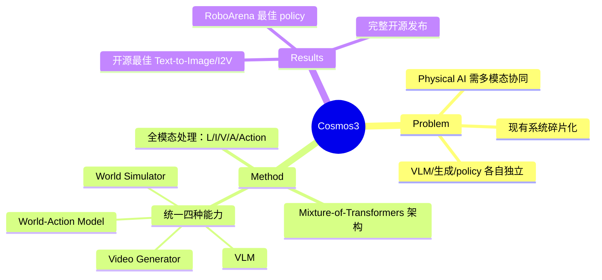

## Summary

> [未获取全文，仅基于 abstract 和元数据]

Cosmos 3 是 NVIDIA 发布的全模态世界模型家族，基于 mixture-of-transformers 架构统一处理语言、图像、视频、音频和动作序列，将 vision-language model、视频生成、世界模拟器和 world-action model 整合为单一框架，在开源 Text-to-Image/Image-to-Video 和 RoboArena policy 性能上达到最佳。

## Problem & Motivation

> [未获取全文，仅基于 abstract 和元数据]

当前 AI 系统在处理多模态输入输出时通常采用独立的模型（VLM、视频生成器、embodied policy 等），导致系统碎片化、模态间协同不足。Physical AI 需要同时理解和生成多种模态（视觉、语言、动作）以完成现实世界任务，需要一个统一的模型架构来联合建模这些能力。

## Method

> [未获取全文，仅基于 abstract 和元数据]

**核心架构**：采用 mixture-of-transformers (MoT) 架构，设计为全模态世界模型。该架构能够：
- 联合处理和生成多种模态：language、image、video、audio、action sequences
- 统一 vision-language model、video generator、world simulator、world-action model 四种能力于单一框架

**模型定位**：
- Text-to-Image 和 Image-to-Video 生成
- World simulation（环境动态建模）
- World-action model（动作策略学习）

## Key Results

> [未获取全文，仅基于 abstract 和元数据]

- **Text-to-Image & Image-to-Video**：被 Artificial Analysis 评为最佳开源模型
- **Embodied Policy**：在 RoboArena benchmark 上达到最佳 policy 性能
- **开源发布**：模型已在 GitHub 和 Hugging Face 开源（Linux Foundation OpenMDW-1.1 许可）

## Strengths & Weaknesses

> [未获取全文，仅基于 abstract 和元数据]

**Strengths**：
- **统一架构**：用单一 MoT 框架统一多模态理解、生成和动作预测，减少系统复杂度
- **全模态覆盖**：覆盖 language/image/video/audio/action 五种模态，是目前少见的真正 omnimodal 系统
- **实证性能强**：在多个 benchmark（图像/视频生成、embodied policy）上达到开源最佳
- **工程完整度高**：NVIDIA 提供完整代码、模型权重和项目网站，复现门槛低

**Weaknesses**（基于 abstract 的推测）：
- **训练成本不透明**：291 位作者暗示巨大的工程投入，中小团队难以复现训练流程
- **MoT 架构细节未知**：如何设计 expert routing、各模态如何共享参数、推理效率如何，需要看全文
- **benchmark 覆盖有限**：RoboArena 是单一 embodied benchmark，泛化性（sim-to-real、真实机器人平台）未知
- **与专用模型对比不足**：未说明是否与当前最强的专用生成模型（如 Sora、Runway）和 VLA（OpenVLA、π0 等）对比

**对领域影响**：
- 推动 Physical AI 的统一建模范式，挑战"每个任务一个模型"的传统
- NVIDIA 的大力投入可能加速 omnimodal model 的工业化落地
- 开源许可下，社区可在此基础上探索 world model + embodied policy 的联合训练策略

## Mind Map

## Notes

- **作者规模**：291 位作者，NVIDIA 团队规模惊人，暗示这是一个大型工程项目而非小团队实验
- **许可证选择**：使用 Linux Foundation OpenMDW-1.1 而非常规 MIT/Apache，可能有额外使用限制，需查阅许可条款
- **后续关注点**：
  - MoT 架构的 expert 设计：是按模态分 expert 还是按任务分？如何避免负迁移？
  - 训练数据规模和来源：尤其是 action sequence 数据从哪里来？
  - Sim-to-real 效果：RoboArena 是仿真 benchmark，真实机器人表现如何？
  - 与 OpenVLA/π0 等开源 VLA 的细粒度对比
