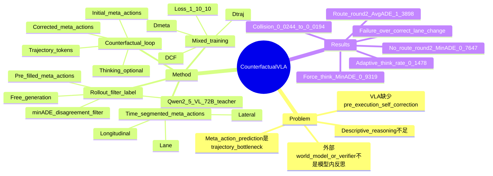

## Summary
CF-VLA 把 autonomous driving VLA 的 reasoning 从一次性解释推进到自我反思：模型先生成 time-segmented meta-actions，再基于视觉上下文和自身计划做 counterfactual reasoning，必要时修正 meta-actions 后再生成轨迹。作者用 rollout-filter-label pipeline 从模型自身失败中筛出高价值场景并生成 counterfactual traces，在 80,000 小时私有驾驶数据上验证了 trajectory accuracy、safety 和 meta-action alignment 的提升。

## Problem & Motivation
现有 reasoning-augmented VLA 通常会描述场景和计划，例如“看到行人”“应该谨慎”，但很少显式追问“我刚提出的 action plan 是否安全、是否合适”。在这种范式里，语言化 intent 一旦生成，往往直接被当作低层 trajectory decoder 的条件，而不是被视觉证据反检验和修正。

作者希望解决的是 autonomous driving VLA 的 pre-execution self-correction：在执行前让模型分析自己计划的潜在后果，而不是等失败发生后由外部 verifier、planner 或 world model 触发 recovery。这个问题重要的原因是 driving 中很多错误来自高层 intent 不对，例如在 pedestrian crossing 时继续加速、在 merge/cut-in 场景里 lane action 不合理；如果 action-language alignment 足够好，模型可以在 language space 中先修改 intent，再把更合理的 meta-actions 交给 trajectory generation。

## Method
**核心 loop**：CF-VLA 的推理链是 `meta-actions -> CF reasoning -> updated meta-actions -> trajectory`。模型先预测 6.4 秒 planning horizon 内的 time-segmented meta-actions，再判断这些 meta-actions 是否 unsafe 或 incorrect；若需要反思，输出 `Thinking:` 段和第二个 corrected `Meta Actions:` 段，最后生成 trajectory tokens。

**Meta-actions 表示**：meta-actions 分为三组：longitudinal（Accelerate、Decelerate、Keep Speed、Wait、Reverse）、lateral（Straight、Left Turn、Right Turn）和 lane-level（Keep Lane、Left Lane Change、Right Lane Change）。每组内部用不重叠时间段覆盖 0.0s-6.4s horizon，使语言计划和连续 trajectory 在时间结构上对齐。

**Rollout-filter-label pipeline**：先从不带 counterfactual reasoning 的 meta-action VLA 出发，在训练集上 rollout 两种轨迹：free generation 使用模型自己预测的 meta-actions，pre-filled meta-actions 使用 expert trajectory 自动提取的 meta-actions。每个场景每种 setting 采样 6 条 trajectory，然后用 `minADE(x_pf, x*) < minADE(x_free, x*)` 且 `minADE(x_free, x*) > 0.5` 筛选场景；直觉是只有当正确 meta-actions 能显著改善 trajectory 时，这个样本才值得教模型反思。对筛出的样本，Qwen2.5-VL-72B-Instruct 作为 teacher 生成不超过 80 words、基于视觉线索的 counterfactual reasoning trace。

**Training**：训练分阶段进行：base VLM 先在 trajectory-only dataset `Dtraj` 上学习直接预测轨迹，再用 `Dtraj ∪ Dmeta` 引入 meta-actions，最后用 `Dtraj ∪ Dmeta ∪ DCF` 训练 CF-VLA。CF samples 中第一段未修正 meta-actions 的 loss 被 mask，避免模型学习错误计划；token-level loss 权重为 trajectory:meta-action:CF reasoning = 1:10:10。模型从 Qwen2.5-VL-3B-Instruct 初始化，输入 text prompt、两个前向 camera videos（120° wide 与 30° telephoto，过去 2s、2Hz）和 1.6s ego trajectory history，输出 6 个离散 future trajectory tokens 解码为 6.4s 轨迹。

**Adaptive thinking**：CF-VLA 不使用单独分类器决定是否思考，而是在统一 prompt 下让模型生成第一段 meta-actions 后选择直接输出 `Action:` 或先输出 `Thinking:`。训练中混合含 CF trace 和不含 CF trace 的样本，使模型学到在 difficult/high-risk 场景中更常反思，在 easy scenes 中跳过 reasoning。

## Key Results
**Large proprietary driving validation set / Dval**：数据来自 80,000 小时、25 个国家的人类驾驶数据；`Dtraj` 包含约 11.6M 个 20s clips，`Dmeta` 来自 3,000 小时自动标注数据，训练集为 433K 个 20s clips / 801K 个 8.4s samples，验证集为 39K clips / 73K samples，`DCF` 通常约 200K samples。所有主结果都报告在这个 `Dval` 上，因此不是公开 benchmark 结果。

**Main results without route information**：`traj-only` 为 0.9283 MinADE / 1.8284 AvgADE / 2.5912 MinFDE / 5.1150 AvgFDE，collision 0.0244，off-road 0.0720。`CF-VLA (w/o route, round2)` 达到 **0.7647 MinADE / 1.5032 AvgADE / 2.1365 MinFDE / 4.1927 AvgFDE**，collision 0.0194，off-road 0.0583，edited IOU 从 0.9174 到 0.9228，think rate 0.083；相对 `traj-only`，MinADE 降低约 **17.6%**，collision 从 0.0244 降到 0.0194，约 **20.5%** 降幅。

**Main results with route information**：`meta-act (w/ route)` 为 0.7263 MinADE / 1.4612 AvgADE / 1.9561 MinFDE / 3.9269 AvgFDE，collision 0.0196，off-road 0.0619。`CF-VLA (w/ route, round1)` 达到 **0.6712 MinADE / 1.4574 AvgADE / 1.7988 MinFDE / 3.9466 AvgFDE**，collision 0.0177，corner distance 0.6010；`CF-VLA (w/ route, round2)` 达到 **1.3898 AvgADE / 3.7474 AvgFDE**，collision 0.0174，off-road 0.0585，IOU 从 0.9238 到 0.9276，think rate 0.123。也就是说 round2 在 average error、安全指标和 IOU 上更好，但 MinADE 比 round1 略差。

**Meta-action bottleneck ablation / no-route Dval**：`meta-act baseline` 的 0.8411 MinADE / 0.7720 corner distance，在 pre-filled ground-truth meta-actions 后变成 **0.4831 MinADE / 0.4399 corner distance**。这说明 trajectory decoder 在 meta-actions 正确时已经很强，主要瓶颈确实在 meta-action prediction，而不是单纯 low-level trajectory decoding。

**Adaptive reasoning ablation / no-route Dval**：`CF-VLA (adaptive)` 为 **0.7650 MinADE / 1.5606 AvgADE / 2.1416 MinFDE / 4.3307 AvgFDE**，edited IOU 0.9153 -> 0.9212，think rate 0.1478。强制不思考时 MinADE 退到 0.7897；强制 always think 时退到 0.9319 MinADE / 2.1144 AvgADE，edited IOU 反而从 0.9132 降到 0.8565，output length 达 257.42。结论是 selective reasoning 有效，而“想得更多”本身不是充分条件。

**Data filtering ablation / route Dval**：filtered CF data 得到 **0.6712 MinADE / 1.7988 MinFDE / 0.6010 corner distance**，think rate 0.2190；whole dataset CF data 为 0.6811 MinADE / 1.8296 MinFDE / 0.6128 corner distance，think rate 0.6677，output length 191.14。whole dataset 的 AvgADE/AvgFDE 数字更低（1.4185 / 3.8344 vs filtered 1.4574 / 3.9466），但它显著更常 reasoning，且关键 min error 和 corner distance 更差；这支持作者关于“counterfactual supervision 需要 targeted filtering”的主张。

**Supplementary ablations**：加入第一轮和第二轮 CF datasets 的 4-dataset round2 变体在 MinADE/MinFDE 上略优于 3-dataset round2（0.6776 / 1.8108 vs 0.6813 / 1.8291），但 AvgADE、safety、IOU、output length 和 think rate 更差（think rate 0.299 vs 0.123）。loss mixture ablation 显示 1:10:10 是较好配置；把 CF reasoning 权重进一步提高会把 think rate 从 0.1478 提到 0.2338，但会损害 trajectory accuracy。

## Strengths & Weaknesses
**已知亮点**：
- 问题 formulation 清楚：作者没有把 reasoning 当作可解释性装饰，而是把它接到 action correction 上，要求模型检查自己的 meta-actions 是否会导致 unsafe/suboptimal outcome。
- Meta-actions 的时间分段设计比较干净，既能被 VLM 语言侧操作，又与 6.4s trajectory horizon 对齐；pre-filled ablation 给出强证据表明 meta-action 质量确实是 bottleneck。
- Rollout-filter-label 的过滤准则是因果味较强的工程选择：只有“换成更好 meta-actions 会改善 trajectory”的样本才进入 CF supervision，避免在 easy scenes 上制造冗余 reasoning。
- 实验不只报 MinADE/FDE，还报 collision、off-road、corner distance、meta-action IOU、output length 和 think rate；这使 adaptive reasoning 的 accuracy-safety-compute trade-off 比较可见。
- Supplementary 提供了 failure cases，而不是只展示成功案例；尤其 Figure 15/16 暴露了 self-reflection 可能 over-correct 或过度保守。

**已知局限**：
- 主实验全部在 NVIDIA 内部 large-scale driving dataset / Dval 上完成，没有公开 benchmark、公开代码或公开权重；可复现性和跨数据集泛化无法从论文中验证。
- `Dmeta` 的 meta-actions 由 expert trajectory 的 rule-based kinematic detectors 自动抽取，并非人工语义标注；如果规则 detector 对某些驾驶语境有偏差，CF trace 会继承这种 target bias。
- Counterfactual reasoning traces 由 Qwen2.5-VL-72B-Instruct teacher 生成，虽然 prompt 要求 grounded visual cues，但没有报告人工审核比例、teacher hallucination rate 或 reasoning label 质量统计。
- 方法仍然依赖 ground-truth future trajectory 来做 filtering 和 expert meta-action extraction；它是训练时自我改进 pipeline，不是部署时从未标注数据中完全自主发现正确反思。
- Adaptive thinking 的触发是隐式语言分支选择；论文没有给出校准曲线或阈值控制机制，因此部署时如何约束“该想时想、不该想时别想”仍不透明。
- Failure cases 显示 CF-VLA 会把安全 keep-lane plan 误修成 left lane change，也会因为红灯线索过度保守、忽略 cut-in vehicle 的真实空间关系。这说明 self-reflection 不是单调增益模块，错误 reasoning 可以覆盖原本合理的 first plan。

**推测**：
- 这篇对 VLA / embodied reasoning 的最大启发不是 autonomous driving 数字本身，而是一个通用 pattern：先把 low-level action 压成可语言操作的 temporally grounded plan，再让模型在执行前对计划做 counterfactual edit。
- 对 GUI agent 也可能有迁移价值：GUI action 可以先抽象成 time/step-segmented intent（例如 navigate/search/edit/confirm），再对“如果执行这个 plan 会不会破坏用户目标或状态”做 self-reflection；但 GUI 的 environment state 和可逆性与 driving 不同，不能直接照搬结果。

**不知道**：
- CF-VLA 在公开 nuScenes / Waymo / NAVSIM 等 benchmark 或 closed-loop driving simulator 上是否保持同样排序。
- 如果 teacher model 换成较弱 VLM，或不使用 expert meta-actions 作为 corrected target，pipeline 是否仍然有效。
- 反思文本是否真的提供了 causal mechanism，还是主要作为 structured regularizer 帮助模型靠近 expert meta-actions；论文没有做去文本语义、保留 corrected meta-actions 的干净因果对照。
- 这种 self-reflection 对 rare but catastrophic safety cases 的覆盖率如何；collision rate 下降很有价值，但论文没有报告按场景类别的 long-tail failure taxonomy。

## Mind Map

## Notes
- 与 [[2512-GenieReasoner]] 的共同点是都在处理 VLA 的 reasoning/action coupling；差异是 GenieReasoner 更偏 unified embodied reasoning + action representation，CF-VLA 更明确地把 reasoning 放在“审查自身 high-level action plan”这个位置。
- 与基于 external world model / verifier 的 safety pipeline 相比，CF-VLA 的 claim 是“模型内部能反思自己的 meta-actions”。但从监督来源看，它仍然依赖 teacher trace 和 expert-derived corrected meta-actions；因此更准确的表述是 supervised self-reflective behavior，而不是完全 autonomous self-improvement。
- date_publish 取论文首页 arXiv header 的 2025-12-30；venue 按 CVPR 2026 记录。正文未给 DOI 或代码链接，因此对应字段留空。
