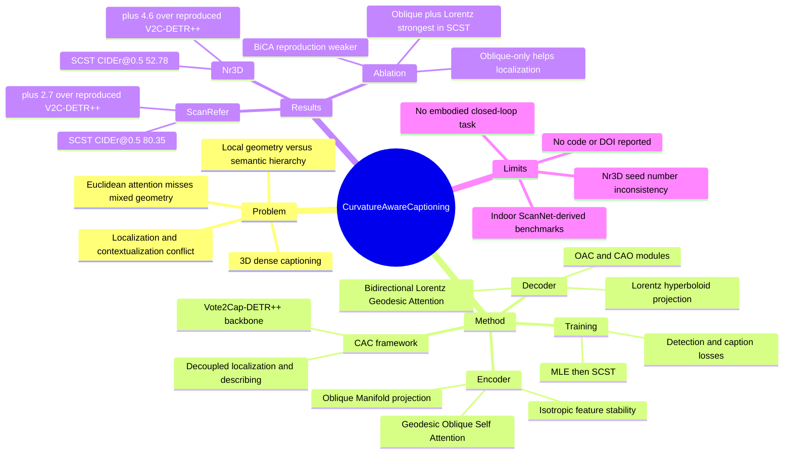

## Summary
CAC 针对 3D dense captioning 中 object localization 与 scene-level semantic contextualization 的张力，提出把 encoder self-attention 放到 Oblique Manifold、把 decoder bidirectional cross-attention 放到 Lorentz Space 的 curvature-aware framework。已知实验在 ScanRefer 和 Nr3D 上提升 CIDEr@0.5，说明 geodesic attention 对 3D scene captioning 的 localization-caption coupling 有帮助。它和 embodied / VLM 方向的关联主要在 3D scene understanding 与 spatial-language grounding，不是 GUI-agent 或 general agent 方法。

## Problem & Motivation
已知：3D dense captioning 要在 point cloud 场景中同时定位 object 并生成自然语言描述，典型应用包括 robotic navigation 和 augmented reality。早期 detect-then-describe pipeline 会积累 detection error，后来的 end-to-end transformer 方法如 SpaCap3D、UniT3D、Vote2Cap-DETR++、BiCA 用 attention 对齐 visual cues 与 linguistic context，但论文认为它们仍主要工作在 Euclidean embedding space。

作者的问题 formulation 是：local object cues 需要保留 surface geometry 等近似 Euclidean 的细粒度空间信息，而 global scene context / object hierarchy 更适合用 hyperbolic curvature 表示指数增长的 semantic distances。若所有阶段都用统一 Euclidean attention，模型容易在精确 localization 与层级 contextual reasoning 之间冲突，表现为定位不准或 caption 关系浅、断裂。

这篇的动机不是构建更大的 language decoder，而是给 3D dense captioning 的不同阶段分配不同 geometric prior：encoder 关注稳定、局部的 spatial feature learning；decoder 关注 object-instance 与 context 之间的 hierarchical relation。

## Method
CAC 基于 Vote2Cap-DETR++ 的 decoupled localization-describing framework，输入是 `40,000 x (3+F)` 的 3D point cloud。PointNet++ set-abstraction 先得到 `2,048 x 3` 坐标和 `2,048 x 256` feature tokens，再经过几何增强的 3DETR encoder，下采样为 `1,024 x 3` 与 `1,024 x 256` encoded scene tokens。

**Encoder-Oblique Projection.** 作者把 3DETR encoder 的 attention module 替换为 Geodesic Oblique Self Attention。做法是把 `Q, K, V in R^{2048 x 256}` 投影到 Oblique Manifold，对每一列施加 unit Euclidean norm constraint，再用 Oblique geodesic distance 计算 pairwise attention scores。实现上用 `epsilon = 1e-4` clipping 把输入限制在 arccos 的有效域内。论文给出的直觉是：Oblique projection 使 attention distribution 更 isotropic，降低方向偏置，提升 bounding box regression 和 object localization 稳定性。

**Vote Query 与 decoupled decoder.** Vote Query Generator 沿用 Vote2Cap-DETR++ 的 spatial refinement：FFN 预测 center-aligned spatial shift 与 feature shift，再用 set-abstraction layer 聚合 refined coordinates，采样 `npoint = 256` points。decoder 继续保持 instance / context 的 decoupled outputs，并在每层迭代更新 spatial locations，以降低 detect-then-describe 的累计误差。

**Decoder-Lorentz Contextualization.** decoder cross-attention 改为 Bidirectional Lorentz Geodesic Attention。Object-aware Context (OAC) 用 instance features 作 `Q`、context features 作 `K/V`；Context-aware Object (CAO) 反过来用 context features 作 `Q`、instance features 作 `K/V`。`Q/K` 通过 exponential map 投影到 Lorentz hyperboloid，用 hyperbolic geodesic distance 替代 dot product，再经 `exp(-D/tau)` 和 softmax 得到 attention weights；计算 arcosh 时用 `epsilon = 1e-15` clipping 保证数值稳定。最终将 instance、OAC、CAO feature concat 后送入 captioning task head。

**Training objective.** 训练目标沿用 Vote2Cap-DETR++ 的四个部分：`Lvq` 监督 vote point shift 到 object centers，`Ldet` 用 Hungarian matching 和 3D GIoU 等检测损失优化 proposals，`Lcap` 结合 MLE 与 SCST 训练 caption head，`Lqr` 支持 decoder layer 中的 iterative query localization。实验训练分三阶段：ScanNet pretrain 1080 epochs，ScanRefer / Nr3D 上 MLE joint training 720 epochs，最后 SCST fine-tuning 180 epochs；论文报告单张 RTX4090 上三阶段 GPU memory 约为 18GB、18GB、12GB。

## Key Results
**ScanRefer validation.** 在 Scan2Cap protocol 下，CAC(O&H) + MLE 在 IoU=0.50 上达到 **69.92 CIDEr / 37.67 BLEU-4 / 26.89 METEOR / 55.62 ROUGE-L**，高于 reproduced Vote2Cap-DETR++ 的 **66.06 / 36.93 / 26.76 / 55.39**。在 SCST 下，CAC(O&H) 在 IoU=0.50 上达到 **80.35 CIDEr / 39.95 BLEU-4 / 26.94 METEOR / 55.66 ROUGE-L**，高于 reproduced Vote2Cap-DETR++ 的 **77.65 / 39.59 / 26.88 / 55.21**；作者概括为 ScanRefer CIDEr@0.5 提升 **+2.7**。

**Nr3D validation.** 在 IoU=0.50 上，CAC(O) + MLE 达到 **50.99 CIDEr / 28.89 BLEU-4 / 26.41 METEOR / 56.18 ROUGE-L**，而 CAC(O&H) + MLE 为 **49.90 / 28.70 / 26.00 / 55.71**；这说明加入 Lorentz decoder 后 MLE 阶段不一定在每个 Nr3D 指标上更高。SCST 后，CAC(O&H) 达到 **52.78 CIDEr / 29.78 BLEU-4 / 26.13 METEOR / 55.94 ROUGE-L**，高于 reproduced Vote2Cap-DETR++ 的 **48.13 / 28.03 / 25.66 / 54.74**；作者概括为 Nr3D CIDEr@0.5 提升 **+4.6**。

**Component / baseline ablation.** ScanRefer IoU=0.50 上，CAC(O) + MLE 为 **68.07 CIDEr**，CAC(O&H) + MLE 为 **69.92 CIDEr**；SCST 下 CAC(O) 为 **79.09 CIDEr**，CAC(O&H) 为 **80.35 CIDEr**，支持 Oblique encoder 与 Lorentz decoder 的互补。BiCA reproduction 在同等条件下较弱：BiCA^R + SCST 为 **76.42 CIDEr@0.5**，CAC(O)BiCA + SCST 为 **77.86**，而 CAC(O&H) + SCST 为 **80.35**；作者因此未把 BiCA 放进主表比较。

**Robustness / efficiency.** Nr3D seed test 覆盖 seeds 0、333、777。表格显示 CAC(O&H) + SCST 在 seed 0 / 333 / 777 下的 CIDEr@0.5 分别为 **52.78 / 49.34 / 53.18**，BLEU-4@0.5 为 **29.78 / 28.98 / 29.58**。训练效率上，作者报告 pretrain / MLE / SCST 的平均 iteration time 分别为 **0.878s / 1.173s / 1.629s**；对应 per-sample FLOPs 为 **10.61 / 11.16 / 13.92 GFLOPs**。

**Qualitative examples.** ScanRefer qualitative comparison 中，作者展示 CAC(O&H) 能把 black trash can 与 rectangular dispenser 识别正确，而 Vote2Cap-DETR++ 分别误写成 blue recycling bin 和 fire extinguisher；CAC 还生成 "the second chair from the right"、"the table is surrounded by chairs" 等空间关系描述，而 baseline 出现 "the table is to the left of the table" 这类不合理关系。

## Strengths & Weaknesses
**已知 Strengths.** 这篇的核心贡献是把 3D dense captioning 的不同子问题拆成不同 curvature bias：Oblique Manifold 处理 encoder 阶段的 feature stability / local geometry，Lorentz Space 处理 decoder 阶段的 hierarchical context。这个 formulation 比单纯堆 cross-attention 更有解释性，也和 3D scene 中局部几何与全局语义层级共存的结构匹配。

**已知 Strengths.** 实验证据覆盖 ScanRefer 与 Nr3D 两个 3D dense captioning benchmarks，并同时报告 MLE 与 SCST 两类 caption supervision。Ablation 给出 CAC(O)、CAC(O&H)、CAC(O)BiCA、BiCA^R、Vote2Cap-DETR++^R 的同条件对比，使得 Oblique-only、Oblique+Lorentz、BiCA-style bidirectional context 的相对贡献更清楚。

**已知 Weaknesses / boundary.** 结果并非所有设置都单调支持 "O&H always better"：Nr3D MLE 下 CAC(O) 的 CIDEr@0.5 是 **50.99**，高于 CAC(O&H) 的 **49.90**；METEOR 与 ROUGE-L 也更高。这说明 Lorentz decoder 的收益可能依赖 SCST fine-tuning 或特定 benchmark / metric，不能简单概括为任意训练阶段都更优。

**已知 Weaknesses / boundary.** 方法仍依赖 ScanNet-derived indoor datasets、PointNet++ / 3DETR / Vote2Cap-DETR++ pipeline 和 supervised dense caption annotations。论文没有验证真实 embodied navigation / manipulation success，也没有在 outdoor、dynamic scenes、open-vocabulary object categories 或 long-horizon agent tasks 上测试；因此它对 embodied AI 的价值目前主要是 perception / scene-language module 层面的启发。

**已知数据问题.** Nr3D seed robustness 的正文说 seed 777 的 CAC(O&H)+SCST CIDEr@0.5 为 **51.18% ± 0.09%**，但 Table 4 同一行显示 seed 777 CIDEr@0.5 为 **53.18**。这可能是正文 typo 或 OCR/extraction error；在没有原始表格之外证据前，不能把 seed robustness 的精确均值/置信区间作为强结论。

**推测.** 对 GUI-agent 的间接启发是：screen elements / DOM elements 也可能同时包含局部几何布局与全局任务层级，单一 Euclidean token attention 未必是最合适的 inductive bias。但本文没有 GUI、web 或 computer-use 实验，不能把 ScanRefer / Nr3D 的提升外推到 GUI grounding。

**不知道.** 论文正文没有给出代码链接、arXiv id、DOI，也没有系统报告 failure taxonomy。它展示了若干 qualitative corrections，但没有量化错误类型，例如 localization error、attribute error、spatial relation error 各占多少；也不知道 geodesic attention 的额外计算开销在更大场景或实时机器人系统中是否可接受。

## Mind Map

## Notes
- 我最看重的是它把 "local Euclidean-like geometry" 与 "global hyperbolic hierarchy" 拆到不同 stage，而不是把 hyperbolic embedding 当成一个统一替换层。这个 design taste 比单一 geometry-aware attention 更合理。
- 需要谨慎读结果：ScanRefer 与 Nr3D 的主要收益集中在 CIDEr@0.5，且 Nr3D MLE 中 Oblique-only 反而强于 O&H；所以它更像是一个对 caption reward / SCST 友好的 geometric prior，而不是无条件提升所有 caption metrics 的方法。
- 对后续 embodied scene understanding，可以追问两件事：第一，geodesic attention 是否能接入 3D visual grounding / navigation 的 object memory；第二，Lorentz hierarchy 到底学到了 object taxonomy、part-whole relation，还是只是更适合 caption dataset 的语言共现结构。论文当前没有提供 probing evidence 来回答这个问题。
