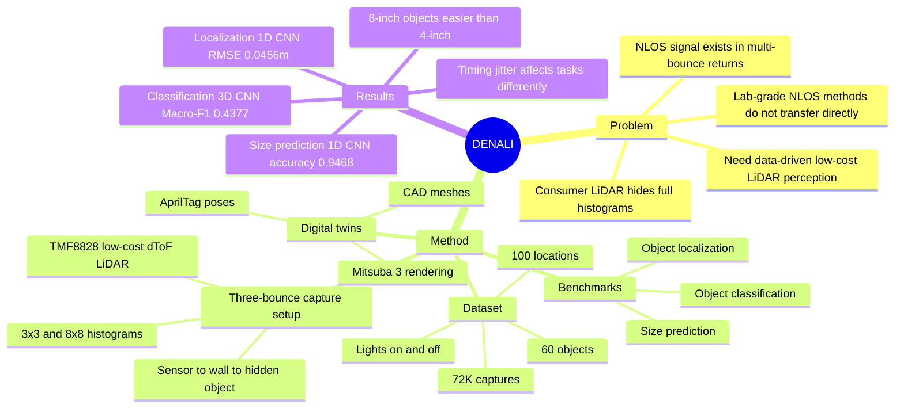

## Summary
DENALI 是一个面向 low-cost LiDAR 的 real-world NLOS spatial reasoning 数据集，收集 72,000 个隐藏物体场景的 full time-resolved histograms，并为每个 capture 配对 Mitsuba 3 digital twin。论文证明消费级 dToF LiDAR 的多次反射 histogram 足以支持数据驱动的隐藏物体 localization、shape classification 和 size prediction，但也清楚暴露了受物体尺寸、位置、光照、模拟 fidelity 和低空间分辨率限制的边界。

## Problem & Motivation
消费级 dToF LiDAR 通常只输出每个 pixel 的单一 depth value，但内部实际记录了 photon-arrival histogram；其中 late-arriving multi-bounce returns 包含 hidden object 的 NLOS 信息。传统 NLOS imaging 依赖 scanning LiDAR、collimated beams 和高时间分辨率 detector，难以直接迁移到 mobile / robot 上的低成本 flash LiDAR。作者的核心问题是：如果重建级别的 NLOS imaging 受硬件限制，是否可以转向 data-driven perception，让低成本 LiDAR 直接学习隐藏物体的位置、形状和尺寸？这个问题对 embodied perception 有意义，因为它把“看不见但可由光传输间接感知”的空间线索变成可学习 benchmark。

## Method
DENALI 的采集系统围绕 three-bounce NLOS signal 设计：LiDAR 朝向 flat relay wall，hidden object 被放在 sensor FoV 外的 motorized gantry 上，光路为 sensor → wall → hidden object → wall → sensor。作者使用 ams TMF8828 consumer-grade flash dToF LiDAR，约 10 美元、940 nm、128 个 time bins，支持 3 × 3 和 8 × 8 spatial output；论文所有 capture 使用 short-range mode。

数据维度是 60 objects × 100 locations × 2 LiDAR resolutions × 2 lighting conditions × 3 repeated samples。60 objects 来自 30 个 3D-printed CAD objects 的 4-inch 和 8-inch 两种尺寸，表面贴 retroreflective tape 以增强 three-bounce return；100 个 ground-plane positions 全部位于 direct line of sight 之外。最终数据包含 72,000 LiDAR captures、2,628,000 full-histogram LiDAR pixels 和 336,384,000 个 time-of-flight bin measurements。

每个 capture 都有 digital twin：作者用 AprilTag 标定 LiDAR、relay wall、tabletop 和 hidden object 的 6-DoF pose，并把已知 object mesh、场景几何和 pose 组合到 Mitsuba 3 中。RealSense RGB-D 主要用于 tag localization 和 validation；论文明确说 RealSense depth 不用于 digital-twin generation。

Benchmark 侧，作者定义三类 DENALI tasks：NLOS Object Localization，回归隐藏物体的 planar (x, y) position；NLOS Object Classification，在 30 个 shape categories 中分类；NLOS Size Classification，判断 4-inch 或 8-inch。输入是 `(n, n, 128)` 的 LiDAR photon-count tensor，主文聚焦 3 × 3 captures，并随机 70/30 划分 train/test。比较模型包括 flattened MLP、time-only 1D CNN、spatiotemporal 3D CNN 和 time-token Transformer。

## Key Results
- **DENALI dataset scale**：60 objects、100 positions、2 spatial resolutions、2 lighting conditions、3 repeats，共 **72,000 captures**；每个 histogram 有 **128 time bins**，总计 **2,628,000 pixels** 和 **336,384,000 ToF bin measurements**。
- **NLOS Object Localization benchmark（Table 2a, RMSE / MAE, lower is better）**：1D CNN overall 为 **0.0456 / 0.0324 m**，优于 3D CNN 的 **0.0475 / 0.0337 m**、Transformer 的 **0.0579 / 0.0428 m** 和 MLP 的 **0.1045 / 0.0907 m**。尺寸影响明显：1D CNN 在 4-inch objects 上为 **0.0548 / 0.0398 m**，在 8-inch objects 上提升到 **0.0341 / 0.0250 m**。
- **NLOS Object Classification benchmark（Table 2b, Top-1 / Top-5 / Macro-F1, higher is better）**：1D CNN overall Top-1 / Top-5 / Macro-F1 为 **0.3876 / 0.7954 / 0.3832**；3D CNN 的 Macro-F1 最高，为 **0.4377**，但 Top-1 / Top-5 为 **0.3523 / 0.5737**。物体尺寸同样重要：1D CNN 在 4-inch objects 上 Macro-F1 **0.2853**，在 8-inch objects 上 **0.4397**。
- **NLOS Size Prediction benchmark（Table 2c, Precision / Recall / Accuracy, higher is better）**：1D CNN overall 达到 **0.9488 / 0.9468 / 0.9468**，高于 3D CNN 的 **0.9304 / 0.9298 / 0.9298**、Transformer 的 **0.8727 / 0.8722 / 0.8722** 和 MLP 的 **0.5968 / 0.5363 / 0.5363**。
- **Sensor timing jitter analysis（Table 3）**：在 3 × 3 center-pixel histograms 上，0 ps baseline 的 localization 为 **0.0804 / 0.0653**，object classification 为 **0.1554 / 0.4503 / 0.1416**，size classification 为 **0.8631 / 0.8616 / 0.8616**；当 Gaussian FWHM 增至约 600 ps 时，localization 仅降到 **0.0819 / 0.0675**，但 classification 降到 **0.1260 / 0.4220 / 0.1064**，size classification 降到 **0.8002 / 0.7944 / 0.7944**。这说明不同 NLOS task 对 detector timing blur 的容忍度不同。

## Strengths & Weaknesses
**已知**：
- DENALI 的主要贡献不是一个复杂模型，而是把 low-cost LiDAR full-histogram NLOS perception 变成可量化数据集和 benchmark；这比只展示单个小规模 demo 更有研究复利。
- Baseline 选择有信息量：MLP、1D CNN、3D CNN、Transformer 对应从无 inductive bias 到 temporal / spatiotemporal / attention 的建模假设。结果显示 temporal local structure 很关键，但 3D CNN 没有稳定超过 1D CNN，说明模型尚未有效利用 3 × 3 低分辨率空间信息。
- 论文主动暴露限制：受控场景、retroreflective objects、known bounding region、固定 sensor / table / relay wall、单一 LiDAR model（ams TMF8828），都意味着结果不能直接代表 unconstrained dynamic real-world environments。
- Scene-level failure mode 很清楚：8-inch objects 更容易定位和分类；靠近 relay wall 的物体总体更易感知，但太靠近 wall 时 first-bounce 与 three-bounce returns 会重叠而导致 localization 困难。
- Modeling-level limitation 也具体：同一个模型在不同 lighting conditions 下出现不同 spatial error pattern，作者据此认为当前模型没有干净分离 object properties、scene geometry 和 ambient illumination。
- Simulation gap 没被粉饰：Mitsuba 3 / MiTransient digital twin 的 histogram 形状 qualitatively similar，但未能捕捉 true pulse width、noise characteristics、jitter 和 intensity scaling，这些会影响 sim-to-real transfer。

**推测**：
- 对 embodied agent 更有价值的方向可能不是直接把 DENALI 当作单一感知模块，而是把 NLOS histogram signal 融入 navigation / obstacle avoidance / spatial memory，让 agent 在遮挡或转角场景中估计 hidden affordance。
- 由于论文没有使用 language 或 VLM，DENALI 对 GUI-agent / VLM 的直接关联较弱；它更像是 embodied spatial sensing 的底层 benchmark，可为以后 multimodal world model 或 sensor-aware VLA 提供额外观测通道。

**不知道**：
- 主文没有给出 8 × 8 resolution 的完整结果、held-out locations / shapes / sizes、non-retroreflective materials 和 unseen object variations 的具体数字，只说放在 supplement。
- 论文顶部给出项目页，但主文没有明确代码仓库链接；因此不知道数据、digital twins、训练脚本和评测协议的实际开放程度。
- 不知道在没有 retroreflective tape、移动物体、杂乱房间、非固定 relay wall 或多传感器融合场景下，当前 benchmark 结论是否仍成立。

## Mind Map

## Notes
DENALI 的研究 taste 比较好：它没有把低成本 LiDAR 的硬件限制包装成“完整 NLOS reconstruction 已解决”，而是换成更实际的 perception tasks，并用数据集规模、baseline 和 limitation analysis 支撑这个 problem formulation。对后续研究最值得追的是两个问题：第一，能否设计显式 factorization 或 physics-informed model，让 object / geometry / lighting 的影响可分离；第二，能否把 NLOS histogram 作为 embodied agent 的 hidden-state observation，而不是孤立地做单帧分类。
