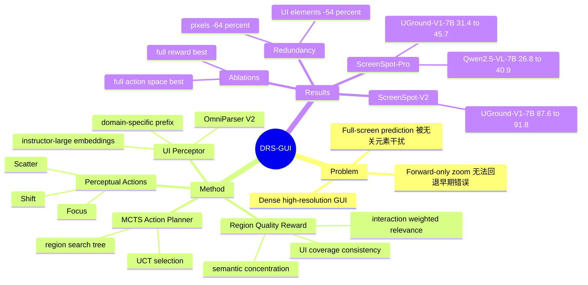

## Summary
DRS-GUI 把 GUI grounding 改写为 search-then-predict：先用 training-free 的 dynamic region search 找到 instruction-relevant region，再让基础 MLLM 在该 crop 内预测坐标。核心贡献是把 UI Perceptor、Focus/Shift/Scatter 三种 perceptual action、MCTS Action Planner 和 region quality reward 组合成一个可插入 Qwen2.5-VL / UGround 等模型的前置搜索模块，主要提升高分辨率、密集 GUI 上的定位稳定性。

## Problem & Motivation
GUI agent 的可靠性依赖 grounding：给定自然语言指令，需要在高分辨率 screenshot 中定位可执行 UI element。论文指出两类现有范式各有脆弱点：full-screen single-step prediction 容易被大量无关 UI 元素分散注意力；iterative crop/zoom 方法虽然逐步聚焦，但通常是 forward-only，一旦早期 crop 偏离目标区域就难以恢复。作者的出发点是模拟人的视觉搜索：在证据弱时不仅缩小视野，还能 shift 到其它区域或 scatter 扩大上下文，并在每一步评估 region 是否真的更接近指令目标。

## Method
DRS-GUI 是一个 training-free 的前置 region search 框架，目标是在最终坐标预测前先得到 $R_{\text{best}}$。形式上，系统先用搜索策略 $\pi_S(S_{\text{full}}, T)$ 从整屏截图和 instruction $T$ 中选出 instruction-relevant region，再把该 region 交给基础 grounding model $M$ 输出点坐标 $p=(x,y)$。

**UI Perceptor** 负责把当前 region 解析成结构化 UI elements。论文采用 OmniParser V2 提取每个元素的 bbox、semantic description（OCR text 或 icon caption）以及是否 interactive；再用 instructor-large 对 instruction 与 element description 编码。为了让 embedding 对齐到当前 GUI 环境，作者为 application type 和 system type 设计 domain-specific prefix，并用 cosine similarity 得到每个 UI element 的 semantic relevance score。

**Perceptual actions** 由 UI Perceptor 执行：

1. **Focus**：选择 top-p% 高相关元素，去掉空间离群点，用最小 enclosing bbox 收缩视野；若收缩不够，则继续剪除最远元素。
2. **Shift**：当高相关线索出现在当前视野外的分离区域时，将 region 重新居中到这些 cues，并控制与旧 region 的 overlap。
3. **Scatter**：当当前 region 缺乏强语义线索时，引入 region 外的高相关元素并扩大视野，同时用 scale constraint 避免无限扩张。

**MCTS Action Planner** 把 region state $S=(R,U,\{s_i\})$ 作为 tree node，把 Focus/Shift/Scatter 作为 action space。每次 search 包含 UCT node selection、expansion、region reward evaluation 和 backpropagation；结束后选择 reward 最高的 region 作为 $R_{\text{best}}$。实现细节中，默认 rollout budget $N=8$、tree depth $H=3$、UCT exploration constant $c=1$。

**Region quality reward** 是三个项的加权和：Interaction Weighted Relevance 强调 interactive UI target；UI Coverage Consistency 评估 region 中 UI element area 占比，避免 blank/decorative region；Semantic Concentration 用归一化 entropy 判断 relevance 是否集中。论文默认权重为 $\alpha=0.4,\beta=0.4,\gamma=0.2$。

## Key Results
DRS-GUI 的主结果集中在 ScreenSpot-Pro、ScreenSpot-V1 和 ScreenSpot-V2，评价指标是 predicted point 是否落在 ground-truth bounding box 内的 grounding accuracy。

- **ScreenSpot-Pro**：Qwen2.5-VL-7B 从 26.8 提升到 40.9（+14.1），UGround-V1-7B 从 31.4 提升到 45.7（+14.3）。较小模型也受益：Qwen2.5-VL-3B 从 16.1 到 28.7，UGround-V1-2B 从 26.8 到 38.3；其中 Qwen2.5-VL-3B + DRS-GUI 的 28.7 超过 OS-Atlas-7B 的 18.9。
- **ScreenSpot-V1**：Qwen2.5-VL-7B 从 84.9 提升到 88.9，UGround-V1-7B 从 86.3 提升到 89.9。提升在 icon/widget 子类上更明显，例如 Qwen2.5-VL-7B 的 Desktop Icon/Widget 从 70.7 到 77.1。
- **ScreenSpot-V2**：Qwen2.5-VL-7B 从 86.5 提升到 90.5，UGround-V1-7B 从 87.6 提升到 91.8；UGround-V1-7B 的 Web Icon/Widget 从 77.2 到 87.7。
- **Action ablation（ScreenSpot-V2, UGround-V1-7B）**：baseline 为 87.6；只加 Focus 到 89.8（+2.2）；Focus+Shift 到 91.0；Focus+Shift+Scatter 到 91.8。论文也报告了局部副作用：Focus+Shift 相比 Focus 在 Mobile 上从 92.0 降到 91.4，作者归因于 compact layout 上偶发 over-shifting。
- **Reward ablation（ScreenSpot-V2, UGround-V1-7B）**：baseline 为 87.6；只用 interaction weighted relevance 到 89.6；加 UI coverage consistency 到 89.9；三个 reward 全部使用到 91.8。coverage 项在 Web 上有小幅下降（87.2 到 87.0），论文解释为 overexpansion 可能引入 redundancy。
- **Redundancy reduction**：dynamic region search 使 best region 相比 original screenshot 平均减少 64% image pixel size 和 54% UI elements。iteration budget 分析显示，准确率随 $N$ 增加而上升，但超过 $N=8$ 后收益变小，因此默认使用 $N=8$。

## Strengths & Weaknesses
**已知：** DRS-GUI 的强项是问题定义清楚、模块化程度高，并且不需要对基础 MLLM 做额外训练；它直接针对 high-resolution / element-dense GUI 中的视觉冗余和 forward-only zoom error accumulation。实验覆盖 general MLLM（Qwen2.5-VL-3B/7B）和 GUI-specific model（UGround-V1-2B/7B），且在 ScreenSpot-Pro 这种 professional high-resolution GUI benchmark 上给出大幅提升。

**已知：** 论文没有只报 main result，也给了两个关键 ablation：perceptual action space 和 reward components。这里最有信息量的是 Shift/Scatter 并非纯增益：Mobile 上可能 over-shifting，coverage reward 在 Web 上可能因 overexpansion 引入 redundancy；这说明 dynamic perception 的收益依赖 region proposal 与 reward 的稳定性。

**推测：** DRS-GUI 更像一个 test-time perception/search wrapper，而不是新的 grounding model；因此它对已有强模型、已有 UI parser 和 embedding quality 的依赖会比较大。尤其当 OmniParser V2 漏检目标元素、OCR/icon caption 错误，或 instruction 与 element description 的 embedding alignment 不好时，MCTS 可能只是在错误候选区域之间搜索。

**不知道：** 论文正文没有给出 code URL、DOI、端到端 latency、每个样本额外计算开销，或 closed-loop GUI agent task 上的收益；实验报告使用两张 NVIDIA A6000，但没有把 DRS-GUI 对实际 agent throughput 的影响量化。论文也没有系统比较不同 UI parser / embedder 的替换结果，因此方法增益中有多少来自 dynamic planning、多少来自外部 UI parser 的结构化先验仍不完全清楚。

对 GUI-agent / VLM 研究的启发是：GUI grounding 不一定只能靠继续 fine-tune 更大的 coordinate predictor，test-time 的“where to look”搜索也可能是高杠杆环节。更重要的开放问题是如何把这种 region search 接入闭环 agent，并让 search cost、parser failure 和 coordinate prediction error 在真实任务中可控。

## Mind Map

## Notes
这篇论文最值得跟踪的不是 MCTS 本身，而是把 GUI grounding 拆成“先选视野、再预测坐标”的接口设计。若后续要做 GUI agent benchmark，可以把它作为一个可插拔 grounding preprocessor 来测试：同一 planner / executor 下，只替换 full-screen grounding 与 DRS-GUI grounding，看真实任务成功率、动作步数和错误恢复是否真的改善。
