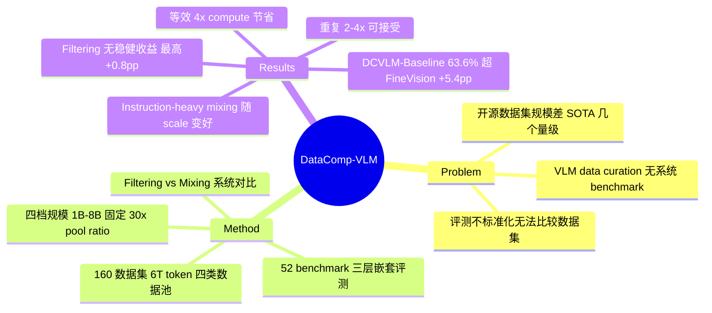

## Summary

DataComp-VLM（DCVLM）把 DataComp/DCLM 的"固定训练配方、比拼数据 curation"范式搬到自回归 VLM 训练：汇集 160 个公开数据集、6T 多模态 token 的数据池，在 1B-8B 四档规模上系统比较 filtering 与 mixing 策略，核心结论是 **mixing 而非 filtering 才是主要杠杆**，产出的 DCVLM-Baseline 数据集在 33 任务 Core 套件上达 63.6%，超 FineVision +5.4pp。

## Problem & Motivation

- 对比式模型（CLIP 系）有 DataComp、LLM 有 DCLM，但**自回归 VLM 的 data curation 一直没有系统 benchmark**——前沿 VLM 的数据配方"poorly understood and largely irreproducible"。
- 现有开源 VLM 数据集多在 million 级样本，与 SOTA 模型 trillion 级 token 的用量差几个数量级；且 VLM 评测不标准化，不同论文之间无法公平比较数据集好坏。
- VLM 数据与 raw web crawl 本质不同：混合了 image-caption、interleaved 多模态文档、纯文本、instruction-tuning 四类异构来源，curation 的设计空间（数据类型 × 模型规模 × 训练预算）太大，需要基础设施来系统探索。

## Method

**数据池**：160 个公开数据集，共 6T token（InternVL-2.5 tokenizer 计），四大类：
1. Image-caption pairs（DataComp-1B、ReLAION-2B、ShareGPT-4o、Pixmo-Cap）
2. Multimodal interleaved documents（MINT-1T、WanJuan、OmniCorpus）
3. Text-only（FLAN、SlimOrca、Numina-Math-1.5）
4. Multimodal instruction-tuning（knowledge/charts/QA/grounding/math/OCR 等 8 个能力类）

覆盖 20+ 语言，用 SSCD embedding（cos>0.75）+ MinHash（Jaccard>0.55）对评测集去污染。

**训练框架**：四档规模，固定 30× pool-to-training-token 比例——Small（1B 模型 / 6.25B token / 80 H100h）→ X-Large（8B / 200B token / 20480 H100h）。架构固定为 InternViT-300M + MLP projector + Qwen2.5-Base，AnyRes tiling。聚焦 VLM "pretraining"（视觉/语言组件的首次多模态联训阶段），并用控制实验验证结论可迁移到 SFT 后。

**评测**：52 个 benchmark、9 个 domain，经稳定性（低 seed 方差）和单调性（small→medium 提升）筛选，分三层嵌套：Validation（13）/ Core（33）/ Extended（52）。

**测试的 curation 方法**：
- Filtering：CLIP-score（OpenAI CLIP / DFN / SigLIP-2）、文本质量分类器（DCLM fasttext、Nemotron）、UniFilter、perplexity 系（含 Conditional Mutual Information）
- Mixing：Caption-heavy（65% caption / 15% instruction）、Balanced（40/40）、Instruction-heavy（10% caption / 70% instruction），text-only 15% 与 multimodal docs 5% 固定

## Key Results

- **Filtering 几乎无效**：没有任何 quality filter 相对 no-filter baseline 产生稳健显著提升，最好的 SigLIP-2 全局过滤也只 +0.8pp。解释：现代 VLM 数据池已经过上游 curation，二次过滤边际收益递减（对 25% pre-filtered 数据过滤还有 +2.4pp，到 100% pre-filtered 只剩 +0.6pp）。
- **Mixing 是主杠杆，且 instruction-heavy 随 scale 变好**：1B/6.25B token 时 instruction-heavy 最差，2B/25B 时第二，4B 时最优——caption-heavy 与 instruction-heavy 的差距随模型和预算增大而扩大。
- **重复容忍度**（Table 2）：instruction-heavy 混合重复 2×（50.2%）仍打平 caption-heavy 的 unique 数据（50.3%），4×（49.8%）仍超 base mix（48.8%），8× 才明显退化——好配比的收益盖过适度重复的代价（每翻倍约 -0.5~1.0%）。
- **Pretraining 指标可预测最终性能**：pretraining→post-SFT 排序 Pearson r=0.99（54 组 fine-tuning run）；换 Qwen2.5-Instruct backbone 后 mixture 排序 r=0.97。
- **DCVLM-Baseline vs FineVision**（Core 33 任务）：Small +0.3pp（36.5%）、Medium +1.1pp（51.7%）、Large +4.7pp（58.9%）、X-Large +5.4pp（63.6%）；4B/100B token 的 DCVLM 模型超过 8B/200B token 的 FineVision 模型，等效 **4× compute 节省**。也全面超过 LLaVA-OneVision-1.5 与 Nemotron-VL-2。闭源数据参照 InternVL-3-8B 为 68.5%，仍有 ~5pp 差距。

## Strengths & Weaknesses

**Strengths**：
- 填补了 VLM data curation 系统 benchmark 的空白，DataComp→DCLM→DCVLM 的方法论一脉相承，团队（Schmidt、Jitsev、LAION 系）就是原班人马，可信度高。
- "filtering 无效、mixing 为王"是有反直觉价值的结论，且给出了机制解释（pool 已 pre-filtered）——这直接挑战了社区从 DataComp/DCLM 继承的 "filter harder" 惯性。
- 30× 固定 pool ratio、稳定性/单调性筛选 benchmark、三层嵌套评测、r=0.99 的 SFT 迁移验证，实验设计的严谨度显著高于一般数据集论文。
- 重复容忍实验有直接的实用价值：instruction 数据不够时重复 2-4× 是可接受的。

**Weaknesses**：
- "filtering 无效"的结论边界很窄：只对**已经 curated 过的公开数据池**成立，作者自己承认从 raw crawl curation 仍是 open problem——标题级结论容易被过度泛化。
- 架构单一（InternViT + Qwen2.5），vision encoder 从未更换；backbone 泛化只用 Qwen2.5-Instruct 验证过，跨模型家族的稳健性存疑。
- Instruction-heavy 配比（70%）依赖有限的 instruction 数据集，即便中等预算也需要大量重复——这个"最优配比"可能是数据可得性的产物而非本质规律。
- 最大规模 8B/200B token 距 InternVL-3 等前沿仍有差距，scale 外推性未知。

**影响推测**：大概率成为 VLM 数据研究的标准试验台（类比 DCLM 之于 LLM 数据）；"mixing over filtering" 可能重新分配社区在数据侧的研究注意力。

## Mind Map

## Notes

- 与 DataComp（CLIP）、DCLM（LLM）构成同一方法论家族的第三块拼图；FineVision 是最直接的竞品数据集。
- "pre-filtered pool 上二次过滤无效"这一点对 daily 阅读中大量 "更好的 VLM data filter" 论文是一个重要的先验校准。
