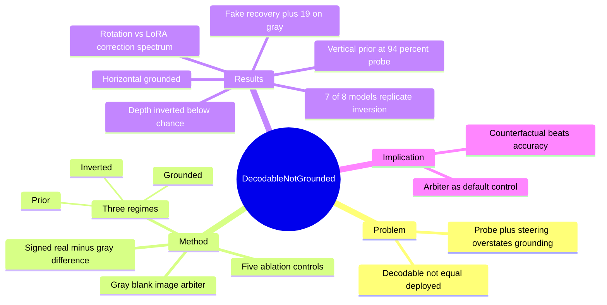

## Summary
这篇论文证明 "linear probe + steering recovery" 这套标准 latent-knowledge 读取流程会系统性高估 VLM 真正 ground 在图像上的能力：作者用一个一行代码的因果对照——把图像换成灰色空白（vision-ablation arbiter）——把 probing 混为一谈的三种 grounding regime 分开：grounded（视觉依赖且正确）、prior（视觉无关的方向性默认）、inverted（可解码、可因果控制，但部署时符号反了，低于 chance）。在 6 个 LM family、2B–27B 的 14 个 VLM 上，camera-relative 空间推理呈现一致分层：horizontal grounded、vertical 是 prior、depth inverted。

## Problem & Motivation
VLM 可解释性研究的标准证据链是：linear probe 能解码某能力（如空间关系）→ training-free steering/projection 能"解锁"行为 → 结论是模型有 latent knowledge 只是没部署。作者展示这条证据链存在系统性盲区：probe accuracy 只说明信息在激活中线性可读，不说明行为是否依赖视觉。最刺眼的巧合是：**最可解码的轴、最干净的 training-free recovery、和唯一不用视觉的轴可以是同一个轴**——vertical 轴 probe 达 94%，projection 把行为从 59% 提到 79%，完美符合"解锁 latent knowledge"的 signature，但灰图对照揭示灰图下同样提升 +19 点：这是 prior amplification，不是视觉恢复。

## Method
**Vision-ablation arbiter**：把输入图像换成灰色空白，测 signed behavioral difference（real accuracy − gray accuracy），单次 forward 即可判定 regime：

- **Grounded-correct**：real ≫ gray，gray 塌向 chance——行为真正依赖视觉。
- **Prior**：real ≈ gray——行为与视觉无关，是方向性默认（directional default）。
- **Inverted**：real 低于 chance 而 gray 回到 chance 附近——模型在读视觉信息，但符号用反了；错误"需要看"才会发生（the error requires looking）。

为排除 input-degeneracy artifact，用五种 ablation（gray、black、noise、patch-scramble、real-but-mismatched）交叉验证。probing 用 five-fold CV logistic on PCA-50 features；correction 侧构建了 nine-method battery（training-free rotation → trained low-rank edit）来测量"纠正 inverted 轴需要多复杂的干预"。

## Key Results
- **三 regime 分层跨模型稳定**（14 models, 6 families, 2B–27B, ViewSpatial-Bench camera-relative direction）：horizontal grounded、vertical prior、depth inverted；depth inversion 在 family 内随 scale 涌现。
- **Probe-behavior 解离**：vertical probe 94% 但行为近 chance（58.5% binary）；depth probe 77% 但行为低于 chance（30.7% binary）——decodable ≠ deployed。
- **伪 recovery 证据**：vertical 的 training-free projection +21 点（59%→79%），但灰图下同样 +19 点——steering "recovery" 是 prior 放大。
- **Decode-deploy inversion 复现**：8 个 inverted-capable model 中 7 个（跨 5 families）在 depth 轴上 decodability 上升而 deployed behavior 下降。
- **Correction-complexity spectrum**：几何最干净的 Qwen3-VL-8B 上，training-free π-rotation +49 点，与 trained LoRA（+55）相当；几何 distributed 的 Qwen2.5-VL-7B 只有 trained low-rank edit 有效（+43）——inversion 的"修复成本"是 per-model 几何属性。
- **任务边界**：同一批 depth-inverted 模型在 What'sUp 和 3DSRBench 的 near-field/metric depth 上仍 grounded-correct——inversion 是 camera-egocentric 任务型边界，不是全局 depth 失败。

## Strengths & Weaknesses
**亮点**：方法极简但切中要害——一张灰图作为因果对照，成本一次 forward，就能推翻 probe+steering 双重验证过的结论。这是 "simple, scalable, generalizable" 的典范：不需要新模型、新数据、新训练，只需要一个 counterfactual control。它对整个 latent-knowledge/steering 文献提出了可执行的默认要求：任何 "unlocked latent capability" claim 应过 blank-image arbiter。

**亮点**：inverted regime 是真正的新发现。prior（视觉无关默认）此前有零星报告，但 "decodable、causally controllable、deployed with wrong sign、低于 chance" 的系统性倒置——且随 scale 涌现——是 probing 和 steering 都结构性看不见的失败模式。"错误需要看才会发生"这个表述很精确：blind 模型反而更准。

**局限**：因果证据停留在 representation level。作者承认 camera-relative depth 缺少干净的 pixel-level minimal pair（镜像会引入 frame ambiguity），所以 "模型读了视觉但符号反了" 的机制解释依赖 probe 几何而非像素干预。anchor model 主要单 seed，γ 超参在评估集上选——严格性上有折扣。

**局限**：范围是 spatial reasoning 三轴二分类。三 regime 分类法是否适用于更复杂的视觉能力（多物体关系、GUI element grounding）待验证——但方法本身域无关，迁移成本低。

## Mind Map

## Notes
- **对 [[Ideas/EvidenceDependence-GUIGrounding]] 的直接支撑与升级**：该 idea 的 Action Collapse Rate 本质就是本文 arbiter 的 GUI 版（ablate 视觉证据 → 看 action 是否塌缩）。本文提供了两个可借用的升级：(1) 三 regime 分类法比 binary "依赖/不依赖" 更有信息量——GUI grounding 也可能存在 "inverted"（读了截图但把位置系统性用反，如坐标轴翻转、分辨率缩放错位）；(2) 五种 ablation 交叉验证（gray/black/noise/scramble/mismatched screenshot）排除 degeneracy artifact 的 protocol 可以直接搬。
- **memory pattern 第三数据点**：这是 "表观能力由 spurious shortcut 驱动、需 counterfactual/intervention 诊断" pattern（VisionSpeaksSound 的 Thud、[[Papers/2606-VisualFLIP]]）的第三个独立数据点，且首次把矛头指向可解释性方法本身（probe+steering）而不只是 benchmark accuracy。该 pattern 下次 memory-distill 可考虑升 insight。
- **与 [[Papers/2604-CoTDegradesSpatial]] 的潜在联系**：如果 vertical 是 prior、depth 是 inverted，那么 CoT 在 spatial 任务上的退化可能部分源于 CoT 放大 language prior（prior regime 恶化）——可对照两文的轴级结果。
- **对 GUI Grounding Robustness 方向的方法论启发**：跨分辨率 grounding 评估也应加 arbiter 对照——如果模型在低分辨率下 accuracy 降低但灰图 accuracy 不变，说明是视觉证据丢失；如果两者同降，说明模型本来就在依赖 layout prior。这能把 "分辨率鲁棒性" 分解成 evidence loss vs prior reliance 两个可分离的失败模式。
- 未提供 code repository；实验用公开模型 + 公开 benchmark（ViewSpatial-Bench、What'sUp、3DSRBench），协议在正文与附录中完整描述。
