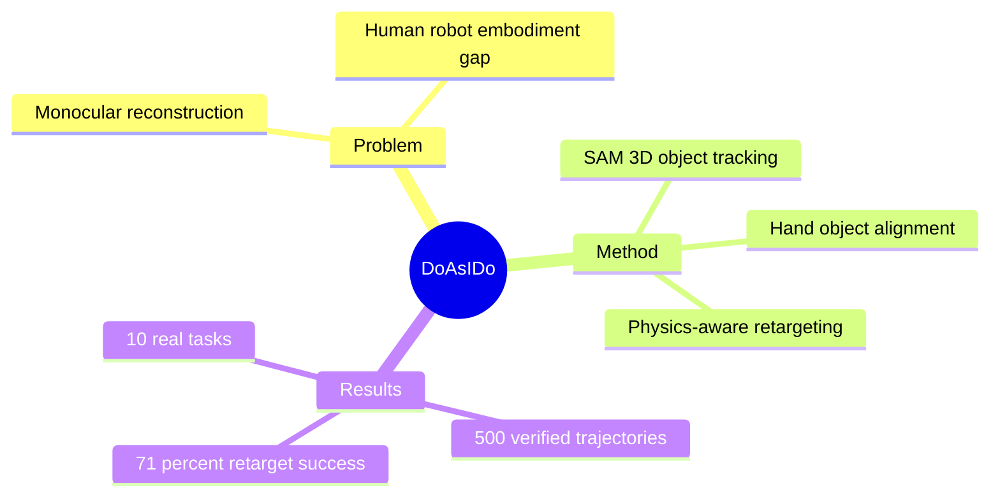

## Summary
Do as I Do 从普通 monocular RGB human video 中重建 4D hand-object interaction，再用 physics-aware sampling optimization retarget 到 dexterous robot hand，产出无需专用 capture hardware 的 robot-complete trajectories。

## Problem & Motivation
人类视频数量巨大，但要把它变成 dexterous manipulation data，必须同时解决单目 RGB 下的 hand/object reconstruction 与 human-to-robot embodiment gap。现有 object tracker 在 occlusion、motion blur 与低分辨率下容易 drift；传统 kinematic retargeting 又只匹配姿态，不显式考虑 contact force、penetration、finger sliding 和 grasp stability。更困难的是，internet video 的 reference 本身带尺度、深度和时间不连续噪声，不能假设存在 MoCap 级 ground truth。论文目标不是只学一个视觉 prior，而是输出能经过 simulation 和 IK 后在真实 robot 上执行的完整轨迹。

## Method
Reconstruction 阶段用 HawoR 跟踪 human hand；通过 SAM 3 做 hand/object segmentation、MoGe 估计 depth 与 camera intrinsics、SAM 3D 生成 object mesh，并对 diffusion pose samples 做 point-guided adaptive sampling、clustering / mask-IoU consensus，以在遮挡后重新锁定物体。随后以 human hand 的 near-metric scale 为基准，通过 centroid 与 least-squares 对齐独立重建的 hand/object translation，再用 GeoCalib 对齐 gravity。

Retargeting 阶段不是直接做几何 imitation，而是在 physics simulator 中运行 MPPI-style sampling-based optimization，kernel 随 iteration 与 horizon anneal。为适应 noisy reference，方法在正式 horizon 前加入 warmup 寻找稳定初始 grasp，对候选轨迹施加 perturbation 以避免局部模式，并用 transition reward 强化 pick/place 等关键接触事件。最终轨迹映射到 dual UR3e arms 与 22-DoF Sharpa Wave hands，经 inverse kinematics 后以 50 Hz 执行。

## Key Results
在 DexYCB 上，object reconstruction 的 F-5/F-10/Chamfer Distance 为 0.71/0.93/0.66；在 HOI4D 为 0.72/0.91/0.49，与 FoundationPose 等 baseline 相比达到或并列最佳。150 段 in-the-wild video 的人工比较中，评审有 67% 情况更偏好本文 tracking。Retargeting 在 655 条 reconstructed references 上从 annealed-sampling baseline 的 25% success 提升到 71%；在 1,352 条 OakInk2 clean bimanual trajectories 上从 72% 提升到 81%，其中 warmup 是主要增益来源。

完整 pipeline 生成 500 条 human-verified dexterous trajectories，来源为 internet 53%、egocentric 31%、generated 16%，覆盖 20 类 action；论文把其中 10 类任务部署到双臂真实系统。数据筛选实验也显示，从大量 online clips 中即使按最好估计也只有约 5% 直接适合 dexterous learning，说明 scale 前仍需强 filtering，而非把任意 human video 当作可执行示范。

## Strengths & Weaknesses
**Strengths.** 工作把 perception、retargeting 与 real deployment 串成端到端 data pipeline，并分别在有 ground truth 的 reconstruction benchmark、in-the-wild preference、simulation retargeting 和真实机器人上给出证据。对 noisy reference 的 warmup / perturbation / transition reward 很实用，且 20 类动作比单一 grasp 数据更接近日常 dexterity。

**Weaknesses.** 方法假设 object rigid 且 monocular metric depth 足够准确；单目 hand-object distance 无法可靠区分真实 contact 与视觉 occlusion。系统只重建 hand 与单一 object，不理解 obstacle、articulation 或完整 scene constraint，部署前还需手工对齐初始 pose/yaw。真实展示只有 10 类代表任务，500 条轨迹也经过 human verification，尚未证明能无人工筛选地直接训练可泛化 policy；physics simulation 的 model error 还会给 sim-to-real quality 设上限。

## Mind Map

## Notes
这篇论文的关键资产是“可执行轨迹生成器”，而不是直接声称 human video 已解决 policy learning。后续研究应把 trajectory verification cost、失败样本比例和用这些数据训练 policy 后的 downstream return 一并报告，否则容易把 data conversion quality 与 policy scalability 混为一谈。
