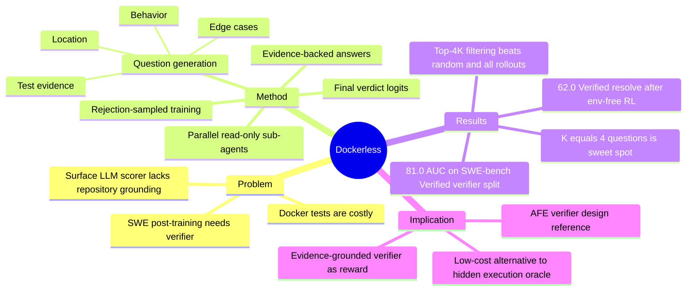

## Summary
Dockerless 提出一个不运行 unit tests、不构建 per-repository Docker 环境的 agentic patch verifier：它先生成验证问题，再派 read-only sub-agents 到代码库里找证据，最后基于 issue、reference patch、candidate patch 和证据给出 correctness score。核心价值不是取代测试本身，而是证明“repository-grounded evidence”可以作为 SFT 过滤和 RL reward 的低成本替代信号。

## Problem & Motivation
SWE agent 的 post-training 依赖 verifier：SFT 需要筛掉坏 trajectory，RL 需要 reward。当前最可靠的 verifier 是在 per-repository Docker 环境中跑 held-out tests，但这带来很重的环境成本：构建镜像、装依赖、找测试、写 runner、解析结果，而且很多 private / enterprise / legacy repo 本来就没有可复现环境或完整 test suite。

已有 execution-free verifier 多数只看 issue、reference patch 和 candidate patch 的表面相似度，或者用 LLM 直接打分；它们没有真正 inspect repository，因此很难判断一个形态不同但功能等价的 patch 是否正确。Dockerless 的问题定义更尖锐：如果不能跑测试，verifier 是否仍能通过读代码、找调用链、检查边界条件来形成可靠的 correctness evidence？

这对当前 notebook 的 Agent-Facing Environment Runtime 很相关：它把 verifier 从“隐藏 oracle test execution”移向“可审计 evidence object + agentic exploration”。对 GUI/CUA 任务来说，类似思想可以迁移为：不直接暴露 hidden success label，而是让 verifier 子代理读取可见状态、日志、DOM/UIA、操作反馈和任务约束，生成可检查的中间证据。

## Method
Dockerless 的输入是 issue `x`、reference patch `y_ref` 和 candidate patch `y`，输出一个 correctness score `r_phi(x, y)`。

流程分两阶段：

1. **Question generation and exploration**：模型先从 issue 与 reference patch 生成 2-4 个 verification questions，问题类别包括 location、behavior、test evidence、edge case。每个问题交给一个 read-only sub-agent，通过 `find`、`grep`、`rg` 等 shell 工具探索代码库，返回 evidence-backed answer，包含文件路径和代码范围。
2. **Judgment**：最终 judge 读取 issue、reference patch、candidate patch 和所有 `(Q_k, A_k)` 证据，输出二元 verdict token；系统用 token logits softmax 得到连续 correctness score。

训练方式是 rejection sampling。作者从 SWE-Gym 和 Multi-SWE-RL 中取 3.7K 个 execution-labeled issues，teacher model 生成 question-answer-judge trajectory；只有最终 verdict 与真实 test outcome 一致的轨迹被保留，用 standard next-token cross-entropy 训练单一 backbone。这个 backbone 同时承担 question generation、sub-agent exploration 和 final judgment。

Dockerless 随后被接进完整 post-training pipeline：

- **Environment-free RFT**：在 minimal Linux image 中收集 16K env-free rollouts，用 Dockerless 给每个 final patch 打分，取 top 4K 做 SFT。
- **Environment-free RL**：从 SFT model 出发，用 Dockerless 平均多次评估的 dense score 作为 GRPO reward；rollout 和 reward 计算都不需要 per-repository Docker。

## Key Results
- Verifier benchmark：在 776 个 balanced trajectory-level samples 上，Dockerless 在 SWE-bench Verified split 达到 81.0 AUC，在 Multi-SWE-bench Flash split 达到 72.1 AUC；相比最强 open-source verifier 分别高 14.3 和 9.2 AUC points，相比最强 frontier LLM judge 也分别高 5.1 和 8.2 points。
- End-to-end post-training：Dockerless-RL-9B 在 env-based evaluation 下达到 SWE-bench Verified 62.0%、Multilingual 50.0%、Pro 35.2%，比 Qwen3.5-9B baseline 高 2.4、8.7、2.9 points。
- 与 env-based pipeline 比较：Dockerless-SFT-9B 与 Env-SFT-9B 基本持平（Verified 60.6 vs 60.0，Multilingual 47.7 vs 48.3，Pro 35.3 vs 33.9）；Dockerless-RL-9B 接近 Test-Execution RL（62.0 vs 62.4，50.0 vs 51.3，35.2 vs 35.7）。
- SFT filter ablation：直接训练全部 16K env-free rollouts 不提升模型；Random 4K 也弱。Dockerless top 4K 在三个 benchmark 上显著高于 Random 4K，说明 verifier 不是装饰性模块，而是真正在筛选有用 trajectory。
- Verification questions ablation：K=0 时 AUC 78.3，K=4 时到 81.0；更多问题反而波动，K=6 为 79.6、K=8 为 80.3。结论是 evidence questions 有用，但问题过多会引入冗余或噪声。
- Latency：Dockerless reward evaluation 平均增加约 180s，占 per-rollout wall-clock 7.2%；作者认为 rollout 本身才是 RL step 的主瓶颈。

## Strengths & Weaknesses
**亮点**：问题切得很准。Dockerless 没有把 execution-free verifier 简化成 “LLM 看两个 diff 猜对错”，而是显式要求 verifier 去代码库里找证据。这个 design 很符合真实 code review：正确 patch 未必像 reference patch，但必须在 location、behavior、test evidence、edge cases 上能被代码证据支持。

**亮点**：它把 verifier 做成可复用 reward source，而不是只做离线 evaluator。SFT filtering 和 RL reward 都用同一个 evidence-grounded score，这让 post-training pipeline 从环境工程问题转成 verifier 质量问题。对 AFE 来说，这支持一个更 general 的假设：执行期 verifier 不一定要是 hidden oracle，也可以是一个受限的 read-only evidence agent。

**局限**：reference patch 是强先验。Dockerless 的 question generation 依赖 golden patch 来提出验证问题；真实 deployment 或 GUI/CUA agent 任务里通常没有 reference solution。它更适合 post-training 数据过滤、benchmark reward construction、或有示范/规格的任务，不等于在线 agent 每一步都能无监督验证。

**局限**：ground truth 仍来自 execution tests。训练和 benchmark label 都是 test-execution outcome，因此 Dockerless 学到的是近似 test verifier，而不是摆脱测试定义的 correctness。它降低了推理/训练时环境成本，但没有消除最初构造 execution-labeled data 的成本。

**局限**：SWE patch verification 与 GUI task completion 的迁移需要谨慎。代码库有稳定文本文件、可 grep 的调用链和 reference patch；GUI 环境的 evidence 更噪、更短暂，UI state 也会变。若迁移到 AFE，需要把 “FILE/RANGE evidence” 换成 “visible-state/action-feedback/verifier-trace evidence”，并明确 stale state、partial completion、hidden side effect 的处理规则。

## Mind Map

## Notes
- 和 [[Papers/2606-LUMOS]] 的关系：LUMOS 讨论 UI semantic state 如何暴露；Dockerless 讨论 verifier 如何以 read-only evidence agent 形式工作。AFE 可以把两者合并：semantic blueprint 作为 evidence substrate，verifier agent 只读地生成 task-progress evidence。
- 和 [[Papers/2606-AgenticAbstention]] 的关系：Dockerless 判断 “patch 是否正确”，Agentic Abstention 判断 “是否应继续行动”。二者都指向 execution-time decision 的 evidence contract，而不是单纯 prompt instruction。
- 对 AFE-MiniSuite 的启发：设计 verifier 时不要直接给 success label；可以让 verifier 子代理回答 2-4 个固定类别问题，如 “目标状态是否可见”“当前 action 是否改变了相关 state”“是否存在未满足 prerequisite”“是否有 irreversible side effect risk”，再由 judge 聚合。
- 代码结论：论文没有在正文 frontmatter 区域给出项目页或 GitHub 链接；本轮没有把代码可用性作为已确认事实写入。
