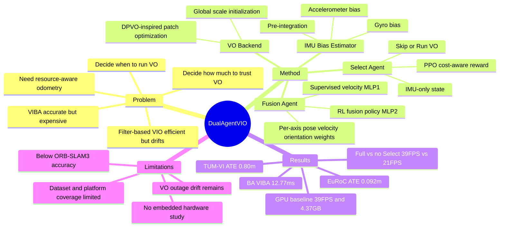

## Summary

这篇论文把 Visual-Inertial Odometry 中“何时运行 VO frontend”和“如何融合 VO/IMU 状态”两个工程决策显式建模为 sequential decision problems，用一个 IMU-only Select Agent 和一个 RL-based Fusion Agent 降低 VIBA 依赖。实验显示它在 EuRoC MAV / TUM-VI 上没有超过 ORB-SLAM3 这类经典优化式 VIO 的精度上限，但在 GPU-based VO/VIO 对比中取得更好的 ATE / FPS / VRAM trade-off。

## Problem & Motivation

VIO 的核心矛盾是精度和计算成本：filter-based methods 高效但容易受 linearization errors 和 noise accumulation 影响，optimization-based methods 通过 non-linear Visual-Inertial Bundle Adjustment (VIBA) 提升精度，但后端优化对资源受限平台不友好。作者没有试图完全移除 VIBA，而是降低它被调用的频率和权重。

论文聚焦两个决策：第一，是否需要在当前帧运行完整 VO pipeline；第二，在有 VO observation 时，应该多大程度相信视觉结果而不是 IMU propagation。传统 keyframe / gating 往往在视觉特征已经提取后才做选择，计算成本已经沉没；本文的 Select Agent 只看 high-frequency IMU signal，试图在视觉计算前做 pre-emptive gating。

这对 embodied navigation / mobile robotics 的意义在于：odometry 不只是追求最低 ATE，也要满足 edge device 上的 latency、memory、power budget。对 GUI-agent / VLM 方向的直接相关性较弱，但它提供了一个把 perception pipeline 的资源调度问题写成 RL policy 的具体案例。

## Method

**Overall pipeline.** 系统由四个模块组成：IMU Preprocess、Select Agent、Visual Odometry、Fusion Agent。IMU Preprocess 先用 Bias Encoder 估计 gyro / accelerometer bias，再做 standard IMU pre-integration，输出 inter-frame 的 `Δp / Δq / Δv / Δt`；这些状态先交给 Select Agent 决定是否运行 VO，再交给 Fusion Agent 生成最终 fused pose。

**IMU Bias Estimator.** 作者训练两个 lightweight encoder networks：一个估计 gyro bias，一个估计 accelerometer bias。训练分阶段进行：先训练 gyro bias，使积分后的 orientation 接近 ground truth；再冻结 gyro estimator，训练 accelerometer bias，使积分后的 velocity 接近 ground truth。论文强调它估计的是 slowly-varying bias，而不是直接 denoise raw IMU signal。

**Select Agent.** VO scheduling 被定义为 MDP。状态是 IMU-only compact state `s_t = {Δp_t, Δq_t, Δv_t, Δt_t^vo}`，动作是二分类：`Skip VO` 或 `Run VO`。episode-level reward 是 `A / (ATE + ε) - B * N_f`，其中 `N_f` 是 VO calls 数量；训练用 PPO，并加入 per-step pose error shaping 来稳定 rollout。这个 agent 的关键约束是：它必须在任何 visual feature extraction 之前做决定，因此跳过时可以省掉整个 VO pipeline。

**VO module.** VO backend heavily inspired by DPVO：CNN feature encoder 提取 dense feature maps，correction predictor 对 patch re-projection 做 recurrent update，最后通过 differentiable bundle adjustment 估计 pose / depth update。由于 monocular VO 有 scale ambiguity，系统在 startup 阶段借鉴 VINS-Mono 的 linear initialization，用 IMU pre-integration 和 VO relative translations 解出 single global metric scale。

**Fusion Agent.** Fusion Agent 是 composite design：MLP1 先以 supervised learning 从 scaled VO poses 和 IMU pre-integration 估计 metric velocity；state propagation 用上一帧 fused state 和 IMU 做确定性传播；MLP2 是 RL policy，输出 position、velocity、orientation 的 per-axis fusion weights。融合形式是 convex blend：VO weight 为 `w`，IMU weight 为 `1 - w`，orientation 用 slerp；reward 包含 trajectory error 和 fused-state uncertainty proxy `Tr(Σ)` penalty。

**Training / evaluation setup.** Visual net 先在 TartanAir 预训练；IMU Bias Estimator 和两个 RL agents 分别在 EuRoC 的 MH 01、TUM-VI 的 Corridor 4 上 fine-tune，再在其余 sequences 上评估。PPO hyperparameters 在 supplementary 中给出：Select Agent 和 Fusion Agent 都训练 1M environment steps，discount factor `γ=0.99`，GAE `λ=0.95`，clip ratio `0.2`。

## Key Results

**EuRoC MAV, classical CPU-based monocular VIO.** 在 SE(3)-aligned RMSE ATE 上，Ours 平均 **0.092 m**，明显好于 MSCKF **0.413 m**、OKVIS **0.221 m**、ROVIO **0.225 m**、VINS-Mono **0.187 m**，接近 VI-DSO **0.091 m**，但弱于 DM-VIO **0.069 m** 和 ORB-SLAM3 **0.041 m**。论文还报告 initial scale estimation 的平均 Scale Error 为 **1.11%**。

**TUM-VI, classical CPU-based monocular VIO.** 按 scene type 平均，Ours 的 overall ATE 是 **0.80 m**，优于 VINS **0.94 m** 和 OKVIS **1.22 m**，略弱于 DM-VIO **0.77 m**。按场景看，Ours 在 Corridor 是 **0.38 m**，Magistrale 是 **1.96 m**，Room 是 **0.10 m**，Slide 是 **0.74 m**。

**EuRoC MAV, GPU-based VO/VIO trade-off.** 与 DPVO / iSLAM / DROID 的统一硬件对比中，Ours 达到 **0.092 m ATE / 39 FPS / 4.37 GB VRAM**；DPVO 是 **0.106 m / 22 FPS / 4.92 GB**，iSLAM 是 **0.529 m / 31 FPS / 6.47 GB**，DROID 是 **0.188 m / 14 FPS / 8.63 GB**。论文据此称 Ours 相比 DPVO 运行 **1.77×** faster，并在这组 GPU baselines 中取得最好的 average ATE、throughput 和 VRAM。

**CPU-side backend cost on EuRoC.** 每 keyframe breakdown 显示，Ours 的 BA/VIBA CPU time 是 **12.77 ms**，总时间 **54.75 ms**，BA 占比 **23%**；ORB-SLAM3 是 **121.09 ms / 214.72 ms / 56%**，DM-VIO 是 **26.49 ms / 64.01 ms / 41%**。Conclusion 中将这概括为相比 ORB-SLAM3 平均 backend cost 约 **9.5×** reduction。

**Ablation: components.** Cumulative ablation 显示 full system 在 EuRoC / TUM-VI / FPS 上是 **0.092 / 0.80 / 39**；去掉 Bias Encoder 后变为 **0.279 / 1.13 / 40**，说明 bias correction 对精度是核心；去掉 Fusion Agent 后变为 **0.133 / 0.94 / 39**；去掉 Select Agent 后精度略好 **0.087 / 0.76**，但 FPS 从 **39** 降到 **21**，说明 Select Agent 的主要收益是计算节省而非纯精度提升。

**Ablation: fusion policy.** 在 EuRoC MH 04 上，Heuristic Fusion ATE 为 **0.143 m**，EKF Fusion 为 **0.127 m**，Ours RL Agent 为 **0.112 m**。同一个 Fusion Agent 接到 DROID-VO frontend 时，ATE 从 DROID-VO baseline 的 **0.399 m** 降到 **0.237 m**，作者据此认为该 fusion policy 不完全依赖特定 VO architecture。

**Robustness.** 在 EuRoC MH 04 的轻度视觉退化测试中，DPVO 从 clean **0.137 m** 退化到 5% blur **0.174 m**、10% blur **0.192 m**；Ours 从 **0.112 m** 退化到 **0.138 m / 0.153 m**。在更强 stress test 中，Ours 从 nominal **0.092 m** 退化到 2s VO outage **1.114 m**、30% severe blur **0.472 m**、2× IMU noise **0.128 m**；DPVO 在 VO outage 和 severe blur 下分别为 **1.928 m** 和 **1.122 m**。

## Strengths & Weaknesses

**已知 Strengths.** 论文的问题 formulation 比“再堆一个更重的 VIO backend”更有工程价值：它把 compute-aware perception scheduling 放到 policy 层处理，直接面对 real-time 和 resource constraints。Select Agent 的 IMU-only pre-emptive gating 是清晰的设计点，因为它在视觉计算之前做 skip decision，避免“先提特征再决定不用”的 sunk cost。

**已知 Strengths.** 实验没有只报 accuracy；它同时报告 EuRoC / TUM-VI ATE、FPS、VRAM、CPU-side BA/VIBA breakdown、component ablation、visual degradation stress tests 和 scale robustness。尤其是 `- Select Agent` ablation 很诚实：去掉 Select Agent 精度略升但 FPS 大幅下降，这说明作者没有把 compute-saving module 包装成无代价精度提升。

**已知 Weaknesses / failure cases.** 该方法在 classical VIO 精度上仍不如 ORB-SLAM3 和 DM-VIO：EuRoC 平均 ATE **0.092 m** vs ORB-SLAM3 **0.041 m**、DM-VIO **0.069 m**。在 severe VO outage 下也仍有明显 drift，2s blackout 时 ATE 到 **1.114 m**；作者在 supplementary 中明确说 residual drift in VO-denied areas 指向 long-range temporal context 和 VO re-initialization feedback 的未来工作。

**已知 Limitations.** 训练和评估集中在 EuRoC / TUM-VI，并使用 offline log-driven environments；作者明确承认尚未系统评估 cross-dataset transfer、不同平台、不同 camera/IMU noise profiles。一个只在 TUM-VI Corridor 4 fine-tune 后迁移到 EuRoC MH 04 的模型，ATE 从 **0.092 m** 升到 **0.173 m**，说明 domain gap 是真实问题。

**已知 Limitations.** 系统依赖 reasonably calibrated VO backend 和成功的 initial scale estimate；在 persistent VO degradation 或 severe miscalibration 下，当前 policy 不显式处理 hard re-initialization。scale robustness 表也显示 base system 在 ±20% initialization error 下 ATE 会升到 **0.661 / 0.682 m**，加 Online Scale Monitor 后仍为 **0.522 / 0.508 m**，并没有完全修复。

**已知 Limitations.** 所有主要实验在 desktop-class hardware 上完成：GPU-based methods 用 NVIDIA RTX 3090，CPU-based methods 用 dual Intel Xeon Platinum 8260。论文声称模块总大小 **32.1 MB**、小网络推理通常 **<1 ms**，但没有 embedded / low-power hardware 上的 latency、energy、memory footprint 系统测量。

**推测.** 这篇论文对 GUI-agent / VLM 的直接方法迁移有限，但对 embodied agents 的“perception as resource allocation”很有启发：agent 不一定只学 high-level action，也可以学在何时调用昂贵感知模块、何时信任 cheaper propagation。类似思想可迁移到移动机器人或 AR agent 的多模块调度，例如 VO / mapping / semantics 共享 edge budget。

**不知道.** 论文没有给出代码链接，也没有报告真实 onboard deployment 或 Jetson-class device 的结果。也不知道该 RL policy 在更长时间运行、动态物体密集场景、严重外参误差、rolling-shutter camera、或非 MAV / handheld motion pattern 下是否仍然稳定。

## Mind Map

## Notes

- 这篇更像 embodied perception / SLAM 系统论文，而不是 GUI-agent / VLM 论文；保留的原因是它把 RL 用在 resource-aware sensor scheduling 和 adaptive fusion 上，和 embodied agent 的实时感知预算有关。
- 最有用的抽象是“shift-left gating”：如果一个 decision 的目标是省计算，就必须发生在昂贵模块启动之前。
- 对后续 idea 的启发：可以考虑把类似 policy 用到 multi-perception-module agent 中，让 agent 在 VO、semantic mapping、object detection、language grounding 之间按 uncertainty 和 compute budget 调度，而不是每帧全量运行。
