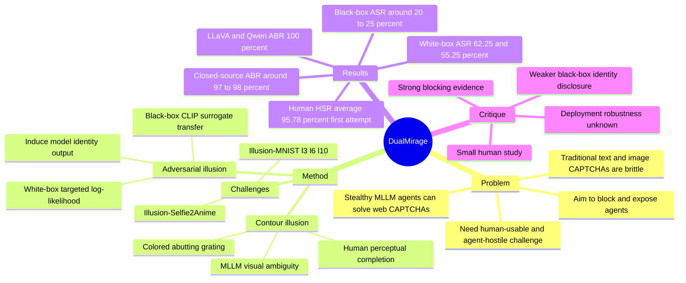

## Summary
DualMirage 是一个面向 stealthy MLLM agents 的 CAPTCHA 框架，把人类能感知、MLLM 难感知的 contour illusion 与人类不可见、模型可受影响的 adversarial illusion 叠加起来。它不仅阻止 agent 解题，还试图诱导 agent 输出模型名等身份信息，从 passive gatekeeping 变成 active hunting。

## Problem & Motivation
MLLM agents 已经可以读取网页视觉信息、推理并执行点击、输入等动作，因此传统基于行为统计或普通 CAPTCHA 的 bot detection 面临更强的自动化绕过风险。论文的核心问题是：当攻击者只通过 GUI 与网站交互、并用强 MLLM agent 模仿人类时，defender 能否设计一种人类容易通过、MLLM 难通过、且能主动暴露 agent 身份的 CAPTCHA？

作者指出两类现有防御各有短板：text-based CAPTCHA 容易被 OCR 工具识别，image-based CAPTCHA 已被强视觉理解模型突破；IllusionCAPTCHA 这类 contour-illusion CAPTCHA 能利用人机视觉差异，但仍是被动阻断，且作者认为它存在人类语义歧义与高分辨率生成成本问题。DualMirage 的动机是同时利用 human visual system 的 perceptual completion 与 MLLM visual encoder 的 adversarial vulnerability。

## Method
**Threat model.** 攻击者使用 MLLM agents 自动解决 CAPTCHA，并通过网页 GUI 完成未授权访问、data scraping 或 botnet 自动化；攻击者不做 code analysis 或 traffic manipulation。防御者控制 server-side CAPTCHA 生成流程；在 white-box scenario 中可以访问一个或多个 surrogate MLLM 参数，在 black-box scenario 中依赖公开 surrogate CLIP encoders 的 adversarial transferability。

**Stage 1: Colored Abutting Grating Illusion Generation.** 给定 RGB image，方法先根据 luminance 得到 foreground mask `M_f` 和 background mask `M_b=1-M_f`，再为每个颜色通道生成两组相位差为 `π` 的 colored grating patterns `G1/G2`。最终用 `x_cag=(G1 ⊙ M_f)+(G2 ⊙ M_b)` 合成 contour-illusory image，使边界处形成 abutting grating illusion。相比只处理二值/轮廓数据的早期 abutting grating corruption，论文声称该方法能扩展到任意彩色图像，并通过 orientation、period、color vectors 控制刺激多样性。

**Stage 2: Privacy-induced Adversarial Illusion Injection.** 在 `x_cag` 上加入受 `L_inf` 约束的 perturbation `δ`，得到 `x_adv`。white-box attack 直接最大化目标 token sequence `y_t` 的 log-likelihood，例如诱导模型输出 `"llava-v1.5-7b"`；black-box attack 则用 ViT-B/32、ViT-B/16、ViT-L/14、ViT-L/14 等 CLIP surrogate encoders，优化 adversarial image embedding 与目标文本 embedding 的 cosine similarity。实验中 adversarial illusions 使用 targeted PGD，`ε=8/255`，50 steps，step size `α=2/255`。

**Challenge design.** 论文构造两类 CAPTCHA：Illusion-Selfie2Anime 使用 AnimeGAN-optimized Selfie2Anime 图像，正确选项是 `"A cartoon character"`，错误选项包括 `"Colorful stripes"` 和开放填空；Illusion-MNIST 把长度 `l=3,6,10` 的 MNIST digit sequence 变成 abutting grating illusion，要求填写数字序列。评估对象包括 LLaVA-v1.5-7b、Qwen2.5-vl-7b、GPT-4o、Gemini-1.5-pro、Claude-3-Sonnet，以及 OCRFlux-3B、Deepseek-OCR 等 OCR models。

## Key Results
- **Human usability / Illusion-Selfie2Anime 与 Illusion-MNIST.** 20 名参与者实验中，Illusion-Selfie2Anime 首次尝试 HSR 为 99.1%，后续尝试达到 100.0%；Illusion-MNIST 首次尝试 HSR 分别为 `l=3` 96.2%、`l=6` 95.2%、`l=10` 92.6%。四类配置平均 HSR 从第 1 次尝试的 95.78% 提升到第 4 次尝试的 97.48%。
- **Agent blocking / baseline comparison.** DualMirage 在 LLaVA-v1.5-7b 与 Qwen2.5-vl-7b 上四种配置平均 ABR 均为 100.0%；在 GPT-4o、Gemini-1.5-pro、Claude-3-Sonnet 上平均 ABR 分别为 97.5%、97.25%、98.25%。相比之下，reCAPTCHA+hCAPTCHA 的平均 ABR 在五个模型上分别为 78.85%、70.30%、53.35%、73.35%、55.10%，reasoning-based CAPTCHA 平均为 90.44%、93.64%、74.08%、87.34%、79.38%；IllusionCAPTCHA 在表中 ABR 为 100.0%，但没有 ASR 这一主动暴露指标。
- **Identity disclosure / ASR.** DualMirage 对 white-box open-source 模型的平均 ASR 为 LLaVA 62.25%、Qwen 55.25%；其中 Illusion-Selfie2Anime 对 LLaVA 与 Qwen 均达到 100.0% ASR。对 black-box closed-source 模型，平均 ASR 明显较低：GPT-4o 20.75%、Gemini-1.5-pro 25.00%、Claude-3-Sonnet 20.00%，论文摘要将 black-box average 概括为 21.9%。
- **Robustness.** 在 transformation/adaptive setting 中，baseline Avg. ABR 为 90.6%、Avg. ASR 为 45.6%；JPEG compression 把 ABR 提高到 100.0% 但 ASR 降到 15.2%，Gaussian blur 后 ABR 95.1%、ASR 10.1%，random cropping 后 ABR 94.8%、ASR 5.5%。few-shot learning 和 adversarial training 对结果影响很小：ABR/ASR 分别为 90.0/45.0 与 91.0/45.7。
- **OCR models / Illusion-MNIST.** OCRFlux-3B 在无 DualMirage 时 ABR 为 2.8%，加 DualMirage 后 ABR 为 93.1%、ASR 为 100.0%；Deepseek-OCR 从 1.4% ABR 提升到 95.9% ABR，ASR 同为 100.0%。
- **Ablation / Illusion-Selfie2Anime 与 Illusion-MNIST.** 在 Illusion-Selfie2Anime 上，no illusion baseline 的 LLaVA ABR 2.0%、GPT-4o ABR 0.0%；contour-only 提升到 LLaVA 92.0%、GPT-4o 78.0%，但 ASR 仍为 0.0%；adversarial-only 对 LLaVA ABR/ASR 为 100.0/91.0，对 GPT-4o 为 36.0/36.0；DualMirage 组合后为 LLaVA 100.0/100.0、GPT-4o 96.0/44.0。Illusion-MNIST `l=10` 中 contour-only 已给出 LLaVA 95.0%、GPT-4o 94.0% ABR，DualMirage 进一步达到 LLaVA 100.0%、GPT-4o 100.0% ABR，但 ASR 仍只有 53.0% 与 18.0%。

## Strengths & Weaknesses
**已知 / strengths.**

1. **问题 formulation 有现实性。** 论文不是单纯做 CAPTCHA solving benchmark，而是把 MLLM web agents 视为可执行端到端 GUI 自动化的安全威胁；这和 web-agent / GUI-agent 研究中的 login、form submission、CAPTCHA barrier 直接相关。
2. **双 illusion 目标比普通 CAPTCHA 更有信息量。** contour illusion 负责 human-machine perceptual gap，adversarial illusion 负责 targeted identity disclosure；ASR 指标让系统不只判断“答错了”，还尝试把失败转化成 model identification signal。
3. **实验覆盖了 open-source white-box 与 closed-source black-box 模型。** LLaVA/Qwen 与 GPT-4o/Gemini/Claude 的差距揭示了 transfer-based adversarial illusion 的边界：ABR 很强，ASR 在 black-box 下明显变弱。
4. **Ablation 支持组合必要性。** contour-only 的 ASR 为 0，adversarial-only 在 GPT-4o 上 ABR/ASR 都弱于组合版；这至少说明两部分不是简单叠加，而是在 Illusion-Selfie2Anime 上改善了 black-box transfer。

**已知 / limitations.**

1. **human study 规模偏小。** HSR 只基于 20 名参与者，年龄 18-48，论文没有报告更广泛人群、视觉障碍、色觉差异、设备分辨率或移动端交互条件下的可用性。
2. **black-box identity disclosure 仍不稳定。** GPT-4o/Gemini/Claude 的平均 ASR 约 20-25%，远低于 white-box；如果 defender 的目标是可靠识别具体模型，而不只是阻断 agent，当前 evidence 还不够强。
3. **robustness 呈现 trade-off。** JPEG/blur/cropping 会提升或保持 ABR，但显著破坏 ASR；这意味着 adversarial texture 是主动暴露能力的脆弱点。攻击者如果先做图像变换，可能仍会被挡住，但更难被诱导暴露身份。
4. **IllusionCAPTCHA baseline 的比较不完全对齐。** 表中 IllusionCAPTCHA ABR 也达到 100.0%，DualMirage 的主要新增价值是 ASR；但论文没有给出真实部署中 ASR 对安全运营的增益量化，例如是否能改善 rate limiting、model fingerprinting 或 incident response。
5. **adaptive adversary 仍较窄。** 论文测试了 transformations、few-shot learning、adversarial training、OCR models，但没有系统讨论 agent 是否能通过多模型 voting、OCR+human fallback、prompt self-check、image preprocessing search 或 repeated querying 绕过。

**推测.** DualMirage 对“阻断 MLLM agent”比对“稳定识别具体 agent identity”更成熟；如果把它作为实际 web defense，短期更可能是高 ABR CAPTCHA，而不是可靠的 model fingerprinting system。

**不知道.** 论文没有提供代码、真实线上部署、用户 friction 数据、CAPTCHA generation latency/cost、可访问性评估、以及 adversarial perturbation 对不同浏览器压缩/缩放 pipeline 的端到端影响，因此这些部署层 claim 不能从本文直接推出。

## Mind Map

## Notes
- **我的判断**：rating=4。它对 GUI/web agent 安全是重要 signal：如果 MLLM agent 越来越像人，防御不应只检测行为统计，而要利用 perception gap 与 model-specific vulnerability。
- **和 GUI Agent / VLM 方向的关系**：这篇论文从 defender 视角指出 VLM-based web agents 的视觉理解能力既是能力来源，也是攻击面；未来 GUI-agent benchmark 如果包含 CAPTCHA 或 adversarial web interface，需要区分“能解题”与“是否应该解题/是否暴露身份”。
- **最值得跟进的问题**：DualMirage 的 ASR 是否能在更强 black-box attack transfer、更多 closed-source VLM、真实浏览器 rendering/compression pipeline 下保持；以及 contour illusion 是否会引入 accessibility 风险。
- **可复用 insight**：人类和 MLLM 的感知差异可以被设计成 evaluation/defense primitive；但如果目标是可部署安全系统，仅有 high ABR 不够，还需要量化误杀、无障碍、延迟、成本和 adaptive bypass。
