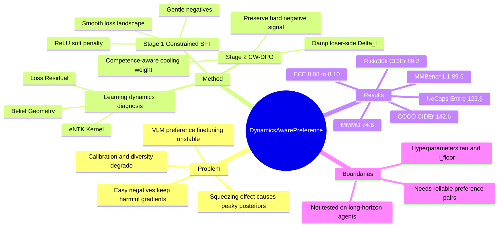

## Summary
这篇论文把 VLM preference finetuning 的不稳定性解释为 learning dynamics 中的 "squeezing effect"：easy negatives 虽然 loss 很低，却仍可能产生不成比例且方向不好的梯度，导致 posterior 过尖、calibration 变差。作者提出 CW-DPO：先用带 gentle negatives 的 constrained SFT 平滑轨迹，再在 DPO 阶段用 competence-aware cooling weight 抑制 easy negatives 的 loser-side 梯度。

## Problem & Motivation
论文关注的是 VLM 的 preference-based finetuning，尤其是 SFT / DPO / PPO 类 alignment 在多模态场景中的训练不稳定问题。作者认为静态或错配的 negative examples 会注入 uninformative gradients，使模型过度惩罚已经很容易拒绝的错误回答，从而损害 calibration、diversity 和生成质量。

核心问题不是“是否要用 preference pairs”，而是 preference optimization 把所有 negative pairs 近似同等处理时，没有考虑模型能力随训练动态变化。随着训练推进，大量 negatives 会变成 easy negatives；如果这些样本仍保留较大 loser-side gradient，就会把概率质量挤压到 dominant mode，形成论文称为 squeezing effect 的过置信闭环。

这个问题对 VLM 方向有直接意义：论文用 captioning、multimodal reasoning 和 calibration 指标显示，naive DPO 可能在偏好对齐时损害 lexical quality 或分布稳定性。对 GUI-agent / embodied-agent 来说，它不是直接任务论文，但其“动态抑制无信息负样本”的思路可能迁移到视觉动作偏好、GUI trajectory preference 或失败样本训练；这属于推测，论文没有在这些交互式任务上验证。

## Method
**诊断视角：learning-dynamics influence decomposition.** 作者用 average per-token log-probability 衡量模型对序列的 confidence，并用一阶 Taylor expansion 分析一次更新如何改变观察样本上的 log-likelihood。该分解包含 Belief Geometry、eNTK Kernel 和 Loss Residual 三部分；对 DPO 来说，作者把不稳定性定位到 negative/loser term 的 residual，当 loser 是 easy negative 时，DPO 的隐式权重 `beta(1-a)` 不一定足以压低残余梯度。

**Stage 1: Constrained SFT / Smooth SFT.** 标准 SFT 只最大化 positive response，容易形成 peaky distribution。CW-DPO 第一阶段在 positive NLL 之外加入 negative trajectory 的软约束：当 negative 的 expected NLL 低于阈值 `C` 时，用 ReLU penalty 轻量惩罚，目标是让 negative 不被过早压到近零概率。论文把这称为用 low-weight "gentle negatives" 平滑 loss landscape，为后续 preference optimization 提供更稳定的初始化。

**Stage 2: Cooling-Weighted DPO.** 第二阶段仍使用 winner/loser preference pairs，但只对 loser-side 的 log-probability difference `Delta_l` 乘以 cooling weight `w_c`。`w_c` 由 loser response 的 average per-token log-probability、easiness floor `l_floor` 和 temperature `tau` 决定：模型已经很确定拒绝的 easy negatives 得到接近 0 的权重；仍有不确定性的 hard negatives 保留接近 1 的学习信号。最终 loss 是 DPO-style objective `-log sigma(beta(Delta_w - w_c * Delta_l))`，核心是 asymmetrically dampening losers，而不是整体缩小 preference loss。

**实验设置。** 主实验 backbone 是 Qwen2.5-VL-72B；CW-DPO 使用两阶段训练，75% 数据做 Constrained SFT，25% 数据做 Preference Alignment。Stage 2 中，作者用 GPT-4o 为每个 winning caption 合成 minimally perturbed negative alternatives。比较对象包括 Qwen2.5-VL Base、SFT、vanilla DPO、PPO、V-DPO、GRPO、OPA-DPO；作者说明主结果取 5 次 independent runs 的平均值。

## Key Results
- **COCO Test / captioning**：CW-DPO 达到 B@4 39.6、METEOR 30.4、CIDEr 142.6、SPICE 25.8。CIDEr 比 PPO 的 139.2 高 3.4，比 OPA-DPO 的 138.5 高 4.1；BLEU-4 比 OPA-DPO 的 36.8 高 2.8。
- **Flickr30k Test**：CW-DPO 的 CIDEr / SPICE 为 89.2 / 18.6，高于 OPA-DPO 的 86.7 / 18.2，也高于 vanilla DPO 的 86.5 / 18.0。
- **NoCaps Val**：CW-DPO 在 In / Near / Out / Entire split 上分别为 125.6 / 121.3 / 123.7 / 123.6，均高于 OPA-DPO 的 122.6 / 119.4 / 121.8 / 121.3。
- **MMMU / MMBench1.1**：CW-DPO 达到 MMMU 74.6% 和 MMBench1.1 89.6%，高于 OPA-DPO 的 73.1% / 87.2%。注意：abstract 声称 MMMU 有 +2.4% absolute accuracy，但 Table 2 中相对最强 baseline OPA-DPO 是 +1.5；论文没有在正文中明确 +2.4 的比较对象。
- **Squeezing suppression / calibration**：Figure 4 中 vanilla DPO 的 TV / JS divergence 约为 0.45 / 0.30，而 CW-DPO 约为 0.15 / 0.10；vanilla DPO 使 ECE 从约 0.12 升到 0.25，CW-DPO 稳定在 0.08-0.10。Figure 4 还报告 COCO full test 上 CW-DPO 的 CIDEr / SPICE 为 142.6 / 25.8，高于 standard DPO 的 137.2 / 24.2。
- **Ablation / Table 3**：去掉 Smooth SFT 后，COCO CIDEr 从 142.6 降到 137.6，MMMU 从 74.6 降到 71.8，MMBench1.1 从 89.6 降到 86.3；去掉 Cooling Weight 后，CIDEr 为 141.5，但 MMMU / MMBench1.1 降到 73.6 / 88.3；去掉 Negative Filtering 后，CIDEr 降到 137.4，说明 adaptive cooling 和过滤 extremely easy negatives 对泛化与稳定性都有贡献。

## Strengths & Weaknesses
**已知：优势。** 论文的最有价值部分是把 VLM preference optimization 的失败模式具体化为 learning dynamics 问题，而不是只报告 DPO 变体涨点。Stage 1 的 smoothing 和 Stage 2 的 loser-side cooling 都比较简单，且 ablation 显示两个阶段都有独立贡献。主实验覆盖 COCO、Flickr30k、NoCaps、MMMU、MMBench1.1，既有 captioning 又有 multimodal reasoning；作者还补充了 entropy、TV/JS divergence、ECE 等过程指标，不只看最终 accuracy。

**已知：baseline 与消融。** 和 SFT、DPO、PPO、V-DPO、GRPO、OPA-DPO 相比，CW-DPO 在 Table 2 的所有列都最高。Ablation 不是只删一个小模块：它分别检验了 w/o Smooth SFT、w/o Negative Sampling、w/o Soft Penalty、w/o CW-DPO、w/o Cooling Weight、w/o Negative Filtering，能支持“平滑初始化 + adaptive loser cooling”这两个核心设计。

**已知：局限。** 作者在 Limitations 中明确说，CW-DPO 依赖 reliable positive-negative paired preference data；扩展到 fully unsupervised、weakly labeled、self-generated 或 noisy preferences 需要额外鲁棒机制。Cooling weight 还引入 `tau` 和 `l_floor` 等需要按数据集调节的超参。论文分析主要围绕 captioning-style VLM alignment；作者自己指出，迁移到 video QA、embodied agents 或 interactive long-horizon multimodal reasoning 需要建模 temporal dependencies。

**不知道：失败案例与可复现细节。** 论文没有给出系统化 failure taxonomy；Figure 1/2 更像机制示意，而不是真实错误分布分析。正文提到 code repository，但仅凭论文正文无法确认代码是否包含完整训练数据构造、GPT-4o negative synthesis prompt、超参搜索范围和 5 次 runs 的方差。abstract 还声称 halving convergence steps，但正文可见部分没有给出具体 step 数或对应曲线数值，因此这条不能作为强证据引用。

**推测：对 GUI-agent / embodied 方向的启发。** 如果 GUI action preference 或 embodied trajectory preference 中也存在大量 trivially wrong negatives，直接做 DPO/GRPO 可能同样会把训练带向 over-penalization 或 calibration drift。CW-DPO 的思路可以转化为“根据当前 policy 对失败动作/失败轨迹的置信度动态调节 negative gradient”，但这需要新的时序 credit assignment 和 trajectory-level confidence 定义；论文没有实验证明这一点。

## Mind Map

## Notes
这篇值得放进 VLM alignment / preference optimization 的 mental model：关键不是“DPO 是否适合 VLM”，而是 negative gradient 是否仍然 informative。对当前研究方向，最可迁移的 insight 是训练信号应随模型 competence 动态变化；easy negative 不应该和 hard negative 拿同等梯度预算。

后续如果研究 GUI-agent RL / preference learning，可以优先检查两个现象：一是 trivial wrong actions 是否仍主导梯度，二是偏好优化是否让 action posterior 过尖并损害 exploration 或 calibration。可参考 CW-DPO 的做法，把 per-token confidence 换成 action-level、element-level 或 trajectory-level confidence，但需要重新定义“easy negative”的可观测指标。
