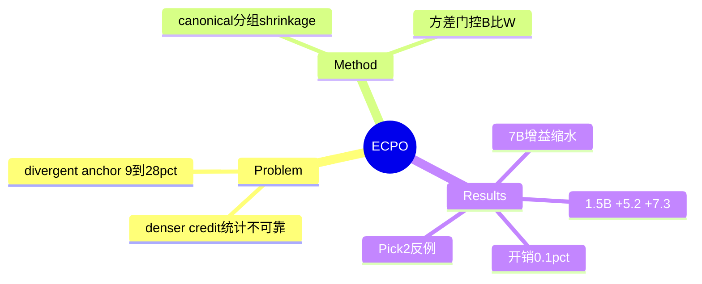

## Summary

对 GiGPO 式 step 级 dense credit 的统计可靠性批评 + 修复：有限 rollout 下"denser 不等于 better"——同 anchor 处罕见幸运动作按观测 return 拿到过大 advantage（divergent anchor bias，训练中此类 anchor 占比 9%→28%），造成后期训练振荡。ECPO 用两件套校准：Evidence-Calibrated Action Advantage（canonical action 分组 + 低计数向 anchor 均值收缩）与 Variance-Gated Credit Weighting（within-action 噪声占优的 anchor 被压权）。Qwen2.5-1.5B 上 ALFWorld +5.2pp / WebShop +7.3pp（对 GiGPO），advantage 计算开销仅 +0.10%。

## Problem & Motivation

Group-based critic-free 方法（GRPO→GiGPO）靠重复 anchor state 构造 step 级 advantage，隐含假设"每个动作有足够重复观测"。实际有限 rollout 下单次观测的经验成功率非 0 即 1——把不可靠点估计当真值直接进 advantage，dense credit 反而注入噪声。这是对"credit 越密越好"的统计层反驳，与 FoldGRPO/DCPO 的"credit 怎么给"问题正交：这里问的是"给出的 credit 可不可信"。

## Method

- **ECA**：文本动作经确定性、环境接地的 canonicalizer 归并（去表面措辞差异、保执行身份）；动作级 return 用 shrinkage 估计 μ̃ = (n·Ḡ + κμ)/(n + κ)——观测少则向 anchor 均值收缩（κ=2.0）。
- **VarGate**：把 anchor 处 return 方差分解为 between-action（B，动作选择解释的部分）与 within-action（W，条件于动作后的下游不确定性）；可靠性权重 ρ = tanh(n/τ)·B/(B+W+ε)，W 占优 → 该 anchor 的 step 级信号被压制、回退轨迹级。
- **设置**：Qwen2.5-1.5B/7B-Instruct；ALFWorld（六子任务）+ WebShop；16 组 × 8 rollouts = 128 并行环境；baseline PPO/RLOO/GRPO/GiGPO。

## Key Results

| （Qwen2.5-1.5B） | GiGPO | ECPO | Δ |
|:--|:--|:--|:--|
| ALFWorld 全任务 | 87.5±0.6 | **92.7±0.7** | +5.2 |
| WebShop success | 64.6±3.1 | **71.9±1.7** | +7.3 |

- **7B 上增益明显缩小**：ALFWorld 91.9 vs 90.8（+1.1）、WebShop 74.7 vs 72.4（+2.3）——校准价值随模型/策略质量提高而衰减（强策略下幸运动作更少？论文未深究）。
- **分任务非全胜**：Pick2 子任务 ECPO 81.7 反低于 GiGPO 91.7±4.7。
- **稳定性**：终期 reward σ 0.746→0.555。
- **消融**：ECA-only 89.8 / VarGate-only 89.6 / 合并 92.7——协同。
- **开销**：advantage 计算 +0.30s/step（≈0.10% 总步时）；group size 4/8/10 下增益 +4.7/+5.2/+3.9（小预算下校准更关键的趋势不明显）。

## Evidence Ledger

| Claim ID | Claim | Type | Source locator | Evidence excerpt | Status |
|:--|:--|:--|:--|:--|:--|
| C1 | divergent anchor bias 定义；占比 9%→28%；单次观测点估计不可靠 | causal-mechanism | §1; Fig 1 | "increases from 9% to 28% during training" | source-verified |
| C2 | canonicalizer + shrinkage μ̃=(nḠ+κμ)/(n+κ) | benchmark-setting | §4.1 | "deterministic environment-grounded canonicalizer" | source-verified |
| C3 | B/W 方差分解；ρ=tanh(n/τ)·B/(B+W+ε) | benchmark-setting | §4.2 | "When Wₛ dominates … suppressed" | source-verified |
| C4 | 1.5B：92.7 vs 87.5 / 71.9 vs 64.6；7B：91.9 vs 90.8 / 74.7 vs 72.4 | comparison | §5.1 表 | 数字逐一核对 | source-verified |
| C5 | 终期 σ 0.746→0.555 | number | Fig 1 | "reduces the final reward standard deviation" | source-verified |
| C6 | 消融 89.8/89.6/92.7 协同 | number | Table 2 | "synergistic effect" | source-verified |
| C7 | +0.30s ≈ 0.10%；N=4/8/10 增益 +4.7/+5.2/+3.9 | number | §5.1/§6.1 | "0.10% of the total step time" | source-verified |
| C8 | 局限：依赖重复 anchor；难 canonicalize 则退回轨迹级；仅三环境 + Qwen2.5 系 | benchmark-setting | Limitations | "where state repetition is rare" | source-verified |
| C9 | Pick2 子任务 81.7 < GiGPO 91.7±4.7 | number | §5.1 分任务表 | "Pick2: 91.7 vs 81.7" | source-verified |

## Strengths & Weaknesses

**Strengths**：
- 诊断有统计学根基且可测量（divergent anchor 占比随训练上升 9%→28% 是干净的过程证据）；shrinkage + 方差门控是教科书级修复，开销可忽略。
- 与 [[Papers/2607-GRPONullWebAgent]] 的 headroom 判据互补：那篇界定 GRPO 何时有效，本篇界定 step 级 credit 何时可信——两者都把"加 RL/加 dense credit"从默认动作变为需前置诊断的决策。

**Weaknesses / 边界**：
- **量纲警告直接命中**（[[Reports/2026-07-27-WebAgent-RL-and-Context-Landscape]]）：+5.2/+7.3pp 落在 [[Papers/2607-MuonAgenticRL]] 所示"仅换优化器即可移动同一基线约 25 点"的噪声带内；优化器/LR/seed 未对齐时该增益的算法归因存疑（本文有 ±std 但只在 ALFWorld/WebShop 小环境）。
- 依赖**重复 anchor state**——GUI/web 真实环境 state 空间大、重复率低且难 canonicalize（论文自认），向 CUA 域迁移的适用面可能很窄；这也是 credit assignment 赛道（agenda 已暂停的子方向）的共同结构性约束。
- 7B 上增益缩水 + Pick2 反例说明校准并非普遍免费午餐；SearchQA 结果在正文之外未详。
- ALFWorld/WebShop 是 2022-23 年小环境，87.5→92.7 的提升空间本身接近饱和带。

**对领域**：把 step 级 credit 的**统计可信度**确立为独立于"密度"的质量轴；对 agenda RL 方向的含义——credit assignment 赛道的新工作已转向可靠性修补（而非新颖密度构造），进一步佐证该子方向拥挤、rule-based reward design 更有空间的既有判断。

## Mind Map

## Notes

- 入队来源：[[Reports/2026-07-27-WebAgent-RL-and-Context-Landscape]]（对 GiGPO 的两条独立批评之一；另一条 BiPACE 2606.25556 未入队）。
- 对 agenda「RL-based GUI Agent Training」：本篇不改变 credit assignment 子方向暂停的判断——它修的是既有构造的统计质量，且自认难迁移到低重复 state 环境（正是 GUI 域特征）；其"前置诊断"思路与 GRPO headroom 判据同属"训练资源分配 gating"家族，后者才是 agenda 标记的可操作切入点。
