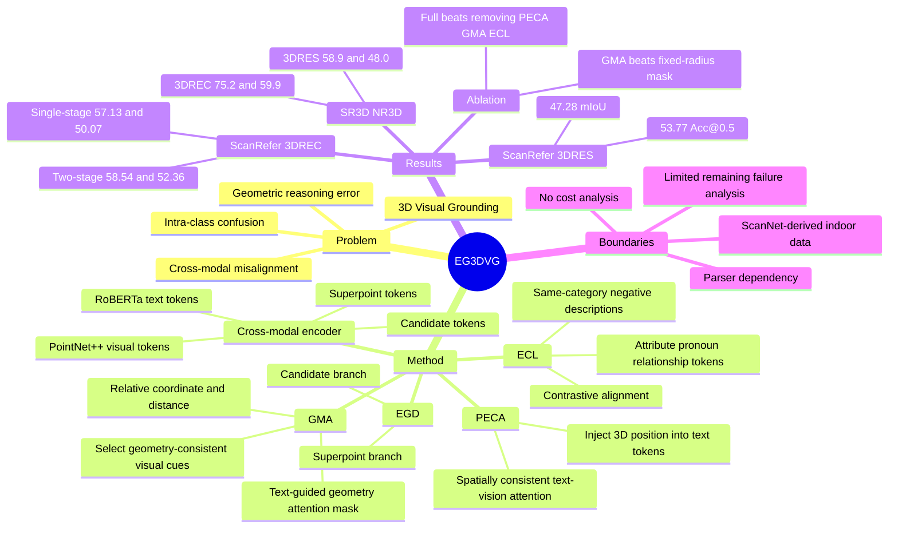

## Summary
EG-3DVG 面向 3D Visual Grounding 中的 cross-modal misalignment、intra-class confusion 和 geometric reasoning error，提出 expression and geometry aware grounding decoder，把 PECA、GMA 和 ECL 三个模块组合到 3DREC / 3DRES 统一框架中。论文在 ScanRefer 和 SR3D/NR3D 上报告了 3D bounding box localization 与 mask prediction 的强结果，但主要证据仍集中在 ScanNet 室内数据分布。

## Problem & Motivation
3D Visual Grounding 的目标是根据自然语言描述，在 3D point cloud scene 中定位目标 object，可以输出 3D bounding box（3DREC）或 semantic mask（3DRES）。作者指出现有 transformer-based 3DVG 方法仍有三类典型失败：textual cues 没有可靠传到 visual representation，导致 cross-modal misalignment；同类 object 较多时，模型不能充分理解 fine-grained expression cues，导致 intra-class confusion；对周围 points / objects / background 的空间聚合不准，导致 geometric reasoning error。这个问题对 embodied scene understanding 重要，因为语言指令往往同时包含 object category、attribute 和 spatial relation，仅靠全局 text-vision fusion 容易把相似实例或几何邻近物体混淆。论文的核心动机是把 expression 线索和 3D geometry 约束显式引入 grounding decoder，而不是只依赖普通 cross-attention。

## Method
EG-3DVG 输入一个 text description 和一个 3D point cloud scene，输出目标 object 的 point-level mask `m` 和 3D bounding box `b`。模型先用 frozen RoBERTa 提取 text tokens，用 PointNet++ 提取 visual tokens，再通过 cross-modal encoder 分别处理 text / visual branches，并用 cross-attention 进行初步融合。每个 visual token 预测 candidate score，top-`Ncand` tokens 作为 candidate tokens；同时，模型把 visual tokens 聚合到 superpoint resolution，得到用于 mask prediction 的 superpoint tokens。

**Expression and Geometry Aware Grounding Decoder (EGD).** EGD 有 superpoint token branch 和 candidate token branch。superpoint branch 用 candidate tokens 和 text tokens refinement superpoint features，使 mask prediction 同时包含 object-aware cues 和 textual semantics。candidate branch 先经过 self-attention 和 PECA，再并行结合 refined superpoint tokens 与 GMA，最后得到 refined candidate tokens；目标 token 由最高 text-alignment score 的 candidate 选出。

**PECA: Position-Guided Expression Cross-Attention.** 普通 visual-to-text cross-attention 的问题是 visual tokens 含 3D positional information，而 text tokens 没有显式空间上下文。PECA 先从 visual token coordinates 投影出 positional embeddings，再通过 text-visual affinity 把这些 3D positional cues 注入 text tokens，得到 `Tpos`；随后 candidate visual tokens 以 `Tpos` 为 key、原 text tokens 为 value 做 cross-attention。这个设计试图让 expression fusion 的 attention weights 更 spatially consistent。

**GMA: Geometry-Aware Masked Attention.** candidate token 只覆盖少数目标候选，不能完整代表目标 object 的几何范围；但直接 attend 到所有 visual tokens 又会引入 background 和无关 object 噪声。GMA 对每个 candidate token 和每个 visual token 计算 relative coordinate offset 与 Euclidean distance，形成 geometric relation tensor，再用 text context 调制生成 geometry-aware attention prior。经过 trainable thresholding 和 STE 得到 binary attention mask 后，masked attention 只聚合 geometry-consistent visual cues。

**ECL: Expression-Aware Contrastive Learning.** 在 multiple setting 中，同一 scene 里会有多个同类 objects。ECL 从同一 scene 中选择指向不同同类 object 的 descriptions 作为 negative text samples，并用 off-the-shelf language parsing tools 抽取 attribute、pronoun、relationship 等 expression-related words。训练时，目标 visual token 要靠近 positive expression tokens，同时远离 negative descriptions 的 expression tokens，从而加强细粒度描述和正确实例之间的对齐。

**Prediction.** mask prediction 通过把 selected target token 投影成 mask embedding，并与 refined superpoint tokens 相乘得到 superpoint-level mask，再映射回 point-level mask。3D bounding box prediction 同时使用 MLP 预测的 initial box 和由 predicted mask 紧包围得到的 mask-derived box，最终 box 是二者加权和，论文设置 `alpha = 0.5`。

## Key Results
- **ScanRefer 3DREC, single-stage setting**：EG-3DVG overall **57.13 Acc@0.25IoU / 50.07 Acc@0.5IoU**，高于 TSP3D 的 **56.45 / 46.71**；论文报告相对 previous SOTA TSP3D 提升 **+0.68 / +3.36**。在 Unique subset 上为 **91.54 / 83.79**，Multiple subset 上为 **51.09 / 44.16**。
- **ScanRefer 3DREC, two-stage setting**：EG-3DVG overall **58.54 Acc@0.25IoU / 52.36 Acc@0.5IoU**，高于 MCLN 的 **57.17 / 45.53**；论文报告提升 **+1.37 / +6.83**。Unique subset 为 **90.84 / 84.57**，Multiple subset 为 **52.87 / 46.71**。
- **ScanRefer 3DRES**：EG-3DVG 达到 **59.77 Acc@0.25IoU / 53.77 Acc@0.5IoU / 47.28 mIoU**。相对 MCLN 的 **58.70 / 50.70 / 44.72**，提升 **+1.07 / +3.07 / +2.56**；但表中 RG-SAN 的 Acc@0.25IoU 是 **61.67**，高于 EG-3DVG，因此更准确地说 EG-3DVG 在该表中最强的是 Acc@0.5IoU 和 mIoU，而不是每个 3DRES metric 都第一。
- **SR3D/NR3D 3DREC**：使用 Acc@0.25 评估时，EG-3DVG 在 SR3D overall / hard 为 **75.2 / 66.6**，在 NR3D overall / hard 为 **59.9 / 52.4**。相对 G3-LQ，overall 分别提升 **+2.1**（SR3D）和 **+1.5**（NR3D）。
- **SR3D/NR3D 3DRES**：使用 mIoU 评估时，EG-3DVG 在 SR3D overall / hard 为 **58.9 / 52.0**，在 NR3D overall / hard 为 **48.0 / 41.9**。相对 MCLN 的 SR3D **49.8** 和 NR3D **46.1** overall mIoU，分别提升 **+9.1** 和 **+1.9**。
- **Component ablation on ScanRefer**：无 PECA / GMA / ECL 时为 **57.04 Acc@0.25 / 49.62 Acc@0.5 / 44.19 mIoU**；完整模型为 **58.54 / 52.36 / 47.28**。单独加入 PECA 为 **57.73 / 50.92 / 45.69**，单独加入 GMA 为 **57.05 / 50.55 / 46.19**，单独加入 ECL 为 **57.56 / 50.85 / 45.84**，说明三者都有边际贡献。
- **GMA attention mask ablation**：fixed-radius mask 为 **57.76 / 51.12 / 46.23**，只用 geometric feature 的 softened attention map 为 **58.16 / 51.20 / 46.70**，完整 GMA 为 **58.54 / 52.36 / 47.28**。这支持作者关于“jointly using geometry and text for attention mask generation”的说法。

## Strengths & Weaknesses
**已知 Strengths.**
- 论文把 3DVG 的失败类型拆成 cross-modal misalignment、intra-class confusion、geometric reasoning error，并让 PECA、ECL、GMA 分别对齐这些问题；problem formulation 和 method decomposition 比单纯堆 decoder 更清楚。
- 方法同时覆盖 3DREC 和 3DRES，且在 ScanRefer、SR3D、NR3D 上给出 main results；ablation 覆盖三个核心模块及 GMA mask generation 方式，能支持每个组件的必要性。
- ECL 针对 multiple setting 中的 same-category distractors 设计 negative text sampling，这和 3D visual grounding 的实际难点贴合，而不是只优化 unique cases。
- 定性结果围绕论文开头的三类 failure 展示：cross-modal misalignment、intra-category confusion、geometric reasoning error，这让定性证据和方法动机保持一致。

**已知 Weaknesses / limitations.**
- 实验主要在 ScanNet 派生的 ScanRefer、SR3D、NR3D 室内场景上；论文没有报告跨 dataset、真实机器人部署、动态场景或 open-world object distribution 下的泛化结果。
- ECL 依赖 off-the-shelf language parsing tools 来抽取 attribute、pronoun、relationship words；论文没有看到 parser error robustness 或不用 parser 的对照实验。
- 论文没有报告 latency、memory、参数量或训练 / 推理开销，因此不知道 PECA、GMA、ECL 的性能增益是否有明显 compute cost。
- 3DRES 表中 EG-3DVG 的 Acc@0.25IoU 低于 RG-SAN，这提醒不能把“3DRES 全指标 SOTA”作为无条件结论。
- 定性分析主要展示 EG-3DVG 相比 MCLN 的成功案例，未系统报告 EG-3DVG 剩余失败案例或 failure taxonomy。

**推测.**
- 对 embodied agent 来说，这篇最有价值的启发是把语言表达中的 attribute / relation 与 3D geometry 绑定，而不是把自然语言指令只当作全局 query；这可能适用于机器人在 cluttered indoor scene 中根据语言定位物体的前端 perception module。论文没有在 robotics、VLN、manipulation 或 GUI-agent benchmark 上验证这一点。
- PECA 的思想也可以类比到 GUI grounding：screen element 有二维位置和布局关系，text instruction 没有显式坐标；给 language tokens 注入 layout / position cues 可能帮助对齐。但这是从 3DVG 机制得到的类比，不是论文实验证据。

**不知道 / 未报告.**
- 没有看到 DOI；也没有在论文首页或正文中看到该论文自身的 arXiv id。
- two-stage EG-3DVG 如何使用 3D detections 的细节被正文指向 supplementary material，正文没有展开。
- 不知道该方法对 noisy point cloud、稀疏扫描、长描述、多目标描述或 parser 抽取失败时的鲁棒性。
- 不知道 GMA 的 binary thresholding 在不同 scene scale 或 object size distribution 下是否需要重新调参。

## Mind Map

## Notes
这篇的研究 taste 在于把 3DVG 的错误来源拆清楚，再做相对简单、可验证的 decoder-level 修改。它没有试图引入更大的 VLM 或复杂 reasoning chain，而是用 position-guided text conditioning、geometry-aware masking 和 expression-level contrastive learning 去修正 grounding decoder 的信息流。后续如果关注 embodied language grounding，可以把这篇和 G3-LQ、MCLN、3D-STMN 一起看，重点比较“显式 semantic-geometric modeling”和“decoder attention masking”到底各自解决哪类错误。
