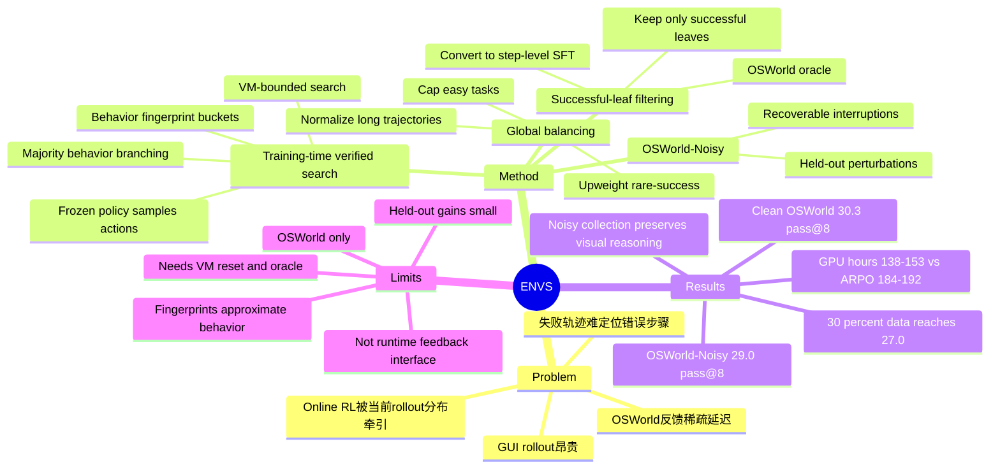

## Summary

ENVS 提出一个面向 long-horizon GUI agent 的 training-time search-and-filter pipeline：在 live OSWorld VM 中对行为不同的 GUI 动作分支搜索，用环境 oracle 验证成功叶子，再把成功轨迹转成全局平衡的 step-level SFT 数据。它的核心 insight 是：GUI agent 的稀疏终端反馈不一定要直接做 online RL，可以先用环境原生 verifier 发现高质量成功轨迹，再做更可控的数据构造。

## Problem & Motivation

GUI agent 训练的难点不只是 policy optimization，而是 **successful trajectory discovery**。OSWorld 这类真实桌面环境每次 rollout 都很贵，反馈通常只有任务结束后的成功/失败；失败轨迹很难告诉模型到底是哪一步错了。ARPO / GRPO 式 online RL 虽然能利用环境 reward，但 trajectory discovery 和 policy update 强耦合，容易让简单任务、长轨迹和当前 policy 的偶然成功主导梯度分配。

ENVS 的动机是把这两个过程解耦：先在 frozen base policy 上做环境验证搜索，收集可执行且成功的轨迹；再离线整理成 balanced supervised data。这样可以在训练前全局观察数据分布，控制 easy tasks、rare-success tasks 和 long trajectory 的梯度权重。

## Method

### 1. Environment-Native Verified Search

ENVS 在 OSWorld live desktop VM 中展开搜索。一个 node 表示已经执行的 action prefix 和由此达到的桌面状态。每一步从 frozen UI-TARS-1.5-7B policy 采样多个 candidate actions，然后把每个 action 压成 coarse behavior fingerprint：

- click / drag：action type + quantized coordinate；
- type：action type + normalized text；
- scroll：direction；
- zero-argument action：action type。

候选动作按 fingerprint 分桶，按桶内样本数排序。高 agreement 的前 `k` 个 bucket 被视为 majority behaviors 并继续探索，低 agreement bucket 被剪枝。最高 agreement action 继续在 parent VM 执行，其余 majority actions 派生 child VMs，child VM 会 replay 共享 prefix 后执行分支动作。

这个设计不是语义等价判断，只是一个廉价的 behavioral disagreement gate。它的目标是把 VM 预算花在行为差异上，而不是 token-level sampling noise 上。

### 2. VM-Bounded Search

ENVS 借用了 tree search 的分支结构，但不使用标准 MCTS 的 UCB/PUCT、value function 或 visit statistics。原因是 OSWorld branch 是真实 VM trajectory：包含真实点击、输入、应用延迟、focus state 和桌面脆弱转移，无法像 abstract simulator 一样低成本反复访问。

因此 ENVS 使用显式 cost gates：

- per-task branch budget；
- per-step branch cap；
- late-step deferral；
- hard step cutoff。

它的定位是 training-time trajectory discovery，而不是 inference-time planning 或 online policy improvement。

### 3. Environment Verification and Successful-Leaf Filtering

搜索结束后，OSWorld task oracle 对每条 leaf trajectory 给 binary reward。失败轨迹直接丢弃；成功轨迹被拆成多个 per-step supervised examples：

- task instruction；
- observation history；
- executed action。

这一步把稀疏终端成功信号转成 dense action-level supervision。一条成功长轨迹可以贡献多个训练样本。

### 4. Global Balancing

搜索得到的数据天然不平衡：简单任务会产生很多成功叶子，长轨迹会产生更多 step examples，困难任务可能只有少量成功。直接均匀训练会让梯度被 easy tasks 和 long trajectories 主导。

ENVS 在 collection 后做 dataset-level balancing：

- cap 过多的 easy-task examples；
- upweight rare-success tasks；
- normalize trajectory length；
- 对异常 rare-success outlier 做上限控制。

这是解耦 search 和 training 的主要收益：因为完整 verified dataset 已经在手，训练前可以全局分配 gradient mass。online RL 只能被当前 policy 采到的 rollout 分布牵着走。

### 5. OSWorld-Noisy

论文还提出 OSWorld-Noisy，用来评估 GUI agent 在真实桌面干扰下的恢复能力。它保留原 OSWorld task 和 evaluator，但注入可恢复的 runtime perturbations：

- 非目标应用里的 concurrent human-task sessions，例如 gedit 记笔记、nautilus 浏览文件、terminal activity；
- notifications、dialogs、browser prompts、toast overlays；
- 偶发目标窗口遮挡、移动、resize。

所有 perturbations 满足 non-sabotage 约束：不向 agent target window 注入点击/按键，不触碰 evaluator 相关文件路径，并且理论上能被少量标准 agent actions 恢复。它测的是 refocus、dismiss、wait、recover，而不是不可解任务。

## Key Results

实验基于 300-task OSWorld pool，其中 86 个 trainable tasks、214 个 held-out tasks。所有方法从 UI-TARS-1.5-7B 初始化，采用相同 15-step horizon 和 pass@8 协议。

**Clean OSWorld**：

| Method | Trained 86 | Held-out 214 | Overall 300 |
|---|---:|---:|---:|
| UI-TARS-1.5-7B base | 73.3 | 2.3 | 22.7 |
| + ARPO clean rollouts | 81.4 | 4.7 | 26.7 |
| + ENVS clean trajectories | 87.2 | 7.5 | 30.3 |

**OSWorld-Noisy**：

| Method | Trained 86 | Held-out 214 | Overall 300 |
|---|---:|---:|---:|
| UI-TARS-1.5-7B base | 66.3 | 1.9 | 20.3 |
| + ARPO noisy rollouts | 62.8 | 5.1 | 21.7 |
| + ENVS noisy trajectories | 88.4 | 5.1 | 29.0 |

**Compute efficiency**：

| Method | Collect GPU-h | Train GPU-h | Total GPU-h |
|---|---:|---:|---:|
| ARPO clean / noisy | - | 184 / 192 | 184 / 192 |
| ENVS clean / noisy | 107 / 121 | 31 / 32 | 138 / 153 |

**Data efficiency**：

- 只用 30% ENVS search data 已达到 27.0 pass@8，约等于 full-budget ARPO clean 的 26.7。
- 75% data 达到 30.7，100% data 为 30.3，说明收益接近饱和，关键是 verified trajectory quality 而不只是数据量。

**Clean vs Noisy collection**：

- ENVS-clean：clean 30.3，noisy 28.3。
- ENVS-noisy：clean 29.0，noisy 29.0。
- Noisy collection 不提升 clean task completion，但比 noisy online RL 更稳定，并更好保留辅助视觉推理能力。

**Auxiliary visual reasoning**：

Noisy ENVS 在 12 个辅助视觉 benchmark 上匹配或超过 clean ENVS。例如 OSWorld-G Refusal：clean ENVS 从 14.8 掉到 1.9，而 noisy ENVS 达到 16.7；BLINK Functional Correspondence 从 23.1 提到 26.2，BLINK IQ Test 从 27.3 提到 30.0。

## Strengths & Weaknesses

**Strengths**：

- **问题切得准**：论文抓住了 GUI RL 的关键瓶颈不是 optimizer 形式，而是昂贵环境里的成功轨迹发现。用环境 oracle 先构造 verified supervision，是比盲目 online RL 更可控的路线。
- **行为分歧门控很实用**：fingerprint bucket 不是完美语义聚类，但足够降低 VM search 成本，把分支预算用在可执行行为差异上。
- **global balancing 是核心贡献**：ENVS 真正区别于普通 rejection-sampling SFT 的地方，是它能在训练前全局控制 task / trajectory / rare-success 的梯度分配。
- **OSWorld-Noisy 有研究价值**：它把 desktop interruptions 建模成 recoverable perturbations，直接对应真实 GUI 使用中的 focus shift、popup、dialog 和 overlay。
- **compute/data efficiency 数字有说服力**：30% 数据就接近 ARPO，且 138-153 GPU-h 优于 184-192 GPU-h，说明 verified search 不是简单堆 compute。

**Weaknesses**：

- **泛化证据仍有限**：实验只在 OSWorld 和 UI-TARS-1.5-7B 家族上完成，不能直接推广到 web、mobile 或其他 desktop benchmark。
- **held-out 提升较小**：clean held-out 仅从 2.3 到 7.5，noisy held-out ENVS 与 ARPO 都是 5.1。主要收益集中在 trainable subset，说明 search data 对真正 OOD task 的迁移仍有限。
- **依赖强环境基础设施**：需要 OSWorld 的 parallel VM execution、可靠 reset、terminal oracle。很多真实软件没有这种干净 oracle。
- **fingerprint 只是近似**：两个不同 fingerprint 可能功能等价，相似 fingerprint 也可能执行后分歧。behavior bucket 不是 semantic action abstraction。
- **OSWorld-Noisy 是合成可恢复干扰**：它不覆盖真实用户行为、系统故障或 adversarial interference。论文也承认 noisy collection 不自动改善 task completion，需要 filtering / balancing。
- **不是 agent-facing feedback interface**：ENVS 把 environment feedback 用于 training data construction，而不是让 agent 在 runtime 中调用 process feedback / recovery API。对 Agent-Friendly Interface 来说，它是重要证据，但不是最终形态。

**Impact**：

ENVS 是 GUI agent 训练路线中的一个重要信号：在高成本、稀疏反馈的真实软件环境中，verified search + balanced SFT 可能比直接 online RL 更稳定、更省算力。它也支持一个更大的判断：环境不只是评测场地，环境 oracle、reset、branching、perturbation 都可以变成训练信号的来源。

## Mind Map

## Notes

- 和 [[Papers/2606-CUAGym|CUA-Gym]] 的关系：CUA-Gym 自动合成 `(task, environment state, reward.py)`，ENVS 则在已有 OSWorld 环境中搜索 verified successful trajectories。前者偏 environment/task/reward generation，后者偏 training-data discovery。
- 和 [[Papers/2606-AsyncWebRL|AsyncWebRL]] 的关系：AsyncWebRL 优化 online multi-step RL 系统吞吐和 loss pathology；ENVS 反而强调把 search 与 training 解耦，用 SFT 吸收 verified trajectories。两者都说明 GUI/Web agent RL 的瓶颈很大程度在环境与数据管道，而不只是模型算法。
- 对 Agent-Friendly Interface 的启发：ENVS 证明 environment feedback 可以从 final binary reward 转成有用的 step-level supervision。但它仍是 training-time 方法。如果未来把类似 oracle-safe progress / recovery feedback 暴露给 agent runtime，就更接近我们讨论的 Feedback Layer / Recovery Layer。
- 一个值得追问的问题：behavior fingerprint 是否可以替换为更语义化的 action abstraction？例如从 click coordinate bucket 升级为 element-level semantic action bucket，这会直接连接到 agent-friendly action space。
