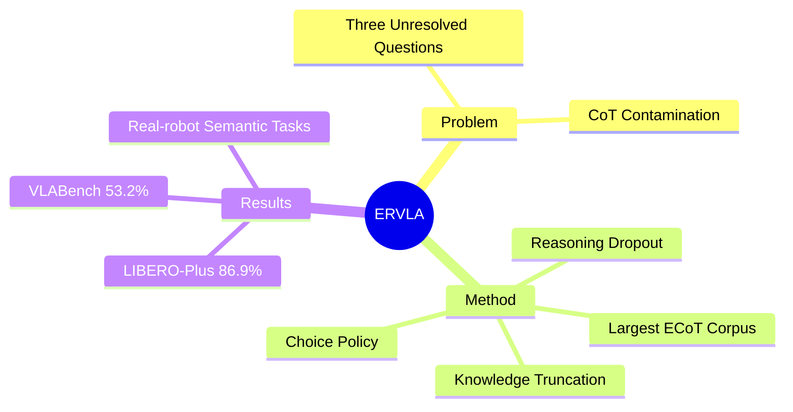

## Summary

> [!summary] ERVLA: Embodied Reasoning VLA
> - **核心**: 重新审视 ECoT（Embodied Chain-of-Thought）在 VLA 中的作用，发现显式 CoT 作为 autoregressive action prefix **不可靠 scaling**，提出将 CoT 作为 representation-shaping supervision 而非 test-time reasoning
> - **数据**: 构建最大规模 embodied CoT corpus（978,743 trajectories, 226.3M samples, 2592.5 hours），覆盖 Bridge、Fractal、Droid、MolmoAct、AgiBot
> - **发现**: (1) 有效 CoT 必须 ground 到 concrete action guidance（end-effector movement、image-space trajectories），高层 reasoning alone 收益 marginal；(2) autoregressive CoT prefix 存在 compounding errors；(3) CoT contamination 问题（noisy labels 阻碍 adaptation）
> - **结果**: LIBERO-Plus 86.9% SOTA，VLABench 53.2%，real-robot 语义歧义 + long-horizon 任务超 baseline
> - **Sources**: [paper](https://arxiv.org/abs/2606.03784v2) | [website](https://taoshuaiz.github.io/ERVLA/)

**Key Takeaways:**
1. **CoT 作为 training signal > test-time reasoning**: reasoning dropout 让模型在训练时吸收 reasoning traces，推理时直接 predict actions，避免 autoregressive instability
2. **Grounded reasoning 是关键**: 高层 semantic reasoning（task plan）仅 marginal gain，必须配合 action-level guidance（end-effector movement、trajectory）
3. **Explicit CoT 不可靠 scaling**: autoregressive prefix 方式在数据增大时出现 compounding errors，reasoning-action coupling 不稳定
4. **CoT contamination**: auto-labeling 的 noisy signals（jittered bboxes、drifting coordinates）对相似 observation 施加 inconsistent supervision，可通过 reasoning dropout + sparse supervision 缓解
5. **Architecture design matters**: knowledge truncation（DiT 只 attend semantic-prefix KV cache）防止 shortcut copying；choice policy + score branch 增强 action generation

---

## Problem & Motivation

Embodied CoT 要解决的核心问题是：VLM 的 semantic abstraction 如何转化为对 action generation 真正有用的 intermediate representation。论文提出三个 unresolved questions：

1. **What forms of reasoning work?** 现有方法涵盖 scene understanding、subtask decomposition、spatial grounding、trajectory prediction、future-frame prediction，但这些选择与特定 architecture/training objective 紧耦合，难以识别什么真正 improve control

2. **How should reasoning interact with policy?** Early ECoT 把 reasoning 作为 action prefix（显式 trace），后续工作探索 latent plan、diffusion conditioning、training-only signal——哪种 integration strategy 最有效？

3. **Does CoT scale?** 大规模 VLA pre-training 开始引入 reasoning supervision，但 public reasoning-enhanced dataset scarce，scaling behavior 不明确

论文的 core insight：**embodied CoT 不应被视为 test-time verbalization channel，而是 reshaping representation space 的 training signal**。

---

## Method

### Embodied CoT Data Construction

构建最大规模 embodied CoT corpus，基于 Bridge、Fractal、Droid、MolmoAct、AgiBot。CoT decompose 为 structured categories：

| Category | Role | Examples |
|:---|:---|:---|
| Task Understanding | Semantic intent | rephrased instruction |
| Spatial Grounding | Align language with visual entities | object bboxes, gripper pixel |
| Subgoal Planning | Task progress | subtask sequence |
| Action-Oriented Motion | Executable motion | end-effector movement, image-space trajectory |

关键设计：**action-oriented reasoning from future motion**，而非仅 semantic plan。

### ERVLA Architecture

**Figure 3. ERVLA architecture: VLM backbone + DiT action head + choice policy**

```
VLM (Qwen3-VL-4B) → semantic representation + KV cache
                     ↓
DiT (flow matching) → continuous action chunks
                     ↓
Choice Policy → N candidate chunks + scores
```

**Core components**:

1. **VLM backbone**: Qwen3-VL-4B，保留 native language space 的 CoT supervision（不压缩 tokenization）
2. **Auxiliary action-query tokens**: `<a_i>` 用于 action regression，`<score>` 用于 candidate scoring
3. **Knowledge truncation**: DiT 只 attend semantic-prefix KV cache（exclude control-query tokens），防止 shortcut copying
4. **Choice policy**: predict N candidate action chunks，score branch 预测 chunk-wise error
5. **Reasoning dropout**: 训练时 random switch `/cot` or `/no_cot`，让 CoT 成为 optional training condition

### Training Objective

$$\mathcal{L} = \lambda_{\text{vlm}}\mathcal{L}_{\text{vlm}} + \lambda_{\text{flow}}\mathcal{L}_{\text{flow}} + \lambda_{\text{choice}}\mathcal{L}_{\text{choice}} + \lambda_{\text{score}}\mathcal{L}_{\text{score}}$$

- $\mathcal{L}_{\text{vlm}}$: CoT next-token prediction
- $\mathcal{L}_{\text{flow}}$: rectified flow loss for continuous actions
- $\mathcal{L}_{\text{choice}}$: supervise best candidate under MAE
- $\mathcal{L}_{\text{score}}$: predict candidate-wise errors

---

## Key Results

### Main Benchmark Results

**LIBERO-Plus** (86.9% success rate, SOTA):
- Spatial track: 100% on background/lighting variations
- Strong zero-shot generalization

**VLABench** (53.2% success rate):
- Challenging OOD settings demanding semantic understanding + instruction following

### CoT Field Ablations

论文系统比较了不同 CoT fields 的 effectiveness：

| CoT Field Type | Contribution |
|:---|:---|
| High-level semantic reasoning | Marginal gain |
| Spatial grounding (bboxes, gripper pixel) | Moderate |
| **Action-oriented guidance (movement, trajectory)** | **Key driver** |

**Key finding**: Grounded action-level reasoning 是性能提升的主要来源，与 [[2407-ECoT]] 的 Naive CoT vs ECoT ablation 结论一致。

### ERVLA Design Ablations

| Design | Impact |
|:---|:---|
| No Choice (end-to-end) | Baseline |
| No Choice + Knowledge Insulation | ↓ |
| Choice + No Knowledge Truncation | ↓ (shortcut copying) |
| **Full ERVLA** | **Best** |

Knowledge truncation 和 choice policy 都是必要设计。

### Real-World Experiments

在语义歧义任务和 long-horizon 任务上超越 baseline：
- Semantic disambiguation: 需理解 instruction 中的 subtle differences
- Long-horizon: multi-step 任务执行

---

## Strengths & Weaknesses

### Strengths

1. **系统性研究 design**: 三个核心问题（what form / how integrate / does scale）都有 controlled experiment，而非"加了就涨"
2. **Critical finding**: explicit CoT as autoregressive prefix 不可靠 scaling —— 这是对 ECoT paradigm 的 direct challenge，具有重要 insight 价值
3. **数据贡献**: 最大规模 embodied CoT corpus（978,743 trajectories），开源
4. **Reasoning dropout 设计**: 将 CoT 从"必须推理"变为"可选训练信号"，工程上有启发性
5. **Negative result honest**: 论文承认 auto-labeling 的 noise 问题（CoT contamination）

### Weaknesses

1. **CoT contamination 量化不足**: 提出了问题但没给出 noise rate 的具体数字，"noisy labels hinder adaptation" 需更精确 evidence
2. **与 ECoT direct comparison 缺失**: 论文 cite [[2407-ECoT]] 但没在同一 benchmark 直接比较 ERVLA vs ECoT（autoregressive prefix vs reasoning dropout）
3. **Choice policy overhead**: N candidate chunks + score branch 增加推理成本，论文没报告实际控制频率
4. **Real-robot evaluation 规模**: abstract 提 real-robot，但 main paper 中 details 较少，appendix 才有完整结果
5. **VLM backbone 选择**: Qwen3-VL-4B vs 其他 VLM（如 SigLIP-DinoV2）没对比

### 可信评估

#### Artifact 可获取性
- **数据**: 将开源（978,743 trajectories）
- **模型**: checkpoint 将发布
- **代码**: 将开源

#### Claim 可验证性
- ✅ LIBERO-Plus 86.9%: benchmark public，可复现
- ✅ VLABench 53.2%: benchmark public
- ✅ CoT field ablations: dataset 开源后可验证
- ⚠️ "explicit CoT doesn't scale reliably": 需更多 evidence（只在一个 scale level 比较）
- ⚠️ "ERVLA > ECoT": 缺 direct comparison on same benchmark

---

## Mind Map



---

## Notes

### 与 ECoT 的关键差异

[[2407-ECoT]] 把 reasoning 作为 mandatory action prefix（7-step fixed chain），ERVLA 把 reasoning 作为 optional training signal（reasoning dropout）。论文的核心 argument：**autoregressive prefix 方式存在 compounding errors，不可靠 scaling**。

但论文没有在同一 benchmark 直接比较这两种 integration strategy，这是关键缺失。ECoT 在 Bridge V2 generalization suite 上 +28% vs OpenVLA，ERVLA 在 LIBERO-Plus/VLABench 上 SOTA —— 两者在数据、architecture、benchmark 都不同，难以直接归因于 reasoning integration strategy。

### "CoT contamination" 的启发

论文提出的 CoT contamination 问题（auto-labeling noise 对相似 observation 的 inconsistent supervision）是一个重要 observation。但论文没有量化：
- Grounding DINO miss rate
- End-effector coordinate drift frequency
- Reasoning chain 与 ground-truth action 的 alignment rate

这些数字对理解 reasoning supervision 的 upper bound 很关键。

### 后续可探索方向

1. **Direct comparison**: ERVLA vs ECoT on same benchmark + same data scale
2. **Adaptive reasoning dropout**: 按 task difficulty dynamic adjust dropout rate
3. **Noise quantification**: 测量 auto-labeling pipeline 的 error rate upper bound
4. **Hierarchical reasoning**: 结合 ERVLA 的 training-only signal 和 explicit reasoning for human correction

### Rating

**分数**: 4 - Important
**理由**: 论文对 ECoT paradigm 提出了 direct challenge（autoregressive prefix 不可靠 scaling），并通过 reasoning dropout 给出 alternative design。系统性研究三个核心问题、构建最大规模 CoT corpus、开源数据模型——这些是 Important 级别的贡献。但 CoT contamination 量化不足、与 ECoT direct comparison 缺失削弱了因果归因的 strength。