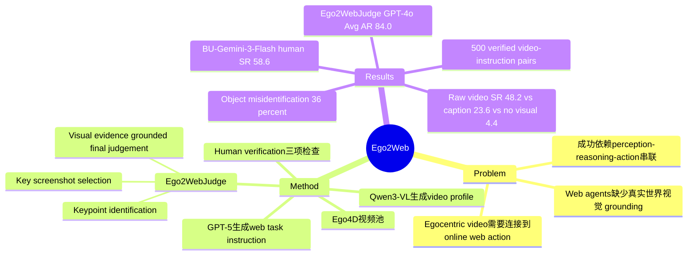

## Summary

Ego2Web 是一个把 egocentric video perception 和 live web-agent execution 绑定在一起的 benchmark：agent 必须先从第一人称视频中定位任务相关视觉线索，再在真实网站上完成对应操作。论文同时提出 Ego2WebJudge，用 visual evidence、action history、screenshots 和 final response 做 LLM-as-a-Judge，实验显示现有 web agents 在 Ego2Web 上仍明显不稳。

## Problem & Motivation

现有 web-agent benchmark 主要评估 agent 如何理解网页截图、DOM 或文本指令，并在网页内完成任务；它们通常不要求 agent 使用用户真实环境中的视觉线索来决定做什么。论文关注的缺口是：AR glasses、wearable camera、home robot 等场景里的 assistant 需要先理解用户身边发生了什么，再把该感知结果转成 web action，例如识别视频中拿起的零食、衣服、车标或运动动作，然后去 Amazon、YouTube、Wikipedia、Google Maps 等网站检索或操作。

这个问题重要，因为它把 web agent 从“纯数字界面执行器”推进到“物理世界感知 + 数字世界行动”的组合任务。作者的核心判断是，成功不仅取决于网页导航能力，还取决于 spatio-temporal grounding、object/brand/action recognition、cross-modal retrieval 和 web planning 的串联；任一环节出错都会传导到最终任务失败。

## Method

**Task definition.** Ego2Web 中每个 episode 输入为 egocentric video $V$ 和 textual instruction $I$，agent 需要在 browser environment $E$ 中执行 web action sequence $A$，达到 goal state $G$。任务同时考察两类能力：一是从视频中抽取 task-relevant visual information，例如 object category、brand、color、temporal order；二是基于该视觉信息规划和执行网页操作，例如导航、搜索、滚动、点击和提取答案。

**Benchmark construction.** 数据来自 Ego4D 等 egocentric video pool。作者先用 Qwen3-VL 对视频每 5 秒生成 clip-level dense captions，把 global scene context 和 local object details 合成为 video profile；再让 GPT-5 基于 video profile 和预定义活跃网站集合生成 web task instruction；最后由人工检查并修改样本，标准包括 Visual Grounding、Web Feasibility 和 Instruction Quality。最终 benchmark 包含 500 个 human-verified video-instruction pairs，覆盖 e-commerce、media retrieval、knowledge lookup、local/maps 和 others 等任务类型。

**Ego2WebJudge.** 由于 Ego2Web 在 live websites 上评估，作者扩展 WebJudge 思路，加入 egocentric visual evidence。Ego2WebJudge 分三步：先从 instruction 中抽取 success keypoints；再让 MLLM 对每个网页 screenshot 做 1-5 relevance rating，选择 key screenshots，避免长轨迹上下文稀释判断；最后把 instruction、selected screenshots、action history、LLM-generated keypoints 和 annotated video keyframes 一起输入 MLLM，输出 Success / Failure 二分类。

**Baselines.** 论文评估 6 个 mainstream web agents：SeeAct、Browser-Use with GPT-4.1、Browser-Use with Gemini-3-Flash、Claude Sonnet 3.7 Computer Use、Claude Sonnet 4.5 Computer Use 和 GPT-5.4。视觉输入方式并不完全一致：Claude 系列和 GPT-5.4 在 computer-use mode 中不能直接访问 raw video，需要转成 textual captions；GPT-4o/GPT-4.1 类 agent 使用 sparse keyframes；Gemini 系列可以处理 dense video input。这个差异本身成为后续结果解释的一部分。

## Key Results

**Ego2Web / Human Eval.** 在 6 个 web agents 上，human evaluation success rate 最高的是 BU-Gemini-3-Flash：58.6%。其他 agent 分别为 BU-GPT-4.1 44.4%、SeeAct 34.2%、Claude 4.5 32.8%、GPT-5.4 30.6%、Claude 3.7 26.4%。这说明即使最强 baseline 在 Ego2Web 上也未超过 60% SR，论文据此强调 visually grounded web execution 仍有明显提升空间。

**Ego2WebJudge / Automatic Evaluation.** 在 Ego2Web 上，Ego2WebJudge 与 human evaluation 的 average agreement rate 明显高于已有自动评估方法。以 Gemini-2.5-Pro 为 judge backbone 时，WebVoyager / WebJudge / Ego2WebJudge 的 Avg. AR 分别是 70.7% / 76.1% / 80.8%；以 GPT-4o 为 backbone 时，对应数字是 74.7% / 78.4% / 84.0%。因此，加入 egocentric visual evidence 的 judge 比只看 web screenshots / trajectories 的 evaluator 更接近人工判断，但 84.0% 也意味着仍有约 16% disagreement。

**Visual Input Ablation / Ego2Web.** 在 Browser-Use + Gemini-3-Flash、Ego2WebJudge (Gemini-2.5-Pro) 评估下，无视觉输入时 overall SR 只有 4.4%；使用 detailed caption 后升到 23.6%；使用 raw video input 达到 48.2%。分任务看，raw video 相对 caption 在 Knowledge Lookup 上从 39.1% 提升到 75.0%，在 E-Commerce 上从 13.0% 提升到 38.2%，在 Media Retrieval 上从 29.5% 提升到 50.7%，说明文本 caption 不能充分替代 temporal / fine-grained visual grounding。

**Failure Analysis / Ego2Web.** 作者随机抽样 50 个 benchmark examples，并人工检查 BU-Gemini-3.1 的失败轨迹。失败类型包括 Object Misidentification 36%、Temporal and Action Misunderstanding 18%、Failure in Cross-Modal Retrieval 16%、Coarse-Grained Matching Errors 12%、Others 18%。最主要失败不是单纯网页不会操作，而是早期视觉 grounding 或 temporal grounding 错误向后传播，导致后续网页检索和验证也错。

## Strengths & Weaknesses

**Strengths.** 这篇论文的贡献不在于提出更强 agent，而在于把 benchmark 问题定义得更贴近 real-world multimodal assistant：任务成功必须同时依赖 egocentric perception 和 online web execution。500 个 video-task pairs 虽然不大，但任务形式清楚地制造了“先看懂现实，再操作网页”的依赖关系，避免退化成纯网页导航。Ego2WebJudge 也比 final-answer judge 更合理，因为它把 annotated visual evidence 纳入评估，而不是只比较文本答案或网页轨迹。

**Weaknesses.** 已知的局限是：Ego2WebJudge 最高只达到 84.0% Avg. AR，不是人工评估的完全替代；部分 baseline 无法直接读取 raw video，只能依赖 captions 或 keyframes，因此 leaderboard 混合了 agent 本身能力与输入模态接口限制。benchmark 只有 500 个样本，且任务由 MLLM / LLM 生成后人工验证，论文主文没有量化人工标注成本、任务生成偏差或网站分布长尾覆盖。

**推测.** Live website evaluation 更真实，但也可能带来 reproducibility 和 website drift 问题；论文 failure analysis 中的 CAPTCHA、authentication barriers 和 session errors 已经显示外部网页状态会进入失败因素，但主文没有系统量化这些外部变量的方差。这个 benchmark 对 AR / wearable assistant 方向很有启发，但如果要作为训练 reward 或长期 leaderboard，可能需要更强的环境控制和版本化网页快照。

**不知道.** 论文主文没有给出每类网站的完整样本分布、annotator agreement、单样本构建成本、Ego2WebJudge 的 prompt 细节对结果的敏感性，也没有证明 500 个样本足以覆盖真实用户物理-数字混合任务的长尾。

## Mind Map

## Notes

项目页：https://ego2web.github.io/

对 GUI / web agent research 的直接启发是：benchmark 不能只考“网页上怎么点”，还要考“网页任务的目标从哪里来”。Ego2Web 把目标来源绑定到 egocentric video，这是比单纯加长 web trajectory 更根本的难点，因为错误会发生在视觉识别、temporal grounding、symbolic mapping、网页检索和最终验证多个阶段。

一个值得继续追的问题：Ego2Web 的失败分布显示 Object Misidentification 和 Temporal / Action Misunderstanding 合计 54%，这暗示提升 raw video grounding 可能比优化 browser controller 更优先。但 Cross-Modal Retrieval 16% 和 Coarse-Grained Matching 12% 也说明“看懂了但搜不准 / 对不上网页实体”仍是独立瓶颈，后续方法可能需要显式维护 visual evidence ↔ web entity 的 alignment trace。
