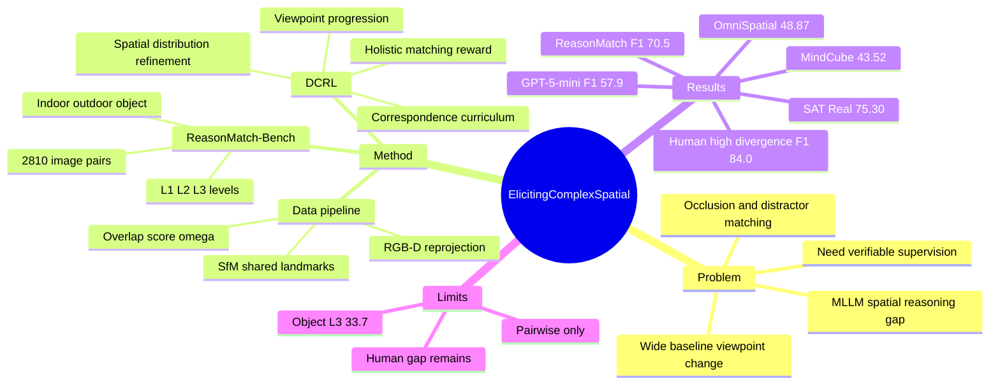

## Summary
这篇论文把 Wide-Baseline Matching (WBM) 作为评估和训练 MLLM complex spatial reasoning 的可验证 testbed：模型要在大视角变化、遮挡、重复结构和语义相似区域下做跨视角 region correspondence。作者构建 ReasonMatch-Bench，并提出从 RGB-D / SfM video-3D corpora 自动生成监督数据，再用 Dynamic Correspondence Reinforcement Learning (DCRL) 基于 verifiable rewards 训练 Qwen3-VL-8B。核心结果是 DCRL 在 ReasonMatch-Bench 达到 70.5 F1，明显高于 Qwen3-VL-8B-Instruct 的 27.5 和 GPT-5-mini 的 57.9，但在最大视角差异 human study 上仍远低于 human 84.0 F1。

## Problem & Motivation
已知：MLLM 要进入 physical world，不能只做 object recognition 或 captioning，还需要跨视角的 spatial reasoning，包括 geometric understanding、viewpoint imagination、fine-grained perception、occlusion/topological reasoning、scale/depth estimation。现有 spatial benchmarks 往往只测相对位置、viewpoint prediction 等孤立能力；Multi-SpatialMLLM 等 correspondence 方法也偏小视角变化、multiple-choice task format 和 SFT。

作者的 problem formulation 是：Wide-Baseline Matching 天然要求模型整合 geometry、semantics、context 和 visibility reasoning，而且答案可以由几何 correspondence 验证，因此适合作为 MLLM spatial reasoning 的训练与评估载体。关键动机不是让 MLLM 替代 classical matcher，而是利用 WBM 的可验证性构造 scalable supervision 和 RL reward，观察 MLLM 是否能学到更通用的 cross-view spatial reasoning。

## Method
**Task formulation.** 输入两张同一 3D scene 的不同视角图像，以及两组带 ID 的 marked point / region sets；MLLM 输出从 Image A ID 到 Image B ID 或 `none` 的 textual mapping。与传统 matcher 输出 dense score matrix 不同，这里把 MLLM 当作 discrete, language-mediated reasoning engine，需要基于 visual prompts 做 partial bipartite matching，并显式处理 unmatched / occluded regions。

**Data generation pipeline.** 作者从 CO3D、uCO3D、ScanNet 的 RGB-D 数据，以及 RealEstate10k、DL3DV 的 RGB/SfM reconstruction 中抽取 image pairs 和 verified correspondences。RGB-D 路径通过 back-project / reproject 得到候选匹配，并用 depth consistency 与 photometric consistency 验证；SfM 路径用 COLMAP shared 3D landmarks。然后用 overlap score `ω` 度量 co-visibility，用 `Δv = 1 - ω` 表示 viewpoint-change magnitude，并把 dense matches clustering / filtering 成每对图像约 10-50 个 spatially separated correspondences。

**ReasonMatch-Bench.** Benchmark 从 220K-pair corpus 中抽取 2,810 image pairs，覆盖 indoor、outdoor、object-centric 三类场景；数据来源比例为 ScanNet 27.7%、uCO3D 28.0%、DL3DV 27.0%、RE10K 17.2%；task levels 为 L1 32.5%、L2 36.8%、L3 30.7%；scene types 为 indoor 55.1%、object 28.0%、outdoor 16.9%。L1 是无 distractor 的 one-to-one matching，L2 在 target side 加 distractors，L3 在两侧都加 distractors / unmatched regions。

**DCRL.** DCRL 用 RLVR/GRPO 在 Qwen3-VL-8B-Instruct 上训练，reward 包含 format compliance 和 holistic matching correctness。`r_match` 对所有 query regions 求 exact-match accuracy，包括正确预测 `none` 的 unmatched regions，因此训练信号不只奖励容易匹配的 salient points，也惩罚忽略 occlusion / out-of-view 的行为。

**Curriculum.** DCRL 有两层 curriculum：image-level viewpoint progression 先从高 overlap / 小视角差异样本开始，再进入低 overlap / 大视角差异样本；point-level correspondence curriculum 调整 cardinality 和 spatial distribution。Supplement 给出的配置是：L1 采样 3-5 个 matchable points、无 distractor；L2 采样 1-2 个 matchable points，并在 Image B 加 3-6 个 distractors；L3 采样 3-6 个 matchable points，并在两侧各加 3-6 个 distractors。训练 stage 从 L1-only 到 L2-only，再到 L1/L2/L3 以 0.3/0.3/0.4 混合，同时逐步收紧 point spacing，使模型从 coarse landmark matching 过渡到 fine-grained correspondence。

**Training details.** 论文报告使用 GRPO，group size `G = 32`，effective batch size 为 `16 x 32` trajectories per update，KL coefficient `β = 0.005`，AdamW，linear warmup 10 steps，constant learning rate `1e-6`，rollout temperature `T = 1.0`，generated prediction 上限 5120 tokens。Reward weights `(w_f, w_m) = (1.0, 1.0)`，viewpoint curriculum 分 10 个 overlap bins，并在 sliding window 20 steps 的 average accuracy reward 超过 0.8 后推进。

## Key Results
**ReasonMatch-Bench main result.** DCRL 在 ReasonMatch-Bench 上达到 70.5 F1 / 70.3 Precision / 71.1 Recall，显著高于 Qwen3-VL-8B-Instruct 的 27.5 F1，也高于 Qwen3-VL-235B 的 49.2、GPT-5-mini 的 57.9、GPT-5-Chat 的 51.5、Gemini-2.5-Pro 的 42.8、Claude-4.5-Sonnet 的 41.7。相对 Qwen3-VL-8B-Instruct，整体 F1 提升 +43.0。

**分场景与难度。** DCRL 在 Outdoor L1 达到 90.9，Indoor L1 达到 84.6，但 Object L3 只有 33.7；这说明 object-centric fine-grained matching 仍是最难部分。GPT-5-mini 在对应三类 L3 上为 Indoor 47.0、Outdoor 51.4、Object 27.8；DCRL 在 Indoor / Outdoor L3 明显更强，分别为 67.0 / 73.6，但 Object L3 的绝对值仍低。

**Human study.** 在 90 个 largest-view-divergence samples 上，human overall F1 为 84.0，DCRL 为 52.0，GPT-5-mini 为 37.2，Gemini-2.5-Pro 为 29.5，Qwen3-VL-235B 为 29.9。分数据集看，human 在 DL3DV / RE10K / uCO3D 上分别为 93.5 / 94.7 / 62.1 F1；DCRL 分别为 57.7 / 70.6 / 27.8 F1。已知结论是：DCRL 明显缩小模型间差距，但最大视角差异和 object-centric 场景离 human 仍很远。

**Transfer to spatial benchmarks.** OmniSpatial overall 从 Qwen3-VL-8B 的 43.60 提升到 DCRL 的 48.87（+5.27）；其中 Dynamic Reasoning 从 51.90 到 61.48，Complex Logic 从 24.40 到 32.78，Perspective Taking 只从 42.50 到 43.21。MindCube overall 从 40.01 到 43.52（+3.51），Rotation 从 53.20 到 59.20；SAT Real 从 70.00 到 75.30。

**General visual understanding.** DCRL 没有在论文报告的 general visual benchmarks 上造成下降：MME-RealWorld 从 62.8 到 63.8，MMStar 从 59.8 到 62.5，RealWorldQA 从 69.5 到 70.5，V*Bench 从 84.8 到 85.9。这个结果支持“targeted spatial RL 没有明显破坏 general visual understanding”的较弱 claim，但只限于这些 benchmark。

**Ablations.** RL vs SFT：SFT 在 ReasonMatch 上从 base 27.5 到 51.0，但 DCRL 到 70.5，比 SFT 高 +19.5；SAT 上 SFT 从 70.0 降到 41.3，而 DCRL 到 75.3，比 SFT 高 +34.0。Curriculum ablation：No Curriculum uniform sampling 为 65.3，Easy-only 为 59.9，Hard-only 为 62.3，Dynamic Curriculum 为 70.5，说明 progressive difficulty 比固定难度或均匀采样更有效。

## Strengths & Weaknesses
**已知 Strengths.** 这篇的核心贡献是把 WBM 重构成 MLLM spatial reasoning 的 verifiable task，而不是再造一个黑盒 spatial QA benchmark。由于 correspondence 可以用 RGB-D / SfM geometry 自动验证，作者能同时做 benchmark、training data 和 RL reward；这比纯人工标注 spatial reasoning chain 更 scalable，也更符合“可验证 reward”在 reasoning RL 中的优势。

**已知 Strengths.** 实验设计有较好的信息量：baseline 覆盖 closed-source frontier models、open-source large MLLMs 和 Qwen3-VL-8B base；evaluation 不只看 ReasonMatch，还看 OmniSpatial、MindCube、SAT 和 general visual benchmarks；ablation 明确比较 SFT、RL、curriculum variants。尤其 SFT 在 ReasonMatch 有提升但 SAT 大幅下降，给出了“teacher-forced matching imitation 可能不如 verifiable RL transferable”的证据。

**已知 Weakness / failure modes.** 论文自己的 error analysis 指出，不同模型失败方式不同：Gemini-2.5-Pro 能写出细致 local appearance descriptions，但缺少 global specificity，容易把“white wall region / wooden surface”这类局部描述误配到相似区域；Qwen3-VL 系列有较强 viewpoint-change awareness，但会出现 visual label misidentification，以及 reasoning text 和 final JSON answer 不一致。ReasonMatch-Bench 的 error dimensions 还包括 Global Layout Misalignment、Overuse of `none` 和 Reasoning Coherence 问题。

**已知 Limitations.** DCRL 最强模型在 high-divergence subset 只有 52.0 F1，仍比 non-expert human 低 32.0 F1；object-centric uCO3D 上 DCRL 27.8 vs human 62.1，差距尤其大。论文也明确说当前工作聚焦 pairwise cross-view matching，而 comprehensive spatial intelligence 还需要 multi-view simultaneous reasoning、3D scene understanding、temporal dynamics 和 semantic knowledge 的整合。

**推测.** WBM 对 embodied / GUI agent 有潜在启发，因为它把“跨视角同一物理元素识别”变成可验证训练信号；在 embodied navigation、mobile manipulation 或多视角 screen / UI state tracking 中，类似 correspondence reward 可能能训练更稳定的 spatial grounding。但论文没有在 robot task、GUI task、active perception 或 action loop 上实验，所以这个迁移价值仍是方向性推测。

**不知道.** 论文正文没有给出 code URL、DOI，也没有报告训练数据总 token / sample 数、训练成本、不同 base MLLM 的 DCRL 可迁移性、reward hacking 诊断、或在 noisy depth / noisy SfM reconstruction 下的 robustness。也不知道 DCRL 的 gains 有多少来自 task format / prompt regularization，多少来自 RL objective 本身；目前最接近的证据是 SFT vs RL 和 curriculum ablation，但还不是完全控制的 causal decomposition。

## Mind Map

## Notes
这篇的 taste 比较好：方法没有依赖复杂的新 architecture，而是把一个 classical vision problem 改造成 MLLM 可读、可训练、可验证的 reasoning problem。对我最有价值的是 problem formulation：spatial reasoning 的 supervision 不一定要人工写 CoT，很多几何任务天然有 correctness oracle，可以直接作为 RL reward。

需要谨慎的地方是：ReasonMatch 仍是 marked region matching，而不是开放世界 embodied action；它证明了 cross-view correspondence 能 transfer 到 OmniSpatial / MindCube / SAT，但没有证明能直接提升 navigation、manipulation 或 GUI 操作成功率。后续值得追的是把 correspondence reward 和 active perception 结合：让 agent 自己选择下一视角，并用多视角 consistency / correspondence correctness 作为训练信号。
