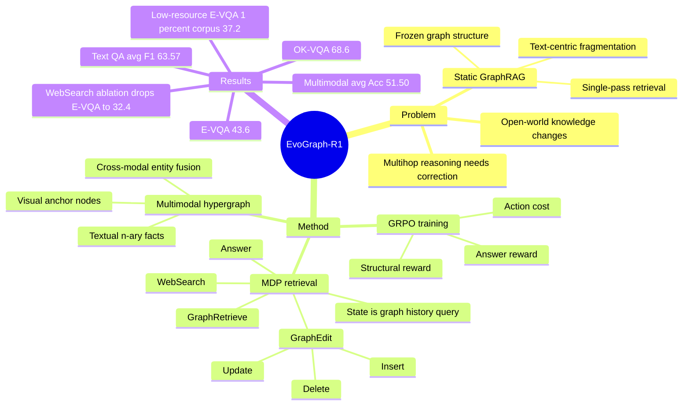

## Summary

EvoGraph-R1 把 multimodal GraphRAG 从“离线构图 + 一次检索”改写为一个 agent-environment MDP：agent 在动态 multimodal knowledge hypergraph 上执行 G RAPH R ETRIEVE、W EB S EARCH、G RAPH E DIT、A NSWER，并通过 RL 学习何时检索、补充、修正或终止。论文的核心贡献是把 retrieval state 显式持久化为可编辑 hypergraph，从而在 text QA 和 multimodal VQA 上同时提升 accuracy、retrieval efficiency 与 traceability。

## Problem & Motivation

作者针对的是 knowledge-intensive VQA / QA 中的 RAG 结构瓶颈。标准 RAG 把证据当作 flat text chunks 或 page-level screenshots，容易丢失多跳关系和 cross-modal alignment；GraphRAG 虽然引入 entity-relation graph，但通常是离线一次构建、推理时静态查询，无法在发现缺失事实、矛盾或噪声时在线修正。

论文明确把问题归结为三个 bottleneck：**text-centric fragmentation** 会把丰富的 multimodal evidence 压成孤立文本 tuple；**static structure** 使 graph 不能吸收新证据或纠错；**rigid retrieval** 让系统在初始检索不足时无法调整策略或调用外部搜索。重要性在于，open-world knowledge 不可能完全存在模型参数或固定 corpus 里；如果 retrieval substrate 本身不能演化，multi-hop reasoning 的失败会沿着错误 graph 传播。

## Method

**Multimodal Hypergraph Construction.** EvoGraph-R1 先从 multimodal corpus 构建统一 hypergraph。文本侧用 MLLM-based extractor 从 text segments 中抽取 n-ary relational facts，每个 hyperedge 包含 natural-language description、entity set、relation type 和 confidence score。视觉侧先为每张图生成 scene description 和 primary object names，再用 image anchor node 绑定视觉 hyperedges，避免 visual facts 脱离原始图像语境。跨模态融合阶段通过 entity label normalization、string similarity 和 embedding proximity 做 entity resolution，最后用 GME 这类 multimodal encoder 为 textual entities、visual entities 和 hyperedges 建索引。

**MDP formulation.** 论文把 graph retrieval 形式化为离散时间 MDP。状态是 `st = (Gt, Ht, q)`：当前 hypergraph、历史 action/reward/graph transition、输入 query。action space 有四类：G RAPH R ETRIEVE 查询当前 graph；W EB S EARCH 在 graph evidence 不足时检索外部信息；G RAPH E DIT 通过 I NSERT / U PDATE / D ELETE 修改 graph；A NSWER 终止并基于 evolved hypergraph 生成答案。只有 G RAPH E DIT 直接改变 graph structure，G RAPH R ETRIEVE 标记访问，W EB S EARCH 提供外部 evidence。

**Graph evolution.** I NSERT 添加从 retrieved content 中验证的新 entities / hyperedges；U PDATE 修正错误、冲突或弱 grounding 的 hyperedges；D ELETE 不是硬删除，而是降低低质量或被反驳元素的 confidence score。这个设计让 graph 从 sparse / noisy initial state 逐步变成 query-specific knowledge state，目标是同时解决缺失证据、错误边和冗余噪声。

**RL optimization.** Agent policy 使用 GRPO 训练，reward 是 trajectory-level：structural reward 检查 reasoning step 是否符合协议，answer reward 是 predicted answer 与 ground-truth 的 token-level F1-style overlap，overall reward 再扣除 retrieval / graph edit action cost。一个关键约束是，answer reward 只有在 structural reward 达到 1.0 时才计入，等于把“格式/流程有效”作为 correctness reward 的 gate。

## Key Results

**Text-only QA（Table 1）**：EvoGraph-R1-7B 在 2WikiMultiHopQA / HotpotQA / Natural Questions 上分别达到 **68.5 / 65.4 / 56.8 F1**，平均 **63.57**。强 baseline Graph-R1-7B 为 **65.0 / 62.7 / 49.9**，平均 **59.20**；因此 EvoGraph-R1 相对 Graph-R1 在三项上分别提升 **+3.5 / +2.7 / +6.9 F1**。Search-R1-7B 平均 **46.03**，MMSearch-R1-7B 平均 **41.80**，说明动态 hypergraph evolution 不只是比 vanilla RAG 强，也明显优于只把 search 当 transient prompt context 的 RL retrieval 方法。

**Multimodal VQA（Table 2）**：EvoGraph-R1-7B 在 E-VQA / InfoSeek / OK-VQA 上达到 **43.6 / 42.3 / 68.6 accuracy**，平均 **51.50**。MMSearch-R1-7B 为 **36.9 / 41.3 / 59.9**，平均 **46.03**；MMKB-RAG 为 **35.9 / 36.4 / 65.4**，平均 **45.90**；GPT-4o-mini 在 OK-VQA 上是 **65.9**。论文报告 EvoGraph-R1 在 E-VQA 上比 MMSearch-R1 高 **+6.7**、比 MMKB-RAG 高 **+7.7**，在 OK-VQA 上比 GPT-4o-mini 高 **+2.7**。

**Ablation（Table 3）**：Full model 在 2WikiMultiHopQA / E-VQA 上是 **68.5 F1 / 43.6 Acc**，平均 retrieval rounds 为 **2.57 / 1.65**。去掉 multimodal hypergraph 后降到 **63.1 / 38.8**；去掉 I NSERT 降到 **60.1 / 36.8**，且 retrieval rounds 增到 **3.48 / 2.45**；去掉 U PDATE 降到 **63.0 / 39.7**；去掉 D ELETE 降到 **66.1 / 42.1**；去掉 W EB S EARCH 降到 **58.9 / 32.4**。最大跌幅来自 W EB S EARCH 和 I NSERT，说明外部 evidence acquisition 与 graph expansion 是核心收益来源。

**Efficiency / robustness / graph refinement**：EvoGraph-R1 在 2Wiki 和 E-VQA 上分别用 **2.57 / 1.65** retrieval rounds 完成查询；Figure 3 报告 EvoGraph-R1 约 **2.4 turns / 1,300 tokens**，相比 no graph editing 的约 **3.1 turns / 2,850 tokens** 和 MMSearch-R1 的约 **3.5 turns / 2,200 tokens** 更短。低资源 E-VQA 中，当 Wikipedia 只保留 **1% corpus** 时，EvoGraph-R1 仍有 **37.2% accuracy**，baseline 范围是 **13.2% 到 18.9%**；相对 MMKB-RAG 的 gain 从 full corpus 的 **+7.7** 扩大到 **1%: +13.2 / 5%: +13.8 / 10%: +12.9**。Table 4 显示 graph refinement 后 nodes 从 **120,499** 到 **123,631**、hyperedges 从 **177,408** 到 **181,418**、graph density 从 **0.781** 到 **0.842**、clustering coefficient 从 **0.024** 到 **0.028**、edge semantic similarity 从 **0.664** 到 **0.685**。

## Strengths & Weaknesses

**已知 Strengths.** 论文的 problem formulation 有价值：把 GraphRAG 的失败从“retriever 不够强”推进到“knowledge graph 作为静态数据结构不适合 iterative reasoning”。MDP state/action/reward 的定义相对清楚，G RAPH R ETRIEVE / W EB S EARCH / G RAPH E DIT / A NSWER 也对应了实际 retrieval agent 需要的四类操作。实验覆盖 text-only 与 multimodal settings，并包含 RAG、GraphRAG、RL-augmented retrieval 三类 baseline；ablation 明确显示 I NSERT、U PDATE、D ELETE、W EB S EARCH 的边际贡献。

**已知 Limitations / boundary.** 论文正文没有单独的 limitations section，也没有报告 code URL、DOI 或自身 arXiv id。Knowledge construction 使用 GPT-4o-mini，base MLLM 使用 Qwen2.5-VL-7B / Qwen2.5-7B-Instruct，因此结果混合了 graph-evolution algorithm、construction model quality、retriever GME、external web search 与 policy learning 的贡献；这些组件替换后是否保持同样收益，正文没有系统拆开。Reward 中 answer quality 用 token-level overlap，适合 text QA，但对 multimodal VQA 中的 semantic equivalence、visual evidence sufficiency 和 hallucination attribution 可能偏粗。

**已知 failure / ablation signals.** 去掉 W EB S EARCH 后 E-VQA 从 **43.6** 跌到 **32.4**，说明 static corpus coverage 仍是硬瓶颈；去掉 I NSERT 后 retrieval rounds 从 **2.57** 到 **3.48**，说明 agent 如果不能把新 evidence 写回 graph，会反复搜索不可用信息。D ELETE 的收益最小但稳定，2Wiki / E-VQA 只下降 **2.4 / 1.5**，这暗示噪声过滤有用，但比 evidence expansion 和 correction 次要。

**推测.** 对 GUI / web agent 的启发不是直接的界面操作能力，而是“把外部观察和检索结果沉淀为可编辑状态”的设计范式：GUI agent 也可能需要把 screen evidence、task memory、web search result 写入结构化 state，而不是每步重新塞 prompt。EvoGraph-R1 的 graph edit actions 可以类比为 agent 对 working memory 的 insert / correct / prune，但这篇没有在 GUI benchmark 或 embodied task 上验证。

**不知道.** 不知道 W EB S EARCH 调用的具体 search engine、网页内容过滤策略、失败率和 latency，也不知道 graph edit 的 verifier 如何避免把错误 web evidence 写入长期 graph。Figure 4 的 generation quality 是 LLM-as-Judge，正文没有给出七个维度的具体数值，因此只能确认作者报告“全部维度优于 baselines”，不能补写定量差距。低资源实验只在 E-VQA 上报告，是否能迁移到 InfoSeek、OK-VQA 或更强 closed-book MLLM 也未证明。

## Mind Map

## Notes

- 这篇最值得保留的 insight 是：retrieval memory 不应只是 retrieved context，而应是 agent 可以增删改查的 external state。这个角度和 GUI / web agent 的 working memory、task state tracking 有潜在连接。
- 需要警惕“self-evolving graph”这个叙述可能掩盖 verification 问题：如果 W EB S EARCH 返回噪声，G RAPH E DIT 的 U PDATE / I NSERT 如何判断可置信？论文给出 confidence score 和 reward，但没有把错误 evidence 写入的 failure rate 单独量化。
- 如果后续做相关 idea，可以把它和 Graph-R1、MMSearch-R1 对照：前者偏 graph interaction，后者偏 search-as-action，EvoGraph-R1 的差异在于把 search/edit 的结果沉淀为 persistent hypergraph state。
