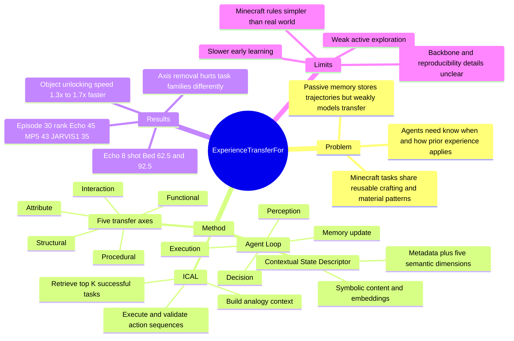

## Summary
Echo 把 Minecraft multimodal LLM agent 的 memory 从被动检索库改成显式的 experience transfer 机制：用五个 transfer axes（structure, attribute, process, function, interaction）组织经验，再通过 ICAL 做类比式检索、改写和验证。论文在 Minecraft from-scratch learning 中报告 Echo 相比 Voyager、MP5、JARVIS-1、MrSteve 等 baseline 有更快的 item unlocking 过程，尤其在积累少量可迁移经验后出现 burst-like chain-unlocking。

## Problem & Motivation
作者要解决的问题不是“agent 有没有 memory”，而是 memory 里的经验怎样被结构化成可迁移知识。现有 Minecraft / embodied agents（如 Voyager、JARVIS-1、MrSteve、MP5）已经能把历史轨迹、规则或 skill 存起来，但论文认为这些 memory 往往仍是 passive repository：检索到历史例子后帮助当前 goal planning，却没有显式建模哪些经验在新任务中仍然成立。

Minecraft 是一个适合研究这种问题的环境，因为 crafting、mining、smelting、material hierarchy 和工具功能之间存在重复结构：例如“wooden pickaxe -> mine stone -> stone pickaxe”和“stone pickaxe -> mine iron -> smelt -> iron pickaxe”共享过程模式。作者的核心 motivation 是：如果 agent 能识别这些跨任务重复的结构、属性、过程、功能和交互模式，就可以减少每个 item / recipe 从零探索的成本。

## Method
**Explicit Transfer Dimensions.** Echo 把可迁移经验拆成五个维度。Structural axis 描述空间布局、层级关系和 reachability；Attribute axis 描述颜色、纹理、硬度、材质等物理/视觉属性；Procedural axis 描述动作造成的状态转移和因果链；Functional axis 描述对象能做什么、在任务中扮演什么角色；Interaction axis 描述 agent 如何感知、操作并收到环境反馈。论文明确区分了它与 MrSteve 的 What-Where-When memory：MrSteve 重点是 episodic memory retrospection，Echo 重点是 structured memory for task transfer。

**Contextual State Descriptor (CSD).** CSD 是 Echo 的统一状态表达，包含 metadata 以及 struct / attr / proc / func / inter 五个 semantic dimensions。它把 visual、textual、interactive signals 压缩成可比较、可验证的 semantic snapshot；每个维度既有 symbolic content，也有 global embeddings，便于向量检索和解释性检查。论文还说训练阶段用 instruction fine-tuning 让 MLLM 更稳定地产生格式化 CSD，训练数据来自 multimodal task instructions、historical execution traces 和 verifier feedback。

**ICAL workflow.** Echo 只把 successful tasks 写入 long-term memory，并离线做 consolidation、cleaning、deduplication、clustering。执行新任务时，它先选 representative task（最成功或最近学会的任务），再按五个 CSD 组件的 multidimensional semantic similarity 检索 top-K related tasks，构造 ICL context；MLLM 只输出 action sequences，随后在环境里执行和验证。成功轨迹回写 memory，失败被记录，从而形成持续的 experience accumulation。

**Agent loop.** 系统是 perception / decision / execution 三层循环：perception layer 读取 position、health、inventory、visual input、scene caption 等；decision layer 用 prompt builder 和 planner 生成 command sequence，并由 pre-checker 做 resource / position 等检查；execution layer 执行动作、观察结果、更新 task manager，失败时调用 recovery。形式化上，memory 同时保留 symbolic graph 和 vector embeddings；frozen instruction-tuned MLLM 通过 retrieved exemplars 生成 hierarchical plan 和 self-verification assertions，verifier 再判断 plan 是否逻辑一致、任务是否可行。

## Key Results
**From-scratch learning / Table 1.** 论文用 Minecraft cold-start tasks 评估 Success@0→10 和 Success@0→30，任务族包括 Recipe、Functional Eq.、Crafting Chain、Utility Blocks。Echo 8-shot 在 Recipe 上达到 Bed 62.5 / 92.5、Iron Pickaxe 52.5 / 87.5、Shield 55.0 / 87.5；对比 JARVIS-1 为 60.0 / 87.5、50.0 / 85.0、50.0 / 80.0，MP5 为 40.0 / 67.5、37.5 / 65.0、35.0 / 60.0。Functional Eq. 中 Echo 8-shot 为 BridgeEq 50.0 / 80.0、SmeltEq 47.5 / 80.0、WeaponEq 45.0 / 75.0；JARVIS-1 对应为 47.5 / 77.5、45.0 / 75.0、40.0 / 70.0。

**Few-shot scaling.** Echo 从 1-shot 到 8-shot 随 contextual examples 增加整体提升，但 gains 有饱和趋势。论文报告 1-shot 已能 match 或超过多数 baseline；4-shot 和 8-shot 在 Recipe / Crafting Table 相关任务上达到最高整体成功率，其中 Echo 8-shot 的 Crafting Grid 为 57.5 / 92.5、Crafting Table 为 55.0 / 87.5、Furnace 为 37.5 / 70.0。

**Continuous learning / Figure 8.** 在 0-30 episode 的 continuous learning test 中，Echo early phase 较慢，但 episode 10 后加速，最终阶段稳定在约 46-48% 附近；论文文本给出的 episode 30 排名是 Echo 45、MP5 43、JARVIS-1 35、MrSteve 33、Voyager 18。作者据此主张 Echo 通过 explicit axes 和 structured ICL 获得更强的 mid-to-late learning rate，而 JARVIS-1 在 0-10 episode 的 cold-start 更快但 20 episode 后增长趋缓。

**Unlocking speed.** 论文摘要和 Figure 2 报告，在 object-unlocking tasks 的 from-scratch setting 下，Echo 达到相同 milestone 的速度约为 baseline 的 1.3x-1.7x，并出现 mid-stage 的 rapid unlocking：一旦学到可迁移经验，多个相似 items 会在较短区间内连续解锁。

**Ablation / Figure 7.** 去掉单个 transfer axis 会造成可观性能下降：移除 Attribute 使 Recipe 下降 11%；移除 Structural 使 Functional Eq. 下降 7%、Crafting Chain 下降 9%；移除 Procedural 使 Crafting Chain 下降 12%；移除 Functional 使 Functional Eq. 下降 9%；移除 Interaction 使 Utility Blocks 下降 7%。这支持“不同任务族依赖不同 transfer axes”的解释，但论文没有把每个 axis 的 contribution 与 CSD 生成质量、retrieval quality、planner backbone 分开做更细粒度归因。

## Strengths & Weaknesses
**已知：亮点。** 这篇论文的问题意识是对的：很多 embodied / game agents 的 memory 仍停留在“存储和检索历史轨迹”，而 Echo 试图把经验拆成可迁移的因子，这比单纯扩大 memory bank 更接近 causal / structural reuse。五个 axes 也有较强解释性，能把 recipe transfer、functional equivalence、long-horizon crafting chain 和 UI/block interaction 这些现象放进同一框架里。

**已知：实验支持。** Table 1、Figure 7、Figure 8 至少覆盖了 baseline comparison、few-shot scaling、continuous learning 和 axis ablation 四类证据。尤其 ablation 中 Procedural 对 Crafting Chain 的 -12%、Attribute 对 Recipe 的 -11%、Interaction 对 Utility Blocks 的 -7% 与任务语义基本一致，说明作者不是只展示总分提升，也试图解释哪些 axis 对哪些任务更关键。

**已知：局限。** 论文在 conclusion 里承认 Echo 更强调 skill acquisition / learning，而不是 active exploration；它依赖 prior knowledge 和 retrieval，因此在 unfamiliar 或 information-sparse environments 中不如 MP5 这类 active perception 系统。作者还明确说 Minecraft 虽 open-ended，但规则简单且一致；真实物理世界更 ambiguous、causally complex，所以 skill transfer 不会像 Minecraft 中这样直接。

**推测：对 GUI-agent / computer-use 的启发。** 虽然环境是 Minecraft，不是 GUI benchmark，但五个 transfer axes 很像 computer-use agent 需要的可迁移经验分解：UI layout / hierarchy 对应 Structural，控件属性和视觉样式对应 Attribute，workflow state transition 对应 Procedural，控件 affordance 对应 Functional，鼠标键盘操作及反馈对应 Interaction。这个类比有价值，但论文没有在 GUI / web / desktop tasks 上验证，所以只能作为迁移假设。

**不知道：实现与可复现细节。** 正文没有出现本论文的 code URL、DOI 或 arXiv ID；也没有在可读文本中清楚交代具体 MLLM backbone、prompt budget、retrieval embedding model、CSD instruction-tuning 数据规模、Minecraft world seeds 和完整 variance / significance test。因而结果可以作为方向性 evidence，但还不足以判断 Echo 的增益主要来自 transfer-axis representation、retrieval policy、prompt engineering、self-checker，还是 baseline implementation gap。

## Mind Map

## Notes
- **我的判断**：rating=4。它不是 GUI-agent 论文，但对 agent memory、embodied reasoning、task planning 的问题切分很贴近当前兴趣；最有价值的点是把“经验迁移”从 vague memory retrieval 拆成可检查的 transfer axes。
- **和 GUI Agent 方向的连接**：如果把 desktop/web 操作看作长期 workflow learning，Echo 的 CSD 可以启发一种 GUI experience schema：layout structure、visual/control attributes、workflow procedure、widget function、interaction feedback。关键问题是 GUI 中 state transition 更隐蔽，且失败 feedback 更 sparse，这会比 Minecraft 更难。
- **需要继续追问**：CSD 的五个 axes 是否是必要且充分的？能否用 learned latent factors 自动发现 transfer axes？ICAL 检索失败时 Echo 如何避免错误类比？baseline 是否使用了相同 backbone 和相同 action interface？这些决定它是一个通用机制，还是 Minecraft recipe domain 的结构化 prompt 工程。
