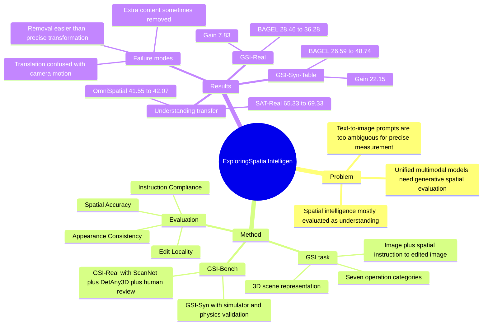

## Summary
这篇论文提出 Generative Spatial Intelligence (GSI)，把 spatial intelligence 从传统的 recognition / QA-style understanding 扩展到图像生成与编辑时能否遵守 3D spatial constraints。作者构建 GSI-Bench，包括真实图像的 GSI-Real 与仿真生成的 GSI-Syn，并显示仅用 GSI-Syn 做 generative editing fine-tuning 可以提升 BAGEL 在 GSI-Bench 和部分 spatial understanding benchmark 上的表现。

## Problem & Motivation
已知：现有 spatial intelligence benchmark 主要评估 MLLM 能否识别、描述或回答空间关系问题，常见形式是 understanding / QA / offline diagnostics；但 unified multimodal models 同时具备 understanding 和 generation，尚缺少系统评估其在生成过程中操纵空间约束的能力。论文的问题是：现代 generative 或 unified multimodal model 是否具备 Generative Spatial Intelligence，能否被可靠、可扩展、模型无关地测量，以及能否通过 targeted generative training 改善并迁移到 spatial understanding。

已知：作者认为 text-to-image prompt 太开放，缺少唯一 ground truth，不适合精确衡量空间一致性。因此论文把 GSI 操作化为 spatially grounded image editing：给定输入图像和明确空间编辑指令，模型必须输出满足指定 3D transformation 的图像，同时保持 realism、semantic consistency 和局部编辑性。

推测：这个问题对 GUI-agent / embodied agent 的价值不在于直接产生 action policy，而在于把“理解空间关系”推进到“生成或修改一个符合空间约束的视觉状态”，更接近 world model 或视觉规划中的状态转换。未知：论文没有直接验证这些 generative spatial gains 是否能提升真实 navigation、manipulation 或 GUI interaction 成功率。

## Method
论文将 scene 表示为 object set 与 camera 的 3D structure：每个 object 包含 center、size、rotation，camera 包含 rotation、translation 和 intrinsics；空间编辑指令表示为 target object、action 和 3D geometric transformation。模型输入为图像 I 和文本指令 T，输出 I'，目标是满足 move、place、rotate、remove、scale、perspective change 等空间变换。

GSI-Bench 覆盖七类 spatial operations：Camera-Relative Move、Object-Relative Place、Object Rotation、Receptacle Placement、Perspective Control、Spatial Removal、Object Scaling。这些操作被设计为 object-level、camera-level 和 scene-level 的 3D transformations，而不是普通风格迁移或语义编辑。

GSI-Syn 是 synthetic benchmark 与训练数据来源，基于 AI2-THOR 和 MesaTask。pipeline 包括：用 DBSCAN 在 floor plan 上采样 room/viewpoint，优先选择可操作物体多的视角；随机选择 target / reference / container object；通过 3D geometric checks 保证可见性、支撑面稳定性、collision avoidance 和空间充足性；在 physics-enabled simulator 中执行并验证 actual state 是否匹配 ideal state；最后用 instance segmentation mask 过滤像素变化过小的样本，并用 Qwen3-VL-235B 过滤 clipping、severe occlusion、physically implausible outcome 等异常。

GSI-Real 从 ScanNet++ 真实 indoor RGB-D 数据中构建。由于真实图像不能直接执行物理编辑并得到 ground-truth edited image，作者用 DetAny3D 从单帧重建 3D bounding boxes、poses 和 semantic labels，再生成 move / rotate / remove 等操作；通过投影 before-and-after bounding boxes 做 visualization-based verification，并用 MLLM 检查物理错误、修正 label-object mismatch、重写自然语言 instruction，最后人工 review 修正残留标注错误和歧义指令。

评估协议包含四个维度：Instruction Compliance (IC) 评估是否满足空间语义；Spatial Accuracy (SA) 对通过 compliance 的样本计算 normalized translation error、relative pose error 和 SO(3) geodesic rotation error；Edit Locality (EL) 用 non-target region 的 LPIPS 转成 100(1-LPIPS) 衡量非目标区域保持程度；Appearance Consistency (AC) 用 Qwen3-VL-235B 检查物体外观属性或 removal 后的背景 inpainting 质量。训练实验以 BAGEL 为 base model，仅用 GSI-Syn 的 spatial editing triplets fine-tune，不加入 understanding / reasoning 数据。

## Key Results
- GSI-Bench 规模：GSI-Real 包含 441 samples，来自 ScanNet++ 的 211 个 indoor scenes，覆盖 3 类操作；GSI-Syn-Room 包含 593 samples、6 类操作，GSI-Syn-Tabletop 包含 600 samples、3 类操作；GSI-Syn-Bathroom 用于 cross-view generalization，包含 200 samples；GSI-Syn-Train 每种操作每个环境 1,500 training samples，总计 10,500 samples，并与 test scenes 严格隔离。
- GSI-Real 主结果：BAGEL average 为 28.46，BAGEL + GSI-Syn fine-tuning 提升到 36.28，增益 +7.83；其中 IC 31.97→40.14 (+8.16)，SA 22.07→27.76 (+5.68)，AC 31.88→40.14 (+8.25)，EL 27.89→37.11 (+9.22)。同表中 Qwen 为 43.44，Emu3.5 为 43.52，Nano Banana 为 33.52，GPT-img 为 34.70。
- GSI-Syn-Table 主结果：BAGEL average 26.59→48.74，增益 +22.15；IC 27.17→50.67 (+23.50)，SA 26.52→44.10 (+17.58)，AC 26.52→50.67 (+24.15)，EL 26.17→49.52 (+23.36)。Nano Banana average 为 37.03，GPT-img 为 33.97，Emu3.5 为 34.25。
- GSI-Syn-Room 主结果：BAGEL average 17.37→24.42，增益 +7.05；IC 16.11→24.01 (+7.90)，SA 14.53→19.41 (+4.88)，AC 24.00→31.64 (+7.64)，EL 14.82→22.61 (+7.79)。作者解释 room 场景增益较小，原因是 scene complexity 和 spatial ambiguities 更强，暴露了 global spatial reasoning 的剩余难点。
- OmniSpatial understanding 迁移：BAGEL overall accuracy 41.55→42.07；Dynamic Reasoning 47.38→48.33 (+0.95)，Spatial Interaction 45.67→47.67 (+2.00)，Perspective Taking 39.22→40.29 (+1.07)。但 Complex Logic 从 32.14 降到 28.97，作者将其归因于 fine-tuning corpus 缺少 explicit reasoning supervision。
- SAT-Real understanding 迁移：BAGEL overall accuracy 65.33→69.33，增益 +4.00；GoalAim 75.00→85.29，EgoM 60.87→73.91，Pers 46.97→48.48。并非所有维度都提升：EgoAct 从 75.68 降到 72.97，ObjM 保持 65.22。
- Qualitative / failure observations：大多数模型在 removal 上优于其他操作，说明 deletion 比 precise geometric manipulation 更容易；Ultra 和 AnyEdit 容易不保持 object identity，AnyEdit 经常让 target unchanged，AnyEdit / BAGEL / Omnigen2 会引入 artifacts，BAGEL 有时把 translation 误解成 camera motion，BAGEL / Emu3.5 / Qwen 虽能跟随 referential cues，但偶尔会额外删除其他内容。

## Strengths & Weaknesses
强项：论文的核心贡献是 problem formulation 和 benchmark construction。GSI 把 spatial intelligence 从“看懂空间关系”推进到“生成时主动 enforce spatial constraints”，这对 unified understanding-generation models 是一个清晰且可测的切入点。

强项：GSI-Syn 和 GSI-Real 的互补设计比较扎实。GSI-Syn 提供可控 3D ground truth、physics validation 和可扩展训练数据；GSI-Real 则用 ScanNet++、DetAny3D、MLLM gating 和 human review 减少 synthetic-to-real gap。评估指标也不是单一 leaderboard，而是把 instruction compliance、geometric precision、locality 和 appearance consistency 分开，有助于定位 failure 类型。

强项：实验不仅比较 nine state-of-the-art models，还验证了 GSI-Syn fine-tuning 对 real benchmark 和 understanding benchmark 的迁移。尤其是 BAGEL 在 GSI-Syn-Table 上 +22.15、GSI-Real 上 +7.83，说明 geometry-grounded synthetic supervision 对 spatial editing 有明显效果。

局限：论文主文没有提供组件级 ablation，例如 MLLM gating、human review、physics validation、不同 operation mix 或训练数据规模分别贡献多少；因此目前只能确认 full GSI-Syn pipeline 有效，不能精确归因到某个设计。另一个局限是 fine-tuning 只以 BAGEL 为 base model，尚不知道同样训练是否能稳定改善 Emu3.5、Qwen-Image-Edit、GPT-image 类模型。

局限：GSI-Real 没有 ground-truth edited image，评估依赖 3D reconstruction / projected boxes / MLLM judgment 与人工构建过程；这比 synthetic 更贴近真实图像，但也引入 DetAny3D 误差和 evaluator bias。论文提到 full thresholds 在 appendix，但当前主文只给出原则性定义，复现实验需要依赖附录或代码。

局限：downstream understanding 的提升是存在但不均匀的。OmniSpatial overall 只提升 +0.52，Complex Logic 下降；SAT-Real overall 提升 +4.00，但 EgoAct 下降。这支持“generative spatial training 可以增强部分 spatial understanding”，但不足以 overclaim 为通用 spatial reasoning 全面提升。

## Mind Map

## Notes
对我的研究最有价值的是：这篇论文把 spatial reasoning 的监督形式从 QA 转成“视觉状态转换”，这更接近 embodied / GUI agent 中 action 后世界状态是否符合预期的问题。GSI 仍然是 image editing proxy，不是 action execution，但它提供了一个可控方式去测 unified model 是否能把语言中的空间约束转化为视觉几何变化。

值得继续追问：GSI-Syn 带来的 understanding gain 是来自更好的 3D spatial representation、更多 localized editing supervision，还是来自模型学习到了一组 benchmark-specific transformation priors？论文没有 ablation 能回答这个机制问题。另一个问题是，如果把 GSI-style supervision 接到 video prediction、world model 或 GUI state transition 任务上，是否能比静态 image editing 更直接服务 agent planning。
