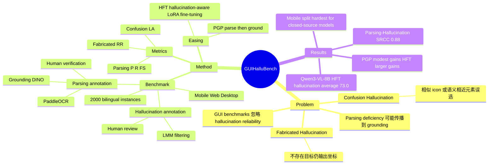

## Summary

这篇论文把 GUI grounding 中的 hallucination 明确拆成 Confusion Hallucination 与 Fabricated Hallucination，并构建 GUI-HalluBench 来同时评估 GUI parsing 和 grounding hallucination。作者进一步提出 training-free 的 Parsing-guided Prompt (PGP) 与 training-based 的 Hallucination-aware Fine-Tuning (HFT)，实验显示 parsing 能力与 hallucination robustness 强相关，且 HFT 在 GUI-HalluBench 上把 Qwen3-VL-8B 的 hallucination average 从 66.0% 提升到 73.0%。

## Problem & Motivation

现有 GUI benchmark 多关注综合能力，例如 grounding、navigation、screen understanding，但很少把 hallucination 当作一等 reliability 问题。对 GUI agent 来说，这个缺口很关键：grounding 错误不是普通分类错，而是会让 agent 点击错误控件，甚至在不存在目标时仍输出看似合理的坐标。

论文观察到两类典型失败：**Confusion Hallucination** 指模型被视觉相似或语义相近的 distractor 误导，选择错误元素；**Fabricated Hallucination** 指模型面对不存在的目标时仍生成 plausible coordinates。作者的核心假设是：这些 grounding hallucinations 不是孤立错误，而与 GUI parsing 的结构理解缺陷紧密相关。

## Method

**GUI-HalluBench** 是论文的核心贡献。作者先构建约 5,000 个 GUI pool：英文界面来自 ScreenSpot 和 AMEX，中文界面由人工采集，覆盖 Daily Life、Transportation、Healthcare、Dining、Entertainment 等中国本地高频 app 场景。界面格式分布为 Mobile 约 41.6%、Web 约 32.3%、Desktop 约 26.1%。

标注分两层：

1. **Parsing Annotation**：用 Grounding DINO 检测 icons，用 PaddleOCR 识别文本，经 NMS 去重后由 LMM 做格式统一和 semantic verification，最后人工复核，得到每个 GUI 元素的语义和 bounding box。
2. **Grounding Hallucination Annotation**：先用 LMM 过滤适合构造 hallucination case 的 GUI，再让 LMM 生成 confusion 或 fabricated suggestions，最后人工 review、validate、finalize。主 benchmark 的 hallucination label 至少由 3 名 human annotators 复核；supplement 中报告三人一致同意率为 96.7%。

最终 benchmark 采样出 2,000 个 bilingual instances，其中英文 1,000、中文 1,000；每个样本同时包含 parsing annotation 和 grounding hallucination annotation。hallucination 类型约 40% 是 Confusion Hallucination、60% 是 Fabricated Hallucination，作者解释为 fabricated cases 在真实 GUI 场景中更常见。

评估指标分两组：

- **Parsing**：Element Precision、Element Recall、Function Similarity，分别衡量元素定位的 false positive、coverage，以及 matched bounding boxes 的语义对齐。
- **Hallucination**：Confusion Hallucination 用 Localization Accuracy (LA)，Fabricated Hallucination 用 Rejection Rate (RR)。Fabricated setting 下，模型需要拒答；若输出坐标或未明确拒绝，则不算正确拒绝。

缓解方法也分两类：

- **PGP (Parsing-guided Prompt)**：不训练模型，只把 prompt 改成 parse-then-ground，要求模型先列出界面元素及坐标，再基于解析结果输出目标坐标。
- **HFT (Hallucination-aware Fine-Tuning)**：额外构建独立于 GUI-HalluBench 的训练数据，包含 20K parsing interfaces 和 10K hallucination-aware grounding instances；同时混合 WidgetCaption、UI RefExp、RICO-Semantics、RICO-SCA、OS-Atlas、ShowUI、GUIEnv、SeeClick-Web、ScreenQA、ShareGPT-Computer、LLaVA-Instruct 等数据。作者用 LoRA fine-tune Qwen3-VL-8B 和 InternVL3.5-8B，冻结 ViT 与 aligner，在 8 张 NVIDIA A100 80GB 上训练 3 epochs，LoRA rank 8、alpha 32、learning rate 1e-4、warmup ratio 0.03。

## Key Results

**GUI-HalluBench overall performance (Table 2)**：

| Model | Parsing Avg | Hallucination Avg |
|:---|---:|---:|
| GPT-4o (with grounding) | 20.2% | 57.2% |
| Claude Computer Use | 37.7% | 56.6% |
| Gemini-2.0 (Project Mariner) | 41.6% | 60.5% |
| InternVL3.5-8B | 55.7% | 63.2% |
| Qwen3-VL-8B | 58.1% | 66.0% |
| GUI-Owl-7B | 55.4% | 64.9% |
| InternVL3.5-8B (HFT) | 71.9% | 69.1% |
| Qwen3-VL-8B (HFT) | 72.3% | 73.0% |

几个关键信号：

- 在 GUI-HalluBench 上，closed-source general LMM 并不领先：Gemini-2.0 是 closed-source 里最高，hallucination average 为 60.5%，低于 Qwen3-VL-8B 的 66.0% 和 GUI-Owl-7B 的 64.9%。
- GPT-4o 的 parsing precision 只有英文 4.3%、中文 3.4%，但 hallucination average 仍有 57.2%；这说明 general reasoning strength 不等价于 GUI structural perception。
- PGP 收益稳定但幅度有限：Qwen3-VL-8B 的 hallucination average 从 66.0% 到 67.7%，InternVL3.5-8B 从 63.2% 到 64.8%，Claude Computer Use 从 56.6% 到 59.2%。
- HFT 收益更大：Qwen3-VL-8B 的 hallucination average 从 66.0% 到 73.0%，绝对提升 7.0%；InternVL3.5-8B 从 63.2% 到 69.1%，绝对提升 5.9%。

**Parsing 与 hallucination 的相关性 (Figure 6)**：

- Parsing Avg 与 Hallucination Avg 的 SRCC 为 0.88，支持作者的主张：grounding hallucination 与 parsing deficiency 强相关。
- Function Similarity 与 hallucination 指标相关性明显弱，例如 English Function Similarity 与 Hallucination Avg 的 SRCC 为 0.27；作者解释为 hallucination 更依赖元素检测和上下文推理，而不是 matched box 上的语义相似度。

**GUI format split (Table 4)**：

| Model | Mobile | Desktop | Web |
|:---|---:|---:|---:|
| GPT-4o (with grounding) | 40.2% | 60.2% | 69.4% |
| Claude Computer Use | 37.7% | 58.1% | 66.7% |
| Qwen3-VL-8B | 58.1% | 62.2% | 67.8% |
| Qwen3-VL-8B (PGP) | 60.3% | 64.0% | 69.6% |
| InternVL3.5-8B (HFT) | 69.9% | 71.6% | 70.9% |
| Qwen3-VL-8B (HFT) | 71.2% | 74.1% | 73.3% |

Mobile GUI 更难：closed-source models 在 Mobile 上明显低于 Desktop/Web；HFT 后 Qwen3-VL-8B 在 Mobile/Desktop/Web 分别达到 71.2%/74.1%/73.3%，是表中整体最强。

## Strengths & Weaknesses

**亮点**：

1. 问题定义很准。论文不是泛泛讨论 VLM hallucination，而是把 GUI grounding 的可靠性问题落到两个可评估 failure modes：相似元素误选与不存在元素编造。
2. Benchmark 设计比单纯 grounding accuracy 更接近 deployment risk。Fabricated Hallucination 要求模型拒答，这和 WebArena 中 unachievable task 的精神一致：agent 不能只会输出动作，还要知道何时不该行动。
3. Parsing subset 与 hallucination subset 的双层设计有诊断价值。SRCC 0.88 的结果说明 parsing quality 可能是 GUI grounding reliability 的关键瓶颈，而不是只靠更强语言推理就能解决。
4. PGP 与 HFT 形成了 cost ladder：PGP 几乎无成本但提升小，HFT 成本高但收益显著；这比只给一个 heavy training recipe 更有实践参考价值。

**局限**：

1. Benchmark 构造仍部分依赖 LMM 过滤和 LMM suggestion。虽然有人工复核，样本分布仍可能继承 GPT-4o、Gemini-2.0、Qwen3-Max 对“什么是 plausible hallucination”的偏好。
2. HFT 的收益归因不够干净。训练配方混入大量公开 GUI grounding / VQA / general instruction 数据，同时加入 self-built parsing 与 hallucination data；论文没有给出只移除 hallucination-aware data、只保留 parsing data、只保留 public GUI data 的细粒度 ablation，因此“到底是哪部分数据带来 7.0% 提升”仍不完全清楚。
3. PGP 的实际收益偏 modest。对 Qwen3-VL-8B 仅提升 1.7%，对 InternVL3.5-8B 提升 1.6%；它验证了 parse-then-ground 的方向，但不是充分解决方案。
4. 作者自己承认 GUI-HalluBench 覆盖专业高风险场景不足，例如 medical diagnostic dashboards、financial trading terminals、engineering design tools 都没有纳入；因此它对 safety-critical GUI agent 的外推有限。
5. Forward-generalization 仍是问题。benchmark 基于当前 GUI layout 与 icon convention 构造，面对 adaptive layouts、dynamic widgets、新 icon metaphors 或 AR interfaces 时，hallucination patterns 和 HFT mitigation 可能失效。

**已知 / 推测 / 不知道**：

- 已知：GUI-HalluBench 有 2,000 个 bilingual multi-platform instances；HFT 在该 benchmark 上显著提升 Qwen3-VL-8B 与 InternVL3.5-8B；Parsing Avg 与 Hallucination Avg 的 SRCC 为 0.88。
- 推测：如果一个 GUI agent 系统能显式引入可靠 parser 或 UI element inventory，再做 action grounding，可能比纯 screenshot-to-coordinate 更抗 hallucination；但这篇论文只验证了 prompt 与 fine-tuning 两种路径，没有验证完整 agent loop。
- 不知道：HFT 在真实多步 GUI automation 中能否转化为 task success rate 提升；GUI-HalluBench 上的 RR/LA 改善是否会降低误点击、错误提交、不可逆操作等 end-to-end 风险。

## Mind Map

## Notes

- 对 GUI agent 研究的直接启发：hallucination 评估应该把“选错相似元素”和“面对不存在元素仍行动”分开，否则一个 aggregate grounding accuracy 会掩盖很不同的风险来源。
- 这篇论文更像 benchmark + diagnosis + mitigation baseline，而不是一个强方法论文。真正重要的是问题 formulation：GUI grounding reliability 不能只看 hit rate，还要看 abstention / rejection。
- 后续值得追踪：把 GUI-HalluBench 的 fabricated setting 扩展到多步任务，例如目标不存在、页面状态未达成、权限不足、外部服务失败时，agent 是否能停下来而不是继续生成 action。
