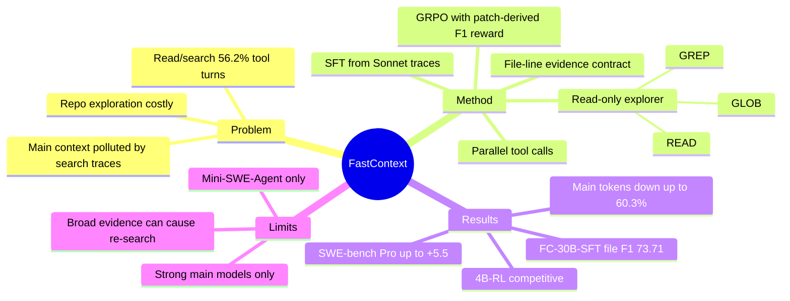

## Summary

FastContext 把 coding agent 的 repository exploration 从主 solver 轨迹中拆出来，训练一个只做 read/glob/grep 的专用 explorer，返回紧凑的 file-line evidence。核心结果是：在 Mini-SWE-Agent 上接入 FastContext 后，SWE-bench Multilingual / SWE-bench Pro / SWE-QA 的端到端成功率普遍提升，同时显著降低主模型 token 消耗，说明“找上下文”可以成为独立可训练的 agent-facing affordance。

## Problem & Motivation

coding agent 在真实 repo 任务中不只是“会不会写 patch”，还要先找到相关文件和代码区域。论文对 300 条 GPT-5.4-high + Mini-SWE-Agent 的 SWE-bench Multilingual 轨迹做分析，发现 read/search 占 9.96 / 17.72 个 tool-use turns（56.2%），消耗 46.5% 主 agent tokens；首次 edit 前中位数需要 6 个顺序 exploration turns 和 15.5 个 exploration tool calls。

这暴露出一个结构性问题：主模型把大量探索噪声留在自己的上下文里，后续 reasoning / editing 都背着这些无关片段。FastContext 的动机不是再造一个完整 coding agent，而是把 repository exploration 做成可复用、低成本、只读、可训练的 subagent，让主 solver 只接收少量可引用证据。

## Method

**Runtime contract**：FastContext 是 read-only exploration subagent，只暴露三个 language-agnostic tools：`READ`（带行号读文件）、`GLOB`（路径发现）、`GREP`（regex 搜索）。它可以在同一 turn 并行发多个 tool calls，最后输出 `<final_answer>` block，包含文件路径、行号范围和简短相关性说明；主 agent 再基于这些 evidence 做 focused read、edit、test。

**SFT policy initialization**：作者从 Sonnet 4.6 exploration traces 构造 2,954 条 SFT 数据，分三类行为训练：

- `parallel_toolcalls`：990 条，训练首轮 broad search，把 path / symbol / entry point 等互补信号一次性并行查出来；
- `multiturn_traj`：983 条，保留多轮搜索轨迹，训练 observation-driven refinement；
- `linerange`：981 条，训练只输出窄 file-line citation 的 final answer。

训练使用 Qwen3-4B-Instruct 和 Qwen3-Coder-30BA3B，assistant-token-only loss masking，目标是让小模型学会完整 exploration loop，而不是只学最终文件分类。

**RL task-grounded refinement**：SFT 不能直接优化“最终 citations 是否覆盖能修 bug 的位置”，所以作者用 400 个 issue-resolution prompts 和 reference patches 构造 patch-derived file/line labels，再用 GRPO 训练 4B explorer。Reward 由 file-level F1、line-level F1、bounded parallelism bonus 和 format penalty 组成：空输出、超长输出、坏 citation、过度 fan-out 都会被惩罚。

**Evaluation**：端到端把 FastContext 接入 Mini-SWE-Agent，主 agent 用 GPT-5.4 / GLM-5.1 / Kimi-K2.6，在 SWE-bench Multilingual、SWE-bench Pro、SWE-QA 上评测。另用 SWE-bench Verified 的 patch-derived reference locations 做 standalone localization 评估。

## Key Results

**端到端成功率**：

- GPT-5.4 + same-model exploration 在 SWE-bench Pro 从 46.0 提升到 51.5（+5.5）；FC-4B-RL 达 48.5（+2.5），但更省 token。
- GLM-5.1 + FC-4B-RL 在 SWE-bench Pro 从 17.5 提升到 22.5（+5.0）。
- Kimi-K2.6 + FC-4B-RL 在 SWE-bench Multilingual 从 76.3 提升到 78.3（+2.0），在 SWE-bench Pro 从 31.0 提升到 33.5（+2.5）。

**主模型 token 节省**：

- GPT-5.4 + FC-4B-RL 在 SWE-bench Multilingual 从 457k 降到 338k（-26.0%），SWE-bench Pro 从 818k 降到 701k（-14.3%），SWE-QA 从 418k 降到 210k（-49.8%）。
- same-model exploration 在 GPT-5.4 SWE-QA 上 token 从 418k 降到 166k（-60.3%），但成本上不如小模型 explorer 有吸引力。
- 成本 audit：GPT-5.4 SWE-bench Multilingual 中，4B-RL explorer 总计 22.58M tokens，按 \$0.20 / 1M tokens 估算仅 \$4.52；主模型成本从 \$282.47 降到 \$208.92，即使算上 explorer 仍省 \$69.03。

**Standalone localization**：

- 非 frontier 模型里，FC-30B-SFT 达 file-level F1 73.71、module-level F1 60.35；最佳非 FastContext baseline 是 68.57 / 50.88。
- 4B 模型经 SFT 从 file-level F1 62.57 提升到 70.55；再经 RL 到 71.48。RL 主要提升 recall，符合 reward 覆盖 patch-relevant locations 的设计。

## Strengths & Weaknesses

**亮点**：

- 问题切分很干净：把 repository exploration 作为独立可训练组件，而不是埋在主 agent 的 ReAct 轨迹里。这和 [[Papers/2606-OpenRath]] 的 “runtime state should be explicit” 是同一类系统 taste。
- 方法简单可复用：只读工具 + file-line evidence contract，避免 subagent 直接编辑代码导致 credit assignment 和安全边界混乱。
- 结果可信度比纯 localization benchmark 强，因为作者报告了端到端 success、主模型 token、standalone F1、成本 audit 和 case study。
- 小模型 explorer 的价值明确：4B-RL 在多个设置里接近或超过 30B-SFT，说明 exploration 不是必须交给 frontier model。

**局限**：

- 端到端只接入 Mini-SWE-Agent，尚未证明能自然迁移到 Claude Code / Codex / OpenHands 等不同 tool interface 和 memory policy。
- 主 agent 都是强模型（GPT-5.4、GLM-5.1、Kimi-K2.6），30B 级或更小 solver 的交互效果未知。
- public SWE 类 benchmark 仍可能有 pretraining / product tuning overlap，不能直接当 deployment guarantee。
- FastContext 返回 evidence 较宽时，主 agent 可能不信任或重复探索；case study 中 gohugoio__hugo-12448 的 token 反而从 2045.5k 增到 3604.4k。这说明 delegation interface 需要 confidence / completeness 信号，否则 compact evidence 会变成“又一份可疑检索结果”。

## Mind Map

## Notes

- 对当前 notebook 的启发：`daily-papers` / `paper-digest` / `autoresearch` 也有类似瓶颈，主 agent 同时做检索、判断、写作，容易把大量候选噪声带进 synthesis。可以考虑把“候选定位/去重/证据摘取”变成独立 read-only subagent，主 agent 只消费 file/line/source evidence。
- 对 [[Reports/2026-06-23-AgentFriendlyEnvironment-Proposal]] 的启发：FastContext 本质是 `explore_context()` affordance，和 AFE 的 `observe/map/verify/rollback` 可以并列。关键不是暴露更多原始 state，而是暴露可引用、可校验、低噪声的 evidence slice。
- 我不完全买账的地方：patch-derived localization reward 会偏向最终被改的代码，可能低估测试、配置、调用链等 supporting evidence；如果主 agent 需要的是“理解设计空间”而非“找 patch 行”，FastContext 的 citation contract 可能太窄。
