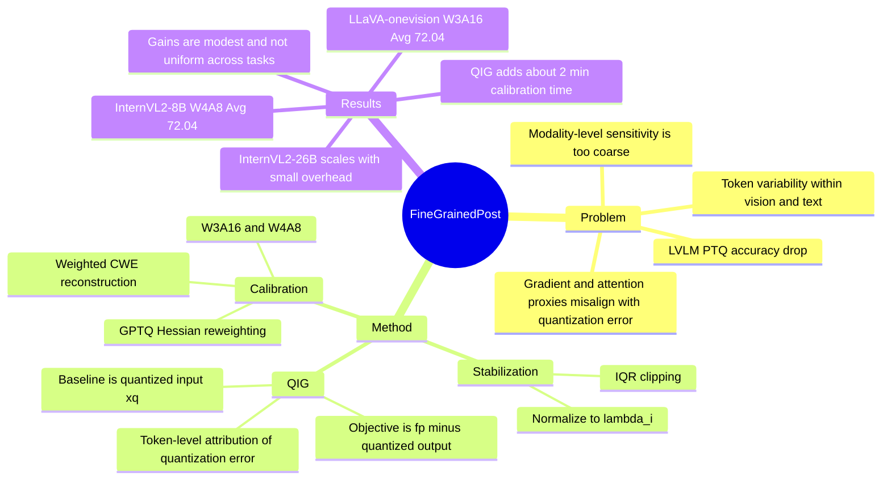

## Summary

这篇论文提出 Quantization-aware Integrated Gradients (QIG)，用 token-level attribution 直接估计 LVLM post-training quantization error 中每个 token 的敏感性，并把该权重用于 fine-grained calibration。核心结论是：相比只做 modality-level balancing，QIG 在 W3A16 与 W4A8 低比特设置下能更稳定地保留 LLaVA-onevision、InternVL2、Qwen2-VL 等模型的多模态 benchmark 性能，且 calibration 额外开销很小。

## Problem & Motivation

作者要解决的问题是 LVLM 的 post-training quantization 仍然存在明显精度损失，尤其当方法只在 modality level 区分 vision tokens 和 text tokens 时，会忽略同一 modality 内不同 token 对 quantization error 的差异。论文通过 InternVL2-8B calibration activation 的可视化指出四类现象：massive outliers、layer heterogeneity、sub-layer divergence 和 token variability；这些现象说明量化敏感性不是简单的 vision/text 二分。

现有 LVLM quantization 方法如 MBQ 用 gradient-based modality weights 缓解 modality imbalance，但作者认为 SFT gradient、attention 等常见 proxy 不一定和真实 quantization error 对齐。Table 1 的 controlled experiment 也支持这一点：在 InternVL2-8B W4A8 的 VizWiz 上，gradient-based token-level sensitivity 反而低于 modality-level，attention-based 只有 modest gain，而 perturbation-based sensitivity 表现最好但需要反复 forward，计算成本太高。

## Method

**Activation observation.** 论文先分析 calibration 阶段的 activation distribution：不同层、不同 linear sub-layer、不同 token position 的 activation magnitude 差异很大。作者据此把 problem formulation 从“不同 modality 应该有不同量化权重”推进到“每个 token 在每层/子层都可能有不同 quantization sensitivity”。

**QIG sensitivity.** 标准 Integrated Gradients 解释的是 full-precision model 的 task output `f(x, w)`，但本文要解释的是 quantized model 和 full-precision model 之间的 output gap。QIG 因此把 baseline 设为 quantized input `xq`，把 attribution objective 设为 `f(x_alpha, w) - f(x_alpha, wq)`，沿 `xq` 到原始输入 `x` 的直线路径积分，得到每个 token 的 QIG score。直观上，某个 token 的 QIG 越大，说明把它从 quantized representation 恢复到原始 representation 对缩小 quantization-induced discrepancy 越重要。

**Stabilization and calibration objective.** 由于 raw QIG heavy-tailed，作者用 IQR clipping 抑制极端 token importance，再归一化成 token coefficients `lambda_i`。在 channel-wise equalization (CWE) 中，原本每个 token 的 reconstruction error 被等权求和；QIG 把该 objective 改成按 `lambda_i` 加权，使 scale search 更关注 quantization-sensitive tokens。这个设计同时给出 W4A8 weight-activation 和 W3A16 weight-only 形式，保持原 CWE 框架不变。

**Extension to GPTQ.** 论文还把 fine-grained weighting 接入 GPTQ：将 Hessian `H = X^T X` 替换为 `H' = X^T Lambda X`，其中 `Lambda = diag(lambda_1, ..., lambda_T)`。这说明 QIG 不只是一个独立 calibration trick，也可以作为 token-aware reconstruction weighting 插入已有 PTQ 框架。

**Experimental setup.** 主实验使用 ShareGPT4V 改进的 COCO Caption 数据随机采样 128 个 image-caption pairs 做 calibration；模型包括 LLaVA-onevision-7B、Qwen2-VL-7B、InternVL2-8B 和 InternVL2-26B；评估走 LMMs-Eval，benchmark 包括 VizWiz、MMMU、ChartQA、AI2D、ScienceQA。量化设置覆盖 W3A16 weight-only 和 W4A8 weight-activation，baseline 包括 RTN、GPTQ、AWQ、SmoothQuant 和 MBQ。

## Key Results

- **LLaVA-onevision-7B / W3A16**：QIG 在 VizWiz、MMMU、ChartQA、AI2D、ScienceQA 上的平均准确率为 **72.04%**，高于 MBQ **70.44%**、RTN **69.03%**、GPTQ **67.97%**，距离 FP16 **73.37%** 只差 **1.33 points**。其中 VizWiz 从 MBQ **57.99%** 提升到 **62.82%**。
- **InternVL2-8B / W4A8**：QIG 平均准确率 **72.04%**，高于 MBQ **71.38%**、RTN **70.80%**、SmoothQuant **70.15%**；MMMU 从 MBQ **45.67%** 到 **47.33%**，VizWiz 从 **57.36%** 到 **58.33%**。
- **Qwen2-VL-7B / W3A16 和 W4A8**：QIG 的 average 分别为 **70.30%** 和 **67.77%**，略高于 MBQ 的 **70.15%** 和 **67.48%**。但提升不均匀：W3A16 的 ChartQA 为 **77.76%**，低于 MBQ **79.18%**；W4A8 的 VizWiz 为 **58.85%**，低于 MBQ **60.17%**。
- **InternVL2-26B scaling**：在 W4A8 上，QIG 相比 MBQ 在 ChartQA / MMMU / VizWiz 分别为 **85.24 / 50.22 / 63.91** vs **84.44 / 49.78 / 63.51**；在 W3A16 上，QIG 的 ChartQA 和 VizWiz 为 **85.12%**、**64.14%**，高于 MBQ **84.48%**、**63.33%**，但 MMMU 为 **50.89%**，低于 MBQ **51.67%**。
- **QIG ablation / LLaVA-onevision-7B W4A8**：baseline `x'=0, objective=f(x)` 在 ChartQA / VizWiz 为 **73.87 / 61.73**；改成 error objective `f(x)-f(0)` 为 **74.30 / 62.31**；完整 QIG `x'=xq, objective=f(x)-f(xq)` 达到 **74.52 / 62.82**，是四种 IG configuration 中最好。
- **GPTQ integration / W3A16**：在 LLaVA-onevision-7B 上，GPTQ+QIG 的 VizWiz 为 **56.95%**，高于 GPTQ **54.87%**；在 InternVL2-8B 上，ChartQA / AI2D / VizWiz 从 GPTQ **76.40 / 76.65 / 59.79** 提升到 **78.12 / 78.47 / 60.57**。
- **Efficiency**：InternVL2-8B 的 quantization time 从 MBQ **0.55 GPU hours** 到 QIG **0.58 GPU hours**，只多约 **2.0 min**；InternVL2-26B 从 **0.95** 到 **0.99 GPU hours**，多约 **2.5 min**。相比之下，Leave-One-Out perturbation 需要 **2.07** 和 **4.20 GPU hours**。
- **Appendix robustness**：IQR clipping 在 LLaVA-onevision-7B W4A8 的 VizWiz / MMMU / ScienceQA 上为 **59.10 / 45.00 / 94.25**，高于 no clipping **54.32 / 41.37 / 93.28**。OCR-specific calibration 下，Qwen2-VL-7B W4A8 使用 128 samples 时 QIG 平均 **80.97%**，高于 MBQ **77.45%**；256 samples 时为 **81.06%** vs **77.68%**。

## Strengths & Weaknesses

**已知**

- 贡献点清楚：QIG 把 sensitivity proxy 从 SFT gradient / attention 迁移到 quantization error attribution，本身和 PTQ objective 对齐；Table 4 也显示 quantized baseline 与 error objective 都有贡献。
- 实验覆盖多个 LVLM family、7B 到 26B 规模、W3A16 和 W4A8 两类设置，以及 VizWiz、MMMU、ChartQA、AI2D、ScienceQA 等 benchmark；不是只在单模型或单 benchmark 上调参。
- 方法的计算位置主要在 calibration 阶段，推理图不需要新增模块；Table 6 显示相比 MBQ 只增加约 2-2.5 分钟 quantization time，比 Leave-One-Out token perturbation 便宜很多。
- Appendix 的 IQR clipping ablation 有价值：raw QIG 会被 heavy-tailed token importance 破坏，说明 token-level weighting 不是“越细越好”，还需要 robust stabilization。

**局限**

- 相比 MBQ 的平均提升总体不大，论文自己报告跨六个配置大约额外 **0.5%** average gain；在 LLaVA-onevision-7B W4A8 上 average 只从 **70.16%** 到 **70.23%**。这更像 calibration quality 的稳健改进，而不是数量级上的压缩突破。
- per-benchmark 并非全胜：Qwen2-VL-7B 上多个任务低于 MBQ，InternVL2-26B W3A16 的 MMMU 也低于 MBQ。这说明 token-level QIG 仍可能和特定模型/任务的敏感 token 分布不完全匹配。
- 论文主要报告 accuracy 与 quantization-time overhead，没有给出真实 inference latency、throughput、energy、显存占用或 integer kernel 部署的端到端数字。因此“practical deployment”目前最强证据是低比特 accuracy 保持较好，而不是实测系统收益。
- 主实验的 calibration set 是 128 个 ShareGPT4V/COCO Caption pairs；虽然 Appendix 有 OCR-specific calibration 的正结果，但还不知道 calibration distribution shift、样本数量、prompt format 对 QIG stability 的系统影响。
- baseline 没有直接覆盖所有近期 LVLM PTQ 方法，例如正文相关工作提到 Q-VLM / QSLAW，但主表主要比较 RTN、GPTQ、AWQ、SmoothQuant、MBQ。

**推测**

- 对 GUI agent / computer-use agent 来说，QIG 的直接价值可能在 screen-understanding VLM 的本地化部署：如果 agent pipeline 受限于 VLM 显存或推理成本，token-aware PTQ 可能帮助保留 OCR、chart/document understanding、visual reasoning 等能力。
- GUI screenshot 中的 text tokens、icon/region tokens、instruction tokens 也可能存在强 token-level sensitivity 差异；QIG 的 attribution-to-quantization-error 思路可能比单纯 vision/text modality balancing 更适合 screen-heavy calibration。

**不知道**

- 不知道 QIG 在真实 GUI-agent、web-agent 或 embodied closed-loop 任务中是否能保持 action success rate；论文只评估静态 LVLM benchmark。
- 不知道方法在更激进设置如 W2A16、KV cache quantization、vision encoder/adapter 全栈量化中是否仍稳定。
- 不知道 code release 的实现细节是否完全覆盖论文中的 supplement 配置，例如 32-step integrated gradients、IQR clipping 和 GPTQ integration。

## Mind Map

## Notes

这篇和 [[2606-VLMPTQ]] 形成一个有用对照：VLM-PTQ 主要把 modality-aware Hessian / correction term 用在 weight compensation，QIG 则进一步追问同一 modality 内 token 的 quantization sensitivity。我的判断是 rating=4：它对 LVLM deployment 和 VLM compression 有清晰 insight 与充分 ablation，但和 GUI-agent / embodied-agent 的关系仍是间接的，不能把静态 benchmark accuracy 直接外推到闭环 agent performance。

后续如果要服务 GUI-agent 方向，值得补做三类实验：screen/OCR-heavy calibration set 下的 token sensitivity visualization，GUI benchmark 上的 quantized VLM success rate，以及真实推理 latency / memory / cost 的系统测量。当前证据只能说明 QIG 是一个更贴近 quantization error 的 calibration weighting 方法，不能说明它已经解决 agent 场景中的 perception-to-action 稳定性。
