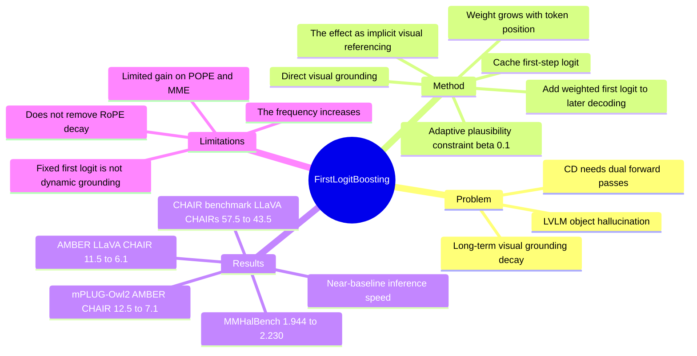

## Summary
First Logit Boosting (FLB) 是一种 training-free decoding 方法，用第一步生成时的 logit 作为后续生成的 additive anchor，以缓解 LVLM 长文本生成中 visual grounding 随 token 位置衰减导致的 object hallucination。论文把收益归因于 direct visual grounding 与 "The" effect 两个机制，并在 AMBER、CHAIR、MMHalBench、ConvBench 以及 LLaVA-1.5 / InstructBLIP / mPLUG-Owl2 上报告减少 hallucination、几乎不增加推理开销。我的判断是：方法非常简单且对 decoding-time grounding 有启发，但它更多是在缓解 RoPE 长程衰减的症状，并未从结构上解决 context-dependent visual grounding。

## Problem & Motivation
LVLM 在 image captioning、VQA 等多模态任务上表现很强，但仍会生成图像中不存在的 object。作者关注的是生成式回答中的 object hallucination，尤其是长描述里 visual grounding 逐渐变弱、language prior 逐渐主导的问题。

已有方法分三类：retraining-based 方法需要额外数据和训练成本；external grounding 方法要引入额外模型检查或补充对象，结构更重；training-free 的 Contrastive Decoding (CD) 类方法虽然不训练，但每步通常需要 original / distorted 两次 forward pass，而且不能稳定解决长序列中的 grounding decay。论文的核心动机是：如果第一步生成离 image tokens 最近、视觉信息最强，是否可以把第一步 logit 作为整个 generation 的视觉锚点。

## Method
**核心机制.** FLB 在第一步解码时保存完整 logit distribution：`l0 = logit_theta(y | x, v)`，之后每个 decoding step 都在当前 logit 上加一个加权的 `l0`。权重是随位置增长的 `wt = gamma(1 - exp(-lambda t))`，用于在越靠后的 token 上越强地抵消 long-term decay；主实验固定 `gamma = 0.3`、`lambda = 0.05`。

**Adaptive plausibility constraint.** 直接把第一步 logit 加到后续位置会带来不合理 token，例如在句中反复插入 "The"。作者沿用类似 VCD 的 candidate filtering：只允许当前原始分布中概率不低于 `beta * max_prob` 的 token 被选中，主实验 `beta = 0.1`。附录中 `beta = 0` 的例子出现了大量重复的 "The"，而 `beta = 0.1` 消除了该问题。

**Direct visual grounding effect.** 作者认为第一步 token 离 visual tokens 最近，受 RoPE positional drift 影响最小，因此第一步 logit 保存了更强视觉证据。Fig. 3 的示例中，ground-truth words 的 first-token logit mean 是 4.74，hallucination words 是 2.15；FLB 将这个 margin 重复注入后续 decoding。

**"The" effect.** 论文观察到第一步 logit 中 "The" 等句首词概率很高，而以 "The" 开头的句子更倾向引用前文已经视觉定位过的实体。FLB 通过提升句首 "The" 的概率，间接提高后续 noun referencing 的稳定性；作者把这称为 implicit visual referencing。这个解释有实验证据支持，但机制仍偏经验性，不能等同于真正的显式 object grounding。

## Key Results
- **AMBER generative / LLaVA-1.5.** FLB 将 CHAIR 从 baseline 11.5 降到 6.1，将 Hal 从 48.9 降到 31.6，将 Cog 从 4.6 降到 2.7；Cover 基本保持在 50.4（baseline 50.1）。同表中 VCD / ICD / M3ID 的 CHAIR 分别是 9.9 / 9.1 / 9.8，均高于 FLB。
- **AMBER generative / InstructBLIP.** FLB 将 CHAIR 从 11.6 降到 9.0，将 Hal 从 51.7 降到 43.8，Cover 为 53.6（baseline 53.4），Cog 为 4.7（baseline 5.3）。ICD 和 M3ID 在该 backbone 上没有稳定优于 baseline。
- **MSCOCO-CHAIR generative.** 在 LLaVA-1.5 上，FLB 将 CHAIRs 从 57.5 降到 43.5、CHAIRi 从 17.3 降到 12.0，Recall 为 73.6（baseline 73.3）。在 InstructBLIP 上，FLB 将 CHAIRs 从 59.0 降到 52.5、CHAIRi 从 18.5 降到 15.8，Recall 为 71.3（baseline 69.4）。
- **Ablation / AMBER.** Baseline 的 CHAIR / Cover / Hal / Cog 为 11.9 / 49.6 / 48.8 / 4.4；direct visual grounding only 为 9.2 / 50.3 / 41.1 / 4.7；"The" effect only 为 6.5 / 50.6 / 29.9 / 2.4；full FLB 为 5.7 / 50.3 / 30.7 / 2.4。两种机制都有效，其中 "The" effect 对 hallucination 指标贡献更大，full FLB 在 CHAIR 上最好。
- **Quality and speed.** AMBER 上 average words / tokens 从 baseline 79.58 / 104.67 变为 FLB 78.62 / 101.40，长度没有明显膨胀。GPT-4V aided evaluation 中 Accuracy 从 5.01 提升到 7.28，Detailedness 从 5.47 提升到 6.51；Fig. 5 显示 VCD / ICD / M3ID 约为 baseline 两倍慢，而 FLB 接近 baseline speed。
- **Beyond captioning.** MMHalBench 上，LLaVA-1.5 的 Average Score 从 baseline 1.944 提升到 VCD 2.098、FLB 2.230；ConvBench 三轮 win rate 中，FLB 为 0.159 / 0.178 / 0.108，baseline 为 0.132 / 0.173 / 0.103，VCD 为 0.154 / 0.173 / 0.111。
- **Other settings.** mPLUG-Owl2 / AMBER 上，FLB 将 CHAIR 从 12.5 降到 7.1、Hal 从 50.8 降到 33.0、Cog 从 5.2 降到 2.9。Discriminative POPE / MME 上，FLB 与 beta-only 完全相同：POPE Random Acc/F1 为 0.846 / 0.826，Popular 为 0.827 / 0.809，Adversarial 为 0.801 / 0.786，MME score 为 115.88；这说明 FLB 的主要收益集中在长生成任务。

## Strengths & Weaknesses
**已知的优点.**

1. 方法非常轻：不需要 retraining、外部 verifier 或双 forward pass，只缓存一次 first-step logit 并在后续 decoding 中复用。
2. 实验覆盖了 AMBER、CHAIR、MMHalBench、ConvBench，以及 LLaVA-1.5、InstructBLIP、mPLUG-Owl2；主结果和附录结果都显示 hallucination 指标下降。
3. Ablation 比较清楚：direct visual grounding 和 "The" effect 都被单独 mask 出来测试，且两者都优于 baseline。
4. 作者没有回避 fluency 风险：主文报告约 1,000 个 AMBER response 中没有观察到句中异常 capitalized token，附录也展示了 `beta = 0` 会坏掉、`beta = 0.1` 能稳定 token selection。

**已知的局限.**

1. 论文自己承认 FLB 没有从根本上消除 RoPE 带来的 long-term decay，只是通过 early-token reinforcement 缓解其影响。
2. FLB 不能 fully model context-dependent visual grounding，因为它注入的是固定 first-token logit，而不是随当前上下文动态更新的视觉证据。
3. Discriminative POPE / MME 上 FLB 与 beta-only 表现完全一致，说明短输出或判别式任务中收益有限。
4. "The" effect 会明显改变句首词分布：AMBER 中 sentence-initial "The" 比例从 baseline 67.4% 增至 `gamma = 0.3` 时的 89.4%。GPT-4V 评价显示质量未下降，但这仍可能在需要多样化表达或非英语输出的场景中成为风险。
5. 部分质量评价依赖 GPT-4V judge；这能衡量自然语言质量，但不是完全确定性的 hallucination metric。

**推测与不知道.**

1. 推测：对 GUI agent / screen understanding 的长描述或多轮观察摘要，FLB 可能有用，因为这些场景也会出现后段生成被 language prior 带偏的问题。
2. 不知道：论文没有在 GUI benchmark、OCR-heavy screen、non-English caption、closed-source frontier LVLM 或 tool-using agent loop 上验证 FLB。
3. 不知道：first logit anchor 与更强 visual attention repair、动态 object memory、或 GUI element grounding 模块结合时是否互补，论文没有实验。

## Mind Map

## Notes
- **和当前研究方向的关系**：这是 VLM hallucination / visual grounding 的 decoding-time 方法，不是 GUI agent paper，但对长 screen description、视觉观察摘要、agent perception trace 的 hallucination control 有潜在参考价值。
- **我的判断**：rating=4。它的 insight 不复杂，但足够锋利：第一步 logit 同时携带视觉锚点和句法初始化信号；实验显示这个极小改动能压过多种 CD baseline。
- **保留疑问**：论文把 "The" effect 解释为 implicit visual referencing，这个解释目前主要由统计相关和 ablation 支撑；它是否是真正的视觉引用，还是更一般的低熵语言初始化效应，还需要更细粒度的 causal analysis。
