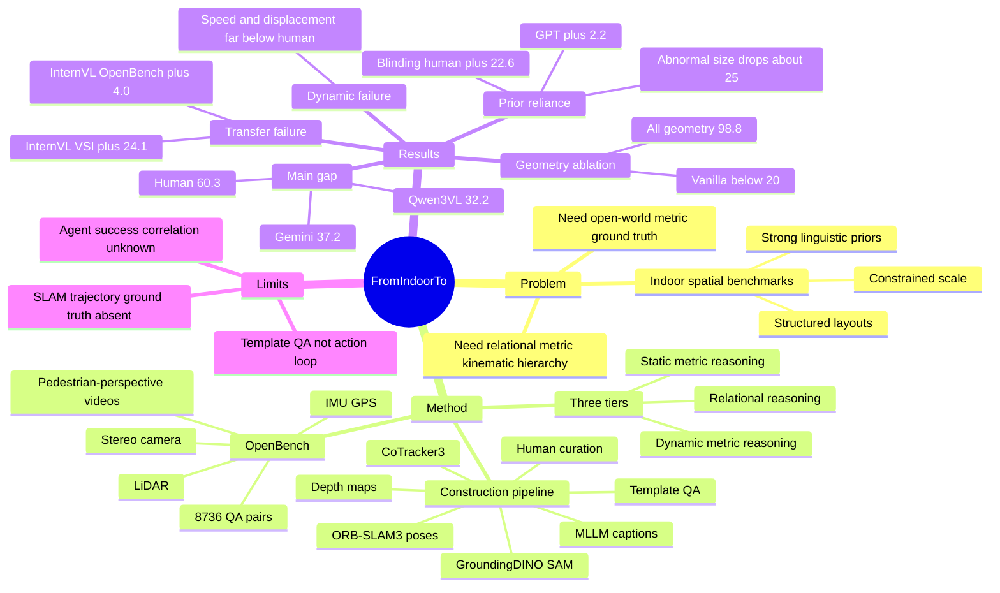

## Summary
这篇论文提出 OpenBench：一个基于 pedestrian-perspective stereo video、LiDAR、IMU/GPS 的 open-world spatial reasoning benchmark，用 8,736 个 QA 覆盖 relational、static metric、dynamic metric 三层能力。核心结论是，当前 MLLMs 在 indoor benchmark 上看似提升的 spatial intelligence 很大程度依赖 linguistic priors，迁移到 open-world metric / kinematic reasoning 后明显失效。对 GUI-agent / embodied / VLM 研究最重要的启发是：如果 benchmark 不能破坏语言先验、不能给出可验证 metric ground truth，就很容易高估模型的 grounded spatial reasoning。

## Problem & Motivation
已知：MLLMs 在 VQA、captioning 等 semantic tasks 上进展很快，但 physical world 中的 agent 需要的是更强的 spatial intelligence：能判断 relative layout、估计 metric distance / depth / size，并理解 object motion 与 ego-motion。作者把 spatial intelligence formalize 成三层 hierarchy：Relational Reasoning、Metric Reasoning、Kinematic Reasoning，其中第三层要求在时间上保持 spatio-temporal consistency。

现有 benchmark 的问题是覆盖不够完整：OmniSpatial、SparBench、All-Angles-Bench 等主要是 qualitative relational reasoning；VSI-Bench、STI-Bench 等开始测 quantitative / dynamic reasoning，但依赖 indoor datasets 或 autonomous-driving datasets；SpatialRGPT-Bench、Open3D-VQA 等 outdoor / open-space benchmark 常用 monocular depth estimation 作为 pseudo ground truth，存在 metric scale ambiguity。作者的动机是构建一个 pedestrian-centric、open-world、metrically-sound 的 benchmark，专门检验 MLLMs 是否真的从视觉中获得可泛化的空间理解，而不是靠室内布局和物体尺寸的语言先验答题。

这对 embodied AI 和 GUI agent 都重要：agent 的许多失败不是不会命名物体，而是无法把视觉观察转成可靠的几何关系、距离、运动和状态变化。论文的关键问题不是“哪个模型分数最高”，而是“现有 benchmark 是否掩盖了模型没有 grounded metric perception 这一事实”。

## Method
**OpenBench task hierarchy.** Benchmark 覆盖 3 tiers、9 tasks。Relational tier 包含 Relative Distance、Relative Direction、Qualitative Ego-Motion；Static Metric tier 包含 Object 3D Localization、Absolute Distance、Depth-aware Counting；Dynamic Metric tier 包含 Absolute Displacement、Absolute Speed、Quantitative Ego-Motion。MCA tasks 用 Accuracy，NA tasks 用 Mean Relative Accuracy (MRA)，后者基于 5% 到 50% 的 10 个 relative-error thresholds。

**Data collection.** 作者搭建了 pedestrian-perspective multi-sensor rig：synchronized stereo RGB cameras、32-beam LiDAR、IMU/GPS，安装在人工推动的 cart 上。补充材料给出硬件细节：stereo RGB 为 1080p / 15 FPS，LiDAR 为 10 FPS，IMU 为 100 Hz，GPS 为 1 Hz；camera height 约 1.4m。采集场景覆盖 university campuses、public parks、open plazas、historical sites，以及 large-scale shopping malls；人工过滤 blur、low light、缺少 queryable objects 的片段后得到约 20 小时 high-quality multimodal data，其中约 6 小时用于 benchmark construction。

**Benchmark construction pipeline.** Pipeline 分三步：Data Preprocessing、Spatial Information Extraction、QA Generation and Curation。预处理阶段用 stereo images + IMU 的 ORB-SLAM3 估计 metric-scale camera pose，并把 LiDAR point cloud 投影成 sparse / densified depth maps；keyframes 每 30 frames 抽一次。Joint-Annotation Module 用 locally-run Qwen-2.5-VL-8B-Instruct 生成 object captions，再用 GroundingDINO + SAM 做 detection / segmentation，用 CoTracker3 做 temporal tracking，最后把 object masks 对应的 depth 反投影并注册到 world coordinates，得到每个 object 的 spatio-temporal profile。

**QA generation and curation.** 作者用 template-based generation 生成问题，目标是尽量隔离 spatial reasoning，减少复杂语言理解或多步逻辑推理的 confounder。为解决 open-world 场景中多个相似物体的 ambiguity，每个 queried object 都被赋予 numerical ID，并以 visual tag 形式跟踪在视频中。Metric answers 直接由 object spatio-temporal coordinates 计算；之后经过 MLLM-assisted human-in-the-loop curation，最终得到 8,736 个 high-quality QA pairs。

**Benchmark fidelity checks.** 论文对自动构建 pipeline 做了误差分析。Stereo calibration 的 mean reprojection error 为 0.32 pixels；LiDAR-to-camera calibration 的 mean reprojection error 为 0.51 pixels，mean translation error 为 0.002m，mean rotation error 为 0.978 degrees。端到端的静态物体地图验证中，pipeline output 与现场人工测量的 mean positional error 为 0.68m（indoor mall）和 0.79m（outdoor campus）。已知边界是：作者没有 ground-truth trajectories 来直接定量评估 ORB-SLAM3 pose accuracy，而是引用 ORB-SLAM3 在 comparable stereo-inertial datasets 上的 public validation。

## Key Results
**OpenBench main results.** 在 270-question human subset 上，human average 为 60.3；Gemini-2.5-Pro 为 36.8，Qwen3VL-32B-Instruct 为 31.9，GPT-5 为 27.9。完整 OpenBench 上，Gemini-2.5-Pro 是最强 closed-source model，average 37.2；Qwen3VL-32B-Instruct 是最强 open-source model，average 32.2；GPT-5 为 29.7，GPT-4o 为 25.9。这个 gap 说明即使 frontier MLLMs 在 open-world spatial QA 上仍明显低于人类。

**Relational reasoning gap.** 作者指出 human-model disparity 在 spatial relations 上最明显：human relative direction 为 83.3，而 tiny subset 上 Gemini-2.5-Pro / GPT-5 / Qwen3VL-32B-Instruct 分别为 23.1 / 30.8 / 23.1。相对地，static metric tasks 的 gap 有时更小，例如 object localization 上 human 43.9，Gemini-2.5-Pro 39.7，GPT-5 35.3；这支持作者的 claim：OpenBench 暴露的是 relational layout cognition，而不只是 object recognition 或粗略距离估计。

**Dynamic metric reasoning 是普遍 failure case.** Human 在 absolute speed 为 65.8、quantitative ego-motion 为 66.8；完整 OpenBench 上 Gemini-2.5-Pro 对应为 31.1 / 40.8，GPT-5 为 33.8 / 30.6，Qwen3VL-32B-Instruct 为 36.8 / 49.2。Absolute displacement 也低：human subset 为 42.9，完整 OpenBench 上 Gemini-2.5-Pro / GPT-5 / Qwen3VL-32B-Instruct 分别为 26.8 / 10.5 / 18.6。已知结论是：当前 MLLMs 对动态量的估计需要 metric precision 与 temporal consistency，但普遍没有稳定的 spatio-temporal representation。

**Indoor progress does not transfer.** 在 VSI-Bench 上，InternVL3.5-38B 相比 InternVL2-40B 提升 +24.1；但在 OpenBench 上，近似同规模比较只有 22.9 到 26.9，即 +4.0。QwenVL family 也类似：QwenVL2.5-32B 到 QwenVL3-32B 在 VSI-Bench 为 37.7 到 61.5（+23.8），在 OpenBench 为 30.0 到 32.2（+2.2）。作者用这组结果支持“indoor benchmark 上的 spatial intelligence gain 可能是对 indoor regularities / benchmark-like data 的 overfitting”。

**Blinding test 暴露 linguistic priors.** OpenBench 上，vision-enabled 相对 vision-disabled 的 average gain：human 为 +22.6，Gemini 为 +12.4，GPT 为 +2.2，Qwen3-VL 为 +5.3，InternVL3.5 为 +6.3，LLaVA-Video 为 +4.9，LLaVA-OneVision 为 +3.3。Figure 1 还报告 GPT-4o 在 absolute distance task 上关掉 vision 后，VSI-Bench 的 mean relative accuracy drop 只有 -0.1，而 OpenBench 为 -26.9；这说明 indoor layout 允许模型靠语言先验答题，而 open-world layout 更迫使模型依赖视觉。

**Synthetic abnormal scenes 进一步验证 prior reliance.** 在 synthetic indoor normal / abnormal scenes 中，human overall MRA 只从 57.1 降到 56.0（drop 1.1）；Gemini-2.5-Pro 从 46.0 降到 31.4（drop 14.6），Qwen2.5-VL-32B-Instruct 从 48.8 降到 30.7（drop 18.1）。Size estimation 对异常物体尺度尤其敏感：Gemini size MRA 从 54.7 降到 29.7（drop 25.0），Qwen size MRA 从 54.5 降到 28.3（drop 26.2）；human size 只从 62.5 到 60.5（drop 2.0）。这支持作者的解释：模型经常输出 category-level canonical size，而不是根据视觉证据重新估计尺度。

**Geometric information ablation shows bottleneck is perception, not arithmetic.** 在 absolute distance task 的 structured formula setting 中，Qwen3VL-32B / Gemini-2.5-Pro vanilla 只有 17.5 / 19.2；提供 all geometry `(p1, p2, R, T)` 后两者都到 98.8。去掉公式但仍提供全部 geometry 时，Qwen3VL-32B 为 59.2，Gemini-2.5-Pro 为 85.4；只给 object localizations 或 ego-motion 只能带来中等提升，例如 both localization 为 33.8 / 40.0，ego-motion 为 32.5 / 22.9。已知结论是：模型能做显式公式计算，但不能可靠地从视频中抽取 precise metric localization 与 ego-motion，也不一定能自行推导 3D 几何关系。

**Additional ablations.** 对 Qwen3VL-32B，input frames 从 8 到 64 的 OpenBench average 只从 30.2 到 32.5，32 frames 为 32.2，说明简单增加采样帧数收益有限。Specialized spatial models 的结果也谨慎：SpatialRGPT-VILA1.5-8B 为 24.0，相比 VILA-1.5-8B 的 20.4 有 +3.6；但 SpaceThinker-Qwen-3B 为 21.7、SpaceOm-3B 为 23.2，均低于 Qwen2.5VL-3B-Instruct 的 24.2。作者明确提醒这些不是 like-for-like comparison，因为这些模型的 task format 与 OpenBench video QA 不完全匹配。

## Strengths & Weaknesses
**已知 Strengths.** 论文最强的地方是 problem formulation：它没有只堆一个新 benchmark，而是先把 spatial intelligence 拆成 relational、metric、kinematic 三层，再用 multi-sensor open-world data 给每层提供可验证 ground truth。这个 design 直接攻击了 indoor benchmark 的核心漏洞：scale range 小、layout structured、语义 diversity 低、语言先验强。

**已知 Strengths.** 实验设计有诊断价值。Main table 覆盖 closed-source frontier models 和多组 open-source model families；blinding test、abnormal scenes、geometric information ablation 分别从“是否看图”“是否依赖 canonical object priors”“是否会几何计算”三个角度验证同一个 claim：当前 MLLMs 缺的是 grounded metric perception，而不是单纯缺少计算能力。

**已知 Weakness / boundary.** OpenBench 的 ground truth 虽然比 monocular-depth pseudo labels 更可靠，但不是完美真值。论文承认没有 ground-truth trajectories 来量化 ORB-SLAM3 在该数据上的 pose error；object 3D registration 会受 occlusion、segmentation masks、temporal misalignment、visible point cloud centroid approximation 影响。pipeline end-to-end positional error 0.68m / 0.79m 对十几米到几十米尺度任务可能可接受，但对小距离或细粒度 interaction 任务仍可能成为上限因素。

**已知 Weakness / boundary.** Benchmark 是 template-based video QA，不是 closed-loop embodied task，也不是 GUI task。它能诊断 visual-spatial grounding，但不能直接证明模型在 navigation、manipulation、computer-use 或 web/mobile agent execution 中会失败到同等程度；那些任务还涉及 action policy、memory、tool use、state update 和 recovery。

**已知 failure cases.** 当前最明确的 failure case 是 dynamic metric reasoning：absolute displacement、absolute speed、quantitative ego-motion 都需要跨帧 tracking、metric scale 和 time interval integration，几乎所有模型都远低于 human。另一个 failure case 是 abnormal object scale：当视觉证据与常识尺寸冲突时，模型更倾向输出 canonical size。

**推测.** 对 embodied / GUI agent 的启发是，许多“agent 不稳”的根源可能不是 planning，而是 perception 层的 metric grounding 不可靠：模型能说出物体和关系，却不能稳定估计距离、方向、可达性和状态变化。OpenBench 这类 benchmark 可以作为 VLM backbone 的 spatial sanity check，但若要服务 agent training，还需要把 metric QA 扩展成 action-conditioned evaluation 或 interactive verification。

**不知道.** 论文没有报告 OpenBench 在真实 robot policy、navigation success、mobile manipulation success、GUI grounding 或 computer-use task success 上的相关性；也没有给出完整 code release 信息、DOI，或不同 sensor/pipeline error 对最终 QA label 的 sensitivity analysis。因此它证明的是“MLLM open-world spatial QA 存在明显 gap”，还没有证明“这个 benchmark 分数能预测 agent 成功率”。

## Mind Map

## Notes
最重要的 insight：spatial reasoning benchmark 必须打破 shortcut。VSI-Bench 这类 indoor video benchmark 可能已经让模型学到“浴缸和马桶通常 1m 左右”这种语言/场景先验，而不是让模型真正从视觉估计距离；OpenBench 的价值在于把 scale、layout、semantics 和 dynamics 拉出 indoor regularities。

对后续研究的方向性启发：如果要训练 GUI / embodied agent 的 spatial grounding，单靠更多 screenshot/video QA 可能不够，需要显式的 geometry supervision、multi-view consistency、ego-motion / temporal tracking，以及能惩罚 linguistic prior shortcut 的 evaluation。这里的 geometric information ablation 很关键：当 `(p1, p2, R, T)` 都给出时模型几乎满分，说明未来方法可以把“视觉中抽取几何状态”作为独立瓶颈来优化，而不是只看最终 QA accuracy。

需要谨慎：这篇是 benchmark / diagnosis paper，不是解决方案。它支持“current MLLMs lack generalizable open-world spatial intelligence”的结论，但不直接告诉我们哪种 architecture、data 或 training objective 能修复这个 gap。
