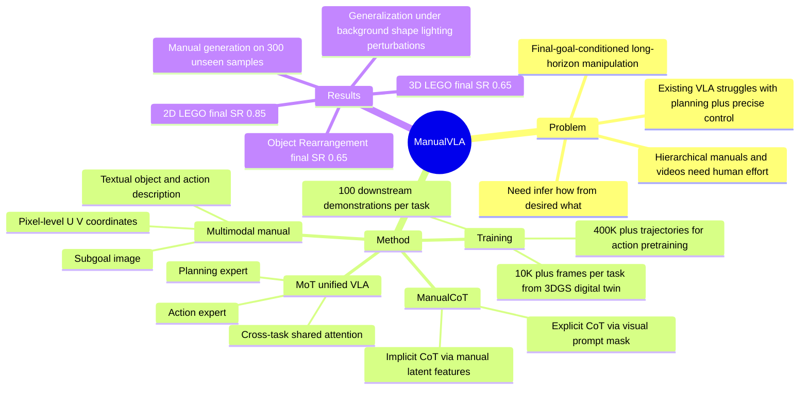

## Summary
ManualVLA 针对有明确 final goal state 的长程机器人任务，把 multimodal manual generation 和 action execution 统一到一个 MoT-based VLA 中。核心做法是先从当前图像、目标图像和语言指令生成包含文本、2D 坐标和 subgoal image 的 manual，再用 explicit / implicit ManualCoT 把这些 manual 转成 action expert 的控制条件；在 2D LEGO Assembly、3D LEGO Assembly 和 Object Rearrangement 上，作者报告相对既有 VLA baseline 的平均成功率提升。

## Problem & Motivation
论文关注的是 final-goal-conditioned long-horizon manipulation：机器人只看到当前状态、目标状态和语言指令，需要自己推断中间过程并完成操作。作者认为现有 VLA 通常直接从 sensory inputs 映射到 actions，在 LEGO assembly、object rearrangement 这类任务上同时缺两件事：高层规划如何对齐最终构型，以及细粒度控制如何稳定执行每个中间步骤。

已有 hierarchical 方法会依赖 human-crafted manuals、human demonstration videos 或额外 reasoning models。它们能提供中间过程，但代价是人为介入和额外模型成本，也不一定能泛化到 unseen final goal states。ManualVLA 的问题 formulation 是：能否让 VLA 从目标的 "what" 推断执行的 "how"，并把这个过程内化到一个统一模型中。

## Method
ManualVLA 以 Janus-Pro 为 foundation model，底层 LLM 使用 DeepSeek-LLM 1.5B，并扩展成 Mixture-of-Transformers (MoT) 架构。MoT 为 manual generation 和 action generation 分别设置 task-specific non-embedding components，包括 FFN、attention projections 和 layer normalizations，同时通过 shared attention 让两个任务的 token 在统一序列中交互。

**Manual generation** 由 planning expert 负责。输入是 language instruction、current image 和 goal image；输出的 manual 包含三类信息：描述目标物体和动作的 textual description、目标物体 centroid 的 pixel-level `(U, V)` coordinates、以及 next-step subgoal image。作者假设长程任务不需要非常密集的 temporal subgoals，只在任务状态发生关键变化时生成新 manual；如果生成的 object description 与上一次相同，则复用已有 manual。

**ManualCoT** 分为 explicit CoT 和 implicit CoT。explicit CoT 把预测的 `(U, V)` 坐标作为 mask overlay 到 current image 上，形成 prompt image 给 action expert；implicit CoT 则通过 cross-task shared attention，让 action expert attend 到 planning expert 生成的 subgoal manual latent representations。直观上，manual 先告诉模型 "what" object，再告诉 "where" to place，最后用 subgoal image 给出 anticipated visual outcome。

**Action generation** 采用 diffusion-based action modeling。模型使用 continuous vision encoder SigLIP-Large 处理 action input image，使用 noise encoder / noise decoder 建模 noised action，使用 state encoder 注入 robot state；这些 action / state components 都是 two-layer MLP。训练目标中 action expert 使用 diffusion policy 式 MSE noise prediction loss。

**Training strategy** 是三阶段。Stage 1 在经过筛选的大规模 cross-embodiment robot datasets 上预训练 action expert，数据规模超过 400K trajectory samples，训练 5 epochs；Stage 2 用 3D Gaussian Splatting digital-twin toolkit 生成每个任务超过 10K frames 的 manual data，只训练 manual expert；Stage 3 对每个 downstream task 用 3DConnexion Spacemouse teleoperation 采集 100 demonstrations，并联合 finetune planning 和 action experts，目标为 `L_final = L_manual + L_action`。

**Real-to-render data generation** 用 3D Gaussian Splatting 重建 LEGO board、bricks 或 rearrangement objects 的 3D assets，放到统一 Cartesian coordinate system 中，再迭代采样合法位置并从 front-view camera 渲染 intermediate states。这个 pipeline 同时产出 photorealistic images、position 和 textual information，用于训练 planning expert。

## Key Results
- **Manual generation, 300 unseen test samples**：在 2D LEGO Assembly 上，subgoal image 的 **PSNR 29.01 / FID 36.39**，坐标 **MAE 3.23**；在 3D LEGO Assembly 上为 **PSNR 28.68 / FID 34.63 / MAE 3.58**；在 Object Rearrangement 上为 **PSNR 28.11 / FID 24.46 / MAE 6.21**。论文还报告 language descriptions 中的 object nouns 在 unseen test samples 上全部正确生成。
- **Real-world long-horizon manipulation, 20 unseen test goal states**：Table 2 比较了 π0、π0.5、FAST、CoT-VLA、VLM + π0.5 和 ManualVLA。ManualVLA 的 final task S.R. 在 **2D LEGO Assembly 为 0.85**，高于 VLM + π0.5 的 **0.60**、CoT-VLA 的 **0.30**、π0.5 的 **0.20**；在 **3D LEGO Assembly 为 0.65**，高于 VLM + π0.5 的 **0.35**；在 **Object Rearrangement 为 0.65**，高于 VLM + π0.5 的 **0.50**。
- **Step-wise success degradation**：baseline 往往早期步骤较好但后续掉得快。以 2D LEGO Assembly 为例，VLM + π0.5 从 first 2-brick step 的 **0.75** 下降到 final S.R. **0.60**，ManualVLA 从 **0.95** 到 **0.85**；在 3D LEGO Assembly 中，ManualVLA 的三段 step-wise success 是 **0.90 / 0.75 / 0.65**，final S.R. **0.65**。
- **Generalization on 2D LEGO Assembly, 20 rollouts**：在 unseen perturbations 下，ManualVLA 的 success rate 从 origin **0.85** 下降到 background **0.65 (-23%)**、shape **0.60 (-29%)**、lighting **0.70 (-17%)**。对应 VLM + π0.5 为 origin **0.60**、background **0.45 (-25%)**、shape **0.35 (-46%)**、lighting **0.50 (-17%)**。
- **Ablation conclusions**：Figure 6 的文字结论是，manual 中加入更多 multimodal information 会提升 manipulation performance；去掉 explicit CoT 或 implicit CoT 都会带来 noticeable degradation；MoT 比只复制 FFN 的 MoE 更适合同时生成高质量 manuals 和 actions；precision manipulation 中 diffusion-based action generation 更好。正文没有给出这些 ablation bar 的具体数值，因此这里只记录方向性结论。

## Strengths & Weaknesses
**已知：**
- 论文的核心价值在 problem formulation：把 final goal state 到 executable procedure 的推断显式建模为 manual generation，再把 manual 作为 action generation 的 control condition，而不是要求 VLA 直接隐式学完整长程规划。
- Manual 的三种模态分工清楚：text 提供 object / action semantics，2D coordinates 提供 precise localization，subgoal image 提供 expected visual outcome。explicit CoT 与 implicit CoT 分别对应图像输入层和 latent attention 层的条件注入。
- 对比 baseline 覆盖了 end-to-end VLA、visual CoT-VLA 和 hierarchical VLM + π0.5；主表同时报告 step-wise 和 complete task S.R.，能看到长程执行中的累积失败问题。
- 数据策略比较务实：action expert 从 400K+ open-source trajectories 预训练，manual expert 主要靠 3DGS digital twin 合成，downstream finetuning 每个任务只用 100 demonstrations。

**推测：**
- ManualVLA 对 GUI-agent / computer-use 的启发不是机器人动作本身，而是 "goal state → intermediate manual → executable action" 这个接口。GUI 任务也常有目标状态和可观察中间状态，manual-like intermediate representation 可能比直接 action decoding 更可调试；但论文没有在 GUI 或 web/mobile agent benchmark 上验证。
- 2D centroid `(U, V)` prompt 适合桌面物体放置，但对于需要 orientation、contact-rich force control、遮挡下 3D pose 或 deformable object manipulation 的任务可能不够。这是从 representation 边界推出的风险，不是论文报告的失败案例。
- Digital-twin manual data 的优势可能依赖物体可重建、可分解、可渲染，并且任务状态能被离散 intermediate placements 表达；开放家庭环境、多物体动态交互或高反光/透明物体可能更难迁移。

**不知道 / 未报告：**
- 正文没有给出 arXiv id、DOI 或 GitHub code link；只给了 project page。
- 正文提到 Appendix B 有 general manipulation tasks、Appendix C / D 有更多 visualizations 和 failure case analyses，但主文没有展开这些结果或具体 failure taxonomy。
- 论文没有报告推理 latency、manual generation 错误如何传播到 action 的统计、human demonstration collection cost、digital-twin pipeline 的构建时间，也没有给出不同 manual quality 下的完整数值表。

## Mind Map

## Notes
这篇论文值得和 CoT-VLA、CheckManual、π0.5、OpenVLA 一起看。ManualVLA 的关键不是单纯多一个 planner，而是让 planner 生成的 manual 同时以 explicit image prompt 和 implicit latent condition 进入 action expert；这比把 VLM planner 和 policy model 松散串起来更像一个可端到端对齐的中间表示设计。

我最想追问的是 manual representation 的最小充分性。Table 2 说明它在 LEGO / rearrangement 上有效，但这些任务的子目标都能较自然地表示成 target object + target coordinate + expected subgoal image；如果目标是需要连续接触、工具使用、力控或不规则 3D 姿态的任务，manual 是否仍应是 2D coordinate-centered，还是要升级成 affordance trace、contact graph 或 3D pose / constraint representation，论文还没有回答。
